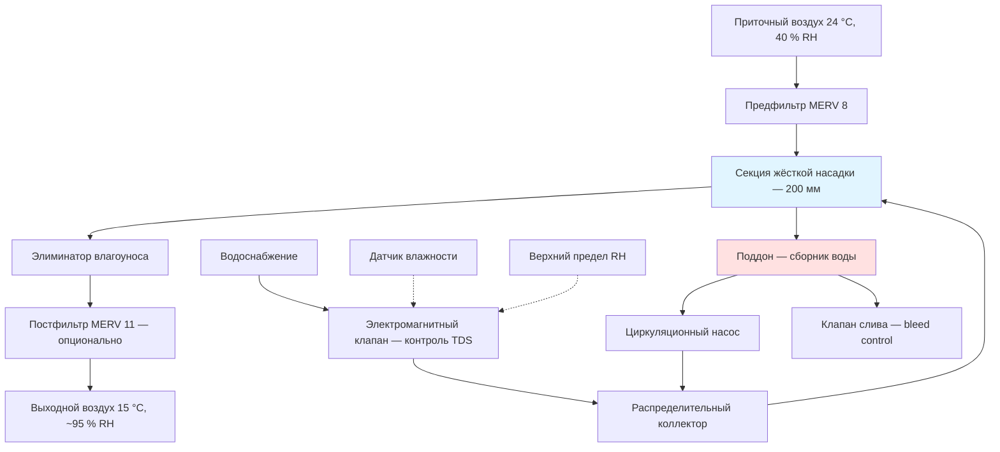

## Принципы работы испарительных увлажнителей

Испарительные увлажнители (evaporative humidifiers) добавляют влагу в воздушный поток методом адиабатического насыщения (adiabatic saturation): вода испаряется с поверхности увлажнённой насадки за счёт теплоты самого воздушного потока без подвода внешней энергии. Процесс одновременно увеличивает влагосодержание и снижает температуру по сухому термометру, сохраняя при этом постоянную энтальпию влажного воздуха. Линия процесса на психрометрической диаграмме (psychrometric chart) совпадает с линией постоянной температуры влажного термометра.

**Уравнение добавки влаги:**


\dot{m}_w = \dot{m}_a \cdot (d_2 - d_1)


где:
- $\dot{m}_w$ — массовый расход испаряемой воды, кг/с;
- $\dot{m}_a$ — массовый расход сухого воздуха, кг/с;
- $d_1$, $d_2$ — влагосодержание на входе и выходе секции, кг/кг с.в.

**Снижение температуры по сухому термометру:**


\Delta T = \frac{(d_2 - d_1) \cdot h_{fg}}{c_{p,a}}


где $h_{fg} \approx 2450$ кДж/кг — скрытая теплота парообразования при 20 °C; $c_{p,a} \approx 1{,}005$ кДж/(кг·°C) — удельная теплоёмкость сухого воздуха.

Теоретическая конечная точка процесса — адиабатическое насыщение (100 % RH при температуре влажного термометра). Реальные системы достигают 80–95 % эффективности насыщения.

## Типы влажных насадок


| Тип насадки | Эффективность насыщения | Скорость на входе, м/с | Перепад давления, Па | Срок службы | Применение |
|---|---|---|---|---|---|
| Жёсткая целлюлоза (rigid cellulose) | 85–95 % | 2–3 | 38–76 | 5–7 лет | ПВУ, приточные системы |
| Жёсткая керамика (rigid ceramic) | 80–90 % | 2,5–3,5 | 51–89 | 10+ лет | Промышленность, агрессивная среда |
| Волокнистая случайная насадка (random fibre) | 70–85 % | 1,5–2,5 | 25–51 | 2–4 года | Жилой сектор, лёгкая коммерция |
| Матрица форсунок (spray nozzle matrix) | 60–80 % | 2–4 | 13–38 | 8–10 лет | Чистые помещения, промышленность |


### Жёсткие насадки (Rigid Media)

Структурированные в виде сот панели из гофрированной целлюлозы или керамики имеют высокую удельную поверхность 1800–3600 м²/м³. Вода подаётся через распределительный коллектор на верхнюю грань насадки и стекает вниз под действием капиллярных и гравитационных сил, тогда как воздух проходит горизонтально в перекрёстной схеме. Рекомендации по проектированию: толщина насадки 150–300 мм (увеличение толщины повышает эффективность); угол ячеек 45° или 60°; скорость воздуха на лице насадки (face velocity) 2–3 м/с; расход воды 0,8–1,6 л/(мин·м) ширины.

### Поддонные (Basin) системы

Насадка располагается над сборным поддоном (sump); циркуляционный насос подаёт воду на распределительные трубы над насадкой. Стоимость установки ниже, чем у жёстких насадок; перепад давления меньше. Необходима регулярная очистка поддона для предотвращения биологического роста. Глубина поддона — не менее 76 мм; расход слива (bleed) — 10–20 % циркуляционного расхода для контроля TDS.

## Эффективность насыщения и психрометрический расчёт

Эффективность насыщения (saturation effectiveness):


\eta_{\text{sat}} = \frac{d_2 - d_1}{d_{\text{sat}}(T_{\text{wb}}) - d_1} \times 100\,\%


где $d_{\text{sat}}(T_{\text{wb}})$ — влагосодержание при насыщении при температуре влажного термометра $T_{\text{wb}}$.

**Пример расчёта.**

Исходные условия: $T_{\text{сух}} = 24$ °C, $\varphi_1 = 40$ %, $d_1 = 0{,}0065$ кг/кг. Температура влажного термометра $T_{\text{wb}} = 15$ °C. Влагосодержание при насыщении $d_{\text{sat}} = 0{,}0108$ кг/кг. Измеренное влагосодержание на выходе $d_2 = 0{,}0102$ кг/кг.

$$\eta_{\text{sat}} = \frac{0{,}0102 - 0{,}0065}{0{,}0108 - 0{,}0065} \times 100 = \frac{0{,}0037}{0{,}0043} \times 100 \approx 86\,\%$$

Снижение температуры:

$$\Delta T = \frac{(0{,}0102 - 0{,}0065) \times 2450}{1{,}005} \approx 9\,\text{°C}$$

Температура выходящего воздуха: $24 - 9 = 15$ °C. Для воздушного потока 340 кг/ч (280 м³/ч при плотности 1,2 кг/м³) добавка влаги составит:

$$\dot{m}_w = 340 \times (0{,}0102 - 0{,}0065) = 1{,}26\text{ кг/ч}$$

## Конфигурация системы





## Управление качеством воды

Испарение удаляет чистую воду, концентрируя растворённые вещества в рециркуляционном контуре. Циклы концентрирования (concentration cycles, CoC):


\text{CoC} = \frac{\text{TDS}_{\text{продувка}}}{\text{TDS}_{\text{подпитка}}}
\quad\Rightarrow\quad
\dot{Q}_{\text{слив}} = \frac{\dot{m}_w}{\text{CoC} - 1}


Целевые значения CoC: 3–5 для целлюлозных насадок, 5–8 для керамических. Автоматический клапан слива (bleed valve) управляется по сигналу датчика электропроводности (conductivity transmitter). Требования к воде: TDS < 500 мг/л (предпочтительно < 1000 мг/л максимум); биоцид — зарегистрированный продукт по протоколу производителя; фильтрация — не менее 50 мкм на входе в распределительную систему.

## Рекомендации ASHRAE и нормативная база

По ASHRAE Standard 62.1-2022, раздел 5.12, испарительные увлажнители должны быть оснащены:
- Элиминаторами влагоуноса (moisture eliminators) с эффективностью улавливания капель ≥ 95 % для частиц > 100 мкм;
- Сливными поддонами с доступом для осмотра и очистки;
- Автоматическим отсечным клапаном воды при остановке вентилятора;
- Защитой от переполнения и сигнализацией утечки.

ASHRAE Handbook — HVAC Systems and Equipment, глава 22, содержит корреляции эффективности насыщения для различных типов насадок, расчёты перепада давления, расходы воды в зависимости от климатических условий и правила интеграции с воздушными экономайзерами (air-side economizers).

Российская нормативная база: **СП 60.13330.2020**, **ГОСТ Р 30494-2011** (оптимальные параметры микроклимата), **СанПиН 2.1.3684-21** (гигиенические требования к воздуху помещений).

## Преимущества и ограничения применения

**Преимущества:**
- Минимальное электропотребление (только привод насоса): 3–8 Вт/(кг/ч) добавленной влаги.
- Испарительное охлаждение снижает нагрузку на чиллер в тёплый период.
- Самоограничивающийся процесс: при 100 % RH испарение прекращается.
- Нет продуктов сгорания, нет сжатого воздуха.

**Ограничения:**
- Снижение температуры требует доподогрева в холодный период, что снижает энергетический выигрыш.
- Не пригодны для стерильных сред — требуется строгий контроль биологической загрязнённости.
- Регулярное обслуживание (очистка поддона, замена насадки) обязательно.
- Качество воды ограничивает применение в районах с высокой жёсткостью без предварительной обработки.

**Оптимальные области применения:**
- Центры обработки данных (data centers) с непрерывным охлаждением;
- Промышленные объекты с высокими внутренними тепловыделениями;
- Приточные установки в тёплом и сухом климате;
- Сельскохозяйственные теплицы, текстильные производства.

## Требования к техническому обслуживанию

1. **Ежемесячно:** осмотр поддона на застойную воду и биологический рост.
2. **Ежеквартально:** проверка TDS и pH; регулировка расхода слива; промывка циркуляционного насоса.
3. **Раз в полгода:** очистка распределительной системы; замена фильтрующих элементов.
4. **Ежегодно:** оценка состояния насадки; при снижении эффективности насыщения или увеличенном перепаде давления — замена.

Признаки необходимости замены насадки: снижение эффективности насыщения более чем на 10 % от паспортного значения; перепад давления вырос на 25 % и более; видимый биологический рост или минеральные отложения на поверхности ячеек.
