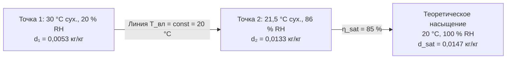

## Технический обзор

Испарительные увлажнители со смоченной насадкой (wetted media humidifiers) пропускают воздушный поток через непрерывно орошаемые поверхности насадочного материала, обеспечивая испарение воды при прямом контакте. Насадочный материал создаёт обширную площадь поверхности для тепло- и массообмена, добавляя влагу без распыления или генерации пара. Рециркуляционные насосы (recirculating pumps) подают воду из поддона (sump) на верхнюю грань насадки; дренаж стекает обратно. Адиабатический характер процесса поглощает явную теплоту из воздуха, охлаждая его при одновременном увлажнении. Данный класс оборудования обеспечивает наименьшее удельное энергопотребление среди всех технологий увлажнения (только привод насоса) и является первым выбором для установок с продолжительным временем работы и достаточным расстоянием абсорбции.

## Конструкция жёстких насадочных панелей

**Целлюлозные жёсткие насадки (rigid cellulose media)** изготавливаются из пропитанной водооталкивающим составом гофрированной целлюлозы с углом ячеек 45° или 60°. Плотность удельной поверхности — 1800–2400 м²/м³; толщина панелей — 100–300 мм. Конфигурация ячеек оптимизирует перепад давления относительно эффективности испарения: более тонкие ячейки увеличивают площадь контакта, но повышают аэродинамическое сопротивление. Модульная конструкция рамы позволяет замену отдельных секций без демонтажа системы водораспределения.

**Керамические жёсткие насадки (rigid ceramic media)** применяются при агрессивном качестве воды или в высокотемпературных зонах, где целлюлоза разрушается. Более высокая начальная стоимость компенсируется сроком службы 10+ лет и лучшей очищаемостью от минеральных отложений.

**Рекомендации по проектированию жёстких насадок:**
- Скорость воздуха на лице насадки (face velocity): 2–3 м/с — оптимальный диапазон;
- Расход орошения: 0,8–1,6 л/(мин·м) ширины;
- Уклон рамы насадки: ≥ 5° для полного дренирования при останове.

## Системы с расширенной металлической сеткой (Expanded Metal Media)

Стеки из расширенной нержавеющей сетки создают извилистые пути потока воздуха, способствующие контакту воздуха с орошаемой поверхностью. Плотность и глубина стека определяют эффективность насыщения и характеристики перепада давления. Эффективность насыщения несколько ниже, чем у жёстких целлюлозных панелей (65–80 %), однако начальная стоимость заменяемых секций меньше, а срок службы нержавеющей стали при надлежащей очистке — 10–15 лет. Некоторые конструкции интегрируют капиллярные фитили в сборки сетки, улучшая равномерность увлажнения при низких расходах воды.

## Водораспределение и гидравлика рециркуляции

Распределительный коллектор (distribution manifold) подаёт воду равномерно по всей ширине насадки через перфорированные трубы, форсунки низкого давления или пористые диффузоры. Расход орошения:


\dot{Q}_{\text{насос}} = \dot{Q}_{\text{распред}} + \dot{Q}_{\text{запас}} \geq 6{,}3\text{–}25\text{ л/(мин·м)}


Центробежный рециркуляционный насос (centrifugal recirculating pump) обеспечивает положительное давление по всем точкам коллектора. Типовые напоры — 3–9 м вод. ст. Непрерывная рециркуляция во время работы промывает насадку, контролирует биологический рост и поддерживает равномерное смачивание. Конструкция поддона: наклонное дно для дренирования осадка; переливная защита; поплавковый клапан подпитки (make-up water float valve) для поддержания уровня.

## Управление качеством воды и продувка

По мере испарения чистой воды концентрация растворённых веществ в рециркуляте растёт. Коэффициент концентрирования (cycles of concentration, CoC):


\text{CoC} = \frac{\text{TDS}_{\text{слив}}}{\text{TDS}_{\text{подпитка}}}
\quad\Rightarrow\quad
\dot{Q}_{\text{слив}} = \frac{\dot{m}_{\text{исп}}}{\text{CoC} - 1}


где $\dot{m}_{\text{исп}}$ — расход испарения (кг/ч). Целевые значения CoC: 3–6 для целлюлозных насадок (риск образования накипи при более высоких значениях), 5–8 для керамических. Автоматический клапан продувки (bleed valve) управляется по сигналу датчика электропроводности (conductivity sensor). Недостаточная продувка ускоряет образование накипи; избыточная — расходует воду и создаёт лишние стоки.

**Пример расчёта продувки.** Испарение $\dot{m}_{\text{исп}} = 50$ кг/ч, TDS подпиточной воды 300 мг/л, целевое CoC = 4:

$$\dot{Q}_{\text{слив}} = \frac{50}{4 - 1} \approx 16{,}7\text{ кг/ч} \approx 16{,}7\text{ л/ч}$$

Расход подпитки: $\dot{Q}_{\text{подп}} = \dot{m}_{\text{исп}} + \dot{Q}_{\text{слив}} = 50 + 16{,}7 \approx 67\text{ л/ч}$.

## Адиабатическое охлаждение и психрометрика

Адиабатическое увлажнение протекает вдоль линии постоянной температуры влажного термометра (constant wet-bulb temperature line) на психрометрической диаграмме (Mollier chart). Снижение температуры сухого термометра:


\Delta T_{\text{сух}} = \eta_{\text{sat}} \cdot (T_{\text{сух}} - T_{\text{вл}})


где $\eta_{\text{sat}}$ — эффективность насыщения; $T_{\text{вл}}$ — температура влажного термометра. При $\eta_{\text{sat}} = 85$ %, $T_{\text{сух}} = 30$ °C, $T_{\text{вл}} = 20$ °C: $\Delta T = 0{,}85 \times 10 = 8{,}5$ °C. Выходная температура — 21,5 °C. Это охлаждение снижает пиковую нагрузку на чиллер в тёплый период, однако в отопительный сезон может потребовать доподогрева приточного воздуха.





## Профилактика легионеллёза (Legionella Prevention)

Бактерии _Legionella pneumophila_ размножаются в застойной тёплой воде (20–50 °C), образуя биоплёнку на поверхностях насадки и поддона. Стратегии профилактики по ASHRAE 188-2018:


| Мера | Параметр | Периодичность |
|---|---|---|
| УФ-стерилизация (UV) рециркуляционного контура | Доза ≥ 30 мДж/см² | Непрерывно |
| Биоцид (biocide) | Согласно листу данных безопасности | По графику производителя |
| Слив системы при длительном простое | Полный дренаж при простое > 2 сут | Автоматически |
| Тепловая дезинфекция (thermal flush) | $T_{\text{вода}} \geq 60$ °C на 30 мин | Ежеквартально |
| Отбор проб воды на _Legionella_ | < 1 КОЕ/100 мл (ISO 11731) | Ежеквартально (или ежемесячно при выявлении) |


Поддержание температуры воды ниже 20 °C (в системах с холодной водой) или выше 50 °C (в системах горячего водоснабжения) прерывает биологический цикл размножения. Температурный диапазон 20–50 °C является зоной риска и должен исключаться из режимов эксплуатации.

## Характеристики перепада давления

Аэродинамическое сопротивление секции насадки зависит от типа материала, толщины и степени загрязнения:


| Тип насадки | Толщина, мм | Скорость, м/с | Перепад давления, Па |
|---|---|---|---|
| Целлюлоза 45° | 200 | 2,5 | 55–75 |
| Целлюлоза 60° | 200 | 2,5 | 65–90 |
| Керамика | 200 | 2,5 | 70–100 |
| Расширенная сетка | 200 | 2,5 | 40–65 |


Засорённая насадка показывает рост перепада давления на 25–50 % по сравнению с чистой, что увеличивает потребление электроэнергии вентилятора и является сигналом к очистке или замене.

## Интеграция с системой управления

Алгоритм управления модулирует клапан подпитки, поддерживая уровень воды в поддоне, и управляет клапаном продувки по показаниям датчика проводимости. Датчик влажности в воздуховоде (duct humidity sensor) обеспечивает обратную связь для включения/отключения насосной группы. Защита от замерзания в холодном климате — электронагрев поддона или автоматический дренаж при останове. Интеграция с BAS (building automation system) — через протоколы Modbus RTU или BACnet IP; аналоговые выходы 4–20 мА для дистанционного мониторинга TDS, расходов и перепада давления.

## Требования к техническому обслуживанию

1. **Ежемесячно:** визуальный осмотр распределения воды по насадке; проверка на застойные зоны; контроль работы клапанов подпитки и продувки.
2. **Ежеквартально:** очистка поддона — удаление осадка и биоплёнки; проверка TDS и pH; регулировка уставки клапана продувки.
3. **Раз в полгода:** промывка распределительной системы; химическая очистка насадки (слабый раствор лимонной или соляной кислоты) при наличии минеральных отложений.
4. **Ежегодно:** оценка состояния насадки по эффективности насыщения и перепаду давления; замена при необходимости; поверка датчиков.

## Нормативная база

- **ASHRAE 62.1-2022** — элиминаторы влагоуноса (≥ 95 % улавливания капель > 100 мкм); доступ к поддону; автоматическое отключение при останове вентилятора;
- **ASHRAE 188-2018** — управление рисками легионеллёза; протоколы мониторинга и дезинфекции;
- **ASHRAE Handbook — HVAC Systems and Equipment, Chapter 22** — проектирование испарительных секций;
- **СП 60.13330.2020** — требования к системам ОВК;
- **СанПиН 2.1.3684-21** — гигиенические нормативы содержания микроорганизмов в воздухе помещений.

## Критерии выбора и ограничения

Увлажнители со смоченной насадкой предпочтительны при: продолжительном времени работы (> 3000 ч/год); наличии персонала для регулярного ТО; условиях, когда испарительное охлаждение выгодно; качестве воды TDS < 500 мг/л; достаточном пространстве для установки и расстоянии абсорбции.

Не рекомендуются при: прерывистой работе (биорост в застойной воде); климатах с преимущественно отопительным сезоном (охлаждение нежелательно); очень жёсткой воде без водоподготовки; отсутствии квалифицированного персонала для ТО; строгих требованиях к стерильности среды.
