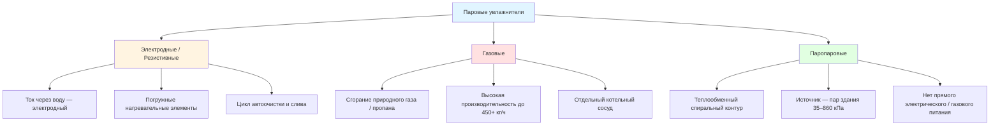

## Введение

Паровые увлажнители (steam humidifiers) — наиболее распространённая в коммерческом и промышленном секторах технология точного регулирования влажности. В отличие от адиабатических систем, они вводят чистый водяной пар непосредственно в воздушный поток, добавляя и явную теплоту, и скрытую теплоту испарения. Это обеспечивает стерильную (микробиологически безопасную) инжекцию, быстрый отклик и возможность применения в критичных средах: медицинских учреждениях, центрах обработки данных, фармацевтических производствах и музейных хранилищах.





## Сравнение трёх технологий


| Параметр | Электродные / Резистивные | Газовые | Паропаровые |
|---|---|---|---|
| Диапазон производительности | 2–90 кг/ч | 23–450+ кг/ч | 9–225 кг/ч |
| Источник энергии | Электричество 208–480 В | Природный газ / пропан | Пар здания 35–860 кПа |
| Время отклика | 5–15 мин | 10–20 мин | 2–5 мин |
| Требования к воде | Контроль проводимости | Высокая чистота (< 50 мг/л TDS) | Минимальные (пар здания) |
| Интервал ТО | 500–2000 ч | 2000–4000 ч | 1000–3000 ч |
| КПД | 95–98 % | 80–85 % (потери в дымовых газах) | 90–95 % |
| Стерильность | Да (кипячение) | Да (> 100 °C) | Зависит от качества пара здания |
| Сложность монтажа | Низкая | Высокая (вентиляция дымохода) | Средняя |


## Расчёт производительности паровой инжекции

Требуемый расход пара рассчитывается из уравнения влажностного баланса:


\dot{m}_s = \dot{V} \cdot \rho_a \cdot (d_2 - d_1)


где:
- $\dot{m}_s$ — расход пара, кг/ч;
- $\dot{V}$ — объёмный расход воздуха, м³/ч;
- $\rho_a \approx 1{,}2$ кг/м³ — плотность сухого воздуха при стандартных условиях;
- $d_1$, $d_2$ — влагосодержание на входе и выходе, кг/кг.

**Пример расчёта.** Воздуховод $\dot{V} = 4700$ м³/ч; входные условия 21 °C, 20 % RH ($d_1 = 0{,}0031$ кг/кг); цель 21 °C, 45 % RH ($d_2 = 0{,}0070$ кг/кг):

$$\dot{m}_s = 4700 \times 1{,}2 \times (0{,}0070 - 0{,}0031) = 4700 \times 1{,}2 \times 0{,}0039 \approx 22\text{ кг/ч}$$

**Коэффициент запаса** 20–30 % учитывает инфильтрацию холодного воздуха и пиковые нагрузки: $22 \times 1{,}25 = 27{,}5$ кг/ч — выбирается типоразмер **30 кг/ч**.

**Требуемая тепловая мощность** (скрытая теплота):


\dot{Q}_{\text{скр}} = \dot{m}_s \cdot h_{fg}


где $h_{fg} \approx 2257$ кДж/кг — скрытая теплота парообразования при атмосферном давлении. Для $\dot{m}_s = 22$ кг/ч: $\dot{Q} = 22 \times 2257 \approx 49{,}7$ МДж/ч = **13,8 кВт**.

## Расстояние абсорбции пара (Steam Absorption Distance)

Пар не поглощается воздухом мгновенно: недостаточное расстояние абсорбции приводит к видимому паровому шлейфу, конденсации на стенках воздуховода и потенциальному микробному росту.

**Упрощённая оценка минимального расстояния:**


L_{\text{абс,min}} = k \cdot \frac{\dot{m}_s}{v_{\text{возд}}}


где $k = 0{,}15$–$0{,}25$ (м²·с/кг) — эмпирическая константа; $v_{\text{возд}}$ — скорость воздуха в воздуховоде, м/с.


| Скорость воздуха, м/с | Расход пара, кг/ч | Минимальное расстояние, м | Рекомендуемое расстояние, м |
|---|---|---|---|
| 2,5 | 23 | 2,4 | 3,7 |
| 2,5 | 45 | 4,6 | 6,1 |
| 5,1 | 23 | 1,2 | 1,8 |
| 5,1 | 45 | 2,4 | 3,0 |
| 7,6 | 23 | 0,9 | 1,5 |
| 7,6 | 45 | 1,5 | 2,4 |


**Факторы, ускоряющие абсорбцию:** многоотверстная конструкция диспергирующей трубки (distribution tube); перегрев пара на 5–11 °C; более высокая температура воздуха; более низкая входная RH; высокая турбулентность в воздуховоде.

## Требования к качеству воды


| Параметр | Электродные | Газовые / Резистивные | Паропаровые |
|---|---|---|---|
| TDS, мг/л | 200–1500 | < 50 | Н/П (пар здания) |
| Жёсткость (CaCO₃), мг/л | < 300 | < 10 | Н/П |
| Проводимость, мкСм/см | 150–1200 | < 100 | Н/П |
| pH | 6,5–8,5 | 6,5–8,5 | Н/П |
| Хлориды, мг/л | < 250 | < 50 | Н/П |
| Кремнезём (SiO₂), мг/л | < 50 | < 10 | Н/П |


**Электродные увлажнители** требуют умеренной проводимости воды для протекания электрического тока через жидкость; избыток минералов вызывает быстрое засорение цилиндра. **Газовые и резистивные** требуют высокочистой питательной воды — близкой к котловому качеству — для предотвращения накипи на теплообменных поверхностях. **Паропаровые** исключают проблемы питательной воды, но требуют чистого пара здания без масляных примесей с надлежащим качеством конденсата.

## Стратегии управления

**Пропорциональное управление (Proportional):** модуляция производительности от 10 до 100 % по сигналу ошибки (deviation from setpoint). Может иметь остаточное смещение (offset) при переменных нагрузках.

**PI-управление (Proportional-Integral):** добавляет интегральную составляющую для исключения статической ошибки. Стандарт для систем ОВК. Типовые настройки: пропорциональная полоса 10–20 % RH, интегральное время 5–10 мин.

**PID-управление:** добавляет дифференциальную составляющую для улучшенного переходного отклика. Применяется в критичных установках (фармацевтика, клинические исследования) с быстрыми изменениями нагрузки.

### Размещение датчика влажности

- **Датчик обратного воздуха (return air sensor):** наиболее распространённая конфигурация; размещается на расстоянии 2/3 пути от увлажнителя до вентилятора, но не менее 3 м ниже по потоку от источника пара.
- **Датчик приточного воздуха (supply air sensor):** используется при жёстком контроле влажности приточного воздуха; требует адекватного расстояния абсорбции выше датчика.
- **Датчик в помещении (room sensor):** прямое измерение результирующей влажности; более медленный отклик, но исключает артефакты воздуховода.

### Защитные блокировки (Safety Interlocks) по ASHRAE 62.1

- Гигростат высокого предела (high-limit humidistat): обычно 60–70 % RH;
- Реле контроля воздушного потока: запрет инжекции пара при остановленном вентиляторе;
- Сигнализация переполнения дренажного поддона;
- Отсечка по низкому уровню воды (для электродных и газовых типов);
- Ограничитель высокой температуры в зоне датчика.

## Требования стандартов ASHRAE

**ASHRAE 170-2021** (медицинские учреждения): большинство помещений — 20–60 % RH; операционные — 20–60 % RH; неонатальные отделения — 30–60 % RH. Паровые увлажнители обязательны в большинстве юрисдикций из-за стерильности пара.

**ASHRAE 55-2023** (тепловой комфорт): 30–60 % RH для оптимального комфорта и воспринимаемого качества воздуха.

**ASHRAE 188-2018** (легионеллёз): протоколы обработки питательной воды, регулярные инспекции и документирование систем.

**ASHRAE 90.1-2022** (энергоэффективность зданий): паровые увлажнители с электрическим нагревом не допускаются при наличии готового пара от централизованных источников, кроме случаев, когда его применение обосновано технически.

## Области применения

**Медицинские учреждения:** паровые увлажнители обязательны для операционных и ОРИТ — обеспечивают стерильный пар без микробных рисков.

**Центры обработки данных:** точный контроль RH (40–60 %) для предотвращения ESD. Паропаровые агрегаты используют инфраструктуру пара здания.

**Музеи и архивы:** жёсткий допуск RH ± 2–3 % для сохранности экспонатов. Модулирующая паровая инжекция с PI-регулированием.

**Фармацевтические производства:** соответствие требованиям GMP FDA; газовые агрегаты с документированными протоколами качества воды.

**Коммерческие офисы:** экономичные электродные агрегаты 23–68 кг/ч на воздуховод.

## Нормативная база

- **ASHRAE Handbook — HVAC Systems and Equipment, Chapter 22** — проектирование паровых увлажнителей;
- **ASHRAE 170-2021, 55-2023, 62.1-2022, 188-2018** — применение и безопасность;
- **AHRI 640-2005** — коммерческие увлажнители: методика испытаний;
- **СП 60.13330.2020** — нормативные требования к системам ОВК;
- **ГОСТ Р 30494-2011** — параметры микроклимата.
