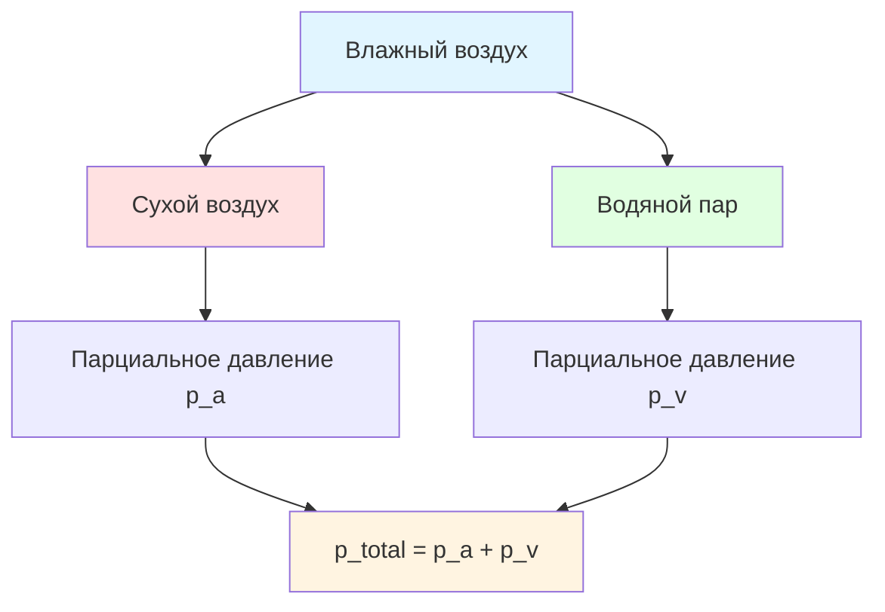

Психрометрика (psychrometrics) — раздел термодинамики, изучающий свойства смесей сухого воздуха и водяного пара и процессы изменения этих свойств. Знание психрометрики обязательно для инженера HVAC: оно лежит в основе расчёта холодопроизводительности, выбора оборудования, анализа процессов обработки воздуха и оценки энергопотребления систем кондиционирования.

## Основы психрометрического анализа

Атмосферный воздух рассматривается как бинарная смесь сухого воздуха (dry air) и водяного пара (water vapor). В диапазоне температур и давлений, характерных для задач HVAC, смесь подчиняется закону Дальтона о парциальных давлениях:


p_{total} = p_a + p_v


где $p_{total}$ — общее атмосферное давление; $p_a$ — парциальное давление сухого воздуха; $p_v$ — парциальное давление водяного пара. На уровне моря при стандартных условиях $p_{total} = 101{,}325$ кПа.

## Состав и свойства сухого воздуха

Стандартный сухой воздух по объёму содержит N₂ (78,08 %), O₂ (20,95 %), Ar (0,93 %) и следы CO₂. Для психрометрических расчётов его рассматривают как один псевдокомпонент с постоянными свойствами:

- молярная масса: $M_a = 28{,}965$ кг/кмоль;
- газовая постоянная: $R_a = 287{,}055$ Дж/(кг·К);
- удельная теплоёмкость при $p = \text{const}$: $c_p = 1{,}006$ кДж/(кг·К) при 20 °C.

Уравнение состояния идеального газа для сухого воздуха:


p_a V = m_a R_a T


## Водяной пар и насыщение

Максимальная концентрация водяного пара при данной температуре определяется давлением насыщения $p_{ws}(T)$, которое возрастает экспоненциально с температурой по уравнению Клаузиуса-Клапейрона:


\frac{dp_{ws}}{dT} = \frac{h_{fg}}{T \cdot v_{fg}}


где $h_{fg}$ — скрытая теплота парообразования, кДж/кг; $v_{fg}$ — изменение удельного объёма при парообразовании, м³/кг.

ASHRAE Handbook — Fundamentals приводит эмпирические коэффициенты для расчёта $p_{ws}(T)$ в диапазоне от −100 °C до +200 °C. Для практических расчётов в диапазоне 0–60 °C точность 0,1 % обеспечивает формула Антуана или табличные данные приложения 1 ASHRAE.

## Семь психрометрических свойств

Состояние влажного воздуха полностью описывается семью свойствами; для однозначного определения состояния достаточно двух независимых. Связь свойств:

**Температура сухого термометра** (dry-bulb temperature, DBT), °C — фактическая температура воздуха, измеренная стандартным термометром.

**Влагосодержание** (humidity ratio, W), кг/кг:


W = 0{,}622 \cdot \frac{p_v}{p - p_v}


**Относительная влажность** (relative humidity, RH, $\phi$), %:


\phi = \frac{p_v}{p_{ws}(T_{db})} \times 100\%


**Удельная энтальпия** (specific enthalpy, $h$), кДж/кг с.в.:


h = 1{,}006 \cdot T + W \cdot (2501 + 1{,}86 \cdot T)


**Удельный объём** (specific volume, $v$), м³/кг с.в.:


v = \frac{R_a \cdot T}{p - p_v}


**Температура точки росы** (dew-point temperature, $T_d$) — температура, при которой воздух насыщается при охлаждении без изменения $p_v$.

**Температура мокрого термометра** (wet-bulb temperature, WBT) — температура адиабатического насыщения, приближающаяся к показанию аспирационного психрометра.

## Применение в инженерии HVAC

### Расчёт холодопроизводительности

Полная тепловая нагрузка на охлаждающую секцию (cooling coil) определяется разностью энтальпий:


Q_t = \dot{m}_{air} \cdot (h_{in} - h_{out})


Явная составляющая (sensible) и скрытая (latent) разделяются для выбора типа и размера оборудования. Коэффициент явного тепла (sensible heat ratio, SHR) определяет требуемую точку росы аппарата (apparatus dew point, ADP):


SHR = \frac{Q_s}{Q_t} = \frac{h_{in} - h_{out,s}}{h_{in} - h_{out}}


### Смешивание воздушных потоков

Состояние смеси двух потоков (приточный + рециркуляционный) определяется правилом рычага по массовым расходам:


W_{mix} = \frac{\dot{m}_1 W_1 + \dot{m}_2 W_2}{\dot{m}_1 + \dot{m}_2}


Аналогично рассчитывают $T_{mix}$ и $h_{mix}$. Объёмные расходы перед смешиванием приводят к массовым через удельный объём: $\dot{m} = \dot{V}/v$.

### Увлажнение и осушение

Зимнее увлажнение добавляет влагу при почти неизменной температуре — на психрометрической диаграмме (psychrometric chart) процесс идёт вертикально вверх. Количество требуемого пара:


\dot{m}_{steam} = \dot{m}_{air} \cdot (W_2 - W_1)


Летнее осушение при охлаждении ниже точки росы следует по кривой насыщения к точке ADP. Отвод конденсата:


\dot{m}_{cond} = \dot{m}_{air} \cdot (W_{in} - W_{out})


### Системы рекуперации энергии

Вращающиеся рекуператоры (rotary heat exchangers) и пластинчатые рекуператоры (plate heat exchangers) передают между потоками и явную, и скрытую теплоту. Психрометрический анализ позволяет рассчитать КПД по полной теплоте (total effectiveness):


\varepsilon_t = \frac{h_{sa,in} - h_{sa,out}}{h_{sa,in} - h_{ea,in}}


## Стандартные атмосферные условия

ASHRAE Standard 62.1 и ASHRAE Handbook — Fundamentals устанавливают стандартные условия:

- атмосферное давление на уровне моря: 101,325 кПа;
- стандартная температура: 20 °C;
- стандартная плотность воздуха: 1,204 кг/м³.

Зависимость давления от высоты над уровнем моря:


p_z = p_0 \left(1 - \frac{g \cdot z}{R_a \cdot T_0}\right)^{5{,}256}


На высоте 1500 м давление составляет $\approx 84{,}5$ кПа. Это существенно влияет на влагосодержание насыщения и производительность оборудования: для расчётов необходимо использовать диаграммы, скорректированные под местную высоту.

## Пример расчёта: летнее кондиционирование (СИ)

**Условия.** Офис: расход приточного воздуха 2000 м³/ч. Смесь наружного (20 % от расхода, 34 °C / 55 % ОВ) и рециркуляционного воздуха (80 %, 26 °C / 50 % ОВ). Требуемый приточный воздух: 14 °C / 90 % ОВ.

**Свойства потоков** (из психрометрических таблиц):

- наружный воздух (OA): $W_{oa} = 0{,}0194$ кг/кг, $h_{oa} = 83{,}8$ кДж/кг, $v_{oa} = 0{,}897$ м³/кг;
- рециркуляционный (RA): $W_{ra} = 0{,}0104$ кг/кг, $h_{ra} = 52{,}7$ кДж/кг, $v_{ra} = 0{,}862$ м³/кг;
- приточный (SA): $W_{sa} = 0{,}0090$ кг/кг, $h_{sa} = 36{,}9$ кДж/кг.

**Массовые расходы** (с учётом $v \approx 0{,}862$ м³/кг):


\dot{m}_{sa} = \frac{2000/3600}{0{,}862} = 0{,}644 \text{ кг/с}


**Смешанный воздух:**


h_{ma} = 0{,}2 \times 83{,}8 + 0{,}8 \times 52{,}7 = 58{,}9 \text{ кДж/кг}


**Нагрузка на охлаждающую секцию:**


Q_t = 0{,}644 \times (58{,}9 - 36{,}9) = 14{,}2 \text{ кВт}


**Удаление конденсата:**


\dot{m}_{cond} = 0{,}644 \times (0{,}0134 - 0{,}0090) \times 3600 \approx 10{,}2 \text{ кг/ч}


## Расширенные применения психрометрики

**Промышленное кондиционирование.** Производство текстиля, бумаги и полупроводников требует точного поддержания влажности ±2–5 % ОВ. Психрометрический анализ определяет нагрузку на осушение или увлажнение при изменении технологических параметров.

**Сушильные установки.** Сельскохозяйственные сушилки, деревообрабатывающие камеры и промышленные конвейерные сушилки рассчитываются на основе психрометрических диаграмм для высоких температур (50–200 °C).

**Чистые помещения.** Фармацевтическое и полупроводниковое производство требует класса чистоты ISO 5–7 при строгом контроле ОВ (40–60 %); психрометрический анализ минимизирует энергопотребление систем точного климат-контроля.

**Центры обработки данных.** ASHRAE TC 9.9 рекомендует ОВ 20–80 % (без конденсации) в серверных помещениях. Психрометрический анализ обосновывает применение режима экономайзера (economizer mode) и снижение нагрузки на механическое охлаждение.

**Сохранение музейных фондов.** Стабильность ОВ ±5 % в диапазоне 45–55 % предотвращает деградацию материалов; психрометрический мониторинг является основой систем управления микроклиматом музеев.

## Заключение

Психрометрика формирует теоретическую и расчётную базу для всех задач климатотехники — от определения нагрузок и выбора оборудования до оптимизации режимов и оценки энергопотребления. Освоение психрометрических методов в соответствии с ASHRAE Handbook — Fundamentals является обязательным компетентностным требованием для инженера HVAC.
