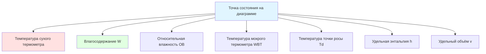

Психрометрическая диаграмма (psychrometric chart) — главный графический инструмент инженера HVAC. Она сводит все термодинамические свойства влажного воздуха на один двумерный чертёж, позволяя визуально анализировать процессы кондиционирования, оценивать нагрузки и проверять результаты аналитических расчётов. Применение диаграммы регламентировано ASHRAE Handbook — Fundamentals.

## Построение диаграммы и системы координат

Психрометрическая диаграмма ASHRAE строится в системе координат, где:

- **Горизонтальная ось (X)** — температура сухого термометра (dry-bulb temperature, DBT), °C. Для задач комфортного кондиционирования диапазон составляет −10...+50 °C.
- **Вертикальная ось (Y)** — влагосодержание (humidity ratio, W), кг воды/кг сухого воздуха. Правая шкала от 0 до $\approx 0{,}030$ кг/кг.

Верхняя граница области существования влажного воздуха — **кривая насыщения** — определяется уравнением:


W_{sat}(T) = 0{,}622 \cdot \frac{p_{ws}(T)}{p_{atm} - p_{ws}(T)}


где $p_{ws}(T)$ — давление насыщения, кПа; $p_{atm}$ — атмосферное давление, кПа.

Точки состояния, находящиеся на кривой насыщения, соответствуют воздуху с ОВ = 100 %. Состояния левее и ниже кривой насыщения в условиях равновесия не реализуются: избыточная влага конденсируется.

## Кривая насыщения

Кривая насыщения (saturation curve) ограничивает диаграмму слева. Вдоль кривой при движении снизу вверх температура, влагосодержание и энтальпия одновременно растут. Крутизна кривой определяется уравнением Клаузиуса-Клапейрона:


\frac{dW_{sat}}{dT} = \frac{0{,}622}{p_{atm}} \cdot \frac{dp_{ws}}{dT}


При высоких температурах (> 25 °C) наклон кривой резко возрастает: небольшое повышение температуры насыщенного воздуха требует значительного увеличения влагосодержания.

Охлаждение воздуха ниже точки росы приводит к конденсации; поэтому процесс охлаждения + осушения (cooling and dehumidification) следует вдоль кривой насыщения к точке ADP и никогда не пересекает её.

## Линии относительной влажности

Линии постоянной ОВ (relative humidity lines) располагаются в диапазоне 10–90 % с шагом 10 % и изгибаются вверх слева направо. Для любой точки состояния:


\phi \approx \frac{W}{W_{sat}(T_{db})} \times 100\%


Горизонтальное перемещение вправо (нагрев) при неизменном W снижает ОВ, так как $W_{sat}(T)$ растёт. Вертикальное перемещение вверх (добавление пара) при неизменной температуре увеличивает ОВ.

## Линии температуры мокрого термометра

Линии постоянной температуры мокрого термометра (wet-bulb temperature, WBT) наклонены вниз слева направо под углом $\approx 30°$ к горизонтали. Они начинаются на кривой насыщения и идут вправо-вниз.

Значение WBT — минимальная температура, достижимая испарительным охлаждением:


T_{wb} \leq T_{db} \quad \text{(при ненасыщенном воздухе)}; \quad T_{wb} = T_{db} \quad \text{(при насыщении)}


Депрессия психрометра $\Delta T = T_{db} - T_{wb}$ характеризует потенциал испарительного охлаждения и коррелирует с дефицитом влажности.

## Линии энтальпии

Линии удельной энтальпии (specific enthalpy lines) практически параллельны линиям WBT с небольшим угловым расхождением. Численное значение считывается со шкалы на левом крае кривой насыщения.


h = 1{,}006 \cdot T_{db} + W \cdot (2501 + 1{,}86 \cdot T_{db}) \quad \text{кДж/кг}


Для энергетических расчётов:


\dot{Q} = \dot{m}_{air} \cdot (h_1 - h_2)


Линии энтальпии позволяют непосредственно определить нагрузку на секцию охлаждения или нагрева без пошагового расчёта свойств.

## Линии удельного объёма

Линии удельного объёма (specific volume lines) наклонены вниз слева направо, круче, чем линии WBT. При стандартном давлении:


v \approx \frac{287{,}055 \cdot T}{(101325 - p_v) } \quad \text{м}^3/\text{кг}


Удельный объём необходим для перевода объёмного расхода (м³/с) в массовый (кг/с):


\dot{m} = \frac{\dot{V}}{v}


Типичные значения: при 0 °C $v \approx 0{,}775$ м³/кг; при 20 °C — $0{,}842$ м³/кг; при 40 °C — $0{,}908$ м³/кг.

## Температура точки росы: чтение по диаграмме

Из любой точки состояния движутся горизонтально влево — при постоянном W — до пересечения с кривой насыщения. Температура в этой точке есть температура точки росы $T_d$:


T_d = T_{sat}(p_v); \quad p_v = \frac{W \cdot p_{atm}}{0{,}622 + W}


Поверхности, температура которых ниже $T_d$, собирают конденсат. Минимально допустимая температура поверхности ограждения (окна, трубопроводы, каналы) должна превышать $T_d$ воздуха помещения.

## Чтение точки состояния: алгоритм

Любые два независимых свойства однозначно определяют точку состояния:

**DBT + ОВ:**
1. Найти DBT на горизонтальной оси.
2. Провести вертикаль.
3. Пересечение с нужной кривой ОВ — точка состояния.

**DBT + WBT:**
1. Найти WBT на кривой насыщения.
2. Провести линию WBT (наклонная) вправо.
3. Пересечение с вертикалью DBT — точка состояния.

**DBT + W:**
1. Найти W на вертикальной правой оси.
2. Провести горизонталь.
3. Пересечение с вертикалью DBT — точка состояния.

**DBT + $T_d$:**
1. Найти $T_d$ на кривой насыщения.
2. Провести горизонталь (постоянное W) до значения DBT.

## Построение основных процессов HVAC

### Явное нагревание (sensible heating)

Горизонтальная линия вправо: W = const, T растёт, ОВ снижается. Добавленное тепло:


q_s \approx 1{,}02 \cdot (T_2 - T_1) \quad \text{кДж/кг с.в.}


### Явное охлаждение (sensible cooling)

Горизонтальная линия влево до точки росы. Применяется, если $T_{coil} > T_d$: нет конденсации.

### Охлаждение и осушение (cooling and dehumidification)

Процесс идёт от точки входа к точке ADP (на кривой насыщения), затем немного вверх вправо — в результате смешения с байпасным воздухом. Итоговая точка лежит на отрезке «точка входа — ADP»:


BF = \frac{T_{out} - T_{ADP}}{T_{in} - T_{ADP}}


Коэффициент контакта (contact factor): $CF = 1 - BF$.

### Увлажнение паром

Вертикальная линия вверх при $T \approx \text{const}$ (пар добавляет минимальное явное тепло: $\Delta T \approx 2{,}4 \cdot \Delta W$ °C).

### Адиабатное увлажнение / испарительное охлаждение

Процесс идёт влево-вниз вдоль линии WBT = const при постоянной энтальпии.

### Смешивание двух потоков

Точка смеси лежит на прямой, соединяющей состояния двух потоков, в положении, обратно пропорциональном массовым расходам (правило рычага):


\frac{\dot{m}_1}{\dot{m}_2} = \frac{L_2}{L_1}


где $L_1$, $L_2$ — длины отрезков до каждой из начальных точек.

## Практический пример: зимнее увлажнение

**Дано:** наружный воздух 0 °C / 80 % ОВ; цель — помещение 22 °C / 40 % ОВ.

**Построение на диаграмме:**

1. Нанести точку OA (0 °C, 80 % ОВ): $W_{OA} \approx 0{,}0029$ кг/кг.
2. Нагреть горизонтально до 22 °C (W остаётся 0,0029 кг/кг; ОВ ≈ 17 %).
3. Увлажнить вертикально до 40 % ОВ: $W_{final} \approx 0{,}0066$ кг/кг.
4. Прирост влагосодержания: $\Delta W = 0{,}0066 - 0{,}0029 = 0{,}0037$ кг/кг.

При расходе воздуха 3000 м³/ч ($\dot{m} \approx 1{,}19$ кг/с):


\dot{m}_{steam} = 1{,}19 \times 0{,}0037 \times 3600 \approx 15{,}8 \text{ кг/ч}


## Вариации диаграммы для специальных условий

### Высотные диаграммы

При высоте свыше 500 м атмосферное давление снижается, что изменяет все психрометрические свойства. На высоте 1500 м ($p \approx 84{,}5$ кПа) влагосодержание насыщения $W_{sat}$ возрастает при той же температуре:


W_{sat,alt} = 0{,}622 \cdot \frac{p_{ws}(T)}{84{,}5 - p_{ws}(T)} > W_{sat,SL}


Применение стандартной диаграммы уровня моря для высотных объектов даёт ошибку в определении влагосодержания и энтальпии до 8–12 %.

### Диаграммы для низких температур

Для холодильных и зимних задач применяют расширенные диаграммы от −40 °C до +10 °C. Характерные приложения: проектирование холодильных камер, системы осушения ледовых арен, анализ обмерзания теплообменников.

### Диаграммы для высоких температур

Промышленные сушилки, вентиляция горячих цехов и печей требуют диаграмм до 100–200 °C. На таких диаграммах линии ОВ сдвигаются вправо, а область ненасыщенного воздуха расширяется.

## Цифровые психрометрические инструменты

Современные инструменты:

- ASHRAE Psychrometric Analysis CD (программные таблицы ASHRAE);
- Carrier HAP (Hourly Analysis Program);
- Trane TRACE 3D Plus;
- открытые онлайн-калькуляторы и Python-библиотека `psychrolib`.

Преимущества цифровых инструментов перед бумажной диаграммой:

- точность 4–6 значащих цифр против 2–3 при ручном чтении;
- автоматический учёт высоты и давления;
- возможность итерационного подбора параметров секций и оборудования;
- экспорт в расчётные программы нагрузок.

Несмотря на доступность цифровых инструментов, умение читать психрометрическую диаграмму остаётся базовым навыком: диаграмма даёт немедленное визуальное понимание природы процесса и выявляет грубые ошибки в расчётах.

## Типичные ошибки при работе с диаграммой

| Ошибка | Последствие | Исправление |
|---|---|---|
| Использование диаграммы уровня моря выше 500 м | Занижение влагосодержания и нагрузки на 5–10 % | Применять высотную диаграмму |
| Смешение метрических и имперских шкал | Ошибка в разы | Проверять подпись осей перед чтением |
| Увлажнение паром трактуется как процесс h = const | Завышение температуры приточного воздуха | Процесс увлажнения паром — вертикальная линия, а не линия WBT |
| Применение объёмных расходов при смешивании | Ошибка в положении точки смеси | Пересчитать в массовые через удельный объём |
| Экстраполяция за границы диаграммы | Недостоверные результаты | Использовать расчётные методы или специализированные диаграммы |

Психрометрическая диаграмма трансформирует абстрактные термодинамические уравнения в наглядный инструмент, доступный для ежедневного применения при проектировании, наладке и анализе работы систем HVAC.
