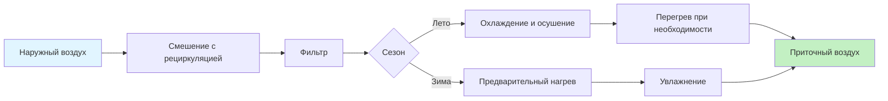

Психрометрический процесс — это переход влажного воздуха из одного состояния в другое в результате теплообмена, массообмена или их сочетания. Каждый процесс имеет характерную траекторию на психрометрической диаграмме и описывается балансами массы, влаги и энергии. Понимание этих процессов — основа проектирования систем HVAC согласно ASHRAE Handbook — Fundamentals.

## Явное нагревание (sensible heating)

Явное нагревание добавляет теплоту без изменения влагосодержания. На психрометрической диаграмме — горизонтальная линия вправо.

**Характеристики процесса:**

- $W = \text{const}$; $T_{db}$ растёт; ОВ снижается; $h$ растёт.

**Уравнение теплового баланса:**


Q_s = \dot{m}_{air} \cdot [c_p + W \cdot c_{pw}] \cdot (T_2 - T_1)


где $c_p = 1{,}006$ кДж/(кг·К) — теплоёмкость сухого воздуха; $c_{pw} = 1{,}86$ кДж/(кг·К) — теплоёмкость водяного пара. Практическое приближение:


Q_s \approx 1{,}02 \cdot \dot{m}_{air} \cdot (T_2 - T_1) \quad \text{кВт}


**Оборудование:** электрические нагреватели сопротивления, горячеводяные и паровые нагревательные секции, газовые горелки, тепловые насосы в режиме нагрева.

**Пример.** Нагреть 1800 м³/ч воздуха с 5 °C до 22 °C:


\dot{m} = \frac{1800/3600}{0{,}795} = 0{,}629 \text{ кг/с}



Q_s = 1{,}02 \times 0{,}629 \times (22 - 5) = 10{,}9 \text{ кВт}


## Явное охлаждение (sensible cooling)

Явное охлаждение удаляет теплоту без конденсации. На диаграмме — горизонтальная линия влево до точки росы. Условие отсутствия конденсации:


T_{coil} > T_d


Как только температура поверхности секции опускается ниже $T_d$, начинается конденсация и процесс переходит в «охлаждение + осушение».

**Применение:** воздушно-воздушные теплообменники (sensible heat exchangers), косвенное испарительное охлаждение второй ступени, «сухие» режимы в промышленных процессах.

**Уравнение:**


Q_s = \dot{m}_{air} \cdot c_p \cdot (T_1 - T_2) \quad (T_1 > T_2; \; T_2 \geq T_d)


## Охлаждение и осушение (cooling and dehumidification)

Наиболее распространённый летний процесс: воздух охлаждается ниже точки росы, водяной пар конденсируется на поверхности секции. На диаграмме — линия от состояния входа к точке ADP (apparatus dew point) на кривой насыщения с учётом байпасного смешения.

**Точка ADP** — эффективная температура поверхности охлаждающей секции:


T_{ADP} < T_d


**Коэффициент байпаса** (bypass factor, BF):


BF = \frac{T_{out} - T_{ADP}}{T_{in} - T_{ADP}}



| Число рядов | BF типовой |
|---|---|
| 2 ряда | 0,30–0,45 |
| 4 ряда | 0,10–0,15 |
| 6 рядов | 0,05–0,10 |
| 8 рядов | 0,02–0,05 |


**Коэффициент явного тепла** (sensible heat ratio, SHR):


SHR = \frac{Q_s}{Q_t}; \quad Q_t = \dot{m} \cdot (h_1 - h_2); \quad Q_s = \dot{m} \cdot c_p \cdot (T_1 - T_2)



Q_l = \dot{m} \cdot h_{fg} \cdot (W_1 - W_2); \quad \dot{m}_{cond} = \dot{m}_{air} \cdot (W_1 - W_2)


где $h_{fg} \approx 2501$ кДж/кг.

**Пример.** Охладить 2000 м³/ч с 30 °C / 60 % ОВ ($W_1 = 0{,}0160$ кг/кг, $h_1 = 70{,}7$ кДж/кг) до 15 °C / 90 % ОВ ($W_2 = 0{,}0095$ кг/кг, $h_2 = 39{,}3$ кДж/кг):


\dot{m} = \frac{2000/3600}{0{,}876} = 0{,}635 \text{ кг/с}



Q_t = 0{,}635 \times (70{,}7 - 39{,}3) = 19{,}9 \text{ кВт}



Q_l = 0{,}635 \times 2501 \times (0{,}0160 - 0{,}0095) = 10{,}3 \text{ кВт}; \quad SHR = \frac{9{,}6}{19{,}9} = 0{,}48


Удаление конденсата: $0{,}635 \times (0{,}0160 - 0{,}0095) \times 3600 \approx 14{,}8$ кг/ч.

## Нагревание и увлажнение (heating and humidification)

Зимнее кондиционирование: предварительный нагрев плюс добавление влаги. Наиболее распространён **последовательный процесс** (two-step):

1. Нагрев воздуха до целевой температуры — горизонтально вправо.
2. Паровое увлажнение до целевой ОВ — вертикально вверх.

**Энергетические уравнения:**


Q_{heat} = \dot{m} \cdot c_p \cdot (T_{intermediate} - T_1)



\dot{m}_{steam} = \dot{m}_{air} \cdot (W_2 - W_1); \quad Q_{hum} = \dot{m}_{steam} \cdot h_{steam}


**Пример.** Кондиционировать 1500 м³/ч с −3 °C / 60 % ОВ ($W_1 = 0{,}00219$ кг/кг) до 22 °C / 40 % ОВ ($W_2 = 0{,}00657$ кг/кг):


\dot{m} = \frac{1500/3600}{0{,}774} = 0{,}538 \text{ кг/с}



Q_{heat} = 0{,}538 \times 1{,}02 \times 25 = 13{,}7 \text{ кВт}



\dot{m}_{steam} = 0{,}538 \times (0{,}00657 - 0{,}00219) = 0{,}00236 \text{ кг/с} = 8{,}5 \text{ кг/ч}


## Адиабатное увлажнение / испарительное охлаждение (adiabatic humidification)

Вода испаряется в воздушный поток без внешнего подвода теплоты. Процесс идёт вдоль линии WBT = const (линия постоянной температуры мокрого термометра) с почти неизменной энтальпией.

**Характеристики:**

- $T_{wb} \approx \text{const}$; $T_{db}$ снижается; $W$ растёт; $h \approx \text{const}$.

**Эффективность прямого испарительного охладителя (direct evaporative cooler):**


\varepsilon = \frac{T_1 - T_2}{T_1 - T_{wb,1}}


Значения $\varepsilon = 0{,}70$–$0{,}90$ для прямых испарительных охладителей.

**Эффект охлаждения:**


Q_{cool} = \dot{m} \cdot c_p \cdot (T_1 - T_2) = \dot{m} \cdot (W_2 - W_1) \cdot h_{fg}


**Пример.** Поток 3000 м³/ч при 38 °C / 18 % ОВ ($T_{wb} = 20{,}0$ °C), $\varepsilon = 0{,}82$:


T_2 = 38 - 0{,}82 \times (38 - 20{,}0) = 38 - 14{,}8 = 23{,}2\,°\text{C}



\dot{m} = \frac{3000/3600}{0{,}91} = 0{,}916 \text{ кг/с}; \quad Q_{cool} = 0{,}916 \times 1{,}02 \times 14{,}8 = 13{,}8 \text{ кВт}


**Ограничения:** эффективно только при ОВ наружного воздуха < 40 %; не применимо в влажном климате.

## Химическое осушение (desiccant dehumidification)

Осушители (desiccants) поглощают влагу из воздуха без охлаждения. На диаграмме процесс идёт вниз и вправо (снижение W при повышении T из-за тепла адсорбции).

**Твёрдые осушители:** силикагель (silica gel), цеолит (molecular sieves), активированный оксид алюминия (activated alumina).

**Жидкие осушители:** хлорид лития (LiCl), триэтиленгликоль (TEG).

**Уравнение удаления влаги:**


\Delta W = W_{in} - W_{out}; \quad T_{out} \approx T_{in} + \frac{\Delta W \cdot h_{ads}}{c_p}


где $h_{ads}$ — теплота адсорбции ($\approx 2800$–$3000$ кДж/кг для силикагеля).

**Регенерация:** нагретый воздух 80–150 °C регенерирует осушитель, перемещая влагу в выбросной поток.

**Применение:** осушение в режимах ниже точки росы (−20..+5 °C), фармацевтические производства, музеи, архивы.

## Паровое увлажнение (steam injection)

Прямое введение пара перемещает точку состояния практически вертикально вверх с незначительным нагревом:


W_2 = W_1 + \frac{\dot{m}_{steam}}{\dot{m}_{air}}



\Delta T \approx 2{,}4 \cdot \Delta W \quad °\text{C}


Для $\Delta W = 0{,}005$ кг/кг прирост температуры составляет $\approx 0{,}012$ °C — пренебрежимо мало.

## Адиабатное смешивание потоков (adiabatic air mixing)

Два потока смешиваются без теплообмена с окружающей средой. Результирующая точка лежит на прямой, соединяющей начальные состояния, согласно правилу рычага.

**Балансы:**


\dot{m}_3 = \dot{m}_1 + \dot{m}_2



W_3 = \frac{\dot{m}_1 W_1 + \dot{m}_2 W_2}{\dot{m}_1 + \dot{m}_2}; \quad T_3 = \frac{\dot{m}_1 T_1 + \dot{m}_2 T_2}{\dot{m}_1 + \dot{m}_2}


**Правило рычага** для графического решения:


\frac{\dot{m}_1}{\dot{m}_2} = \frac{L_2}{L_1}


где $L_1$, $L_2$ — расстояния от точки смеси до состояний 1 и 2 соответственно.

**Пример.** Рециркуляция (2000 м³/ч, 24 °C / 50 % ОВ) + наружный воздух (500 м³/ч, 35 °C / 60 % ОВ):


\dot{m}_{RA} = 2000/0{,}855 = 2339 \text{ кг/ч}; \quad \dot{m}_{OA} = 500/0{,}895 = 559 \text{ кг/ч}



T_{MA} = \frac{2339 \times 24 + 559 \times 35}{2898} = 26{,}1\,°\text{C}



W_{MA} = \frac{2339 \times 0{,}0093 + 559 \times 0{,}0212}{2898} = 0{,}01160 \text{ кг/кг}


## Комбинированные последовательности процессов

Реальные воздухообрабатывающие агрегаты (AHU) реализуют цепочки процессов:

**Зимняя последовательность:**

1. Смешение наружного воздуха с рециркуляцией.
2. Предварительный нагрев (preheat coil) — предотвращение замерзания.
3. Основной нагрев до температуры подачи.
4. Увлажнение до целевой ОВ.

**Летняя последовательность:**

1. Смешение наружного и рециркуляционного воздуха.
2. Охлаждение и осушение на охлаждающей секции.
3. Факультативный перегрев (reheat) для точного контроля влажности.

**Принципы оптимизации:**

- Предварительный нагрев выполнять перед увлажнением: тёплый воздух поглощает пар без конденсации в воздуховоде.
- Экономайзерный режим (economizer) снижает нагрузку механического охлаждения при $h_{OA} < h_{RA}$.
- Рекуперация теплоты между вытяжным и приточным воздухом снижает потребность в нагреве/охлаждении на 50–80 % в умеренном климате.

Глубокое понимание психрометрических процессов позволяет инженеру HVAC оптимизировать последовательность обработки воздуха, минимизировать энергопотребление и обеспечить соответствие параметров микроклимата требованиям ASHRAE Standard 55 и ГОСТ Р 30494-2011.
