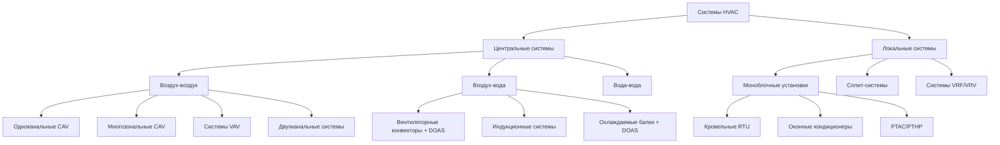

Правильный выбор типа системы HVAC определяет энергетическую эффективность, надёжность и стоимость владения объектом на весь жизненный цикл. Настоящее руководство следует классификации ASHRAE Handbook — HVAC Systems and Equipment и стандартам AHRI 550/590, EN 14511, ASHRAE 90.1.

## Основные классификационные признаки

Системы HVAC классифицируют по трём признакам:

1. **Расположение основного оборудования** — центральное (в механическом помещении) или локальное (непосредственно в обслуживаемой зоне).
2. **Теплопередающая среда** — воздух, вода, хладагент или комбинации.
3. **Архитектура распределения** — централизованная магистраль или распределённые автономные контуры.

## Центральные и локальные системы

Фундаментальный выбор архитектуры определяет всё последующее проектирование.

**Центральные системы** размещают основное оборудование (чиллеры, котлы, воздухообрабатывающие агрегаты) в выделенных механических помещениях. Тепловая энергия распределяется по воздуховодам, трубопроводам холодной/горячей воды (CHW/HW) или одновременно. Одно центральное оборудование обслуживает несколько зон, обеспечивая превосходные возможности управления, высокую эффективность при больших мощностях и централизованное техническое обслуживание. Центральные системы доминируют на объектах с расходом воздуха свыше 30 000 м³/ч или при требованиях к точному контролю микроклимата (больницы, лаборатории).

**Локальные системы** интегрируют все компоненты холодильного цикла в готовые к работе агрегаты, установленные непосредственно в обслуживаемой зоне. Каждый агрегат независимо обслуживает одну зону или небольшую площадь. Преимущества: простота монтажа, низкие начальные затраты для малых объектов (< 500 м²), распределённые отказы (поломка одного агрегата не влияет на остальные).


| Характеристика | Центральные | Локальные |
|---|---|---|
| Диапазон мощности | 200–35 000+ кВт (суммарный) | 2–530 кВт (один агрегат) |
| Начальные затраты | Высокие (оправданы > 350 кВт) | Низкие–средние |
| КПД (EER/COP) | 4,5–7,0 (чиллер) | 2,5–4,5 (агрегат) |
| Техническое обслуживание | Централизованное | Распределённое |
| Избыточность (redundancy) | Требует нескольких чиллеров | Встроенная (несколько агрегатов) |
| Управление влажностью | Превосходное | Ограниченное |
| Типичные применения | Больницы, небоскрёбы, лаборатории | Магазины, офисы, школы |


## Системы «воздух-воздух» (all-air systems)

Системы «воздух-воздух» (all-air systems) распределяют и явную, и скрытую холодопроизводительность исключительно через кондиционированный воздух. Воздухообрабатывающие агрегаты (AHU) подают охлаждённый/осушенный воздух через воздуховоды к концевым устройствам.

**Преимущества:**

- превосходное управление влажностью (центральное осушение);
- полная фильтрация воздуха в центральном агрегате;
- гибкость управления качеством воздуха.

**Недостатки:**

- значительное пространство для воздуховодов (2–5 % площади пола);
- высокое потребление энергии вентиляторами при больших расходах воздуха;
- акустические ограничения (скорость воздуха в воздуховоде).

### Системы с постоянным расходом воздуха (CAV)

В системах CAV (constant air volume) расход воздуха постоянен; температура подачи варьируется для управления тепловой нагрузкой. Применяются в одно- или двухзонных системах с однородной нагрузкой: лаборатории с вытяжными шкафами, операционные, чистые помещения.

### Системы с переменным расходом воздуха (VAV)

Системы VAV (variable air volume) снижают расход воздуха при уменьшении нагрузки, сохраняя постоянную температуру подачи. Блок VAV в каждой зоне регулирует расход воздуха от 30 до 100 % от расчётного. Потребление энергии вентиляторов снижается пропорционально кубу расхода ($P_{fan} \propto \dot{V}^3$), обеспечивая экономию 30–60 % по сравнению с CAV.

**Требования к проектированию систем VAV согласно ASHRAE 90.1:**

- вентиляторы с частотно-регулируемым приводом (VFD) при расходе воздуха > 750 л/с;
- статическое давление не более 250 Па в системах с DDC-управлением;
- управление вентиляцией по требованию (DCV) при числе людей > 25 чел. на зону.

**Ключевое уравнение:** мощность вентилятора в системе VAV:


P_{fan} = \frac{\dot{V} \cdot \Delta p_{total}}{\eta_{fan} \cdot \eta_{motor}}


При снижении расхода с 100 % до 50 % мощность теоретически снижается до $0{,}5^3 = 12{,}5\%$ от номинальной (при переменном статическом давлении).

## Системы «воздух-вода» (air-water systems)

Системы «воздух-вода» (air-water systems) разделяют функции вентиляции и теплоснабжения: централизованный воздушный тракт (DOAS — dedicated outdoor air system) обеспечивает 100 % наружного воздуха для вентиляции, а гидравлические концевые устройства принимают явную нагрузку зоны.

**Физическое обоснование:** теплоёмкость воды ($c_p = 4{,}18$ кДж/(кг·К)) в 4,2 раза выше, чем воздуха ($c_p = 1{,}006$ кДж/(кг·К)), а плотность — в 800 раз. Трубопровод DN 50 может передавать ту же мощность, что воздуховод 600×300 мм:


\dot{Q}_{pipe} = \rho_w \cdot c_{pw} \cdot \dot{V}_w \cdot \Delta T_w \gg \rho_a \cdot c_{pa} \cdot \dot{V}_a \cdot \Delta T_a


Это **резко снижает требования к пространству для воздуховодов** (с 3–5 % до 0,5–1 % площади пола) — решающее преимущество для высотных зданий с малыми межэтажными перекрытиями.

### Вентиляторные конвекторы с DOAS (FCU + DOAS)

Вентиляторный конвектор (fan coil unit, FCU) с двух- или четырёхтрубной системой обеспечивает явное охлаждение и нагрев в каждой зоне. Система DOAS подаёт вентиляционный воздух, предварительно осушённый до точки росы ниже температуры охлаждающей воды в FCU, исключая конденсацию на корпусе.

**Критическое требование к точке росы:** температура приточного воздуха DOAS $T_d < T_{CHW}$ (температура подаваемой холодной воды), иначе FCU будет собирать конденсат с воздуха вместо снятия явной нагрузки.

### Охлаждаемые балки (chilled beams)

Активные охлаждаемые балки (active chilled beams, ACB) индуцируют конвекционный поток воздуха через холодную водяную трубку без вентилятора. Пассивные балки (passive chilled beams) работают только за счёт естественной конвекции.

Требования к температуре холодной воды: $T_{supply,CHW} \geq T_d + 1\,°\text{C}$ — во избежание конденсации на поверхности трубок. Это ограничение предотвращает применение охлаждаемых балок в помещениях с высокими скрытыми нагрузками (кухни, спортзалы) без тщательного контроля точки росы.


| Параметр | Воздух-воздух (VAV) | Воздух-вода (FCU + DOAS) |
|---|---|---|
| Требования к пространству | 3–5 % площади пола | 0,5–1 % площади пола |
| Управление влажностью | Превосходное | Ограниченное (риск конденсации) |
| Управление зоной | ±1,1 К (VAV) | ±0,3 К (локальное FCU) |
| Акустика (NC) | 35–45 | 25–35 |
| Риск конденсации | Нет | Умеренный |
| Начальные затраты | Базовые | На 10–20 % выше |
| Энергопотребление | Базовое | На 15–30 % ниже в высотных зданиях |
| Лучшее применение | Больницы, лаборатории | Офисы > 12 этажей, гостиницы |


## Системы VRF/VRV

Системы с переменным расходом хладагента (variable refrigerant flow, VRF; variable refrigerant volume, VRV) распределяют жидкий хладагент непосредственно к внутренним блокам без промежуточного теплоносителя. Инверторные компрессоры регулируют холодопроизводительность в диапазоне 15–100 %.

**Системы с рекуперацией теплоты (heat recovery VRF)** позволяют одновременно охлаждать одни зоны и нагревать другие, перераспределяя теплоту внутри здания. КПД системы в режиме рекуперации (COP) может достигать 5,0–7,0.

**Ограничения VRF:**

- длина хладагентного трубопровода ≤ 150 м (с ограничениями на перепад высот ≤ 50 м);
- утечки хладагента (GWP фреонов R-410A — 2088; переход на R-32/R-454B по регламенту F-газов ЕС);
- ограниченные возможности по вентиляции наружным воздухом — требуется дополнительная система приточной вентиляции.

**Соответствие стандартам:** EN 14511 (коэффициент производительности при стандартных условиях), EN 14825 (сезонная эффективность SEER/SCOP), AHRI 1230 (VRF systems).

## Критерии выбора типа системы

Оптимальный тип системы определяется комплексным анализом следующих факторов:

**1. Характеристики тепловой нагрузки:**

- Нагрузка охлаждения > 1000 кВт → центральная чиллерная установка (chiller plant) с несколькими агрегатами для резервирования и регулирования.
- Переменные нагрузки с большим числом часов неполной нагрузки → системы VAV или VRF для использования эффекта кубической зависимости потребления от расхода.
- Требования к вентиляции > 7–10 л/(с·м²) → системы «воздух-воздух» или DOAS.

**2. Геометрия и конструкция здания:**

- Высотные здания > 10 этажей → системы «воздух-вода» или VRF для минимизации шахтного пространства воздуховодов.
- Малые потолочные плинтусы < 300–450 мм → системы «воздух-вода» или кассетные FCU.
- Горизонтальный кампус с несколькими отдельными зданиями → распределённые локальные агрегаты или чиллерная группа с районными сетями.

**3. Требования к качеству воздуха и комфорту:**

- Критические требования к влажности (больницы, фармацевтика, лаборатории ЧК) → системы «воздух-воздух» с возможностью дополнительного нагрева для точного контроля влажности.
- Высокое качество воздуха при низких шумовых требованиях → системы «воздух-вода» с DOAS для вентиляции и FCU/охлаждаемыми балками для теплообмена.

**4. Экономические факторы:**

- Минимальные начальные затраты для объекта < 5000 м² → локальные агрегаты или системы VRF.
- Минимальная полная стоимость владения (total cost of ownership) для объектов > 10 000 м² → центральные системы с оптимизированным режимом регулирования.
- Высокие тарифы на электроэнергию с платой за мощность → тепловое аккумулирование (thermal storage) совместно с центральным чиллером.

**5. Надёжность и резервирование:**

- Критические объекты с требованием N+1 (ЦОД, больницы) → центральные системы с несколькими чиллерами и кольцевой разводкой трубопроводов.
- Объекты без постоянного обслуживания → локальные системы с распределёнными режимами отказа.

## Пример расчёта: выбор типа системы для офисного здания

**Условия.** Офисное здание 15 этажей, 12 000 м², расчётная нагрузка охлаждения 600 кВт, нагрузка отопления 350 кВт, вентиляционный расход 25 000 м³/ч. Высота этажа 3,6 м, межэтажное перекрытие 600 мм.

**Анализ:**

1. Мощность > 350 кВт → центральная система предпочтительна.
2. 15 этажей, ограниченное перекрытие → воздуховоды большого сечения неприемлемы.
3. Офисное применение → умеренные требования к влажности (40–60 % ОВ).

**Рекомендуемое решение:** система «воздух-вода» — чиллер 2 × 350 кВт (резервирование N+1) + DOAS 25 000 м³/ч для вентиляции + вентиляторные конвекторы с четырёхтрубной разводкой в каждой зоне.

**Сечение главного воздуховода** (DOAS, ΔP = 6 Па/м, скорость 8 м/с):


A_{duct} = \frac{\dot{V}}{v_{air}} = \frac{25000/3600}{8} = 0{,}868 \text{ м}^2 \quad (900 \times 1000 \text{ мм})


**Сечение главного трубопровода холодной воды** (ΔT = 6 °C, скорость 1,5 м/с):


\dot{V}_w = \frac{600}{4{,}18 \times 6 \times 1000} = 0{,}0239 \text{ м}^3/\text{с}; \quad D = \sqrt{\frac{4 \times 0{,}0239}{\pi \times 1{,}5}} \approx 142 \text{ мм} \quad (\text{DN 150})


Трубопровод DN 150 против воздуховода 900×1000 мм — выигрыш по пространству очевиден.

## Интеграция с системами автоматизации здания (BAS)

Современные системы HVAC невозможно рассматривать в отрыве от систем автоматизации здания (building automation system, BAS) и энергетического мониторинга.

- Центральные системы с BAS (протоколы BACnet IP, Modbus TCP, KNX) обеспечивают оптимизацию работы чиллеров, прогнозирование нагрузки и вентиляцию по требованию (demand-controlled ventilation, DCV).
- Системы VRF с современными контроллерами достигают 80–90 % возможностей централизованного управления при значительно меньших затратах на внедрение.

Тенденция электрификации и декарбонизации теплоснабжения (переход от газовых котлов к тепловым насосам) благоприятствует высокоэффективным тепловым насосам — как в составе центральных систем (water-loop heat pump systems), так и в распределённых (VRF, кровельные тепловые насосы).

---

Настоящее руководство основано на ASHRAE Handbook — HVAC Systems and Equipment, главы 1–4; ASHRAE 90.1-2022; AHRI 550/590; EN 14511/14825; СП 60.13330.2022.
