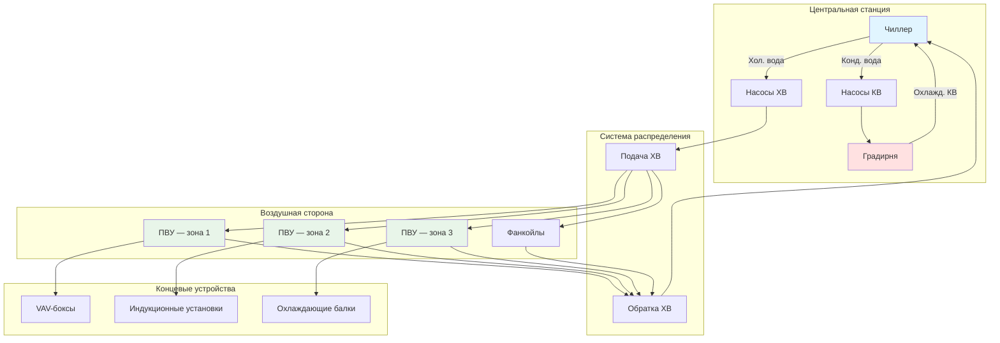

# Центральные системы кондиционирования воздуха

Центральные системы кондиционирования воздуха производят холод или теплоту в одной точке и доставляют кондиционирующий эффект по всему зданию через сети воздуховодов или трубопроводов. Этот подход обеспечивает превосходное управление, высокую энергоэффективность и удобство обслуживания по сравнению с распределёнными системами, что делает его предпочтительным решением для коммерческих зданий, крупных жилых комплексов и учреждений.

Согласно ASHRAE Handbook — HVAC Systems and Equipment (глава «Central Cooling and Heating Plants»), центральные системы делятся на четыре основных класса: системы с полной обработкой воздуха (all-air), воздушно-водяные (air-water), полностью водяные (all-water) и системы теплового насоса на водяном контуре (water-loop heat pump, WLHP).

## Архитектура системы

Центральные системы разделяют производство холода от его транспорта и распределения. Холодильное оборудование (чиллеры, градирни, насосы) располагается в техническом помещении или на кровле, тогда как приточно-вытяжные установки (AHU — air handling unit) или концевые устройства обслуживают отдельные зоны.

## Типы систем

### Системы с полной обработкой воздуха (All-Air Systems)

Системы типа all-air передают 100% явной и скрытой холодопроизводительности через кондиционированный воздух. Центральные приточно-вытяжные установки (AHU) охлаждают, осушают, фильтруют и распределяют воздух по воздуховодам в обслуживаемые помещения.

**Конфигурации:**
- Однопроводная с постоянным расходом (CAV — constant air volume)
- Однопроводная с переменным расходом (VAV — variable air volume)
- Двухпроводная — горячий и холодный коллекторы (dual duct)
- Многозонные агрегаты (multizone)

**Преимущества:**
- Точное управление влажностью через центральное осушение
- Превосходная фильтрация и контроль вентиляции
- Отсутствие водяного трубопровода в занятых помещениях — нет риска протечек
- Гибкое зонирование с VAV-боксами

**Проектные параметры (ASHRAE 90.1):**
- Температура подаваемого воздуха: 11–14°C для охлаждения
- Скорость в основных воздуховодах: 7,6–12,7 м/с
- Максимальное статическое давление: 75–150 Па в зависимости от размера системы
- Экономайзер наружного воздуха обязателен для систем мощностью >15,8 кВт в большинстве климатических зон

### Воздушно-водяные системы (Air-Water Systems)

Воздушно-водяные системы используют первичный воздух для удовлетворения требований вентиляции и снятия скрытых нагрузок, тогда как водяные концевые устройства — фанкойлы (FCU — fan coil unit), индукционные агрегаты, охлаждающие балки (chilled beams) — обрабатывают явное охлаждение.

**Конфигурации:**
- Фанкойлы с выделенной системой наружного воздуха (DOAS — dedicated outdoor air system)
- Индукционные агрегаты (первичный высокоскоростной воздух индуцирует циркуляцию воздуха помещения через водяной змеевик)
- Панели лучистого охлаждения с подачей вентиляционного воздуха

**Преимущества:**
- Уменьшенные сечения воздуховодов — сниженные требования к расходу воздуха
- Независимое зональное управление
- Меньшее энергопотребление вентиляторов по сравнению с all-air системами
- Тихая работа при правильном подборе оборудования

**Проектные параметры:**
- Расход первичного воздуха: 1,5–2,5 м³/(ч·м²) — только вентиляция
- Подача охлажденной воды: 5,6–8,9°C
- Расход воды: 1,2–1,5 л/(ч·кВт) холодопроизводительности
- Управление конденсатом на фанкойлах обязательно во влажном климате

### Полностью водяные системы (All-Water Systems)

Полностью водяные системы исключают воздушное распределение, транспортируя холод только водой. Фанкойлы или лучистые системы обеспечивают кондиционирование помещений, а вентиляция решается отдельно — через DOAS или открываемые окна в мягком климате.

**Конфигурации:**
- Двухтрубные или четырёхтрубные системы фанкойлов (2-pipe / 4-pipe)
- Охлаждающие балки пассивные и активные (passive / active chilled beams)
- Лучистые потолочные или напольные панели

**Преимущества:**
- Минимальные требования к пространству — нет воздуховодов
- Низкие транспортные энергозатраты: вода переносит теплоту примерно в 3500 раз эффективнее воздуха по объёму
- Удобство реконструкции существующих зданий
- Сниженные требования к высоте межэтажного пространства

**Ограничения:**
- Ограниченная способность к осушению
- Риск конденсации при неконтролируемой точке росы
- Обязательна отдельная система вентиляции для соответствия требованиям IAQ (indoor air quality)

### Системы теплового насоса на водяном контуре (WLHP)

Системы WLHP (water-loop heat pump) используют общий водяной контур с температурой 15–32°C в качестве источника и стока теплоты. Индивидуальные тепловые насосы обслуживают зоны, отдавая или забирая тепло из контура.

**Компоненты системы:**
- Распределённые тепловые насосы — 0,2–1,8 кВт каждый
- Замкнутый циркуляционный контур — типично 1–1,5 л/(ч·кВт)
- Котёл для подогрева контура в холодный период
- Градирня или жидкостный охладитель (fluid cooler) для отвода тепла летом

**Преимущества:**
- Одновременная работа на охлаждение и отопление в разных зонах
- Рекуперация тепла между зонами: периметральный обогрев использует теплоту от охлаждения ядра здания
- Холодильный трубопровод не требуется по всему зданию
- Независимое управление и поузловой коммерческий учёт

**Проектные параметры (ASHRAE Handbook — HVAC Systems and Equipment):**
- Рабочий диапазон температур контура: 15–32°C, оптимум 21–27°C
- Скорость воды в трубопроводах: 0,6–1,2 м/с
- Буферный бак: 5,7–11,4 л/кВт подключённой нагрузки
- Мощность градирни: 60–80% от суммарной мощности тепловых насосов

## Проектирование центральной станции

### Выбор чиллера


| Параметр | Водяное охлаждение | Воздушное охлаждение | Испарительное охлаждение |
|---|---|---|---|
| Эффективность, кВт/кВт | 0,45–0,65 | 0,85–1,20 | 0,55–0,75 |
| Занимаемая площадь | Меньше | Больше | Средняя |
| Расход воды | Высокий | Нет | Средний |
| Обслуживание | Умеренное | Низкое | Умеренное |
| Первоначальные затраты | Выше | Ниже | Средние |
| Уровень шума | Низкий | Высокий | Средний |


### Система охлажденной воды (Chilled Water System)

**Температурный перепад (delta-T):**
- Стандартный: подача 6,7°C / обратка 12,2°C (ΔT = 5,6°C)
- Высокий ΔT: подача 4,4°C / обратка 13,3°C (ΔT = 8,9°C) — снижает расход насосов
- Низкотемпературный: подача 3,3°C для применений с высокой явной нагрузкой

**Насосные схемы:**
- Только первичный контур (primary only): один контур с постоянным или переменным расходом
- Первично-вторичная схема (primary-secondary): раздельные контуры производства и распределения
- Переменный первичный расход (variable primary flow, VPF): исключает вторичные насосы, требует тщательного управления

**Подбор трубопроводов:**
- Скорость: 1,2–2,4 м/с в магистралях, 0,6–1,2 м/с в ветвях
- Потеря давления: 0,6–1,2 м вод. ст. на 30 м трубы

**Расход охлажденной воды:**


Q\,[\text{л/ч}] = \frac{Q_{\text{охл}}\,[\text{кДж/ч}]}{\Delta T\,[\text{°C}] \times 4{,}187}


**Пример расчёта.** Офисное здание с тепловой нагрузкой 500 кВт, ΔT = 6°C:


Q = \frac{500 \times 3600}{6 \times 4{,}187} \approx 71\,600\;\text{л/ч} \approx 19{,}9\;\text{л/с}


### Коэффициенты разнообразия нагрузок

Центральные системы выигрывают от того, что пиковые нагрузки не совпадают по времени во всех зонах.


| Тип здания | Коэффициент разнообразия |
|---|---|
| Офисные здания | 0,75–0,85 |
| Гостиницы | 0,70–0,80 |
| Больницы | 0,85–0,95 |
| Торговля | 0,90–1,00 |


Суммарная мощность системы = Сумма пиковых зональных нагрузок × Коэффициент разнообразия.

### Энергоэффективность

**Системы с переменным расходом:**
- Двухходовые регулирующие клапаны обеспечивают переменный первичный расход
- Насосы с частотными преобразователями (VFD — variable frequency drive) снижают энергопотребление при частичных нагрузках
- Минимальный байпасный расход поддерживает протоку через испаритель чиллера

**Свободное охлаждение (free cooling / economizer):**
- Водный экономайзер: использование градирни при допустимой температуре влажного термометра наружного воздуха
- Воздушный экономайзер (air-side economizer): для all-air систем в подходящих климатах
- ASHRAE 90.1 обязывает устанавливать экономайзеры для систем мощностью >15,8 кВт

**Оптимизация работы чиллеров:**
- Поочерёдный ввод чиллеров в работу по нагрузке (chiller sequencing)
- Работа в оптимальных точках КПД
- Тепловая аккумуляция (thermal storage) для управления пиковым спросом

## Сравнение подходов к центральным системам


| Тип системы | Распределение | Концевое устройство | Управление влажностью | Требования к пространству | Типичное применение |
|---|---|---|---|---|---|
| All-Air VAV | Воздуховоды | VAV-боксы | Отличное | Высокое | Офисы, лаборатории |
| Воздушно-водяная | Воздуховоды + трубы | Фанкойлы | Хорошее | Умеренное | Гостиницы, апартаменты |
| Полностью водяная | Только трубы | Фанкойлы, балки | Ограниченное | Низкое | Реконструкция, жильё |
| WLHP | Водяной контур | Тепловые насосы | Умеренное | Низко-умеренное | Школы, офисы |


## Последовательность проектирования

**Соответствие ASHRAE 62.1:** минимальные расходы вентиляции по занятости и типу помещения, коэффициенты эффективности воздухораспределения, вентиляция по требованию (DCV — demand-controlled ventilation).

**Расчёт нагрузок (ASHRAE Fundamentals):**
1. Блочные нагрузки для подбора центрального оборудования
2. Зональные нагрузки для системы распределения и концевых устройств
3. Коэффициенты разнообразия по типу здания
4. Коэффициенты запаса — не более 10–15%

**Порядок проектирования:**
1. Установить условия в помещениях и расчётные нагрузки
2. Выбрать тип системы исходя из требований здания
3. Подобрать центральное оборудование с учётом разнообразия нагрузок
4. Спроектировать систему распределения — воздуховоды или трубопроводы
5. Выбрать и разместить концевые устройства
6. Разработать последовательности управления (sequence of operations)
7. Проверить соответствие энергетическим кодексам (ASHRAE 90.1, СП 60.13330)

Правильное проектирование требует понимания теплопередачи, гидравлики и психрометрики в сочетании с применением стандартов ASHRAE и данных производителя оборудования. Выбор между all-air, воздушно-водяными, полностью водяными системами и WLHP определяется типом здания, климатом, пространственными ограничениями и требованиями к эксплуатации.
