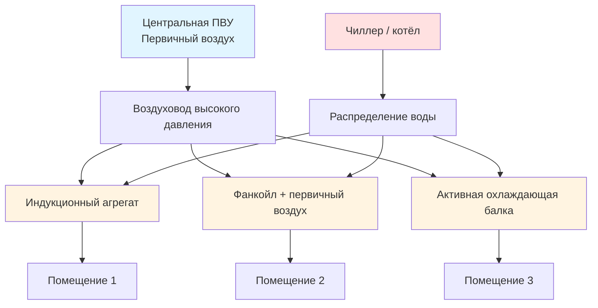

Воздушно-водяные системы объединяют централизованную обработку первичного воздуха с локальными водяными концевыми устройствами для эффективного зонального кондиционирования. Гибридный подход использует превосходную теплоёмкость воды — объёмно примерно в 3500 раз выше, чем у воздуха — сохраняя при этом нормативную вентиляцию за счёт выделенной системы наружного воздуха (DOAS — dedicated outdoor air system).

## Архитектура системы

Воздушно-водяная система состоит из двух подсистем, работающих в координации.

**Система первичного воздуха.** Центральная приточно-вытяжная установка (AHU — air handling unit) обрабатывает и распределяет наружный воздух для удовлетворения требований вентиляции. Воздух охлаждается, осушается и фильтруется перед подачей под давлением 50,8–152,4 Па при относительно малом расходе — 10–30% от суммарного расхода системы.

**Водяной вторичный контур.** Охлажденная и/или горячая вода циркулирует к концевым устройствам, расположённым в кондиционируемых помещениях. Эти устройства обеспечивают основную долю холодо- и теплопроизводительности путём теплообмена «вода — воздух», дополняя подачу первичного воздуха.

Такое разделение функций позволяет системе первичного воздуха сосредоточиться на удалении скрытой нагрузки и вентиляции, тогда как водяной контур снимает явные нагрузки при значительно меньшем потреблении энергии вентиляторами по сравнению с all-air системами.

## Типы концевых устройств

### Индукционные агрегаты (Induction Units)

Индукционные агрегаты используют кинетическую энергию первичного воздуха высокой скорости для индуцирования циркуляции воздуха помещения через водяной змеевик без механических вентиляторов. Первичный воздух подаётся через сопла (nozzles), создавая зону пониженного давления — по принципу Вентури, — которая засасывает воздух помещения через вторичный водяной змеевик в соотношении 3:1 — 5:1 (индуцированный воздух к первичному).

**Принципы работы:**
- Скорость первичного воздуха в соплах: 10,2–20,3 м/с
- Коэффициент индукции: обычно 3:1 — 5:1
- Температура воды охлаждения: 5,6–8,9°C; нагрева: 48,9–60°C
- Отсутствие движущихся частей в концевом устройстве
- Непрерывная циркуляция воздуха в период эксплуатации

**Применение.** Периметральные зоны офисных зданий, гостиниц, больниц, где требуется индивидуальное зональное управление. Наиболее эффективны при высоте этажа 2,44–3,66 м.

### Фанкойлы с первичным воздухом (Fan Coil Units, FCU)

Фанкойлы обеспечивают механическую циркуляцию воздуха через водяные змеевики; первичный воздух подаётся отдельным воздуховодом для вентиляции. Эта конфигурация обеспечивает большую гибкость по сравнению с индукционными агрегатами и эффективно работает при более низких статических давлениях.

**Принципы работы:**
- Скоростные ступени местного вентилятора: обычно 3–4 ступени
- Доля первичного воздуха: 10–25% от суммарного расхода устройства
- Расход воды: регулируется управляющим клапаном
- Давление первичного воздуха: 12,7–50,8 Па
- Мощность электродвигателя вентилятора: 50–200 Вт в зависимости от производительности

**Применение.** Многоэтажные жилые здания, гостиницы, больницы, проекты реконструкции. Подходит для помещений с переменной занятостью, требующих индивидуального управления.

### Охлаждающие балки (Chilled Beams)

Охлаждающие балки передают тепло от воздуха помещения к охлаждённой воде путём конвекции (пассивные) или индуцированного первичным воздухом потока (активные).

**Пассивные охлаждающие балки** полагаются исключительно на естественную конвекцию: тёплый воздух поднимается к охлаждённой поверхности балки, отдаёт теплоту, уплотняется и опускается. Удельная производительность: 65–130 Вт/м² площади пола.

**Активные охлаждающие балки** используют первичный воздух, подаваемый через сопла, который по эффекту Вентури индуцирует воздух помещения через змеевик охлаждения. Соотношение индукции: 2:1 — 6:1. Удельная производительность: 190–320 Вт/м² при правильном проектировании.

Оба типа требуют строгого контроля точки росы и хорошо работают в применениях с контролируемой влажностью — офисы, лаборатории, учебные учреждения.

## Сравнение систем


| Параметр | Индукционные агрегаты | Фанкойл + первичный воздух | All-Air системы |
|---|---|---|---|
| Потребление вентиляторов | Очень низкое (только центральный) | Низкое (малые вентиляторы) | Высокое (крупные центральные) |
| Зональное управление | Отличное | Отличное | Хорошее — удовлетворительное |
| Первоначальная стоимость | Высокая | Умеренная | Умеренная |
| Обслуживание | Низкое (нет движущихся частей) | Умеренное (электродвигатели) | Низкое (только центральное) |
| Уровень шума | Очень тихий | Тихий | Переменный |
| Управление влажностью | Ограниченное (только центральное) | Ограниченное (только центральное) | Отличное |
| Требования к пространству | Компактные концевые устройства | Компактные концевые устройства | Крупные шахты воздуховодов |
| Давление первичного воздуха | Высокое: 50,8–152,4 Па | Низкое: 12,7–50,8 Па | Умеренное: 25,4–101,6 Па |


## Проектные требования

### Первичный воздух (ASHRAE 62.1)

Система первичного воздуха должна обеспечивать минимальные нормы вентиляции наружным воздухом по занятости и типу помещения:

- Офисные помещения: 8,5–10 л/с на человека + 0,3 л/(с·м²) площади
- Конференц-залы: 10 л/с на человека
- Жилые помещения: 3–5 л/с на человека

Первичный воздух обычно снимает 15–30% суммарной нагрузки на охлаждение помещения и 100% требований по вентиляции и осушению.

### Параметры водяной системы

**Охлаждение:**
- Температура подачи: 5,6–9,4°C
- Температура обратки: 12,2–15,6°C
- Перепад температур: 5,6–7,8°C
- Расход: 0,13–0,19 л/(с·кВт)

**Отопление:**
- Температура подачи: 48,9–60°C (среднетемпературная) или 71,1–82,2°C (высокотемпературная)
- Температура обратки: 37,8–48,9°C
- Перепад температур: 11,1–22,2°C

**Расчёт расхода воды через концевое устройство:**


\dot{m}_{\text{воды}} = \frac{Q_{\text{конц}}}{c_{p,\text{воды}} \cdot \Delta T_{\text{воды}}} = \frac{Q_{\text{конц}}}{4{,}187 \cdot \Delta T_{\text{воды}}}


**Пример.** Фанкойл с производительностью охлаждения 3,5 кВт, ΔT воды = 6°C:


\dot{m}_{\text{воды}} = \frac{3{,}5}{4{,}187 \times 6} \approx 0{,}139\;\text{кг/с} \approx 0{,}50\;\text{м}^3/\text{ч}


Двухтрубные системы (2-pipe) сезонно переключаются между охлаждением и отоплением. Четырёхтрубные системы (4-pipe) обеспечивают одновременное отопление и охлаждение, что критично для зданий с разнородными одновременными нагрузками.

## Рекомендации ASHRAE по выбору системы

Согласно ASHRAE Handbook — HVAC Systems and Equipment, воздушно-водяные системы оптимальны при следующих условиях:

1. **Характеристики здания.** Средне- и многоэтажная конструкция (4 и более этажей) со значительными периметральными зонами, требующими индивидуального управления.
2. **Профиль нагрузки.** Высокий коэффициент явного теплоотвода (SHR — sensible heat ratio > 0,75) при умеренных скрытых нагрузках.
3. **Режимы занятости.** Помещения, требующие одновременного отопления и охлаждения в разных зонах.
4. **Энергетика.** Ситуации, где снижение затрат на вентиляторы оправдывает более высокие первоначальные инвестиции.
5. **Высота потолков.** Минимум 2,4–3,7 м для размещения концевых устройств.
6. **Доступ для обслуживания.** Распределённые устройства, доступные для замены фильтров и чистки теплообменников.

Воздушно-водяные системы, как правило, обеспечивают снижение потребления энергии вентиляторами на 20–40% по сравнению с эквивалентными all-air системами при превосходном зональном управлении. Система первичного воздуха работает непрерывно в часы занятости, тогда как концевые устройства модулируют расход воды в соответствии с зональными нагрузками.

**Ограничения.** Воздушно-водяные системы обеспечивают ограниченное осушение сверх того, что даёт система первичного воздуха. Помещения с высокими скрытыми нагрузками — бассейны, кухни, влажный климат — могут потребовать дополнительного осушения или иных типов систем. Распределённый характер концевых устройств увеличивает количество точек обслуживания по сравнению с централизованными all-air системами.
