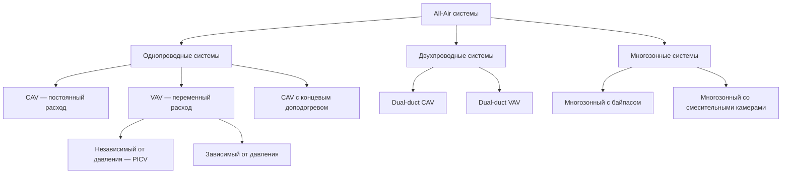

Системы с полной обработкой воздуха (all-air systems) кондиционируют помещения исключительно за счёт подачи и распределения воздуха различной температуры и расхода. Все тепловые нагрузки — и явные, и скрытые — передаются через воздух, а не через воду или хладагент в концевых устройствах. Это принципиально отличает all-air системы от воздушно-водяных и полностью водяных.

## Принципы работы

All-air системы работают по принципу, при котором кондиционированный воздух обеспечивает как явное, так и скрытое охлаждение (или отопление), необходимое для поддержания расчётных условий в помещении. Воздух кондиционируется в центральной приточно-вытяжной установке (AHU — air handling unit) и распределяется через сеть воздуховодов. Теплообмен происходит конвекцией при смешивании приточного воздуха с воздухом помещения.

Холодопроизводительность (уравнение ASHRAE Fundamentals):


Q_{\text{явн}} = \rho \cdot c_p \cdot L \cdot \Delta T = 1{,}2 \cdot 1{,}005 \cdot L \cdot \Delta T \approx 1{,}207\,L\,\Delta T



Q_{\text{скр}} = \rho \cdot r \cdot L \cdot \Delta d \approx 3010\,L\,\Delta d


где $L$ — объёмный расход воздуха, м³/с; $\Delta T$ — разность температур, К; $\Delta d$ — разность влагосодержания, кг/кг; $r = 2{,}501$ МДж/кг — удельная теплота парообразования воды при 0°C.

Для типовых применений коэффициент явного теплоотвода (SHR — sensible heat ratio) составляет 0,70–0,95.

## Конфигурации систем

## Сравнение типов систем


| Тип системы | Регулирование расхода | Энергоэффективность | Применение | Сложность |
|---|---|---|---|---|
| CAV однопроводная | Постоянный объём | Средняя | Простые нагрузки, небольшие здания | Низкая |
| VAV однопроводная | Переменный объём | Высокая | Переменные нагрузки, крупные здания | Средняя |
| CAV с доподогревом | Постоянный объём | Низкая | Критичное управление влажностью | Средняя |
| Dual-duct CAV | Постоянный, смешанный | Низкая | Периметральные зоны | Высокая |
| Dual-duct VAV | Переменный, смешанный | Средняя | Одновременное отопление/охлаждение | Высокая |
| Многозонная | Постоянный, с заслонками | Низкая — средняя | Несколько зон, реконструкция | Средняя |


## Основы воздушного потока

### Расчётные расходы воздуха

Расход приточного воздуха определяется доминирующим условием нагрузки.

**При доминировании явной нагрузки:**


L_{\text{охл}} = \frac{Q_{\text{явн}}}{\rho \cdot c_p \cdot \Delta T} = \frac{Q_{\text{явн}}}{1{,}207 \cdot \Delta T}


**При доминировании скрытой нагрузки:**


L_{\text{ск}} = \frac{Q_{\text{скр}}}{\rho \cdot r \cdot \Delta d} = \frac{Q_{\text{скр}}}{3010 \cdot \Delta d}


**Пример.** Офис площадью 200 м², явная нагрузка $Q_{\text{явн}} = 14\,\text{кВт}$, $\Delta T = 10\,\text{К}$:


L = \frac{14{,}0}{1{,}207 \times 10} \approx 1{,}16\;\text{м}^3/\text{с} = 4160\;\text{м}^3/\text{ч}


Типовые разности температур приточного воздуха для охлаждения: 8–14°C. Более высокие значения ΔT снижают расход воздуха, но могут вызвать дискомфорт из-за высокой скорости на выходе диффузоров.

### Вентиляционные требования (ASHRAE 62.1)


V_{oz} = R_p \cdot P_z + R_a \cdot A_z


где $R_p$ — норма наружного воздуха на человека, м³/(с·чел); $P_z$ — количество людей в зоне; $R_a$ — норма наружного воздуха на единицу площади, м³/(с·м²); $A_z$ — площадь зоны, м².

## Стандарты расчёта воздуховодов

Проектирование воздуховодов по ASHRAE Fundamentals — глава 21 — следует двум основным методам.

### Метод равного трения (Equal Friction Method)

Поддерживает постоянный удельный перепад давления по всей сети. Диаметр воздуховода рассчитывается по уравнению Дарси — Вейсбаха:


\frac{\Delta P}{L} = \frac{\lambda}{D_h} \cdot \frac{\rho v^2}{2}


где $\lambda$ — коэффициент гидравлического трения (формула Муди); $D_h$ — гидравлический диаметр; $v$ — скорость воздуха.


| Применение | Удельная потеря, Па/м |
|---|---|
| Жилые системы низкого давления | 1,5–2,5 |
| Коммерческие системы | 2,0–3,7 |
| Высокоскоростные системы | 7,5–14,9 |


### Метод восстановления статического давления (Static Pressure Regain)

Применяется для VAV систем. Скорость уменьшается в каждом ответвлении, преобразуя динамическое давление в статическое, что компенсирует потери на трение:


\Delta P_{s,\text{восст}} = \frac{\rho}{2}\left(v_1^2 - v_2^2\right) \cdot \eta_{\text{диф}}


где $\eta_{\text{диф}}$ — КПД диффузора (расширения), обычно 0,5–0,85.

## Системы постоянного расхода воздуха (CAV)

CAV-системы подают фиксированный расход воздуха независимо от изменений нагрузки. Регулирование температуры осуществляется модуляцией температуры приточного воздуха через нагревательные/охлаждающие секции. Приточные вентиляторы работают с постоянной скоростью; зональное управление — через заслонки или концевые секции доподогрева.

**Преимущества:**
- Простая логика управления
- Более низкая первоначальная стоимость
- Надёжная эксплуатация
- Стабильные расходы вентиляционного воздуха

**Недостатки:**
- Высокое энергопотребление при частичных нагрузках
- Нестабильное управление влажностью при сниженных нагрузках
- Одновременное охлаждение и отопление в системах с доподогревом

## Системы переменного расхода воздуха (VAV)

VAV-системы модулируют расход воздуха в соответствии с тепловыми нагрузками при поддержании постоянной температуры приточного воздуха. Концевые VAV-боксы регулируют расход заслонками по сигналу зонального термостата. Скорость приточного вентилятора изменяется через привод с частотным преобразователем (VFD — variable frequency drive) для поддержания статического давления в воздуховоде.

**Закон подобия вентиляторов:**


\frac{N_2}{N_1} = \left(\frac{L_2}{L_1}\right)^3


Снижение расхода воздуха на 50% от номинала уменьшает потребляемую мощность до 12,5% от полной нагрузки. Большинство коммерческих зданий работает при частичных нагрузках 80–90% времени, что делает VAV существенно эффективнее альтернатив с постоянным расходом.

**Рекомендации по проектированию:**
- Минимальный расход воздуха: 30–50% от пикового — для вентиляции и перемешивания
- Стратегии сброса статического давления для снижения потребления вентиляторов
- Коэффициенты разнообразия (0,70–0,85) применяются к пиковым зональным нагрузкам
- Эффективность воздухораспределения при сниженных расходах

## Двухпроводные системы (Dual-Duct)

Двухпроводные системы поддерживают отдельные горячий и холодный коллекторы по всему зданию. Смесительные камеры (mixing boxes) в каждой зоне смешивают два потока для получения требуемой температуры. Конфигурация обеспечивает превосходное зональное управление при значительных энергетических потерях из-за одновременного нагрева и охлаждения воздуха.

**Меры по снижению энергопотребления:**
- Рекуперация тепла между горячим и холодным коллекторами
- Сброс температуры холодного коллектора по потребностям зон
- Отключение горячего коллектора в периоды только охлаждения

## Многозонные системы (Multizone)

Многозонные агрегаты кондиционируют несколько зон из одной AHU с зональными заслонками, расположенными в корпусе агрегата. Горячий и холодный коллекторы формируют воздух, а зональные заслонки смешивают потоки для каждого воздуховода. Ограничены применением в небольших зданиях из-за протяжённых воздуховодов и энергетических потерь.

**Ограничения по ASHRAE 90.1:** максимальный расход в новом строительстве ограничен в большинстве климатических зон по соображениям энергоэффективности.

## Практические рекомендации по проектированию

**Ограничения скоростей в воздуховодах (по условию шума):**


| Тип воздуховода | Максимальная скорость, м/с |
|---|---|
| Основные магистрали (коммерческие) | 7,6–10,2 |
| Ответвлённые воздуховоды | 5,1–6,6 |
| Концевые разветвления | 3,0–4,6 |
| Жилые приточные линии | 3,0–4,6 |


**Соотношение сторон прямоугольных воздуховодов:** не более 4:1 для минимизации потерь давления и стоимости материалов.

**Класс герметичности:** герметизация по SMACNA класс 6 или 12 снижает энергетические потери на 10–20% по сравнению с негерметичными конструкциями.

All-air системы остаются доминирующим выбором для коммерческих зданий благодаря простоте, способности обеспечивать полный контроль микроклимата и совместимости с режимами свободного охлаждения через воздушный экономайзер (air-side economizer). Выбор между CAV, VAV и двухпроводными конфигурациями определяется зональными требованиями, приоритетом энергоэффективности и доступным пространством для воздуховодов.
