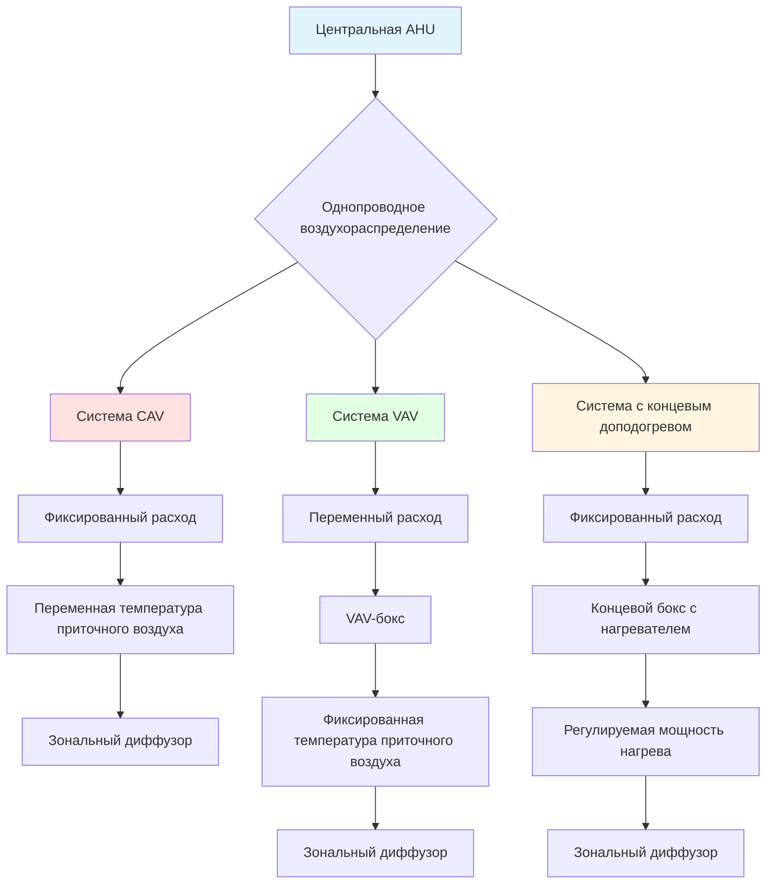

Однопроводные all-air системы — наиболее распространённая архитектура HVAC в коммерческих зданиях. Кондиционированный воздух подаётся через единую сеть воздуховодов от центральной приточно-вытяжной установки (AHU — air handling unit) к концевым устройствам или непосредственно в обслуживаемые помещения. Характерная особенность: весь воздухообмен зоны осуществляется через один воздуховодный тракт, а температурное управление достигается модуляцией расхода воздуха, регулированием температуры приточного воздуха или концевым доподогревом (terminal reheat).

## Классификация систем

Однопроводные системы делятся на три основные категории в зависимости от метода управления расходом воздуха.

### Системы постоянного расхода воздуха (CAV — Constant Air Volume)

CAV-системы поддерживают фиксированный расход воздуха для каждой зоны независимо от изменений тепловых нагрузок. Управление температурой осуществляется модуляцией температуры приточного воздуха на центральной AHU. Когда зона достигает заданного значения, система снижает холодопроизводительность, поэтому CAV подходит только для помещений с равномерными нагрузками и одновременными требованиями к отоплению или охлаждению.

**Рабочие характеристики:**
- Фиксированная скорость вентилятора и расход воздуха
- Температура приточного воздуха варьируется от 13 до 18°C в зависимости от зональной потребности
- Работа экономайзера (economizer) регулирует приток наружного воздуха
- Низкая энергоэффективность при частичных нагрузках

### Системы переменного расхода воздуха (VAV — Variable Air Volume)

VAV-системы модулируют подачу воздуха в соответствии с тепловыми нагрузками зоны при постоянной температуре приточного воздуха. Концевые VAV-боксы регулируют расход заслонками по сигналу зонального термостата. По мере закрытия заслонок статическое давление в воздуховоде возрастает, что вызывает снижение скорости центрального вентилятора через привод с частотным преобразователем (VFD — variable frequency drive).

**Рабочие характеристики:**
- Температура приточного воздуха обычно фиксирована на уровне 13°C
- Расход воздуха варьируется от минимума 30% до 100% номинального расхода
- Потребление вентилятора снижается пропорционально кубу снижения расхода
- Превосходная энергоэффективность при частичных нагрузках по сравнению с CAV
- Требуется контроль минимального расхода для вентиляции и перемешивания

### Системы с концевым доподогревом (Terminal Reheat)

Конфигурации с концевым доподогревом сочетают подачу воздуха постоянного расхода с нагревательными секциями в концевых устройствах на уровне зон. Центральная система подаёт воздух при температуре, достаточной для снятия максимальной охлаждающей нагрузки (обычно 11–13°C), тогда как зоны с меньшей потребностью в охлаждении или требующие отопления получают электрический или горячий водяной доподогрев непосредственно в концевом боксе.

**Рабочие характеристики:**
- Постоянный расход воздуха обеспечивает нормативную вентиляцию и перемешивание
- Зональное управление температурой через нагревательные секции
- Высокое энергопотребление из-за одновременного охлаждения и отопления
- Отличное управление влажностью для критичных применений
- Простое зональное управление температурой

## Сравнение архитектуры систем

## Характеристики производительности


| Параметр | CAV | VAV | Концевой доподогрев |
|---|---|---|---|
| Энергоэффективность при частичной нагрузке | Низкая | Отличная | Низкая |
| Зональное управление | Только одна зона | Отличное многозональное | Отличное многозональное |
| Первоначальная стоимость | Низкая | Средняя | Средняя — высокая |
| Эксплуатационная стоимость | Средняя | Низкая | Высокая |
| Управление влажностью | Низкое | Среднее | Отличное |
| Надёжность вентиляции | Хорошая | Требует контроля | Отличная |
| Применимые типы зданий | Небольшие однородные помещения | Большинство коммерческих зданий | Лаборатории, больницы |
| Потребление вентилятора при нагрузке 50% | 100% | 25% | 100% |


## Расчётные зависимости

### Расход воздуха для охлаждения


L_{\text{охл}} = \frac{Q_{\text{явн}}}{\rho \cdot c_p \cdot (T_{\text{пом}} - T_{\text{пр}})} = \frac{Q_{\text{явн}}}{1{,}207 \cdot \Delta T}


**Пример.** Офисная зона площадью 120 м², явная нагрузка $Q_{\text{явн}} = 8{,}4$ кВт, $\Delta T = 10$ К:


L = \frac{8{,}4}{1{,}207 \times 10} \approx 0{,}696\;\text{м}^3/\text{с} = 2505\;\text{м}^3/\text{ч}


### Экономия энергии вентилятора в VAV-системе

По закону подобия вентиляторов (affinity laws):


\frac{N_2}{N_1} = \left(\frac{L_2}{L_1}\right)^3


При снижении расхода до 50% от номинала: $N_2 = N_1 \times 0{,}5^3 = 0{,}125 \cdot N_1$.

Снижение расхода до 60% от номинала даёт: $N_2 = 0{,}6^3 = 0{,}216 \cdot N_1$ — потребление всего 21,6% от полной нагрузки.

## Рекомендации ASHRAE по выбору системы

Согласно ASHRAE Handbook — HVAC Systems and Equipment, выбор однопроводной системы определяется несколькими параметрами здания.

**VAV предпочтительны, когда:**
- Существует несколько зон с различными профилями нагрузок
- Занятость здания варьируется в течение дня
- Энергоэффективность является приоритетом
- Высота помещения превышает 2,7 м
- Реконструкция позволяет установить датчики давления в воздуховодах

**CAV остаётся обоснованным выбором для:**
- Однозонных применений площадью менее 929 м²
- Помещений с постоянным нормативным расходом вентиляционного воздуха
- Зданий с равномерными нагрузками
- Проектов с ограниченным бюджетом
- Реконструкций с ограничениями по трассировке воздуховодов

**Концевой доподогрев обоснован для:**
- Лабораторий с минимальным расходом воздуха по условиям безопасности
- Медицинских учреждений с точным управлением температурой (операционные, реанимации)
- Помещений с критичными требованиями к влажности
- Зданий с доступными низкопотенциальными источниками теплоты
- Применений с высоким коэффициентом явного теплоотвода (SHR)

## Рекомендации по проектированию

**Подбор воздуховодов.** Однопроводные системы требуют бо́льших поперечных сечений, чем двухпроводные, поскольку весь расход проходит через один тракт. Удельные потери на трение должны оставаться ниже 0,1 кПа на каждые 30 м для обеспечения приемлемого энергопотребления вентилятора.

**Минимальный расход воздуха.** VAV-системы требуют настройки минимального расхода — обычно 30% от номинального, — чтобы обеспечить нормативную вентиляцию и предотвратить расслоение воздуха. ASHRAE 62.1 требует отслеживания подачи наружного воздуха для VAV-систем при всех условиях эксплуатации.

**Температура приточного воздуха.** Более низкие температуры (11–13°C) увеличивают явную холодопроизводительность и снижают требования к расходу, но требуют дополнительного осушения и создают риск конденсации на наружных поверхностях воздуховодов. Тепловое сопротивление изоляции должно соответствовать требованиям местных энергетических нормативов.

**Управление вентилятором.** VAV-системы реализуют экономию только при надлежащем управлении. Датчики статического давления, расположенные на расстоянии 2/3 длины самого длинного воздуховодного тракта, обеспечивают оптимальные управляющие сигналы. Вентилятор поддерживает достаточное давление, чтобы удерживать заслонку наиболее нагруженного VAV-бокса в положении 90–95% открытия — стратегия сброса давления (static pressure reset, SPR).

## Достоинства и ограничения

Однопроводные системы обеспечивают простоту в проектировании, монтаже и техническом обслуживании по сравнению с двухпроводными или многозонными альтернативами. Единственный воздуховодный тракт минимизирует требования к пространству и снижает первоначальные затраты. Однако однопроводные системы без концевого доподогрева не могут одновременно отапливать одни зоны при охлаждении других, что ограничивает их применение в зданиях с высокими нагрузками на фасад или в объектах со смешанным функциональным зонированием.

VAV-технология стала доминирующим выбором для коммерческих HVAC-применений благодаря значительному потенциалу энергосбережения. Законы подобия вентиляторов определяют, что снижение скорости вентилятора до 50% от номинальной уменьшает потребляемую мощность примерно до 12,5% от полной нагрузки — существенно лучший результат, чем у систем с постоянным расходом при частичных нагрузках.
