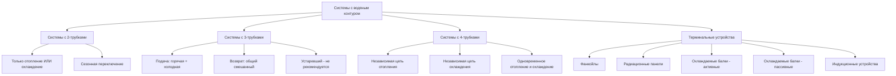

## Обзор

Системы HVAC с водяным контуром распределяют кондиционированную воду к терминальным устройствам, расположенным по всему зданию, где вода обменивает тепло с воздухом помещения или поверхностями. В отличие от систем только с воздухом, которые транспортируют кондиционированный воздух через воздуховоды, системы с водяным контуром используют трубопроводы меньшего диаметра для транспортировки тепловой энергии. Это фундаментальное различие обеспечивает значительные преимущества в приложениях зданий, где ограничения пространства, требования зонирования или энергоэффективность определяют выбор системы.

Физика, управляющая этими системами, основана на конвективном и радиационном теплообмене. Удельная теплоёмкость воды (4,186 кДж/кг·К) значительно превышает таковую воздуха (1,005 кДж/кг·К), что позволяет воде транспортировать примерно в 3500 раз больше тепловой энергии на единицу объёма, чем воздух. Это термодинамическое преимущество приводит к уменьшению размера системы распределения, снижению энергии насоса по сравнению с энергией вентилятора и более тихой работе.

## Типы архитектуры системы

## Сравнение конфигураций трубопроводов

| Параметр | Система с 2-трубками | Система с 4-трубками |
|-----------|---------------|---------------|
| Стоимость трубопровода | Более низкие первоначальные инвестиции | Более высокие первоначальные инвестиции |
| Гибкость эксплуатации | Отопление ИЛИ охлаждение в сезон | Одновременное отопление и охлаждение |
| Период переключения | Переходный период 2-4 недели | Без переходного периода |
| Управление зоной | Ограниченное - один режим по всему зданию | Отличное - независимое управление зоной |
| Энергоэффективность | Средняя - невозможно оптимизировать по зонам | Выше - соответствует фактическим нагрузкам зоны |
| Применимость | Здания с однородной нагрузкой, одноклиматные зоны | Переменные нагрузки, периметр/ядро здания |
| Сложность обслуживания | Ниже - меньше клапанов и элементов управления | Выше - больше компонентов для обслуживания |
| Температура проектной воды | 6-9°C охлаждение / 49-82°C отопление | Отдельная оптимизация для каждой цепи |

## Конфигурации терминальных устройств

### Фанкойлы (FCU)

Фанкойлы состоят из оребренного теплообменника, центробежного или осевого вентилятора, фильтра и поддона конденсата, заключённых в корпус. Вентилятор нагнетает воздух через катушку, где происходит явный и скрытый теплообмен в соответствии с:

**Явное охлаждение:** $Q_s = m_{воздух} \times c_p \times (T_{вход} - T_{выход})$

**Скрытое охлаждение:** $Q_l = m_{воздух} \times h_{fg} \times (\omega_{вход} - \omega_{выход})$

Фанкойлы обеспечивают локальное управление, позволяя отдельно регулировать температуру в каждой зоне. Типичные применения включают отели, квартиры и периметральные офисы, где гибкость зонирования перевешивает требования к обслуживанию распределённого оборудования.

**Характеристики производительности:**

| Спецификация фанкойла | Типичный диапазон | Соображения при проектировании |
|-------------------|---------------|----------------------|
| Производительность охлаждения | 200-2000 CFM (340-3400 м³/ч) | Размер на основе пиковой нагрузки зоны |
| Расход воды | 0,06-0,63 л/с | Поддерживать разницу температур 3-8°C на катушке |
| Температура подаваемой воды | 6-9°C (охлаждение) | Управление точкой росы предотвращает конденсацию |
| Уровень звука | 25-45 NC | Критично для занятых помещений |
| Мощность вентилятора | 0,2-0,8 Вт/CFM | Выбирать для эффективности, не только по стоимости |

### Радиационные панели охлаждения

Радиационные панели обмениваются теплом в основном путём теплового излучения, а не конвекции. Разности температур поверхности управляют радиационным теплообменом в соответствии с соотношением Стефана-Больцмана. Панели, установленные в потолке, охлаждаются, поглощая длинноволновое инфракрасное излучение, излучаемое более тёплыми поверхностями и людьми.

Скорость теплообмена следует:

**$q = \varepsilon \times \sigma \times A \times (T_{поверхность}^4 - T_{панель}^4)$**

Где ε представляет коэффициент излучательности поверхности, а σ — константу Стефана-Больцмана (5,67×10⁻⁸ Вт/м²·К⁴).

Практические системы радиационных панелей достигают производительности охлаждения 95-160 Вт/м² с температурой поверхности панели, поддерживаемой на 1-2°C выше точки росы помещения, чтобы предотвратить конденсацию. Управление точкой росы представляет критическое ограничение проектирования — сложный мониторинг влажности и модуляция температуры панели предотвращают накопление влаги.

### Охлаждаемые балки

Охлаждаемые балки используют естественную конвекцию (пассивную) или индуцированный воздушный поток (активный) для передачи тепла из помещения в охлаждаемую воду, циркулирующую через балку.

**Пассивные охлаждаемые балки** полностью полагаются на конвекцию, движимую плавучестью. Тёплый воздух помещения поднимается в контакт с охлаждённой поверхностью балки, передаёт тепло, становится плотнее и опускается. Типичные производительности колеблются от 65-130 Вт/м² обслуживаемой площади пола.

**Активные охлаждаемые балки** содержат первичный воздух, подаваемый с высокой скоростью через сопла, индуцирующие воздух помещения по катушке охлаждения посредством эффекта Вентури. Отношение индуцированного воздуха обычно колеблется от 2:1 до 6:1 (воздух помещения к первичному воздуху). Производительность достигает 190-320 Вт/м² при надлежащем проектировании.

Оба типа требуют строгого управления точкой росы и отлично работают в приложениях с хорошо контролируемой влажностью, таких как офисы, лаборатории и учебные учреждения.

## Рекомендации ASHRAE по выбору системы

Справочник ASHRAE - Системы и оборудование HVAC предоставляет критерии выбора на основе характеристик здания:

**Системы с водяным контуром подходят для приложений, где:**
- Независимое управление зоной оправдывает техническое обслуживание терминального устройства
- Вертикальное пространство для воздуховодов ограничено
- Явное охлаждение доминирует (скрытые нагрузки обрабатываются отдельно)
- Требуется тихая работа
- Эффективность транспортировки энергии приоритизируется над распределением воздуха

**Избегайте системы с водяным контуром, где:**
- Требуются высокие скорости вентиляции (невозможно соответствовать без выделенного наружного воздуха)
- Управление влажностью критично и сложно управлять централизованно
- Жильцы не имеют технической квалификации для локального управления
- Доступ для обслуживания терминальных устройств сильно ограничен

## Соображения при проектировании системы

### Управление температурой воды

Поддерживайте температуру подаваемой воды выше точки росы помещения с адекватным запасом безопасности (обычно 1-2°C). Непрерывно контролируйте точку росы и реализуйте стратегии сброса, которые повышают температуру подаваемой воды по мере увеличения влажности.

### Требования к вентиляционному воздуху

Системы с водяным контуром не обеспечивают вентиляционный воздух напрямую. Соответствие стандарту ASHRAE 62.1 требует отдельной выделенной системы наружного воздуха (DOAS). DOAS кондиционирует вентиляционный воздух, управляет влажностью помещения и часто поддерживает небольшое давление.

### Стратегия зонирования

Спроектируйте зоны на основе характеристик нагрузки, ориентации и моделей занятости. Периметральные зоны с высокими солнечными и проводящими нагрузками отделены от внутренних зон с преимущественно оборудованием и нагрузками от жильцов. Система с 4-трубками обеспечивает оптимальный ответ на одновременные требования отопления и охлаждения в разных зонах.

### Энергоэффективность

Энергия насоса для распределения воды обычно потребляет 1-2% транспортируемой тепловой энергии, в сравнении с 8-15% для систем распределения воздуха. Насосы с переменной скоростью, оптимизированное управление разницей температур и снижение потока на основе спроса максимизируют выгоду в эффективности. Работа водяного экономайзера продлевает часы свободного охлаждения, когда наружные условия это позволяют.
