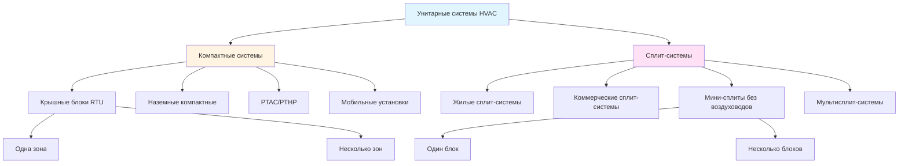

# Унитарные системы HVAC

Унитарные системы — это изготовленные на заводе блоки кондиционирования воздуха, предназначенные для обслуживания одной зоны или помещения. Эти самостоятельные системы интегрируют все компоненты холодильного цикла — компрессор, конденсатор, испаритель, расширительное устройство и органы управления — в один или два совместимые на заводе узла. Термин «унитарные» отличает эти изделия от собираемых на месте центральных систем, где компоненты подбираются и согласуются на объекте.

## Классификация унитарного оборудования

Унитарные системы делятся на две основные категории в зависимости от физической конфигурации:

**Компактные системы:** Все компоненты размещены в одном корпусе, установленном на улице или в механических помещениях.

**Сплит-системы:** Холодильный контур разделен между наружным конденсаторным агрегатом и комнатным воздухообработчиком, соединенными трубопроводами с хладагентом.

## Показатели эффективности унитарных систем

Три основных показателя количественно характеризуют эффективность унитарных систем, каждый из которых учитывает различные условия работы:

**SEER (Сезонный коэффициент энергетической эффективности охлаждения):** Характеризует эффективность охлаждения за весь сезон охлаждения с учетом изменяющихся наружных температур от 18°C до 40°C. Рассчитывается как общее удаленное тепло (кДж) разделенное на общее потребление электроэнергии (кВт·ч) в течение сезона охлаждения.

- Текущий федеральный минимум: 14 SEER (сплит-системы), 13,4 SEER (компактные) в северных штатах
- Пороговое значение Energy Star: ≥15 SEER (сплит), ≥14 SEER (компактные)
- Высокоэффективные установки: 20-28 SEER достижимо с инверторными компрессорами

**EER (Коэффициент энергетической эффективности):** Эффективность охлаждения в установившемся режиме при условиях проектирования (наружная температура 35°C, внутренние 26,7°C/19,4°C по сухому/влажному термометру, 50% относительной влажности). Рассчитывается как холодопроизводительность (кДж/ч) разделенная на мощность потребления (кВт).

- Федеральный минимум: 12,2 EER для сплит-систем ≥13,2 кВт
- Критично для анализа пиковой нагрузки и выбора электрического питания
- Коммерческие крышные блоки: обычно 10-14 EER

**HSPF (Сезонный коэффициент эффективности отопления):** Эффективность отопления тепловых насосов за весь сезон отопления. Общий выход теплоты (кДж) разделенный на общее потребление электроэнергии (кВт·ч) включая дополнительное электрическое отопление.

- Федеральный минимум: 8,8 HSPF (сплит-тепловые насосы), 8,0 HSPF (компактные)
- Пороговое значение Energy Star: ≥9,0 HSPF
- Тепловые насосы для холодного климата: сохраняют производительность до -26°C с HSPF 10-13

## Сравнение компактных и сплит-систем

| Параметр | Компактные системы | Сплит-системы |
|-----------|-----------------|---------------|
| **Площадь установки** | Не требуется внутреннее пространство | Требуется 0,3-0,6 м² внутреннего механического пространства |
| **Трубопроводы хладагента** | Заводские герметичные, без полевых труб | Полевые трубопроводы, обычно 4,5-45 м |
| **Подключение воздуховодов** | Один проход на крыше/стене | Внутренний блок требует камеры подачи/возврата |
| **Доступ для обслуживания** | Все компоненты доступны снаружи | Требуется доступ к наружному и внутреннему блокам |
| **Эффективность (SEER)** | Обычно 13-18 SEER | Обычно 14-28 SEER |
| **Шум (внутри)** | 45-55 дБ передается через воздуховод | 35-50 дБ в месте расположения воздухообработчика |
| **Первоначальная стоимость** | Ниже стоимость оборудования + установки | Выше из-за трубопроводов и трудозатрат |
| **Заряд хладагента** | 2,3-6,8 кг заводской герметизации | 3,6-11,3 кг с полевыми корректировками |
| **Эстетический эффект** | Видимое оборудование на крыше/земле | Скрытый внутренний блок, компактный наружный |
| **Гибкость замены** | Должен соответствовать существующей опоре/платформе | Компоненты заменяются независимо |

## Крышные блоки (RTU)

Коммерческие компактные установки, предназначенные для установки на крыше, служат в диапазоне 8,8-88 кВт производительности на единицу. RTU интегрируют охлаждение, отопление (газовая печь, электрическое отопление или тепловой насос), фильтрацию и органы управления экономайзером. Эти установки монтируются на конструктивные крышные панели, которые размещают подключения воздуховодов и обеспечивают герметичную установку.

**Ключные соображения проектирования:**

- Нагрузка на конструкцию: 73-98 кг/м² нагрузки на крышу для установки + панель + переходные части воздуховодов
- Интеграция герметизации панели с кровельной мембраной критична для гидроизоляции
- Выпуск воздуха: доступны конфигурации горизонтального или вертикального направления
- Работа экономайзера: до 100% наружного воздуха для свободного охлаждения при наружной температуре < 13-18°C
- Газовое отопление: секции печи с термическим КПД 80% до 117 кВт тепловой мощности
- Сертификация AHRI обязательна для проверки производительности

## Компактные настенные установки (PTAC)

Самостоятельные установки, вмонтированные через наружные стены, служат отдельным помещениям. Стандартная ширина 1,07 м соответствует гнездам в отелях, многоквартирных домах и домах престарелых. Холодопроизводительность варьируется от 2,05-4,40 кВт с опциональным электрическим или тепловым насосом отопления.

**Характеристики производительности:**

- EER: 9,4-12,5 при стандартных условиях рейтинга
- Воздухоохлаждаемый конденсатор выпускает воздух прямо наружу (воздуховоды не требуются)
- Интегрированная вентиляция наружным воздухом (обычно 4,7-11,8 л/с)
- Стандартная электросеть 208/230В однофазная
- Уровень звука при работе: 45-55 дBA на расстоянии 1 м
- Срок службы: 10-15 лет при ежегодном обслуживании

## Мини-сплит-системы без воздуховодов

Мини-сплиты с переменной производительностью доставляют 2,63-10,55 кВт на внутренний блок с рейтингами SEER более 25. Инверторные компрессоры модулируют от 20-130% номинальной производительности, точно подстраиваясь к нагрузке при минимизации потерь от циклирования.

**Преимущества:**

- Управление температурой на уровне зоны с независимыми термостатами блоков
- Отсутствие воздуховодов устраняет потери распределения 25-40%
- Трубопроводы хладагента до 61 м по горизонтали, 15 м вертикального разделения
- Тепловая мощность сохраняется при наружных температурах до -10,6°C
- Установка за 4-8 часов для однозонных приложений

**Конфигурации с несколькими блоками** подключают 2-8 внутренних агрегатов к одному наружному с независимой работой. Общая подключенная производительность не должна превышать 100-130% номинальной производительности наружного агрегата для предотвращения проблем одновременной полной нагрузки.

## Сертификация AHRI и стандарты рейтинга

Air-Conditioning, Heating, and Refrigeration Institute (AHRI) ведет независимые программы сертификации, проверяющие заявления производителей о производительности. Оборудование с сертификатом AHRI отображает справочный номер, доступный для поиска в онлайн-каталоге, содержащий:

- Сертифицированные холодопроизводительности и тепловую мощность при стандартных условиях
- Рейтинги эффективности SEER, EER, HSPF
- Электрические характеристики (напряжение, фаза, полный ток нагрузки)
- Тип хладагента и количество заряда
- Уровни звуковой мощности (внутренние и наружные)

Стандарт AHRI 210/240 регулирует тестирование жилого унитарного оборудования, в то время как AHRI 340/360 охватывает коммерческие установки более 17,6 кВт. Спецификация оборудования с сертификатом AHRI обеспечивает независимую проверку данных о производительности, используемых в расчетах нагрузки и энергетическом моделировании.

Сертификация Energy Star требует уровней эффективности на 15-20% выше федеральных минимумов, проверенных тестированием AHRI. Программы утилит обычно требуют соответствие Energy Star как минимальный порог приемлемости.

## Методология выбора системы

1. **Рассчитайте расчетные нагрузки** согласно ACCA Manual J (жилой) или ASHRAE Fundamentals (коммерческой)
2. **Определите конфигурацию** на основе доступного механического пространства и подхода к распределению
3. **Выберите размер оборудования** 100-115% расчетной нагрузки охлаждения (избегайте перегрузки)
4. **Выберите уровень эффективности** посредством анализа жизненного цикла затрат, включая тарифы на электроэнергию и часы эксплуатации
5. **Проверьте сертификацию AHRI** для выбранной модели и совпадения наружного/внутреннего компонентов
6. **Подтвердите совместимость напряжения** с доступным электроснабжением
7. **Проверьте уровни звука** в соответствии с требованиями проекта
8. **Проверьте зазоры** для соответствующей установки и доступа для обслуживания

Правильный выбор размера трубопроводов хладагента, вакуумирование до 42 Па и испытание давлением азотом остаются критичными для долговечности сплит-системы независимо от качества оборудования.
