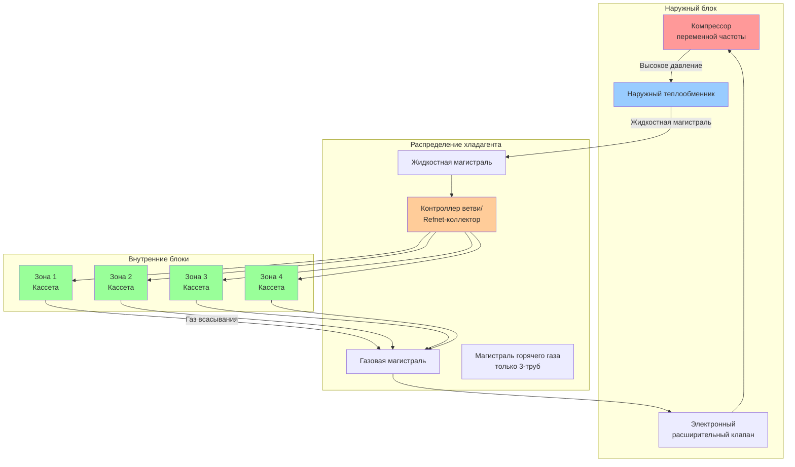

# Системы с переменным расходом хладагента

Системы с переменным расходом хладагента (VRF) представляют собой передовую бесканальную технологию HVAC, использующую хладагент в качестве основного теплоносителя. Эти системы оснащены компрессорами с переменной частотой вращения и электронными расширительными клапанами для модуляции расхода хладагента, соответствующей точным тепловым нагрузкам по нескольким внутренним блокам, подключённым к одному наружному блоку.

## Архитектура и конфигурация системы

Системы VRF состоят из трёх основных компонентов:

- **Наружный блок**: содержит компрессор с частотным приводом и переменной частотой вращения, теплообменник и управляющую электронику
- **Внутренние блоки**: несколько кассетных доводчиков воздуха (от 1 до 64+ на систему) с индивидуальным управлением зонами
- **Сеть трубопроводов хладагента**: медные трубы, распределяющие хладагент между наружным и внутренними блоками

### Диаграмма конфигурации системы

## Типы систем VRF

### Тепловой насос VRF (2-труба)

Системы тепловых насосов работают в режиме охлаждения или нагревания по всем зонам одновременно. Две трубопроводные магистрали хладагента (жидкостная и газовая) соединяют наружный и внутренние блоки.

**Применение**: здания с равномерными тепловыми нагрузками, жилые комплексы, гостиницы

### Рекуперация тепла VRF (3-труба)

Системы рекуперации тепла обеспечивают одновременное нагревание и охлаждение в разных зонах. Третья магистраль (магистраль горячего газа) позволяет перераспределять энергию хладагента между зонами, требующими нагревания и охлаждения.

**Применение**: офисные здания, учреждения здравоохранения, многофункциональные комплексы

## Сравнение систем 2-труба и 3-труба

| Параметр | 2-труба тепловой насос | 3-труба рекуперация тепла |
|-----------|----------------------|---------------------------|
| Одновременное нагревание/охлаждение | Нет | Да |
| Трубопроводы хладагента | 2 (жидкостная + газовая) | 3 (жидкостная + газовая + горячий газ) |
| Рекуперация энергии | Отсутствует | Высокая (30-40% экономия) |
| Стоимость установки | Ниже | На 15-25% выше |
| Эффективность работы | Высокая | Очень высокая |
| Переключение режимов | Требуется | Не требуется |
| Контроллер ветви | Соединения Refnet | Боксы BS/BC |
| Идеальное применение | Равномерные нагрузки | Смешанные нагрузки |
| Сложность управления | Средняя | Продвинутая |

## Расчёты мощности

### Общая мощность системы

В соответствии с Guideline 37-2022 ASHRAE мощность системы VRF рассчитывается с использованием коэффициента комбинирования (CR):

**Коэффициент комбинирования (CR)** = Σ(мощности внутренних блоков) / мощность наружного блока

Максимальный CR варьируется в зависимости от производителя (обычно 100-150%):

**Пример расчёта**:
- Мощность наружного блока: 14,0 кВ
- Внутренние блоки: 8 блоков × 2,6 кВ = 20,8 кВ
- CR = 20,8 / 14,0 = 1,50 или 150%

### Применение коэффициента разнородности

Фактическая одновременная нагрузка меньше, чем общая подключённая мощность:

**Эффективная мощность** = мощность наружного блока × коэффициент эффективности работы

Для офисных применений используйте коэффициент разнородности 70-80%, когда CR превышает 100%.

## Проектирование трубопроводов хладагента

### Ограничения по длине трубопровода

Guideline 37 ASHRAE устанавливает ограничения для трубопроводов:

- **Максимальная эквивалентная длина трубопровода**: 198-305 м (варьируется в зависимости от производителя)
- **Максимальная разница по высоте**: 49-101 м
- **Самый длинный отдельный участок**: 152-183 м от наружного блока до самого дальнего внутреннего блока

### Методология определения размера труб

Размер трубопровода хладагента зависит от мощности и эквивалентной длины:

| Мощность внутреннего блока | Жидкостная магистраль OD | Газовая магистраль OD |
|---------------------------|--------------------------|------------------------|
| 2,0-2,6 кВ | 6,4 мм | 9,5 мм |
| 2,6-4,4 кВ | 9,5 мм | 12,7 мм |
| 4,4-7,0 кВ | 9,5 мм | 15,9 мм |
| 7,0-10,5 кВ | 12,7 мм | 19,1 мм |
| 10,5-14,0 кВ | 15,9 мм | 22,2 мм |

### Расчёт перепада давления

Перепад давления хладагента в трубопроводах:

**ΔP** = f × (L/D) × (ρv²/2)

Где:
- f = коэффициент трения (0,015-0,025 для хладагента)
- L = эквивалентная длина трубопровода (м)
- D = внутренний диаметр (м)
- ρ = плотность хладагента (кг/м³)
- v = скорость хладагента (м/с)

Максимально допустимый перепад давления: 21-34 кПа эквивалента на 30 м для надлежащего возврата масла.

### Рассмотрение возврата масла

Минимальная скорость хладагента для увлечения масла:

- **Горизонтальные участки**: 5,1-7,6 м/с
- **Вертикальные подъёмы**: 7,6-10,2 м/с

Устанавливайте масляные ловушки каждые 9-12 м на вертикальных подъёмах, превышающих 12 м.

## Эксплуатация рекуперации тепла

Системы VRF с рекуперацией тепла перераспределяют тепловую энергию с использованием боксов выбора ветви (BS):

**Энергетический баланс**: Q_охлаждение + Q_нагревание = Q_наружный + Q_рекуперированный

В режиме одновременной работы зоны охлаждения отводят тепло через наружный блок, а зоны нагревания получают рекуперированную энергию, снижая нагрузку на наружный блок.

**Эффективность рекуперации тепла** = (рекуперированная энергия) / (общее энергопотребление) × 100%

Типичная эффективность рекуперации: 30-40% в условиях смешанной нагрузки.

## Рекомендации по проектированию согласно ASHRAE

### Расчёт нагрузки (ASHRAE Guideline 37-2022)

1. Рассчитайте нагрузки нагревания и охлаждения по зонам согласно Manual J или ASHRAE Fundamentals
2. Определите совпадающие пиковые нагрузки для определения размера наружного блока
3. Примените коэффициенты разнородности на основе типа здания и схем занятости
4. Определите размер наружного блока на уровне 70-80% от общей подключённой мощности внутренних блоков для систем с высоким CR

### Расчёт заряда хладагента

Общий заряд хладагента:

**M_total** = M_наружный + (M_жидкость × L_жидкость) + (M_газ × L_газ) + Σ(M_внутренний)

Где:
- M_наружный = заводской заряд в наружном блоке (кг)
- M_жидкость = заряд жидкостной магистрали на метр (кг/м)
- M_газ = заряд газовой магистрали на метр (кг/м)
- L = длина трубопровода (м)
- M_внутренний = заряд на внутренний блок (кг)

Типичный заряд: 0,23-0,68 кг на 3,5 кВ мощности системы

## Оптимизация производительности

### Эффективность при частичной нагрузке

Системы VRF превосходны в условиях частичной нагрузки благодаря технологии частотного преобразователя:

- **Нагрузка 100%**: EER 11-13
- **Нагрузка 50%**: EER 15-18
- **Нагрузка 25%**: EER 18-22

Интегрированное значение IPLV согласно AHRI 1230: типичное значение 18-24 EER для высокоэффективных моделей.

### Стратегия зонирования

Оптимальное зонирование максимизирует эффективность:

- Группируйте зоны с похожими тепловыми характеристиками
- Отделите периметральные и внутренние зоны
- Изолируйте зоны с высокой нагрузкой (конференц-залы, серверные комнаты)
- Ограничьте 8-12 внутренних блоков на наружный блок для отзывчивого управления

## Требования к установке

**Критические соображения при установке**:

- Трубопроводы хладагента должны быть припаяны с продувкой азотом (предотвращение окисления)
- Вакуумируйте систему до минимум 500 микрон перед заправкой
- Используйте масло полиольного эфира (POE), совместимое с хладагентом R-410A
- Устанавливайте фильтросушители на жидкостную магистраль для защиты расширительных клапанов
- Уклоняйте горизонтальные трубопроводы на 0,5% в сторону наружного блока для возврата масла
- Поддерживайте трубопроводы каждые 1,2-1,8 м; избегайте передачи вибраций
- Изолируйте жидкостную и газовую магистрали (минимум толщина стенки 12,7 мм)

## Заключение

Системы VRF обеспечивают исключительную энергоэффективность, точное управление зонами и гибкую установку в приложениях, начиная от небольших коммерческих зданий и заканчивая крупными многоэтажными комплексами. Конфигурации рекуперации тепла позволяют одновременное нагревание и охлаждение, рекуперируя 30-40% энергии, которая иначе была бы потеряна. Надлежащее проектирование системы требует тщательного внимания к планировке трубопроводов, расчётам мощности и соблюдению рекомендаций ASHRAE Guideline 37 для обеспечения оптимальной производительности и надёжности.
