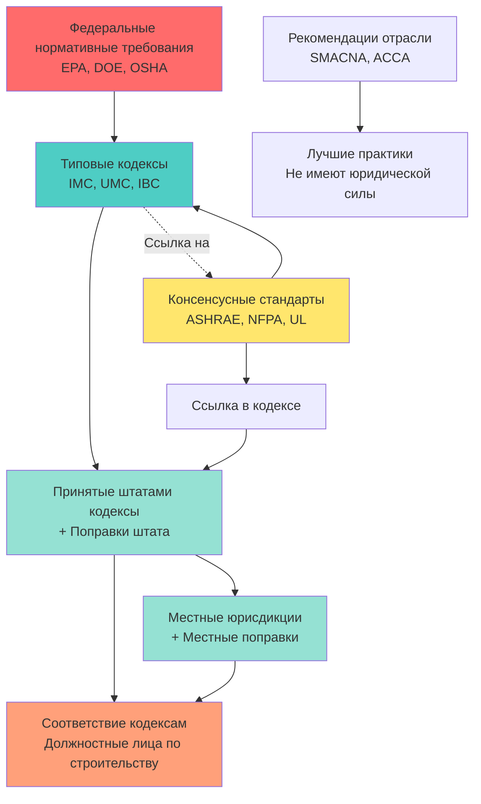

Индустрия HVAC работает в рамках комплексной нормативно-правовой базы, установленной типовыми кодексами, консенсусными стандартами и федеральными нормативными требованиями. Понимание иерархии, процесса принятия и механизмов соответствия необходимо для надлежащего проектирования, установки и эксплуатации систем.

## Кодексы в сравнении со стандартами и нормативными требованиями

Эти три категории выполняют различные, но взаимодополняющие функции в построенной среде:

**Строительные кодексы** — это юридически обязательные документы, принятые государственными органами юрисдикции. Они устанавливают минимальные требования для безопасности, здоровья и конструктивной целостности. Кодексы вводятся законодательством и имеют силу закона. Международный механический кодекс (IMC) и Единый механический кодекс (UMC) являются примерами типовых механических кодексов.

**Консенсусные стандарты** — это технические спецификации, разработанные посредством сотрудничества в отрасли. Организации, такие как ASHRAE, NFPA и SMACNA, разрабатывают стандарты посредством консенсусных процессов с участием производителей, инженеров, подрядчиков и должностных лиц по кодексам. Стандарты становятся обязательными только при ссылке в принятых кодексах или при указании в контрактах.

**Нормативные требования** — это установленные правительством правила с прямой юридической силой. Федеральные нормативные требования EPA (управление хладагентами), DOE (эффективность оборудования) и OSHA (безопасность работников) применяются по всей стране независимо от принятия местного кодекса.

## Основные организации, разрабатывающие кодексы и стандарты

Нормативная база HVAC формируется несколькими ключевыми организациями:

| Организация | Полное название | Основная направленность | Типы документов |
|--------------|-----------|---------------|----------------|
| **ICC** | Международный совет по кодексам | Типовые строительные кодексы | IMC, IBC, IECC, IFC, IRC |
| **ASHRAE** | Американское общество инженеров по отоплению, охлаждению и кондиционированию воздуха | Стандарты проектирования HVAC | 15, 55, 62.1, 62.2, 90.1, 189.1 |
| **NFPA** | Национальная ассоциация противопожарной защиты | Пожарная безопасность и спасение жизней | 70 (NEC), 90, 92, 96, 105 |
| **UL** | Underwriters Laboratories | Тестирование безопасности продукции | 1995, 1741, 60335-2-40 |
| **SMACNA** | Национальная ассоциация подрядчиков по производству листового металла и кондиционированию воздуха | Стандарты установки | Конструкция воздуховодов, герметизация, системы HVAC |
| **IAPMO** | Международная ассоциация сантехников и механиков | Типовые кодексы (западная часть США) | UMC, UPC |

## Иерархия кодексов и их взаимосвязи

## Процесс принятия кодекса

Путь от публикации типового кодекса до его местного применения следует многоэтапному процессу:

**Разработка типового кодекса** проводится по трехлетнему циклу. ICC и IAPMO собирают комитеты технических экспертов для рассмотрения предлагаемых изменений. Периоды открытого обсуждения позволяют участие промышленности. Слушания по разработке кодекса позволяют голосованию государственных членов принимать, изменять или отклонять предложения.

**Принятие штатами** варьируется по юрисдикции. Некоторые штаты устанавливают обязательные штатные кодексы с централизованным применением. Другие допускают местное принятие с надзором штата. Принятие обычно отстает от публикации типового кодекса на 1–3 года. Штаты часто вводят поправки, учитывающие региональный климат, строительные практики или политические соображения.

**Местное принятие** происходит через муниципальные постановления или резолюции округа. Юрисдикции могут принимать типовые кодексы дословно, с поправками штата или с дополнительными местными изменениями. Местные поправки обычно касаются регионов с сильным ветром, сейсмических зон, границ лесных пожаров или зон наводнений.

**Циклы поправок** означают, что специалисты должны одновременно отслеживать несколько версий кодекса. Новое строительство следует недавно принятым кодексам. Существующие здания часто остаются под действием исходных кодексов строительства, если только существенные изменения не вызовут необходимость обновления. ICC публикует новые издания каждые три года (2021, 2024, 2027).

## Включение стандартов по ссылке

Типовые кодексы включают стандарты посредством ссылки, а не полного воспроизведения текста. Когда IMC ссылается на ASHRAE 62.1, этот стандарт становится обязательным, как если бы он был написан в самом кодексе. Этот механизм обеспечивает:

- Специализацию: организации, разрабатывающие стандарты, развивают глубокую техническую экспертизу
- Актуальность: стандарты обновляются независимо от циклов кодекса
- Гармонизацию: несколько кодексов ссылаются на одни и те же стандарты
- Гибкость: юрисдикции могут изменять ссылки на кодексы для указания версий стандартов

Обычно ссылаемые стандарты включают ASHRAE 90.1 (энергоэффективность), ASHRAE 62.1 (вентиляция), NFPA 70 (электричество) и сотни стандартов продукции ASTM, ANSI и UL.

## Соответствие кодексам и нормативные требования

**Проверка проектной документации** предшествует строительству. Конструкторы подают механические чертежи и спецификации в отделы строительства. Должностные лица по кодексам проверяют соответствие применимым кодексам и стандартам. Неполные или несоответствующие чертежи получают уведомления об исправлении, требующие переподачи.

**Выдача разрешения** санкционирует строительство. Механические разрешения требуют чертежей, расчетов и сборов. Некоторые юрисдикции предлагают ускоренную проверку для стандартных установок.

**Проверки** проводятся на предписанных этапах строительства: черновая отделка (перед скрытием), окончательная (система работает) и специальные проверки (сейсмические крепления, дымоудаление). Инспекторы проверяют, соответствует ли установка утвержденным чертежам и соответствует требованиям кодекса.

**Свидетельство о возможности использования** разрешает занятие здания после успешных окончательных проверок всех профессий. Недостатки HVAC могут предотвратить выдачу свидетельства.

**Процедуры отклонения** существуют в ситуациях, когда буквальное соответствие кодексу создает практические трудности. Истцы демонстрируют эквивалентную безопасность посредством альтернативных методов или материалов. Должностные лица по строительству или апелляционные советы одобряют отклонения в индивидуальном порядке.

## Ключевые ссылки на кодексы

Критические положения механических кодексов касаются:

- Методологии выбора оборудования и расчета нагрузок
- Требований к воздуху для горения топливных приборов
- Конструкции, материалов и герметизации воздуховодов
- Норм вентиляции для занятых помещений
- Классификации хладагентов и ограничений системы
- Мер по энергосбережению и эффективности оборудования
- Сейсмических и ветровых крепежных систем для оборудования и распределения
- Доступа и зазоров для технического обслуживания

Понимание различия между кодексами, стандартами и нормативными требованиями позволяет специалистам HVAC эффективно соответствовать требованиям. Кодексы устанавливают обязательные минимумы. Стандарты предоставляют технические спецификации. Нормативные требования устанавливают прямые федеральные требования. Вместе эти рамки обеспечивают безопасные, эффективные и надежные системы HVAC.
