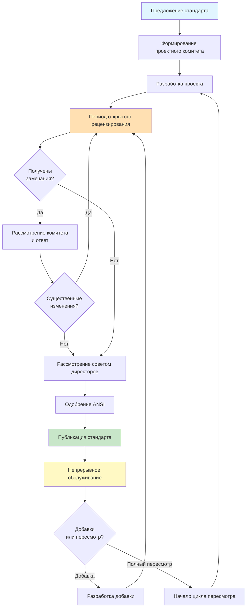
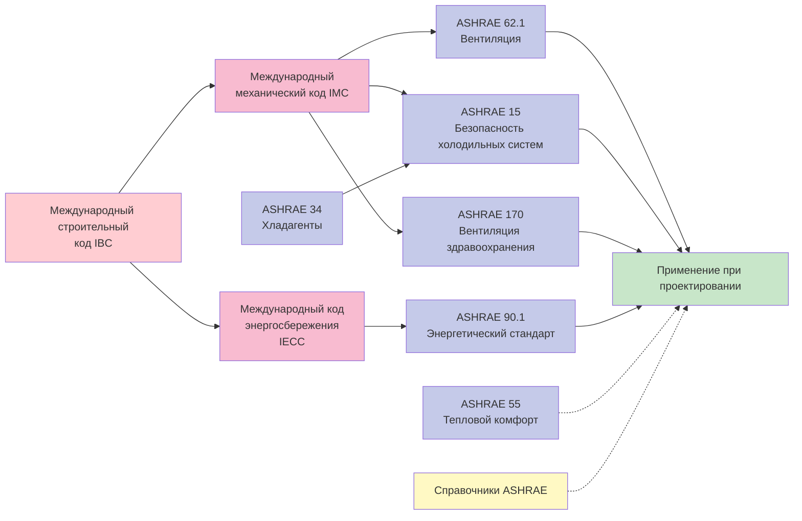

Американское общество инженеров по отоплению, охлаждению и кондиционированию воздуха (ASHRAE) разрабатывает и поддерживает наиболее широко применяемые стандарты HVAC в Соединённых Штатах и во всём мире. Эти консенсусные стандарты составляют техническую основу строительных норм, энергетических нормативов и проектной практики во всей отрасли.

## Основные стандарты ASHRAE

### Стандарт ASHRAE 62.1: Вентиляция для приемлемого качества воздуха в помещении

Стандарт 62.1 устанавливает минимальные нормы вентиляции и требования к качеству воздуха в помещениях для коммерческих и учреждений зданий. Стандарт определяет требования к наружному воздуху на основе плотности занятости, площади пола и источников загрязняющих веществ.

**Ключевые требования:**
- Минимальные нормы вентиляции наружным воздухом, указанные в м³/ч на одного человека плюс м³/ч на квадратный метр
- Процедура норм вентиляции и процедура качества воздуха в помещении как альтернативные пути соответствия
- Требования к фильтрации воздуха на основе качества наружного воздуха
- Мандаты по документированию проектирования и ввода системы в эксплуатацию

Поток наружного воздуха в зоне дыхания рассчитывается как:

Vbz = Rp × Pz + Ra × Az

Где Rp — норма наружного воздуха на человека, Pz — численность населения зоны, Ra — норма наружного воздуха на площадь, Az — площадь пола зоны.

### Стандарт ASHRAE 90.1: Энергетический стандарт для зданий

Стандарт 90.1 устанавливает минимальные требования к энергоэффективности для систем зданий, включая HVAC, освещение и внешние ограждающие конструкции. Этот стандарт упоминается в IECC и принят в качестве закона в большинстве юрисдикций США.

**Ключевые компоненты:**
- Предписывающие требования к эффективности оборудования
- Обязательные положения, включая экономайзеры, рекуперацию энергии и управление вентиляцией по требованию
- Требования к изоляции внешних ограждающих конструкций и ограждениям
- Метод энергетического бюджета затрат как альтернатива на основе производительности
- Требования, специфичные для климатических зон (зоны 0-8)

Требования к эффективности оборудования используют показатели EER, SEER, COP, IPLV и эффективность горения в зависимости от типа и мощности оборудования.

### Стандарт ASHRAE 55: Условия теплового окружения для занятия человеком

Стандарт 55 устанавливает условия теплового окружения для приемлемого теплового комфорта человека. Стандарт рассматривает температуру, влажность, движение воздуха и радиационные эффекты.

**Модели комфорта:**
- Прогнозируемое среднее голосование (PMV) и прогнозируемый процент недовольных (PPD) для механически кондиционируемых помещений
- Адаптивная модель комфорта для естественно вентилируемых зданий
- Метод повышенной скорости воздуха для увеличенного движения воздуха
- Диапазоны температуры и влажности для типичных офисных помещений

Приемлемые диапазоны действующей температуры варьируются от 20–26 °C зимой до 23–27 °C летом в зависимости от теплоизоляции одежды и метаболического уровня.

### Стандарт ASHRAE 15: Стандарт безопасности для холодильных систем

Стандарт 15 устанавливает требования безопасности для проектирования, строительства, установки и эксплуатации холодильных систем. Стандарт рассматривает классификацию хладагента, местоположение системы, вентиляцию и обнаружение утечек.

**Критические требования:**
- Пределы количества хладагента на основе классификации токсичности (A/B) и воспламеняемости (1/2L/2/3)
- Требования к вентиляции машинного отделения
- Системы обнаружения хладагента и сигнализации
- Положения о сбросе давления и герметизации
- Процедуры испытаний и продувки

### Стандарт ASHRAE 34: Обозначение и классификация безопасности хладагентов

Стандарт 34 присваивает номера хладагентам и устанавливает классификацию безопасности на основе токсичности и воспламеняемости. Система классификации использует букву для токсичности (A = менее токсичный, B = более токсичный) и цифру для воспламеняемости (1 = распространение пламени отсутствует, 2L = низкая воспламеняемость, 2 = воспламеняемый, 3 = высокая воспламеняемость).

**Классификации распространённых хладагентов:**

| Хладагент | Номер | Классификация | Применение |
|-----------|-------|----------------|-----------|
| R-410A | - | A1 | Жилые/коммерческие кондиционеры |
| R-32 | - | A2L | Альтернатива с низким ПГП |
| R-134a | - | A1 | Охладители, автомобильные |
| R-1234yf | - | A2L | Автомобильные, низкий ПГП |
| R-717 (аммиак) | - | B2L | Промышленное охлаждение |
| R-744 (CO2) | - | A1 | Трансчитические системы |

### Стандарт ASHRAE 170: Вентиляция учреждений здравоохранения

Стандарт 170 устанавливает требования к вентиляции учреждений здравоохранения, включая больницы, амбулаторные учреждения и дома престарелых. Стандарт определяет строгие требования к частоте воздухообмена, соотношениям давления, фильтрации и контролю влажности.

**Ключевые требования:**
- Минимальное количество воздухообменов в час для конкретных типов помещений
- Положительное или отрицательное соотношение давления по отношению к соседним помещениям
- Минимальные процентные доли наружного воздуха
- Требования к эффективности фильтрации (рейтинги MERV)
- Диапазоны температуры и влажности для комфорта пациента и контроля инфекций

Операционные требуют минимум 20 воздухообменов в час с положительным давлением, в то время как палаты изоляции воздушно-капельных инфекций требуют минимум 12 воздухообменов в час с отрицательным давлением.

## Справочники ASHRAE

ASHRAE публикует четыре всеобъемлющих справочника по четырёхлетнему циклу, каждый полностью обновляется и пересматривается в каждом цикле:

| Справочник | Год издания | Основное содержание |
|------------|-------------|-------------------|
| Системы и оборудование HVAC | 2024, 2028 | Типы систем, выбор оборудования, проектирование |
| Холодильные системы | 2026, 2030 | Холодильные системы, хранение продуктов, транспорт |
| Применение HVAC | 2027, 2031 | Типы зданий, специализированные применения |
| Основы | 2025, 2029 | Психрометрия, теплопередача, расчёт нагрузок |

## Процесс разработки стандартов

Стандарты ASHRAE следуют строгому консенсусному процессу разработки, аккредитованному Американским национальным институтом стандартов (ANSI). Процесс обеспечивает сбалансированное представление от производителей, пользователей и категорий общих интересов.

## Взаимосвязь стандартов и иерархия

Основные стандарты ASHRAE взаимодействуют со строительными нормами и другими стандартами, образуя нормативно-правовую базу:

Диаграмма иллюстрирует, как модельные строительные коды ссылаются на стандарты ASHRAE, которые затем направляют применение при проектировании. ASHRAE 34 входит в 15 для безопасности хладагентов, в то время как стандарт 55 и справочники предоставляют дополнительное руководство по проектированию.

## Добавки и циклы пересмотра

Стандарты подвергаются непрерывному обслуживанию через добавки, опубликованные между полными пересмотрами. Основные стандарты, такие как 62.1, 90.1 и 55, публикуются по трёхлетним циклам пересмотра. Добавки включаются в следующее изданное издание и доступны отдельно для немедленного принятия.

Типичный жизненный цикл стандарта:
- **Год 0**: Стандарт опубликован
- **Годы 1-2**: Разрабатываются и публикуются добавки
- **Год 3**: Начинается процесс пересмотра, публикуется новое издание
- Комитет непрерывного обслуживания собирается 2-3 раза в год

## Соответствие и принятие

Стандарты ASHRAE становятся юридически обязательными, когда они приняты юрисдикциями или упоминаются в строительных нормах. Большинство штатов принимают модельные коды (IBC, IMC, IECC), которые ссылаются на конкретные издания стандартов ASHRAE. Проектировщики должны проверить, какое издание применимо к их проекту на основе юрисдикции и даты выдачи разрешения.

Стандарт 90.1 получает особенно широкое распространение как основу для федеральных требований к зданиям, программ стимулирования коммунальных предприятий и сертификаций зелёного строительства, включая LEED. Стандарт 62.1 формирует минимальное требование к вентиляции в IMC и большинстве государственных механических кодов.

Понимание стандартов ASHRAE необходимо для проектирования, спецификации, установки и эксплуатации HVAC. Эти стандарты представляют коллективные знания отрасли и предоставляют техническую основу для безопасных, эффективных и удобных сред в зданиях.
