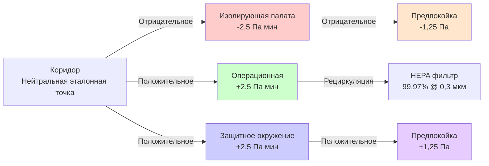

Стандарт ASHRAE 170 «Вентиляция учреждений здравоохранения» устанавливает минимальные требования к вентиляции помещений здравоохранения для минимизации передачи инфекции, контроля запахов и поддержания надлежащих условий окружающей среды. Этот стандарт работает в сочетании с рекомендациями Института руководящих принципов объектов (FGI) по проектированию и строительству больниц и амбулаторных учреждений.

## Фундаментальные принципы проектирования

Системы HVAC учреждений здравоохранения принципиально отличаются от коммерческих зданий из-за критических требований к контролю инфекции, безопасности пациентов и соответствию нормативным требованиям. Стандарт рассматривает три основные стратегии контроля инфекции:

**Разбавляющая вентиляция** снижает концентрацию переносимых по воздуху загрязнителей за счет постоянного воздухообмена. Требуемое общее количество воздухообменов в час (ACH) зависит от функции помещения, где критические области требуют более высоких показателей.

**Направленный поток воздуха** контролирует миграцию загрязнителей через соотношения давлений. Положительное давление защищает иммунокомпрометированных пациентов, предотвращая попадание воздуха из коридора, в то время как отрицательное давление содержит инфекционные аэрозоли в изолирующих палатах.

**Фильтрация** удаляет твердые частицы и микроорганизмы. Стандарт определяет минимальные значения рейтинга эффективности (MERV) и, для критических помещений, высокоэффективную фильтрацию частиц (HEPA).

## Требования к соотношению давлений

Перепады давления предотвращают перекрестное загрязнение между помещениями. Стандарт требует минимальных перепадов давления **2,5 Па (0,01 дюйм вод. ст.)** между соседними помещениями, хотя проектные значения 5-10 Па обеспечивают операционный запас.

## Параметры проектирования для каждого помещения

### Критические и хирургические помещения

| Тип помещения | Давление | ACH всего | ACH наружного воздуха | Рециркуляция | Фильтрация воздуха | Температура (°C) | ОВ (%) |
|------------|----------|-----------|-----------------|---------------|----------------|------------------|--------|
| Операционная (Класс B/C) | Положительное | 20 мин | 4 мин | Разрешена | MERV 14 + HEPA | 20–23 | 20–60 |
| Защитное окружение (PE) | Положительное | 12 мин | 2 мин | Не разрешена | MERV 14 + HEPA | 20–24 | 40 макс |
| Изолирование инфекции, передающейся по воздуху (AII) | Отрицательное | 12 мин | 2 мин | Не разрешена | MERV 14 | 20–24 | 30–60 |
| Отделение интенсивной терапии (ОИТ) | Положительное/равное | 6 мин | 2 мин | Разрешена | MERV 14 | 21–24 | 30–60 |
| Кардиологическая катетеризация | Положительное | 15 мин | 3 мин | Разрешена | MERV 14 + HEPA | 20–23 | 20–60 |

### Диагностические и лечебные помещения

| Тип помещения | Давление | ACH всего | ACH наружного воздуха | Фильтрация воздуха | Температура (°C) | ОВ (%) |
|------------|----------|-----------|-----------------|----------------|------------------|--------|
| Отделение неотложной помощи | Равное/отрицательное | 12 мин | 2 мин | MERV 14 | 21–24 | 30–60 |
| Кабинет бронхоскопии | Отрицательное | 12 мин | 2 мин | MERV 14 | 20–24 | 30–60 |
| Помещение для аутопсии | Отрицательное | 12 мин | 2 мин | MERV 8 | 20–24 | 30–60 |
| Рентгенология (рентген) | Равное | 6 мин | 2 мин | MERV 8 | 22–26 | 30–60 |
| МРТ кабинет | Равное | 6 мин | 2 мин | MERV 8 | 21–24 | 30–60 |
| Фармацевтический (стерильное компаундирование) | Положительное | 30 мин | 4 мин | MERV 14 + HEPA | 20–23 | 30–60 |

### Вспомогательные и дополнительные помещения

| Тип помещения | Давление | ACH всего | ACH наружного воздуха | Фильтрация воздуха |
|------------|----------|-----------|-----------------|----------------|
| Комната грязной работы | Отрицательное | 10 мин | 2 мин | MERV 8 |
| Помещение оборудования стерилизатора | Отрицательное | 10 мин | 2 мин | MERV 8 |
| Помещение уборочного инвентаря | Отрицательное | 10 мин | 2 мин | MERV 8 |
| Пищеблок | Отрицательное | 10 мин | 2 мин | MERV 8 |
| Туалетная комната пациента | Отрицательное | 10 мин | 1 мин | MERV 8 |

## Расчеты воздухообмена

Общее количество воздухообменов в час рассчитывается на основе требуемого расхода воздуха и объема помещения:

$$\text{ACH} = \frac{Q \times 60}{V}$$

Где:
- $\text{ACH}$ = Воздухообмены в час
- $Q$ = Расход воздуха (CFM)
- $V$ = Объем помещения (м³)

Для помещений с требованиями минимальной ACH требуемый расход воздуха становится:

$$Q = \frac{\text{ACH} \times V}{60}$$

Вентиляция наружным воздухом должна соответствовать большему из требований ACH или вентиляции, необходимой для контроля теплоты:

$$Q_{oa} = \max\left(\frac{\text{ACH}_{oa} \times V}{60}, \frac{Q_{sensible}}{1.08 \times \Delta T}\right)$$

Где:
- $Q_{oa}$ = Расход наружного воздуха (CFM)
- $Q_{sensible}$ = Явная нагрузка охлаждения (кДж/ч)
- $\Delta T$ = Разница температур между подачей и помещением (°C)

## Требования к фильтрации

Учреждения здравоохранения требуют поэтапной фильтрации для защиты как пациентов, так и оборудования HVAC:

**Предфильтр MERV 8**: Защищает оборудование нижнего уровня и поддерживает чистоту системы. Минимум для всех систем подачи здравоохранения.

**Вторичный фильтр MERV 14**: Требуется для зон ухода за пациентами. Захватывает 75–85 % частиц размером 0,3–1,0 мкм, включая большинство носителей бактерий и крупные вирусные аэрозоли.

**Финальный HEPA фильтр**: Требуется для защитных сред, операционных и фармацевтического компаундирования. Удаляет ≥99,97 % частиц 0,3 мкм. Тестирование эффективности фильтра:

$$E = \left(1 - \frac{C_{downstream}}{C_{upstream}}\right) \times 100\%$$

Где эффективность $E$ должна быть ≥99,97 % при наиболее проникающем размере частиц (MPPS) 0,3 мкм.

## Специальные соображения вентиляции

**Проектирование предпокойки**: Предпокойки буферизируют переходы давления между изолирующими палатами и коридорами. Они могут работать в положительном, отрицательном или нейтральном режиме в зависимости от того, обслуживают ли они защитные окружения или помещения с изолированием инфекции, передающейся по воздуху.

**Управление на основе спроса**: Некоторые некритические помещения позволяют снижать расход воздуха в период отсутствия людей, но критические помещения требуют непрерывной работы при полной ACH независимо от присутствия людей.

**Требования к резервированию**: Системы безопасности жизнедеятельности, обслуживающие операционные и отделения интенсивной терапии, должны включать резервное оборудование, соединения аварийного питания и отказоустойчивые органы управления для поддержания соотношения давлений при отказе оборудования.

**Контроль влажности**: Контроль относительной влажности предотвращает рост бактерий (>60 % ОВ) и проблемы с статическим электричеством (<30 % ОВ). Операционные и защитные окружения имеют наиболее жесткие допуски.

## Интеграция с рекомендациями FGI

Рекомендации FGI ссылаются на ASHRAE 170 как на авторитетный стандарт вентиляции, но добавляют типы помещений и требования, не охватываемые ASHRAE 170. Проектировщики должны соответствовать обоим документам, применяя более строгое требование при возникновении конфликтов. Недавние издания улучшили согласованность между двумя стандартами, в частности в отношении конфигураций предпокойки и операционных класса B по сравнению с классом C.

## Компоненты

- Вентиляция здравоохранения Ashrae 170
- Соотношения давлений здравоохранения
- Показатели воздухообмена здравоохранения
- Фильтрация здравоохранения
- Температура влажность здравоохранения
- Параметры проектирования тип помещения
