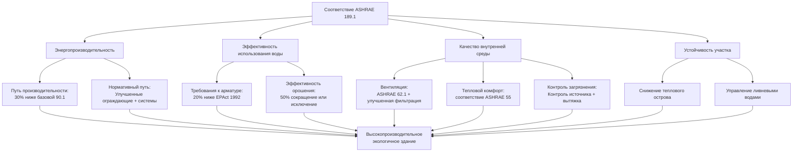

## Обзор

Стандарт ASHRAE 189.1 «Стандарт проектирования высокопроизводительных экологичных зданий» устанавливает минимальные требования к устойчивому проектированию, строительству и эксплуатации зданий. Этот комплексный стандарт интегрирует устойчивость участка, эффективность использования воды, энергопроизводительность, качество внутренней среды и выбор материалов в единый нормативный документ.

ASHRAE 189.1 служит как самостоятельным стандартом, так и технической основой Международного кодекса экологичного строительства (IgCC). Он предоставляет обязательные требования, которые юрисдикции могут принять как обязательный код, отличаясь от добровольных систем рейтинговки, таких как LEED.

## Структура стандарта

Стандарт охватывает шесть основных областей производительности:

**Устойчивость участка**: ограничивает развитие на чувствительных участках, способствует управлению ливневыми водами, снижает эффект теплового острова и защищает среду обитания.

**Эффективность использования воды**: устанавливает максимальные расходы и объёмы слива для арматуры и систем орошения, снижая потребление питьевой воды на 30-40% по сравнению с базовой линией.

**Энергоэффективность**: требует производительность на 30% лучше, чем базовая линия ASHRAE 90.1 Приложение G для большинства типов зданий, с нормативными путями для более мелких проектов.

**Качество внутренней среды (IEQ)**: предписывает минимальные нормы вентиляции согласно ASHRAE 62.1, контроль источников загрязнения, соответствие тепловому комфорту и критерии акустической производительности.

**Материалы и ресурсы**: требует экологически предпочтительных материалов, управления строительными отходами и ограничений воздействия хладагентов.

**Строительство и планы эксплуатации**: устанавливает требования к наладке систем, стандарты документирования и положения для постоянной производительности.

## Требования к энергоэффективности

Положения ASHRAE 189.1 в области энергоэффективности превышают Стандарт 90.1 несколькими путями:

**Путь производительности**: затраты энергии на всё здание на 30% ниже базовой линии ASHRAE 90.1-2010 Приложение G (варьируется в зависимости от типа здания и климатической зоны). Этот подход обеспечивает гибкость проектирования, гарантируя значительную экономию энергии.

**Нормативный путь**: улучшенная теплоизоляция ограждающих конструкций, снижение плотности мощности освещения, минимальные показатели эффективности HVAC и обязательные экономайзеры где применимо. Нормативные требования обычно дают экономию энергии 20-25%.

**Требования специфичные для HVAC**:
- Требования к экономайзерам в климатических зонах 3B-8
- Управляемая по спросу вентиляция для помещений > 46 м² с плотностью > 40 человек на 92 м²
- Рекуперация энергии при наружном воздухе превышающем 70% от воздуха подачи
- Ограничения мощности вентилятора на 30% ниже ASHRAE 90.1
- Значения R теплоизоляции воздуховодов и труб увеличены на 20-30%
- Балансировка гидравлических систем и оптимизация управления

## Эффективность использования воды

Требования к экономии воды охватывают внутреннюю арматуру, наружное орошение и технологическую воду:

**Внутреннее водопотребление**: максимальные расходы на 20% ниже базовой линии Закона об энергетической политике 1992 года:
- Смесители на раковин: 5,7 л/мин (в сравнении с базовым 8,3 л/мин)
- Душевые лейки: 7,6 л/мин (в сравнении с базовым 9,5 л/мин)
- Унитазы: 4,8 л на смыв (в сравнении с базовым 6,0 л на смыв)
- Писсуары: 1,9 л на смыв (в сравнении с базовым 3,8 л на смыв)

**Эффективность орошения**: использование воды для ландшафта сокращается на 50% благодаря эффективной технологии орошения, выбору растений с учётом климата и улучшению почвы. Высокоэффективные системы включают капельное орошение, датчики влажности почвы и контроллеры, управляемые по погоде.

**Системы воды HVAC**: градирни должны достигать минимальной кратности концентрирования, ограничивая потери воды при продувке. Испарительные охладители требуют систем управления водой, предотвращающих непрерывный выпуск.

## Качество внутренней среды (IEQ)

Положения IEQ обеспечивают здоровье, комфорт и производительность занимающихся:

**Требования вентиляции**: минимальные расходы наружного воздуха согласно ASHRAE 62.1, с улучшенной фильтрацией (минимум MERV 13 против базового MERV 8). Управляемая по спросу вентиляция требуется для помещений высокой плотности, оптимизируя качество воздуха при сокращении потребления энергии.

**Тепловой комфорт**: проектирование должно соответствовать ASHRAE 55, обеспечивая тепловой комфорт для 80% занимающихся. Системы должны поддерживать температуру и влажность в установленных диапазонах.

**Контроль источников загрязнения**:
- Спецификации материалов с низким выбросом
- Прямая вытяжка рядом с источником (принтеры, кухни, туалеты)
- Изоляция площадей высокого загрязнения с отрицательным давлением
- Мониторинг CO2 в парковочных зонах с автоматическим управлением вентиляцией

**Акустическая производительность**: максимальные уровни фонового шума указаны по типу помещения (NC 35 для классных комнат, NC 40 для открытых офисов). Системы HVAC должны включать глушители, акустическую облицовку воздуховодов или другие методы ослабления.

**Дневное освещение и управление освещением**: требуется автоматическое управление освещением, снижающее нагрузки охлаждения HVAC от тепла, выделяемого освещением.

## Сравнение с другими стандартами экологичного строительства

| Критерий | ASHRAE 189.1 | LEED v4 BD+C | IgCC 2018 | CALGreen Уровень 2 |
|----------|--------------|--------------|-----------|------------------|
| **Тип стандарта** | Нормативный код | Система рейтинговки | Нормативный код | Нормативный код |
| **Энергопроизводительность** | 30% ниже 90.1 | Кредиты 5-18 пт | 189.1 или нормативный | 15% ниже Title 24 |
| **Сокращение воды** | 30-40% внутри 50% наружно | 30% внутри 50% наружно | Требования 189.1 | Сокращение 20% внутри |
| **Вентиляция** | ASHRAE 62.1 + MERV 13 | 62.1 + улучшенный мониторинг | Требования 189.1 | Базовая 62.1 |
| **Наладка систем** | Требуется улучшенная наладка | Фундаментальная + улучшенная наладка | Улучшенная наладка | Функциональное тестирование |
| **Принцип применения** | Обязателен как код | Добровольная сертификация | Обязателен как код | Обязателен как код (CA) |
| **Гибкость** | Ограниченная | Высокая (меню пунктов) | Умеренная | Ограниченная |

## Интеграция с LEED

Соответствие ASHRAE 189.1 обеспечивает значительный прогресс в сертификации LEED:

**Прямо выполняемые требования LEED**:
- Требование энергетики и атмосферы (минимальная энергопроизводительность)
- Требование эффективности использования воды (снижение потребления внутренней воды)
- Требования качества внутренней среды (минимальное качество воздуха в помещении, контроль табачного дыма окружающей среды)

**Полученные кредиты LEED**: проекты, отвечающие 189.1, обычно получают 35-45 пунктов LEED по нескольким категориям, приближаясь к уровню LEED Gold. Дополнительная оптимизация сверх минимумов 189.1 дает дополнительные кредиты.

**Дополнительное использование**: много юрисдикций принимают 189.1 как базовый код, в то время как проекты стремятся к сертификации LEED для рыночного отличия, демонстрируя производительность сверх минимальных требований.

## Воздействие на материалы и ресурсы

Стандарт рассматривает экологические воздействия выбора материалов и практик строительства:

**Управление хладагентами**: лимиты GWP и ODP всего здания на основе заряда хладагента и срока эксплуатации оборудования. Системы должны использовать хладагенты с меньшим воздействием (R-410A, R-134a предпочтительнее R-22).

**Управление строительными отходами**: минимум 50% отведения строительных и сносимых отходов со свалок через переработку и спасение.

**Выбор материалов**: предпочтение материалов с вторичным содержанием, местных материалов и сертифицированных изделий из дерева, снижающих воплощённый углерод и воздействие транспорта.

## Пути соответствия

Проекты могут демонстрировать соответствие тремя основными методами:

**Нормативное соответствие**: следуйте всем обязательным положениям плюс нормативные требования в каждом разделе. Подходит для простых проектов с типичными моделями использования.

**Соответствие производительности**: демонстрируйте эквивалентную или превосходящую производительность через энергетическое моделирование, расчёты использования воды и анализ качества внутреннего воздуха. Обеспечивает гибкость для инновационных проектов.

**Соответствие, основанное на результатах**: демонстрируйте фактическую измеренную производительность в течение одного года после завершения. Требует надёжных систем мониторинга, но подтверждает достижение результатов в реальных условиях.

## Соображения при внедрении

Успешное соответствие ASHRAE 189.1 требует интегрированного проектирования:

**Планирование на ранней стадии**: привлекайте инженеров HVAC на стадии концептуального проектирования для оптимизации выбора системы, изменения размеров и интеграции с ограждающими конструкциями и системами освещения.

**Энергетическое моделирование**: путь производительности требует детального моделирования согласно протоколам Приложения G, устанавливая базовое и предложенное потребление энергии здания.

**Наладка систем**: улучшенная наладка проверяет, что все системы работают как спроектировано. Начните наладку на стадии проектирования, продолжая через строительство и далее в период эксплуатации.

**Документирование**: поддерживайте подробные записи, демонстрирующие соответствие каждому разделу. Документирование поддерживает утверждение кода и будущую эксплуатацию.

**Последствия для затрат**: дополнительные затраты обычно 2-4% для нового строительства, компенсируемые экономией эксплуатационных затрат 25-40% от сокращения потребления энергии и воды.

## Будущее развитие

ASHRAE 189.1 подвергается постоянному совершенствованию с трёхлетним циклом пересмотра:

**Соответствие нулевой энергии**: будущие версии будут прогрессировать к производительности с нулевым энергетическим балансом, согласовываясь с целями Architecture 2030 и мандатами штатов на нулевую энергию.

**Адаптация к климату**: улучшенные положения об устойчивости, рассматривающие экстремальную погоду, перебои в электроснабжении и воздействия изменения климата на системы зданий.

**Ориентированный на здоровье IEQ**: расширенные требования к мониторингу качества воздуха, контролю патогенов и ориентированным на благополучие условиям окружающей среды, отражающие приоритеты в постпандемическую эпоху.

**Фазовый выпуск хладагентов**: ускоренный переход на хладагенты с ультра-низким GWP, поддерживающие международные климатические обязательства согласно Кигалийской поправке.

## Компоненты

- Устойчивость участка
- Эффективность использования воды
- Повышенная энергоэффективность
- Качество внутренней среды
- Воздействие материалов и ресурсов
- Строительство, планы и спецификации
