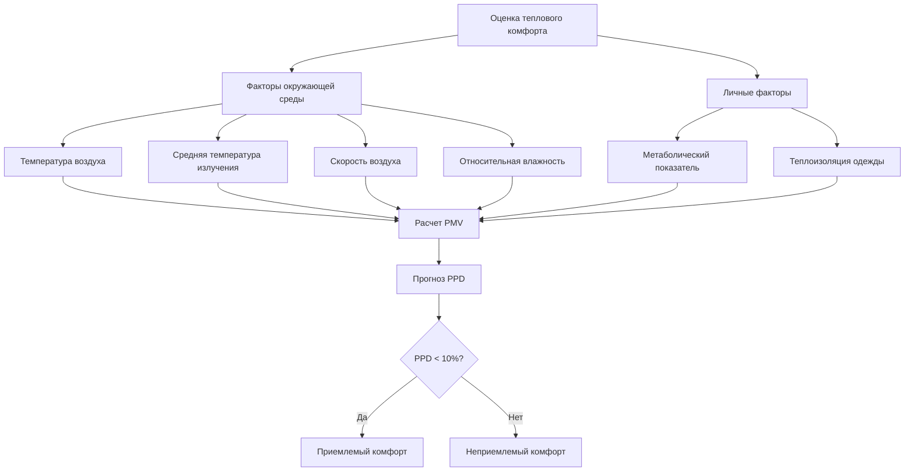

Стандарт ASHRAE 55 «Тепловые условия окружающей среды для занятости человека» определяет комбинации внутренних тепловых условий окружающей среды и личных факторов, которые обеспечивают приемлемые тепловые условия для большинства пользователей. Этот стандарт применяется к здоровым взрослым, занимающимся малоподвижной и умеренной физической активностью, и применяется к внутренним помещениям, предназначенным для пребывания человека более 15 минут.

## Параметры теплового комфорта

Оценка теплового комфорта требует шести основных параметров, разделенных на факторы окружающей среды и личные факторы.

**Параметры окружающей среды:**
- Температура воздуха (сухой термометр)
- Средняя температура излучения
- Скорость воздуха
- Относительная влажность

**Личные параметры:**
- Метаболический показатель (met)
- Теплоизоляция одежды (clo)

## Метаболический показатель

Метаболический показатель представляет производство энергии организмом в результате клеточного метаболизма, выраженное в единицах met, где 1 met = 58,2 Вт/м². Это соответствует метаболическому показателю неподвижного человека в состоянии покоя.

| Вид деятельности | Метаболический показатель (met) | Метаболический показатель (Вт/м²) |
|------------------|----------------------------------|-----------------------------------|
| Лежачее положение | 0,8 | 47 |
| Сидячее положение, спокойно | 1,0 | 58 |
| Сидячее положение, легкая работа (офис) | 1,2 | 70 |
| Стоячее положение, расслабленное | 1,2 | 70 |
| Легкая активность (медленная ходьба) | 1,6 | 93 |
| Средняя активность (ходьба 5 км/ч) | 2,0 | 116 |
| Высокая активность (упражнения) | 3,0-4,0 | 175-232 |

Метаболический показатель напрямую влияет на тепловое ощущение. Более высокие метаболические показатели увеличивают теплогенерацию, требуя более низких температур окружающей среды для поддержания теплового нейтралитета.

## Теплоизоляция одежды

Теплоизоляция одежды измеряется в единицах clo, где 1 clo = 0,155 м²·K/Вт. Это представляет теплоизоляцию, обеспечиваемую типичной деловой одеждой.

| Комплект одежды | Теплоизоляция (clo) | Теплоизоляция (м²·K/Вт) |
|-----------------|---------------------|------------------------|
| Без одежды | 0 | 0 |
| Шорты | 0,3 | 0,047 |
| Легкая летняя одежда | 0,5 | 0,078 |
| Типичный деловой костюм | 1,0 | 0,155 |
| Тяжелая зимняя домашняя одежда | 1,5 | 0,233 |

Значения теплоизоляции одежды суммируются. Каждый предмет одежды способствует общей теплоизоляции:

$$I_{cl,total} = \sum_{i=1}^{n} I_{cl,i}$$

Где $I_{cl,i}$ представляет теплоизоляцию каждого отдельного предмета одежды.

## Операционная температура

Операционная температура ($t_o$) объединяет температуру воздуха и среднюю температуру излучения в одно значение, представляя однородную температуру воображаемого ограждения, с которым пользователь обменивается теплом посредством излучения и конвекции в той же мере, что и в реальной среде.

При скорости воздуха менее 0,2 м/с:

$$t_o = \frac{t_a + t_r}{2}$$

При скорости воздуха от 0,2 до 0,6 м/с:

$$t_o = A \cdot t_a + (1-A) \cdot t_r$$

Где:
- $t_o$ = операционная температура (°C)
- $t_a$ = температура воздуха (°C)
- $t_r$ = средняя температура излучения (°C)
- $A$ = коэффициент, зависящий от скорости воздуха

Для большинства приложений проектирования HVAC с низким движением воздуха достаточен простой средний показатель. Операционная температура обеспечивает более значимый показатель для теплового комфорта, чем температура воздуха отдельно, особенно в помещениях со значительными источниками излучающего тепла или холодными поверхностями.

## Модели PMV и PPD

Модели Predicted Mean Vote (PMV) и Predicted Percentage Dissatisfied (PPD), разработанные П.О. Фангером и стандартизированные в ASHRAE 55 и ISO 7730, прогнозируют тепловое ощущение на основе установившегося теплового баланса.

### Расчет PMV

Уравнение PMV прогнозирует среднее тепловое ощущение по шкале теплового ощущения ASHRAE:

$$PMV = [0.303 \cdot e^{-0.036M} + 0.028] \cdot L$$

Где $L$ представляет тепловую нагрузку на организм:

$$L = (M - W) - 3.05 \times 10^{-3}[5733 - 6.99(M-W) - p_a]$$
$$- 0.42[(M-W) - 58.15] - 1.7 \times 10^{-5}M(5867 - p_a)$$
$$- 0.0014M(34 - t_a) - 3.96 \times 10^{-8}f_{cl}[(t_{cl} + 273)^4 - (t_r + 273)^4]$$
$$- f_{cl}h_c(t_{cl} - t_a)$$

Где:
- $M$ = метаболический показатель (Вт/м²)
- $W$ = внешняя работа (Вт/м²), обычно нулевая для большинства видов деятельности
- $p_a$ = парциальное давление водяного пара (Па)
- $t_a$ = температура воздуха (°C)
- $t_r$ = средняя температура излучения (°C)
- $t_{cl}$ = температура поверхности одежды (°C)
- $f_{cl}$ = коэффициент площади одежды
- $h_c$ = коэффициент конвективной теплопередачи (Вт/м²·K)

### Расчет PPD

PPD прогнозирует процент термически недовольных пользователей:

$$PPD = 100 - 95 \cdot e^{-(0.03353 \cdot PMV^4 + 0.2179 \cdot PMV^2)}$$

ASHRAE 55 требует PPD ≤ 10%, что соответствует -0,5 ≤ PMV ≤ +0,5 для приемлемой тепловой среды.

## Границы зоны комфорта

ASHRAE 55 определяет приемлемые диапазоны операционной температуры в зависимости от метаболического показателя, теплоизоляции одежды и влажности.

### Летние условия (0,5 clo)

| Уровень активности | Диапазон операционной температуры (°C) |
|-------------------|----------------------------------------|
| 1,0 met (сидячее положение) | 24,5 - 28,0 |
| 1,2 met (легкая активность) | 23,5 - 27,0 |

### Зимние условия (1,0 clo)

| Уровень активности | Диапазон операционной температуры (°C) |
|-------------------|----------------------------------------|
| 1,0 met (сидячее положение) | 20,0 - 23,5 |
| 1,2 met (легкая активность) | 19,0 - 22,5 |

**Ограничения по влажности:**
- Температура точки росы: 0°C - 18°C
- Относительная влажность: Нет верхнего предела для комфорта (конденсация и микробный рост ограничивают примерно 70%)

**Скорость воздуха:**
- Условие неподвижного воздуха: ≤ 0,15 м/с
- Повышенные скорости воздуха допускаются при более высоких температурах для увеличения охлаждающего эффекта

## Адаптивная модель комфорта

Для естественно кондиционируемых помещений ASHRAE 55 предоставляет адаптивную модель комфорта, признавая, что пользователи адаптируются к колебаниям наружного климата. Приемлемая операционная температура зависит от преобладающей средней наружной температуры:

$$t_{comf} = 0.31 \cdot t_{pma(out)} + 17.8$$

Где:
- $t_{comf}$ = температура комфорта (°C)
- $t_{pma(out)}$ = преобладающая средняя наружная температура воздуха (°C)

Приемлемые диапазоны расширяются на ±3,5°C от температуры комфорта для 80% приемлемости и ±2,5°C для 90% приемлемости. Эта модель применяется только к естественно кондиционируемым помещениям, где пользователи могут контролировать открываемые окна и отрегулировать одежду.

## Локальный тепловой дискомфорт

Помимо комфорта всего тела, ASHRAE 55 рассматривает факторы локального дискомфорта:

**Вертикальная разница температур воздуха:** Максимум 3°C между уровнем лодыжек (0,1 м) и уровнем головы (1,1 м) для сидящих пользователей.

**Асимметричность лучистой температуры:**
- Теплый потолок: < 5°C
- Холодная стена: < 10°C
- Холодный потолок: < 14°C
- Теплая стена: < 23°C

**Температура поверхности пола:** 19-29°C для занятых помещений с надлежащей обувью.

**Риск сквозняка:** Колебания скорости воздуха не должны превышать установленные пределы в зависимости от локальной интенсивности турбулентности и средней скорости воздуха во избежание ощущения сквозняка.

## Применение в проектировании HVAC

Соответствие ASHRAE 55 требует рассмотрения всех шести параметров теплового комфорта при проектировании. Системы HVAC должны поддерживать операционные температуры в приемлемых диапазонах при контроле влажности, минимизации сквозняков и ограничении асимметричности излучения. Стандарт допускает компромиссы между параметрами — повышенная скорость воздуха может компенсировать более высокие температуры, а более низкая влажность расширяет приемлемые температурные диапазоны.

Для механически кондиционируемых зданий проектировщики обычно нацеливаются на PMV = 0 (тепловой нейтралитет) с PPD ≤ 10%, обеспечивая удовлетворенность 90% пользователей. Критические приложения могут требовать более строгих критериев с PPD ≤ 6% (PMV в пределах ±0,35).
