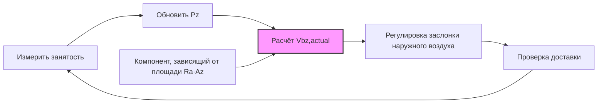

## Определение зоны дыхания

Зона дыхания составляет занятую область кондиционируемого помещения, в которой оценивается эффективность вентиляции. ASHRAE 62.1 определяет эту зону как объём между 75 см и 183 см над полом и на расстояние более 60 см от стен или стационарного оборудования кондиционирования воздуха. Это пространственное определение сосредоточивает анализ вентиляции на области, где люди фактически дышат, исключая объёмы на уровне пола и потолка, где качество воздуха имеет минимальное влияние на воздействие на человека.

Концепция зоны дыхания признаёт, что системы распределения воздуха не создают равномерные концентрации загрязняющих веществ во всём помещении. Стратификация температуры, характеристики струи приточного воздуха и расположение вытяжного воздуха создают градиенты концентрации, которые значительно варьируются от пола до потолка. Определение зоны дыхания устанавливает согласованную контрольную плоскость для оценки эффективности доставки наружного воздуха.

## Основное уравнение

Наружный воздухопровод зоны дыхания (Vbz) объединяет два независимых компонента вентиляции, адресующих различные источники загрязнения:

$$V_{bz} = R_p \cdot P_z + R_a \cdot A_z$$

Компонент, зависящий от людей (Rp · Pz), адресует биогазы, метаболический CO₂ и запахи, связанные с присутствием людей. Компонент, зависящий от площади (Ra · Az), адресует выбросы, связанные со зданием, от материалов, мебели, чистящих средств и технологических процессов. Этот двухкомпонентный подход признаёт, что качество воздуха в помещении зависит как от плотности занятости, так и от характеристик здания.

Уравнение производит детерминированные результаты, требующие четырёх входных параметров:
- Rp: норма наружного воздуха на одного человека (м³/ч на человека)
- Pz: численность зоны (люди)
- Ra: норма наружного воздуха на единицу площади (м³/ч на м²)
- Az: площадь пола зоны (м²)

## Таблицы норм вентиляции

Стандарт ASHRAE 62.1, таблица 6-1, определяет минимальные значения Rp и Ra для 63 категорий занятости, охватывающих коммерческие, учебные, жилые и промышленные типы зданий. Таблица организует категории по основной функции, признавая, что различные виды деятельности генерируют различные профили загрязняющих веществ.

### Избранные нормы вентиляции

| Категория занятости | Rp (м³/ч на человека) | Ra (м³/ч·м²) | Плотность населения по умолчанию (люди на 100 м²) |
|-------------------|-----------------|--------------|-------------------------------------------|
| Офис — комната отдыха | 2.83 | 0.065 | 2.69 |
| Офис — конференц-зал/переговорная | 2.83 | 0.032 | 5.38 |
| Офис — главный вход в атриум | 2.83 | 0.032 | 1.08 |
| Офис — открытый офис | 2.83 | 0.032 | 0.54 |
| Класс — возраст 5-8 лет | 5.66 | 0.065 | 2.69 |
| Класс — возраст 9+ лет | 5.66 | 0.065 | 3.77 |
| Торговля — отдел продаж | 4.25 | 0.065 | 1.62 |
| Торговля — общая площадь торгового центра | 4.25 | 0.032 | 4.30 |
| Ресторан — обеденный зал | 4.25 | 0.097 | 7.53 |
| Ресторан — кафетерий/быстрое питание | 4.25 | 0.097 | 10.76 |
| Спортзал — игровая площадка | 11.33 | 0.032 | 3.23 |
| Спортзал — зрительская площадка | 4.25 | 0.032 | 16.15 |
| Отель — спальня/люкс | 2.83 | 0.032 | 1.08 |
| Отель — атриум/предварительная функция | 4.25 | 0.032 | 3.23 |
| Театр — аудитория | 2.83 | 0.032 | 16.15 |
| Библиотека — читальный зал | 2.83 | 0.065 | 1.08 |

Таблица показывает систематические закономерности в назначении норм. Помещения с интенсивной метаболической активностью (спортзалы, залы для упражнений) получают повышенные значения Rp, отражающие повышенное производство биогазов. Помещения со значительными выбросами материалов (розничная торговля, столовые) получают повышенные значения Ra, учитывающие выделение газов из продуктов и загрязняющие вещества технологических процессов.

## Анализ компонента, зависящего от людей

Компонент, зависящий от людей, адресует загрязняющие вещества, генерируемые человеческим метаболизмом и деятельностью. Взрослые люди в состоянии покоя производят примерно 0,3 л/мин CO₂, увеличиваясь до 2-3 л/мин во время интенсивных упражнений. Метаболическая активность также генерирует тепло, влагу и биогазы, включая летучие органические соединения из дыхания и эманации с поверхности кожи.

Член Rp · Pz рассчитывает наружный воздухопровод, необходимый для разбавления загрязняющих веществ, связанных с людьми, до приемлемых концентраций. Расчёт предполагает стационарные условия, при которых генерирование загрязняющих веществ равно удалению через наружный воздухопровод вентиляции плюс любая очистка воздуха. Значения Rp в таблице 6-1 получены из исследований, коррелирующих недовольство присутствующих людей с нормами вентиляции, устанавливающих эмпирические связи между воздушным потоком и воспринимаемым качеством воздуха.

**Пример — конференц-зал:**

Конференц-зал площадью 55,7 м² вмещает 30 человек (5,38 человек на 100 м²):
- Rp = 2,83 м³/ч на человека
- Pz = 30 человек

Компонент, зависящий от людей:
$$R_p \cdot P_z = 2,83 \times 30 = 84,9\ \text{м³/ч}$$

Этот воздушный поток поддерживает концентрацию CO₂ ниже 700 мл/л выше наружных уровней (примерно 1100 млн⁻¹ в целом с исходным уровнем наружного воздуха 400 млн⁻¹).

## Анализ компонента, зависящего от площади

Компонент, зависящий от площади, адресует выбросы от строительных материалов, мебели, оборудования и чистящих средств. Новые здания выделяют значительно более высокие нагрузки загрязняющих веществ, чем более старые здания, хотя выбор материалов и вентиляция во время строительства могут снизить начальные концентрации. Ковровое покрытие, краска, клеи и композитные изделия из дерева представляют основные источники выбросов.

Член Ra · Az обеспечивает базовую вентиляцию независимо от занятости, обеспечивая адекватное разбавление источников, связанных со зданием. Значения Ra отражают типичные нормы выбросов для различных категорий помещений, с повышенными значениями, назначаемыми помещениям с интенсивным использованием материалов или выбросами технологических процессов.

**Пример — конференц-зал (продолжение):**

Для того же конференц-зала площадью 55,7 м²:
- Ra = 0,032 м³/ч·м²
- Az = 55,7 м²

Компонент, зависящий от площади:
$$R_a \cdot A_z = 0,032 \times 55,7 = 1,78\ \text{м³/ч}$$

Общий наружный воздухопровод зоны дыхания:
$$V_{bz} = 84,9 + 1,78 = 86,7\ \text{м³/ч}$$

Компонент, зависящий от людей, преобладает (98% от итога) благодаря высокой плотности людей, типичной для конференц-залов.

## Рассмотрения плотности занятости

Значения плотности населения по умолчанию в таблице 6-1 обеспечивают типичное руководство по проектированию, когда конкретные данные о занятости недоступны. Конструкторы могут использовать фактически ожидаемые плотности, когда они документированы программой строительства или требованиями кодекса. Более высокие плотности увеличивают компонент, зависящий от людей, пропорционально, оставляя компонент, зависящий от площади, неизменным.

Связь между плотностью занятости и общей Vbz следует:

$$V_{bz} = R_p \cdot \left(\frac{\rho \cdot A_z}{100}\right) + R_a \cdot A_z = \left(\frac{R_p \cdot \rho}{100} + R_a\right) \cdot A_z$$

Где ρ представляет плотность занятости в люди/100 м². Эта формулировка показывает, что общая норма вентиляции на единицу площади увеличивается линейно с плотностью занятости.

**Пример влияния плотности:**

Для открытого офиса площадью 92,9 м² с различными плотностями:

| Сценарий | Плотность (люди на 100 м²) | Pz | Компонент, зависящий от людей (м³/ч) | Компонент, зависящий от площади (м³/ч) | Общий Vbz (м³/ч) | Удельная норма (м³/ч·м²) |
|----------|---------------------------|----|-----------------------|---------------------|-----------------|-------------------|
| Низкая плотность | 0,54 | 0,5 | 1,42 | 2,97 | 4,39 | 0,047 |
| По умолчанию | 1,08 | 1 | 2,83 | 2,97 | 5,80 | 0,062 |
| Высокая плотность | 1,62 | 1,5 | 4,25 | 2,97 | 7,22 | 0,078 |
| Очень высокая | 2,15 | 2 | 5,66 | 2,97 | 8,63 | 0,093 |

Удвоение занятости с 0,54 до 1,08 человек/100 м² увеличивает общую вентиляцию на 32%, в то время как учетверение плотности увеличивает требования на 96%.

## Приложения с переменной занятостью

Помещения с высоко переменной занятостью выигрывают от стратегий вентиляции, управляемой спросом (DCV), которые регулируют расчёты Vbz на основе фактически измеренной занятости. Датчики CO₂ или счётчики занятости обеспечивают данные в реальном времени, обеспечивая динамическую корректировку Pz:

$$V_{bz,actual} = R_p \cdot P_{z,measured} + R_a \cdot A_z$$

Компонент, зависящий от площади, остаётся постоянным, в то время как компонент, зависящий от людей, варьируется в зависимости от занятости. Этот подход поддерживает минимальную вентиляцию в соответствии с кодексом в периоды низкой занятости, обеспечивая адекватный наружный воздух при увеличении занятости.

Контрольный цикл постоянно регулирует доставку наружного воздуха в соответствии с фактическими требованиями вентиляции, снижая энергопотребление при поддержании качества воздуха в помещении.

## Атипичные категории занятости

Некоторые типы помещений отступают от стандартных закономерностей Rp и Ra. Камеры исправительных учреждений получают минимум 2,83 м³/ч на человека, несмотря на непрерывную занятость, отражая повышенные ограничения безопасности на системы наружного воздуха. Комнаты для курения, хотя и редко встречаются, получают повышенные нормы 33,96 м³/ч на человека, адресуя продукты горения табака. Помещения, вмещающие животных, используют специализированные нормы на основе типа животного и плотности.

Помещения с высокой занятостью транзитного характера, включая аудитории, театры и терминалы транспорта, используют повышенные плотности по умолчанию (10,76-16,15 человек на 100 м²), сохраняя умеренные значения Rp (2,83-4,25 м³/ч на человека). Эта комбинация признаёт интенсивную кратковременную занятость без пропорционального увеличения выбросов материалов.

## Процедура расчёта

Систематический процесс расчёта следует:

1. Определить категорию занятости из таблицы 6-1
2. Извлечь значения Rp и Ra для категории
3. Определить площадь пола зоны Az из архитектурных чертежей
4. Установить численность зоны Pz из плотности по умолчанию или документированной занятости
5. Рассчитать компонент, зависящий от людей: Rp · Pz
6. Рассчитать компонент, зависящий от площади: Ra · Az
7. Суммировать компоненты для получения Vbz

Эта детерминированная процедура производит согласованные результаты у различных конструкторов и проектов, поддерживая соблюдение кодекса и взаимную проверку.

## Связанные темы

- [Процедура определения норм вентиляции](../ventilation-rate-procedure/)
- [Эффективность распределения воздуха в зоне](../zone-air-distribution-effectiveness/)
- [Эффективность вентиляции зоны с несколькими помещениями](../multiple-zone-ventilation-efficiency/)
- Системы вентиляции, управляемые спросом
- Мониторинг и контроль CO₂
- Технологии определения занятости
