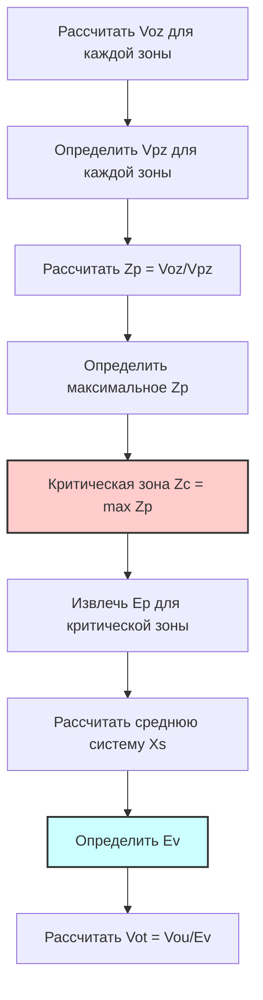

## Концепция эффективности системы

Эффективность вентиляции системы (Ev) количественно определяет, насколько эффективно многозонная система распределяет наружный воздух в отдельные зоны в соответствии с их требованиями. Безразмерный коэффициент учитывает физическую реальность того, что системы, обслуживающие зоны с различными долями наружного воздуха, не могут достичь идеального распределения—зона, требующая наибольшей доли наружного воздуха (критическая зона), определяет поступление наружного воздуха в систему, что приводит к чрезмерной вентиляции зон с более низкими требованиями.

Значение Ev представляет отношение минимальной доли наружного воздуха в первичном воздухе зоны к доле наружного воздуха системы в критической зоне. Значения менее 1,0 указывают на неэффективность распределения, требующую дополнительного поступления наружного воздуха в систему, превышающего простую сумму требований зон. Однозонные системы и многозонные системы, в которых все зоны имеют одинаковые доли наружного воздуха, достигают Ev = 1,0, не требуя дополнительного наружного воздуха.

## Основные уравнения

Некорректированное поступление наружного воздуха суммирует отдельные требования зон:

$$V_{ou} = D \cdot \sum_{all\ zones} V_{oz}$$

Где D представляет коэффициент разнообразия (обычно 1,0, если документированные колебания занятости не позволяют снижение). Это суммирование предполагает идеальное распределение, при котором каждая зона получает ровно требуемый ей наружный воздушный поток.

Эффективность вентиляции системы следует:

$$E_v = \frac{1 + X_s - Z_c}{1 + X_s - Z_c \cdot E_p}$$

Где:
- Xs = средняя доля наружного воздуха в системе = Vou / Vps
- Zc = доля наружного воздуха критической зоны = max(Zp) для всех зон
- Ep = доля первичного воздуха зоны в критической зоне
- Vps = общий первичный воздушный поток системы (сумма всех первичных воздушных потоков зон)

Корректированное поступление наружного воздуха в систему учитывает неэффективность распределения:

$$V_{ot} = \frac{V_{ou}}{E_v}$$

Это значение представляет фактический наружный воздух, необходимый во входе системы для удовлетворения требований всех зон при неидеальном распределении.

## Определение критической зоны

Критическая зона характеризуется наибольшей долей наружного воздуха в первичном воздухе зоны (Zp), рассчитываемой для каждой зоны как:

$$Z_p = \frac{V_{oz}}{V_{pz}}$$

Где Vpz представляет первичный воздушный поток зоны—наружный воздух и рециркуляционный воздух, подаваемые из приточной установки, исключая любой перетекающий воздух из соседних зон или рециркуляционный воздух из той же зоны. Для VAV-систем Vpz варьируется от минимального до расчетного значения в зависимости от тепловых нагрузок.

Критическое состояние обычно возникает при минимальном воздушном потоке, когда доли наружного воздуха достигают максимальных значений. Стандарт требует оценки Zp при условии, производящем наибольшее отношение—обычно минимальный поток для VAV-систем, расчетный поток для систем с постоянным объемом.

Блок-схема иллюстрирует систематическую процедуру определения критической зоны и расчета эффективности системы.

## Доля первичного воздуха зоны (Ep)

Доля первичного воздуха зоны (Ep) в критической зоне представляет отношение минимального к расчетному первичному воздушному потоку для VAV-систем:

$$E_p = \frac{V_{pz,min}}{V_{pz,design}}$$

Для систем с постоянным объемом Ep = 1,0, так как первичный воздушный поток остается постоянным. Для VAV-систем Ep обычно колеблется от 0,3 до 0,5 в зависимости от установок минимального воздушного потока. Более низкие значения Ep указывают на больший диапазон регулирования, что обычно снижает Ev и требует более высокого поступления наружного воздуха в систему.

Взаимосвязь между Ep и Ev следует обратным закономерностям. Более низкие значения Ep (больший диапазон регулирования) снижают Ev, поскольку высокая доля наружного воздуха при минимальном потоке создает большие расхождения между требованиями критической зоны и других зон. Более высокие значения Ep (ограниченный диапазон регулирования) улучшают Ev, уменьшая распределение долей наружного воздуха в различных условиях эксплуатации.

## Средняя доля наружного воздуха в системе

Средняя доля наружного воздуха в системе (Xs) представляет отношение некорректированного поступления наружного воздуха к общему первичному воздушному потоку системы:

$$X_s = \frac{V_{ou}}{V_{ps}}$$

Где Vps суммирует все первичные воздушные потоки зон:

$$V_{ps} = \sum_{all\ zones} V_{pz}$$

Для VAV-систем расчет использует минимальные первичные воздушные потоки, так как критические условия возникают при минимальном потоке. Расчет Xs устанавливает базовую долю наружного воздуха перед коррекцией на неэффективность распределения.

## Примеры расчета эффективности

**Пример 1 - Трехзонная VAV-система:**

Рассмотрим VAV-систему, обслуживающую три офисные зоны с одинаковыми требованиями к вентиляции, но разными размерами:

| Зона | Az (м²) | Pz | Vbz (м³/ч) | Ez | Voz (м³/ч) | Vpz,min (м³/ч) | Vpz,design (м³/ч) | Ep |
|------|---------|----|-----------|----|------------|-----------------|-------------------|-----|
| 1 | 140 | 15 | 280 | 1.0 | 280 | 510 | 1,275 | 0.40 |
| 2 | 186 | 20 | 373 | 1.0 | 373 | 680 | 1,700 | 0.40 |
| 3 | 93 | 10 | 187 | 1.0 | 187 | 340 | 850 | 0.40 |

Шаг 1 - Рассчитать доли наружного воздуха в первичном воздухе зоны:
- Z1 = 280/510 = 0,550
- Z2 = 373/680 = 0,550
- Z3 = 187/340 = 0,550

Шаг 2 - Определить критическую зону (все зоны равны):
$$Z_c = 0,550$$

Шаг 3 - Рассчитать некорректированное поступление наружного воздуха:
$$V_{ou} = 280 + 373 + 187 = 840\ \text{м³/ч}$$

Шаг 4 - Рассчитать общий первичный воздушный поток:
$$V_{ps} = 510 + 680 + 340 = 1,530\ \text{м³/ч}$$

Шаг 5 - Рассчитать среднюю долю наружного воздуха в системе:
$$X_s = \frac{840}{1,530} = 0,550$$

Шаг 6 - Рассчитать эффективность вентиляции системы:
$$E_v = \frac{1 + 0,550 - 0,550}{1 + 0,550 - 0,550 \times 0,40} = \frac{1,0}{1,33} = 0,752$$

Шаг 7 - Рассчитать поступление наружного воздуха в систему:
$$V_{ot} = \frac{840}{0,752} = 1,118\ \text{м³/ч}$$

Система требует поступления 1,118 м³/ч наружного воздуха, на 33% больше, чем сумма требований зон, из-за неэффективности распределения.

**Пример 2 - VAV-система смешанного назначения:**

Рассмотрим систему, обслуживающую различные типы помещений с разными требованиями к наружному воздуху:

| Зона | Тип | Az (м²) | Pz | Vbz (м³/ч) | Ez | Voz (м³/ч) | Vpz,min (м³/ч) | Vpz,design (м³/ч) | Zp | Ep |
|------|-----|---------|----|-----------|----|------------|-----------------|-------------------|----|----|
| 1 | Офис | 186 | 20 | 373 | 1.0 | 373 | 850 | 2,040 | 0.440 | 0.417 |
| 2 | Конференция | 56 | 30 | 316 | 1.0 | 316 | 680 | 1,360 | 0.465 | 0.500 |
| 3 | Комната отдыха | 37 | 10 | 166 | 1.0 | 166 | 425 | 850 | 0.392 | 0.500 |

Шаг 1 - Определить критическую зону:
$$Z_c = \max(0,440; 0,465; 0,392) = 0,465\ \text{(Зона 2)}$$

Критическая зона Ep = 0,500

Шаг 2 - Рассчитать итоги:
$$V_{ou} = 373 + 316 + 166 = 855\ \text{м³/ч}$$
$$V_{ps} = 850 + 680 + 425 = 1,955\ \text{м³/ч}$$
$$X_s = \frac{855}{1,955} = 0,438$$

Шаг 3 - Рассчитать эффективность:
$$E_v = \frac{1 + 0,438 - 0,465}{1 + 0,438 - 0,465 \times 0,500} = \frac{0,973}{1,206} = 0,807$$

Шаг 4 - Рассчитать поступление наружного воздуха в систему:
$$V_{ot} = \frac{855}{0,807} = 1,060\ \text{м³/ч}$$

Система требует поступления 1,060 м³/ч, на 24% выше суммированных требований зон. Более высокая эффективность (0,807 в сравнении с 0,752 в Примере 1) получается в результате меньшего разброса значений Zp среди зон.

## Влияние параметров проектирования

Несколько параметров проектирования значительно влияют на Ev и результирующие требования к поступлению наружного воздуха в систему:

### Соотношения минимального воздушного потока

Более низкие соотношения минимального воздушного потока (более низкий Ep) снижают Ev:

| Значение Ep | Ev (для Zc=0,55, Xs=0,55) | Соотношение Vot/Vou |
|-------------|---------------------------|---------------------|
| 0,30 | 0,690 | 1,45 |
| 0,40 | 0,752 | 1,33 |
| 0,50 | 0,810 | 1,23 |
| 0,60 | 0,864 | 1,16 |
| 1,00 (ПО) | 1,000 | 1,00 |

Более низкие диапазоны регулирования требуют на 16-45% дополнительного наружного воздуха в сравнении с системами с постоянным объемом.

### Разброс доли наружного воздуха в зоне

Системы с аналогичными значениями Zp среди зон достигают более высокий Ev:

| Диапазон Zp | Критическое Zc | Xs | Ep | Ev |
|-------------|---------------|----|----|----|
| 0,50-0,52 | 0,52 | 0,51 | 0,40 | 0,961 |
| 0,40-0,60 | 0,60 | 0,50 | 0,40 | 0,833 |
| 0,30-0,70 | 0,70 | 0,50 | 0,40 | 0,750 |

Однородные требования к наружному воздуху минимизируют неэффективность распределения.

## Стратегии проектирования для улучшения эффективности

Проектировщики могут использовать несколько стратегий для улучшения Ev и снижения поступления наружного воздуха в систему:

### 1. Группирование зон

Группировка зон с аналогичными долями наружного воздуха в общие системы. Отделение зон с высокими требованиями (комнаты для переговоров, спортзалы) от зон с низкими требованиями (хранилища, механические помещения) для снижения разброса Zp в каждой системе.

### 2. Системы с выделенным наружным воздухом

Разделение вентиляции от тепловых нагрузок с использованием систем с выделенным наружным воздухом (DOAS). Эти системы подают 100% наружный воздух всем зонам пропорционально их требованиям, исключая неэффективность распределения (Ev = 1,0).

### 3. Увеличенные минимальные воздушные потоки

Повышение установок минимального воздушного потока (увеличение Ep) для снижения изменения доли наружного воздуха. Этот подход взаимообменивает энергию вентилятора на снижение нагрузок на отопление/охлаждение наружного воздуха.

### 4. Перетекающий воздух

Использование перетекающего воздуха из зон с избыточным наружным воздухом для подачи в соседние зоны, снижая их прямые требования к наружному воздуху и улучшая системный Ev.

## Системы с постоянным объемом

Системы с постоянным объемом достигают Ev = 1,0 при непрерывной работе всех зон. Неизменяющиеся соотношения воздушных потоков исключают неэффективность распределения, которая беспокоит VAV-системы. Однако системы с постоянным объемом потребляют больше энергии вентилятора и могут чрезмерно вентилировать помещения при неполной занятости.

Упрощенный расчет для систем с постоянным объемом:

$$V_{ot} = V_{ou} = \sum_{all\ zones} V_{oz}$$

Коррекция эффективности не требуется, упрощая управление наружным воздухом и снижая поступление наружного воздуха в систему в сравнении с эквивалентными VAV-системами.

## Динамическая эффективность системы

VAV-системы испытывают изменяющуюся Ev при модуляции воздушных потоков зон с тепловыми нагрузками. Критическая зона может перемещаться между помещениями при изменении нагрузок, усложняя управление наружным воздухом. Продвинутые системы управления рассчитывают Ev непрерывно на основе измеренных воздушных потоков и долей наружного воздуха, регулируя поступление системы для поддержания минимальной вентиляции при всех условиях.

Динамический расчет требует:
1. Измерить Vpz для каждой зоны
2. Рассчитать текущий Zp для каждой зоны
3. Определить текущую критическую зону
4. Рассчитать текущий Ev
5. Отрегулировать поступление наружного воздуха в систему для поддержания Vot

Этот подход реального времени оптимизирует подачу наружного воздуха, снижая энергопотребление при обеспечении соответствия кодексу.

## Последствия для потребления энергии

Низкие значения Ev существенно увеличивают нагрузки на отопление и охлаждение наружного воздуха. Для системы с Ev = 0,75 в сравнении с Ev = 1,0:

Дополнительный наружный воздух = 33%
Дополнительная нагрузка наружного воздуха = 33%

В системе на 170,000 м³/ч с базовым требованием 34,000 м³/ч:
- Ev = 1,0: Vot = 34,000 м³/ч
- Ev = 0,75: Vot = 45,333 м³/ч
- Дополнительная нагрузка: 11,333 м³/ч, требующая отопления/охлаждения

Этот дополнительный воздушный поток пропорционально увеличивает годовое энергопотребление, подчеркивая важность эффективного проектирования системы.

## Связанные темы

- [Процедура расчета вентиляции](../ventilation-rate-procedure/)
- [Наружный воздушный поток в дыхательной зоне](../breathing-zone-outdoor-airflow/)
- [Эффективность распределения воздуха в зоне](../zone-air-distribution-effectiveness/)
- Проектирование и управление VAV-системами
- Системы с выделенным наружным воздухом
- Методы анализа критической зоны
