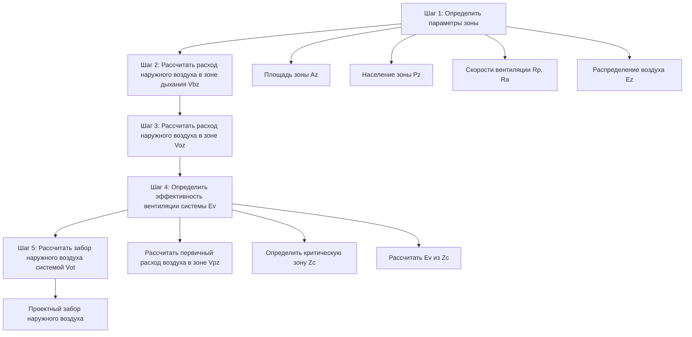

## Обзор процедуры

Процедура расчета скорости вентиляции (VRP) обеспечивает нормативную методологию для расчета минимальных требований к наружному воздуху в механически вентилируемых коммерческих зданиях. Процедура определяет расход наружного воздуха на трех различных уровнях: зона дыхания, зона подачи и забор наружного воздуха системой. Каждый этап расчета учитывает факторы, отражающие характеристики распределения воздуха, конфигурацию системы и эксплуатационное разнообразие.

VRP применяется к системам с постоянным и переменным расходом воздуха, конфигурациям одной и нескольких зон, а также системам с рециркуляцией воздуха и без нее. Процедура предусматривает трансферный воздух, вентиляцию с управлением по требованию и системы рекуперации энергии посредством специальных модификаций расчета. Методология дает детерминированные результаты, основанные на плотности заселения, площади пола, функции помещения и архитектуре системы.

## Последовательность расчета

VRP следует систематической пятиэтапной последовательности, переходящей от требований отдельной зоны к общему забору наружного воздуха системой:

Каждый шаг основывается на предыдущих расчетах, устанавливая детерминированный путь от характеристик помещения к требованиям проектирования системы. Последовательность обеспечивает систематическое рассмотрение всех факторов, влияющих на доставку наружного воздуха.

## Шаг 1: Параметры зоны

Первоначальный шаг собирает основные характеристики зоны из архитектурных данных и данных о заселении. Площадь пола зоны (Az) берется из строительных чертежей, исключая незанятые помещения, такие как механические помещения и складские площади. Население зоны (Pz) представляет проектное заселение, обычно полученное из строительных кодексов или требований программы собственника.

Скорости вентиляции на человека (Rp) и на единицу площади (Ra) получаются из табл. 6-1 ASHRAE 62.1 в зависимости от категории заселения. Типичные значения включают:

| Категория заселения | Rp (м³/ч на человека) | Ra (м³/ч на м²) |
|-------------------|-----------------|--------------|
| Офисное помещение | 8.5 | 0.65 |
| Переговорная | 8.5 | 0.65 |
| Класс | 17 | 1.3 |
| Розничная торговля | 12.8 | 1.3 |
| Ресторан (обеденная зона) | 12.8 | 1.95 |
| Спортивный зал | 34 | 0.65 |

Эффективность распределения воздуха (Ez) определяется из табл. 6-2 в зависимости от типа системы и режима работы. Типичные значения колеблются от 0,8 для верхних смесительных систем при охлаждении до 1,2 для вентиляции с вытеснением воздуха снизу с тепловыми шлейфами.

## Шаг 2: Расход наружного воздуха в зоне дыхания

Расчет расхода наружного воздуха в зоне дыхания (Vbz) объединяет компоненты на основе людей и площади, используя основное уравнение:

$$V_{bz} = R_p \cdot P_z + R_a \cdot A_z$$

Это уравнение устанавливает минимальное требование к наружному воздуху в зоне дыхания — области внутри занятого помещения между 0,75 м и 1,8 м над полом и более чем на 0,6 м от стен или стационарного оборудования кондиционирования.

**Пример расчета:**

Для офисного помещения площадью 185 м² с 20 занятыми:
- Rp = 8,5 м³/ч на человека
- Ra = 0,65 м³/ч на м²
- Az = 185 м²
- Pz = 20 человек

$$V_{bz} = 8.5 \times 20 + 0.65 \times 185 = 170 + 120 = 290\ \text{м³/ч}$$

Зона дыхания требует 290 м³/ч наружного воздуха для поддержания приемлемого качества внутреннего воздуха.

## Шаг 3: Расход наружного воздуха в зоне

Расход наружного воздуха в зоне (Voz) учитывает эффективность распределения воздуха, признавая, что не весь подаваемый наружный воздух достигает зоны дыхания:

$$V_{oz} = \frac{V_{bz}}{E_z}$$

Для примера офиса с верхней смесительной подачей (Ez = 1,0 при отоплении/охлаждении):

$$V_{oz} = \frac{290}{1.0} = 290\ \text{м³/ч}$$

Если помещение использует потолочную подачу с половым возвратом при охлаждении (Ez = 0,8):

$$V_{oz} = \frac{290}{0.8} = 362\ \text{м³/ч}$$

Плохие характеристики смешивания требуют на 25% больше наружного воздуха при подаче в зону, чтобы достичь той же концентрации в зоне дыхания.

## Шаг 4: Эффективность вентиляции системы

Для многозонных систем расчет эффективности вентиляции системы (Ev) требует определения доли первичного наружного воздуха в зоне для каждой зоны:

$$Z_p = \frac{V_{oz}}{V_{pz}}$$

Где Vpz представляет первичный расход воздуха в зоне — наружный воздух и рециркулируемый воздух из приточной установки, исключая трансферный воздух или рециркулируемый воздух из той же зоны. Критическая зона демонстрирует наибольшее значение Zp:

$$Z_c = \max(Z_{p,\text{все зоны}})$$

Некорректированный забор наружного воздуха суммирует все требования зон:

$$V_{ou} = D \cdot \sum_{\text{все зоны}} V_{oz}$$

Коэффициент разнообразия D обычно равен 1,0, если не задокументированы вариации заселения. Эффективность вентиляции системы следующая:

$$E_v = \frac{1 + X_s - Z_c}{1 + X_s - Z_c \cdot E_p}$$

Где Xs представляет среднюю долю наружного воздуха в системе, а Ep обозначает долю первичного воздуха в зоне в критической зоне (обычно 1,0 для систем с постоянным расходом или отношение минимального расхода к проектному первичному расходу для VAV систем).

## Шаг 5: Забор наружного воздуха системой

Окончательный расчет определяет забор наружного воздуха системой:

$$V_{ot} = \frac{V_{ou}}{E_v}$$

Это значение представляет минимальный наружный воздух, необходимый при заборе системы для удовлетворения всех требований зон с учетом неравномерного распределения по системе.

**Пример многозонной системы:**

Рассмотрите VAV систему, обслуживающую три зоны:

| Зона | Az (м²) | Pz | Vbz (м³/ч) | Ez | Voz (м³/ч) | Vpz,мин (м³/ч) | Vpz,проект (м³/ч) |
|------|----------|----|-----------|----|-----------|---------------|------------------|
| 1 | 139 | 15 | 224 | 1.0 | 224 | 509 | 1018 |
| 2 | 186 | 20 | 298 | 1.0 | 298 | 679 | 1359 |
| 3 | 93 | 10 | 149 | 1.0 | 149 | 340 | 679 |

$$V_{ou} = 224 + 298 + 149 = 671\ \text{м³/ч}$$

Доли первичного наружного воздуха в зоне при минимальном расходе:
- Z1 = 224/509 = 0,44
- Z2 = 298/679 = 0,44
- Z3 = 149/340 = 0,44

Критическая зона: Все зоны равны (Zc = 0,44)

Предполагая Xs = 0,25 и Ep = 509/1018 = 0,5 для всех зон:

$$E_v = \frac{1 + 0.25 - 0.44}{1 + 0.25 - 0.44 \times 0.5} = \frac{0.81}{1.03} = 0.787$$

$$V_{ot} = \frac{671}{0.787} = 852\ \text{м³/ч}$$

Система требует забора наружного воздуха 852 м³/ч, на 27% больше суммы требований зон из-за неэффективности распределения.

## Специальные применения

Однозонные системы или многозонные системы с идентичными значениями Zp во всех зонах достигают Ev = 1,0, требуя забора наружного воздуха, равного требованиям зон. Системы со 100% наружным воздухом (без рециркуляции) автоматически удовлетворяют требованиям VRP, если общий расход подачи воздуха соответствует или превышает Vou.

Системы вентиляции с управлением по требованию используют датчики занятости или мониторинг CO₂ для регулировки Vot в зависимости от фактического заселения. Стандарт позволяет снизить Pz в расчете Vbz до измеренных значений, пропорционально снижая забор наружного воздуха. Этот подход дает значительную экономию энергии в помещениях с высокой переменной заселением.

Трансферный воздух из соседних зон с классификацией Класс 2 может заменить наружный воздух в принимающих зонах, снижая Vot. Расчет вычитает расход трансферного воздуха из Voz в принимающих зонах, при условии, что трансферный воздух не может превышать требование наружного воздуха в зоне.

## Реализация проекта

Проектировщики определяют минимальные положения задвижек наружного воздуха для подачи Vot при всех условиях работы. Системы с переменным расходом требуют измерения и управления расходом наружного воздуха для поддержания минимального Vot при изменении расхода подачи. Управление экономайзером интегрируется с требованиями минимальной вентиляции, обеспечивая доставку Vot при работе экономайзера.

Надлежащее внедрение VRP требует проверки балансировки воздуха о том, что проектный расход наружного воздуха достигает каждой зоны. Процедуры испытания и балансировки измеряют забор наружного воздуха, проверяют последовательности управления задвижками и подтверждают скорости вентиляции в зонах при минимальном и проектном расходах.

## Связанные темы

- [Расход наружного воздуха в зоне дыхания](../breathing-zone-outdoor-airflow/)
- [Эффективность распределения воздуха в зоне](../zone-air-distribution-effectiveness/)
- [Эффективность вентиляции многозонной системы](../multiple-zone-ventilation-efficiency/)
- Вентиляция с управлением по требованию
- Анализ критической зоны
- Управление наружным воздухом VAV системы
