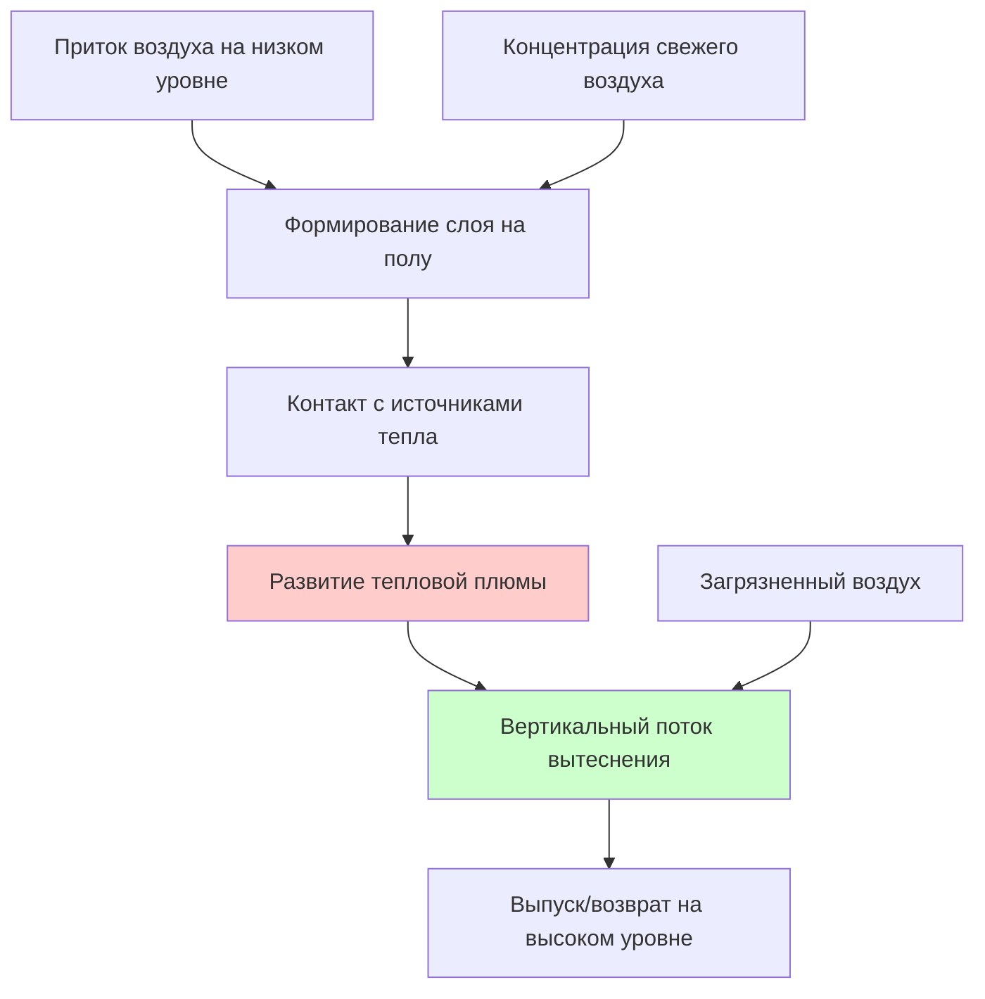

## Определение эффективности

Эффективность распределения воздуха в зоне (Ez) количественно определяет, насколько эффективно поступающий наружный воздух достигает дыхательной зоны относительно условий идеального смешивания. Безразмерный коэффициент представляет отношение концентрации наружного воздуха в дыхательной зоне к концентрации наружного воздуха в приточном воздухе. Значения менее 1,0 указывают на неполное смешивание, при котором концентрации в дыхательной зоне ниже концентраций в приточном воздухе. Значения больше 1,0 указывают на улучшенную доставку, когда расслоение или схемы распределения воздуха концентрируют наружный воздух в дыхательной зоне.

Коэффициент Ez учитывает физическую реальность того, что системы распределения воздуха создают неоднородные поля концентраций в кондиционируемых помещениях. Разности температур, импульс приточного воздуха, расположение воздуха на выход и распределение источников тепла — все это влияет на эффективность смешивания. Стандарт назначает значения Ez на основе конфигурации системы и режима работы, признавая предсказуемые закономерности в производительности распределения воздуха.

## Математическая основа

Расчет притока наружного воздуха в зону включает Ez для регулировки требований дыхательной зоны:

$$V_{oz} = \frac{V_{bz}}{E_z}$$

Где:
- Voz = приток наружного воздуха в зону у устройства подачи воздуха (м³/ч)
- Vbz = требуемый приток наружного воздуха в дыхательную зону (м³/ч)
- Ez = эффективность распределения воздуха в зоне (безразмерная величина)

Эта взаимосвязь устанавливает, что плохое распределение воздуха (Ez < 1,0) требует пропорционально более высокого притока наружного воздуха для достижения целевых концентраций в дыхательной зоне. И наоборот, улучшенное распределение (Ez > 1,0) позволяет снизить долю приточного наружного воздуха при сохранении качества дыхательной зоны.

Доля наружного воздуха на подаче в зону следует:

$$Z_{oz} = \frac{V_{oz}}{V_z} = \frac{V_{bz}}{E_z \cdot V_z}$$

Где Vz представляет общий приток воздуха в зону. Более низкие значения Ez требуют более высоких долей наружного воздуха в зоне, увеличивая требования системы к наружному воздуху и потребление энергии.

## Стандартные значения Ez

ASHRAE 62.1, таблица 6-2, указывает значения Ez для типичных конфигураций систем:

| Конфигурация системы | Распределение воздуха | Значение Ez |
|---------------------|----------------------|-------------|
| Подача с потолка, возврат в потолок | Смешивание | 1,0 |
| Подача с потолка, возврат в пол/низкий уровень | Режим охлаждения | 0,8 |
| Подача с потолка, возврат в пол/низкий уровень | Режим отопления | 1,0 |
| Подача с пола, возврат в потолок | Режим охлаждения | 1,0 |
| Подача с пола, возврат в потолок | Режим отопления | 0,7 |
| Подпольное распределение воздуха (UFAD) | Расслоенное охлаждение | 1,2 |
| Вытеснительная вентиляция | Наличие источников тепла | 1,2 |
| Вытеснительная вентиляция | Отсутствие источников тепла | 0,8 |

Значения отражают фундаментальные принципы теплопередачи и механики жидкостей, управляющие схемами потоков воздуха в кондиционируемых помещениях.

## Потолочные смешивающие системы

Подача воздуха в потолок с возвратом в потолок представляет наиболее распространенную коммерческую конфигурацию. Струи приточного воздуха захватывают воздух помещения, создавая турбулентное смешивание, которое обеспечивает относительно однородные поля температуры и концентрации. Эта конфигурация достигает Ez = 1,0 в режимах отопления и охлаждения, когда подача и возврат расположены в потолочной плоскости.

Подача с потолка с возвратом в пол или на низком уровне создает различные закономерности при отоплении и охлаждении. При охлаждении холодный приточный воздух опускается из-за отрицательной плавучести, устанавливая сильную вертикальную схему потока, которая проходит через дыхательную зону. Эта конфигурация достигает Ez = 1,0. Однако низкие возвраты при охлаждении с потолочной подачей создают схемы коротких замыканий, где приточный воздух обходит части занятой зоны, снижая Ez до 0,8.

При отоплении теплый приточный воздух поднимается из-за положительной плавучести, потенциально обходя дыхательную зону и поступая непосредственно в потолочные возвраты. Это расслоение снижает концентрации в дыхательной зоне, снижая Ez до 0,8 для напольных возвратов. Потолочные возвраты при отоплении достигают Ez = 1,0, захватывая расслоенный воздух после его циркуляции через занятые зоны.

**Пример — офис с напольными возвратами:**

Офис площадью 185 м² требует Vbz = 104 м³/ч с потолочной подачей и напольными возвратами:

Режим охлаждения (Ez = 0,8):
$$V_{oz} = \frac{104}{0,8} = 130\ \text{м³/ч}$$

Режим отопления (Ez = 1,0):
$$V_{oz} = \frac{104}{1,0} = 104\ \text{м³/ч}$$

Проектирование должно соответствовать требованию более высокого охлаждения, увеличивая приток наружного воздуха на 25% по сравнению с идеальным смешиванием.

## Подпольное распределение воздуха

Системы подпольного распределения воздуха (UFAD) доставляют кондиционированный воздух через диффузоры, установленные в полу, создавая расслоенные профили температуры с холодным воздухом на уровне пола и более теплым воздухом у потолка. Эта конфигурация использует термическую плавучесть для установления предсказуемых схем потоков воздуха. Холодный приточный воздух распространяется по полу, нагревается при контакте с источниками тепла (люди, оборудование, солнечные теплопоступления) и поднимается в верхнюю зону.

Системы UFAD концентрируют наружный воздух в нижней занятой зоне, улучшая доставку в дыхательную зону. Стандарт назначает Ez = 1,2, позволяя снизить приток наружного воздуха в зону на 17% по сравнению с идеальным смешиванием. Расслоение создает эффект вытеснения, при котором свежий воздух предпочтительно вентилирует дыхательную зону перед миграцией в потолочный выпуск или возвратные места.

Улучшенная эффективность зависит от поддержания надлежащего расслоения. Температуры приточного воздуха обычно находятся в диапазоне 17,2–18,3°C, примерно на 2,8–3,9°C ниже, чем в смешиваемых системах. Температурные перепады пол-потолок в 2,8–5°C являются обычными, высота расслоения варьируется в зависимости от интенсивности нагрузки охлаждения и высоты потолка.

**Пример UFAD:**

Тот же офис (Vbz = 104 м³/ч) с UFAD:
$$V_{oz} = \frac{104}{1,2} = 87\ \text{м³/ч}$$

UFAD снижает приток наружного воздуха в зону на 17,6 м³/ч (17%) по сравнению с потолочной подачей с напольными возвратами при охлаждении, снижая нагрузки на нагревание и охлаждение наружного воздуха.

## Вытеснительная вентиляция

Вытеснительная вентиляция подает воздух с низкой скоростью на уровне или близко к уровню пола с температурами немного ниже температуры помещения (обычно на 0,6–2,2°C ниже уставки). Приточный воздух распространяется по полу в виде тонкого слоя, нагревается при контакте с источниками тепла и поднимается в локализованных тепловых плюмах. Эти плюмы переносят загрязнители вверх в поршневидном потоке вытеснения, выпуская на высоком уровне.

Система достигает Ez = 1,2, когда источники тепла создают адекватные тепловые плюмы для установления потока вытеснения. Люди, оборудование и солнечные теплопоступления обеспечивают необходимую плавучесть. Улучшенная эффективность вытекает из того, что свежий воздух предпочтительно подает в нижнюю дыхательную зону, в то время как загрязненный воздух поднимается и выпускается без смешивания обратно в занятые области.

Эффективность вытеснительной вентиляции снижается без достаточных источников тепла для управления вертикальными потоками воздуха. Помещения с минимальными внутренними теплопоступлениями или доминирующими нагрузками охлаждения от проводимости через оболочку могут не установить стабильные схемы вытеснения. Стандарт назначает Ez = 0,8 для систем вытеснения без адекватных источников тепла, признавая, что конфигурация затем работает как неэффективная смешивающая система.

## Влияние выбора системы

Выбор системы распределения воздуха существенно влияет на требования к наружному воздуху и связанное потребление энергии:

| Тип системы | Ez | Voz для Vbz=104 м³/ч | % изменения от эталона |
|-------------|----|-----------------------|------------------------|
| Потолок/Потолок — эталон | 1,0 | 104 м³/ч | 0% |
| Потолок/Пол охлаждение | 0,8 | 130 м³/ч | +25% |
| Пол/Потолок отопление | 0,7 | 149 м³/ч | +43% |
| UFAD охлаждение | 1,2 | 87 м³/ч | -17% |
| Вытеснение с тепловыми источниками | 1,2 | 87 м³/ч | -17% |

Плохие схемы распределения (Ez = 0,7–0,8) увеличивают требования к наружному воздуху на 25–43%, существенно увеличивая энергию отопления и охлаждения. Улучшенное распределение (Ez = 1,2) снижает требования на 17%, предлагая энергетические сбережения, особенно ценные в экстремальных климатах.

## Проектные соображения

Разработчики должны убедиться, что предполагаемые значения Ez соответствуют фактическим конфигурациям системы и режимам работы. Смешанные системы, использующие одновременно отопление и охлаждение, требуют оценки в обоих условиях, выбирая более низкое значение Ez (более высокое Voz) для расчетов проектирования. Анализ в течение всего года определяет контролирующее условие.

Помещения с изменяющимися условиями нагрузки в течение года могут испытывать различные эффективные значения Ez сезонно. Преимущественно охлаждаемые климаты с редким отоплением подчеркивают значения Ez режима охлаждения. Холодные климаты со значительными сезонами отопления должны учитывать производительность режима отопления. Разработчики в смешанных климатах оценивают оба условия, потенциально проектируя различные доли наружного воздуха в режимах отопления и охлаждения.

## Последствия переменного расхода воздуха

Системы VAV модулируют приток воздуха в зону (Vz) на основе тепловых нагрузок при сохранении минимального притока наружного воздуха (Voz). Доля наружного воздуха в зоне варьируется обратно пропорционально приток воздуха:

$$Z_{oz} = \frac{V_{oz}}{V_z}$$

При условиях минимального расхода Zoz достигает максимальных значений, потенциально приближаясь к 100% наружного воздуха. При расходе на проектный режим Zoz достигает минимальных значений. Коэффициент Ez остается постоянным во всем диапазоне потоков для заданного режима работы, хотя доля наружного воздуха варьируется непрерывно.

**Пример VAV:**

Зона офиса с Vbz = 104 м³/ч, Ez = 0,8 (охлаждение), Voz = 130 м³/ч:

| Условие | Vz (м³/ч) | Zoz (%) |
|---------|-----------|---------|
| Минимальный расход | 142 | 91,5% |
| Частичная нагрузка | 284 | 45,8% |
| Проектная нагрузка | 568 | 22,9% |

Высокая доля наружного воздуха при минимальном расходе управляет расчетами эффективности вентиляции для многозонных систем.

## Эффекты вертикальной стратификации температур

Вертикальные градиенты температуры влияют на Ez через их влияние на управляемые плавучестью потоки. Стабильная стратификация (теплый воздух над холодным воздухом) подавляет вертикальное смешивание, потенциально снижая эффективность вентиляции дыхательной зоны. Нестабильная стратификация (холодный воздух над теплым воздухом) улучшает смешивание посредством конвективного опрокидывания.

Системы UFAD и вытеснения намеренно создают стабильную стратификацию, используя термическую структуру для предпочтительной доставки свежего воздуха в занятые зоны. Стратификация должна поддерживать стабильность для достижения Ez = 1,2. Чрезмерные нагрузки охлаждения или плохое проектирование диффузора могут разрушить стратификацию, вернув к смешивающим схемам с пониженной эффективностью.

Потолочные смешивающие системы обычно избегают сильной стратификации, поддерживая Ez = 1,0 посредством турбулентного смешивания, которое преодолевает эффекты плавучести. Очень высокие потолки (>4,6 м) могут развивать стратификацию даже при потолочном смешивании, потенциально требуя модифицированных значений Ez на основе детального анализа.

## Проверка и измерение

Пусконаладочные работы проверяют, что установленные системы достигают предполагаемых значений Ez посредством трассирующего газа тестирования или измерений концентрации CO₂. Эти тесты сравнивают концентрации в дыхательной зоне с концентрациями в приточном воздухе в контролируемых условиях, рассчитывая фактическую эффективность:

$$E_{z,measured} = \frac{C_{supply} - C_{breathing\ zone}}{C_{supply} - C_{outdoor}}$$

Где C представляет концентрации загрязнителя. Измеренные значения в пределах ±10% от предполагаемых значений указывают на приемлемое согласие. Значительные отклонения требуют модификации системы или корректировки наружного воздуха для компенсации дефектов распределения.

## Связанные темы

- [Процедура определения скорости вентиляции](../ventilation-rate-procedure/)
- [Приток наружного воздуха в дыхательную зону](../breathing-zone-outdoor-airflow/)
- [Эффективность вентиляции в многозонных системах](../multiple-zone-ventilation-efficiency/)
- Проектирование подпольного распределения воздуха
- Системы вытеснительной вентиляции
- Измерение качества воздуха в помещении
