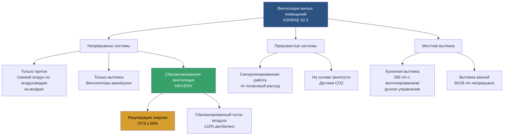

## Обзор

Стандарт ASHRAE 62.2 "Вентиляция и приемлемое качество воздуха в помещениях жилых зданий" устанавливает минимальные расходы вентиляции и другие меры для новых и существующих малоэтажных жилых зданий. Стандарт охватывает вентиляцию всего здания, местную вытяжку, контроль источников и проверку характеристик для поддержания приемлемого качества воздуха в помещениях.

Стандарт применяется к односемейным домам, многоквартирным структурам с тремя этажами или менее, сборным домам и пристройкам к существующим жилищам. Он предусматривает предписывающий путь на основе площади пола и занятости, обеспечивая непрерывную или прерывистую вентиляцию для разбавления загрязняющих веществ от строительных материалов, предметов обстановки и деятельности жильцов.

## Требования к вентиляции всего здания

### Расчет расхода вентиляции

ASHRAE 62.2 определяет требуемый общий расход вентиляции, используя следующую формулу:

$$Q_{total} = 0.03 \times A_{floor} + 7.5 \times (N_{br} + 1)$$

Где:
- $Q_{total}$ = требуемый общий расход вентиляции (л/с)
- $A_{floor}$ = кондиционируемая площадь пола (м²)
- $N_{br}$ = количество спален (минимум 1)

Для жилищных единиц с плотностью занятости выше предполагаемой применяется альтернативная формула:

$$Q_{fan} = Q_{total} \times \frac{\phi}{\phi + \eta \times I}$$

Где:
- $Q_{fan}$ = требуемый расход вентилятора (л/с)
- $\phi$ = доля времени работы системы вентиляции (безразмерная величина)
- $\eta$ = эффективность системы с учетом эффективности распределения
- $I$ = зачет инфильтрации (л/с)

### Зачет инфильтрации

Стандарт позволяет учитывать естественную инфильтрацию на основе герметичности оболочки:

$$Q_{inf} = \frac{NL \times A_{floor}}{2.7}$$

Где:
- $Q_{inf}$ = расход воздуха за счет инфильтрации (л/с)
- $NL$ = нормализованная утечка (безразмерная величина)
- $A_{floor}$ = кондиционируемая площадь пола (м²)

Зачет инфильтрации снижает требование механической вентиляции, но не может превышать две трети $Q_{total}$.

## Стратегии систем вентиляции

### Системы приточной вентиляции

Системы только приточной вентиляции подают отфильтрованный наружный воздух непосредственно в кондиционируемое пространство или через центральный блок обработки воздуха. Воздухозаборник должен быть расположен, чтобы избежать источников загрязнения, и защищен дефлектором от осадков и сеткой от насекомых. Приточный воздух должен распределяться в жилые помещения, а не только в вспомогательные помещения.

**Преимущества:**
- Повышает давление в здании, снижая инфильтрацию некондиционируемого воздуха
- Фильтрует поступающий воздух перед распределением
- Легко интегрируется с центральными системами принудительной циркуляции воздуха

**Недостатки:**
- Может неэффективно удалять влагу во влажном климате
- Более высокое энергопотребление в экстремальном климате без рекуперации
- Может создать избыточное давление в ограждающей конструкции, потенциально подталкивая влагу в полости стен

### Системы вытяжной вентиляции

Системы только вытяжной вентиляции создают пониженное давление в жилище путем удаления воздуха, как правило, с использованием вентиляторов в ванных комнатах или помещениях технического обслуживания. Подпорный воздух поступает через утечки в ограждающей конструкции здания или через специальные пассивные воздухозаборники.

**Преимущества:**
- Более низкая стоимость установки
- Простота эксплуатации и обслуживания
- Эффективна в холодном климате, где снижение давления минимизирует проблемы с влагой

**Недостатки:**
- Отсутствие фильтрации поступающего воздуха
- Может втягивать воздух из нежелательных мест (подполья, гаражи)
- Может создавать опасность обратного потока в комбинированных установках
- Неконтролируемые пути прохождения воздуха

### Системы сбалансированной вентиляции

Сбалансированные системы обеспечивают одинаковый приток и вытяжку воздуха, поддерживая нейтральное давление в здании. Вентиляторы рекуперации тепла (HRV) и вентиляторы рекуперации энергии (ERV) передают чувствительное тепло (HRV) или как чувствительную, так и скрытую энергию (ERV) между потоками воздуха.

**Требования к характеристикам:**
- Баланс расходов в пределах ±10% между приточным и вытяжным воздухом
- Эффективность рекуперации чувствительного тепла (СРЭ) ≥ 60% при −18°C для HRV в холодном климате
- Общая эффективность рекуперации ≥ 50% для ERV во влажном климате
- Эффективность вентилятора ≥ 1.0 л/(с·Вт)

## Требования к местной вытяжке

### Вентиляция кухни

ASHRAE 62.2 требует кухонную вытяжку с одним из следующих вариантов:

| Конфигурация | Минимальное требование |
|--------------|-------------------|
| Вентилируемая кухонная вытяжка | 280 л/ч прерывисто ИЛИ 5 воздухообменов в час (ВОЧ) непрерывно |
| Нисходящая вытяжка | 280 л/ч прерывисто ИЛИ 5 ВОЧ непрерывно |
| Микроволновая печь над плитой | 280 л/ч с вентилированием наружу |
| Удаленная встроенная вытяжка | 280 л/ч с вытяжным зонтом |

Вся кухонная вытяжка должна выводиться наружу и работать по требованию. Рециркуляционные вытяжки не удовлетворяют требованию.

### Вентиляция ванной комнаты

Ванные комнаты требуют вентиляции согласно следующей таблице:

| Конфигурация ванной комнаты | Непрерывно (л/ч) | Прерывисто (л/ч) |
|----------------------|-----------------|-------------------|
| Полная ванная (унитаз, раковина, душ/ванна) | 56 | 140 |
| Полутуалет (унитаз и раковина) | 56 | 140 |
| Санузел (только унитаз) | 56 | 140 |

Ванные комнаты с открывающимися окнами площадью не менее 0.05 м² освобождаются от требований механической вытяжки в некоторых юрисдикциях, хотя ASHRAE 62.2 все еще рекомендует механическую вентиляцию для последовательной работы.

### Характеристики вентилятора

Вентиляторы вытяжки ванной и кухни должны быть оценены и испытаны согласно процедурам HVI (Home Ventilating Institute). Установленный расход воздуха следует проверить при статическом давлении 6.4 Па. Требования эффективности вентилятора обеспечивают энергоэффективность:

$$E_{fan} = \frac{Q}{P} \geq 9.7 \text{ л/(с·Вт)}$$

Где:
- $E_{fan}$ = эффективность вентилятора (л/(с·Вт))
- $Q$ = расход воздуха (л/ч)
- $P$ = потребление энергии (Вт)

## Примеры расчета размеров систем вентиляции

### Пример 1: Односемейный дом

**Дано:**
- Площадь пола: 223 м²
- Спальни: 3
- Ограждающая конструкция: средняя герметичность (ACH50 = 5.0)

**Расчет требуемого расхода вентиляции:**

$$Q_{total} = 0.03 \times 223 + 7.5 \times (3 + 1) = 6.7 + 30 = 36.7 \text{ л/с}$$

**Расчет зачета инфильтрации:**

Нормализованная утечка по тесту с дверью нагнетания:
$$NL = \frac{ACH50}{100} = \frac{5.0}{100} = 0.05$$

$$Q_{inf} = \frac{0.05 \times 223}{2.7} = 4.1 \text{ л/с}$$

Максимально допустимый зачет = $\frac{2}{3} \times 36.7 = 24.5$ л/с

Фактический зачет = 4.1 л/с (менее максимума, приемлемо)

**Требуемая механическая вентиляция:**
$$Q_{mech} = 36.7 - 4.1 = 32.6 \text{ л/с} \approx 34 \text{ л/с непрерывно}$$

### Пример 2: Герметичное строительство с HRV

**Дано:**
- Площадь пола: 167 м²
- Спальни: 2
- Ограждающая конструкция: очень герметична (ACH50 = 1.5)

**Расчет требуемого расхода вентиляции:**

$$Q_{total} = 0.03 \times 167 + 7.5 \times (2 + 1) = 5.0 + 22.5 = 27.5 \text{ л/с}$$

**Зачет инфильтрации:**

$$NL = \frac{1.5}{100} = 0.015$$

$$Q_{inf} = \frac{0.015 \times 167}{2.7} = 0.93 \text{ л/с}$$

**Требуемая механическая вентиляция:**
$$Q_{mech} = 27.5 - 0.93 = 26.6 \text{ л/с} \approx 29 \text{ л/с непрерывно}$$

Для герметичного строительства рекомендуется сбалансированная система HRV для управления путями прохождения воздуха и рекуперации энергии.

## Интеграция системы и управление

### Интеграция центральной системы

При интеграции вентиляции с центральными системами принудительной циркуляции воздуха воздухозаборник должен соответствовать минимальным требованиям по расходу независимо от работы для обогрева или охлаждения. Моторизованный клапан или переключение вентилятора обеспечивает подачу вентиляционного воздуха даже при отсутствии работы обработчика воздуха для теплового кондиционирования.

### Стратегии управления

**Управление по времени:**
- Непрерывная работа с расчетным расходом
- Прерывистая работа с повышенными расходами (типично 4× почасовое требование)
- Запланированная работа в часы занятости

**Управление по требованию:**
- Датчики CO₂ в спальнях и жилых зонах
- Датчики влажности для помещений, где образуется влага
- Обнаружение занятости для прерывистого ускорения

## Ввод в эксплуатацию и проверка

ASHRAE 62.2 требует проверки характеристик установленной системы:

1. **Измерение расхода воздуха** системы вентиляции всего здания
2. **Тестирование местной вытяжки** при статическом давлении 6.4 Па
3. **Балансировка давления** для сбалансированных систем (±10%)
4. **Проверка уровня звука** (≤1.0 сона при непрерывной работе)
5. **Проверка последовательности управления** для прерывистых систем

Методы измерения расхода включают колпаки для измерения расхода, моторизованные колпаки и расчеты на основе манометра с использованием измерений скорости в воздуховодах.

## Компоненты

- Расходы вентиляции всего дома
- Требования к местной вытяжке
- Кухонная вытяжка в жилых помещениях
- Вытяжка ванной в жилых помещениях
- Механическая вентиляция в жилых помещениях
- Естественная вентиляция в жилых помещениях
