Международный совет по кодексам (ICC) публикует Международные коды (I-Codes) — согласованное семейство модельных строительных кодексов, принятых большинством юрисдикций в США и многочисленными международными регионами. Эти коды устанавливают минимальные требования к проектированию, установке, проверке и техническому обслуживанию систем HVAC для защиты здоровья, безопасности и благополучия населения.

## Структура семейства I-Codes

I-Codes функционируют как интегрированная система, где положения из нескольких кодексов применяются к одной установке HVAC. Понимание координации кодексов необходимо для обеспечения соответствия.

```mermaid
graph TD
    A[International Building Code IBC] --> B[Administrative Provisions]
    A --> C[Structural Requirements]
    A --> D[Fire Safety]

    E[International Mechanical Code IMC] --> F[HVAC Design]
    E --> G[Duct Systems]
    E --> H[Ventilation]
    E --> I[Equipment Installation]

    J[International Fuel Gas Code IFGC] --> K[Gas Piping]
    J --> L[Gas Appliances]

    M[International Energy Conservation Code IECC] --> N[Equipment Efficiency]
    M --> O[System Controls]
    M --> P[Duct Insulation]

    Q[International Fire Code IFC] --> R[Fire Dampers]
    Q --> S[Equipment Access]
    Q --> T[Smoke Control]

    U[International Plumbing Code IPC] --> V[Condensate Drainage]
    U --> W[Hydronic Piping]

    B --> X[HVAC Project]
    C --> X
    D --> X
    F --> X
    G --> X
    H --> X
    I --> X
    K --> X
    L --> X
    N --> X
    O --> X
    P --> X
    R --> X
    S --> X
    T --> X
    V --> X
    W --> X

    style A fill:#e1f5ff
    style E fill:#ffe1e1
    style M fill:#e1ffe1
    style X fill:#fff4e1
```

## Основные I-Codes для систем HVAC

| Кодекс | Аббревиатура | Основной охват HVAC | Цикл обновления |
|------|--------------|-------------------|--------------|
| International Mechanical Code | IMC | Полное проектирование механической системы, установка, требования к оборудованию, нормы вентиляции, системы воздуховодов | 3 года |
| International Building Code | IBC | Конструктивная поддержка, степени огнестойкости, классификация использования зданий, контроль дыма | 3 года |
| International Fire Code | IFC | Обслуживание пожарных клапанов, доступ в помещения оборудования, степени распространения пламени, горючие материалы | 3 года |
| International Energy Conservation Code | IECC | Минимумы эффективности оборудования, экономайзеры, герметизация воздуховодов, элементы управления, требования к изоляции | 3 года |
| International Fuel Gas Code | IFGC | Газовые печи, котлы, калориферные установки, размер газопровода, требования к вентиляции | 3 года |
| International Plumbing Code | IPC | Отвод конденсата, гидравлический трубопровод, тепловые насосы с водяным источником, градирни | 3 года |
| International Residential Code | IRC | Механические системы жилых домов на одну и две семьи (альтернатива IMC для жилых зданий) | 3 года |

## Международный механический код (IMC)

IMC служит основным документом кодекса для систем HVAC в коммерческих зданиях. Он содержит полные требования для:

**Стандарты оборудования:**
- Печи, котлы, кондиционеры, тепловые насосы, холодильное оборудование
- Сертификация производителя по признанным стандартам (AHRI, UL, CSA)
- Требования к паспортным данным и идентификации

**Требования к вентиляции:**
- Минимальные нормы наружного воздуха по типу использования (ссылается на ASHRAE 62.1)
- Положения о естественной вентиляции
- Проектирование механической системы вентиляции

**Конструкция системы воздуховодов:**
- Стандарты материалов по классификации давления
- Требования к толщине листового металла
- Поддержка воздуховодов и сейсмическое крепление
- Места установки пожарных клапанов и дымовых клапанов

**Воздух для горения:**
- Требования к воздуху горения в помещении (0,147 м³ на 1 кДж/ч входного потока)
- Размер отверстий для наружного воздуха горения
- Положения об механическом подаче воздуха горения

## Требования координации кодексов

Проектировщики и установщики HVAC должны ориентироваться в перекрывающихся положениях из нескольких I-Codes:

| Компонент системы | Основной кодекс | Дополнительные коды | Требование координации |
|------------------|--------------|-----------------|--------------------------|
| Конструктивная поддержка кровельного блока | IBC (Глава 16) | IMC (Раздел 304) | Инженер конструкций рассчитывает постоянные и временные нагрузки; IMC требует адекватной поддержки |
| Установка пожарного клапана | IMC (Раздел 607) | IBC (Раздел 717), IFC | IMC ссылается на сборки огнестойкости IBC; IFC регулирует доступ и испытания |
| Изоляция воздуховода | IECC (Раздел C403.2.7) | IMC (Раздел 604) | IECC предписывает значения R; IMC регулирует степень распространения пламени и развитие дыма |
| Вентиляция газовой печи | IFGC (Глава 5) | IMC (Раздел 801) | IFGC предоставляет подробные таблицы вентиляции; IMC устанавливает общие принципы вентиляции |
| Требования экономайзера | IECC (Раздел C403.5) | IMC | IECC требует экономайзеры по климатической зоне и мощности; IMC регулирует установку заслонки |
| Отвод конденсата | IPC (Раздел 314) | IMC (Раздел 307) | IPC определяет размер дренажного трубопровода; IMC требует вспомогательные поддоны и переключатели безопасности |

## Процесс разработки кодексов ICC

I-Codes подвергаются прозрачному, основанному на консенсусе процессу разработки:

**Трёхлетний цикл обновления:**
1. **Этап предложения** — Любое лицо может подать предложения об изменении кодекса (18 месяцев до публикации)
2. **Слушания технической комиссии** — Технические комиссии оценивают предложения и вносят рекомендации
3. **Период открытых комментариев** — Заинтересованные стороны комментируют действия комиссии
4. **Голосование членов-правительств** — Члены-правительства ICC голосуют по спорным пунктам
5. **Публикация** — Новое издание публикуется по трёхлетнему циклу (2024, 2027, 2030)

**Комитеты по разработке кодексов:**
- Комитет по разработке Международного механического кодекса (IMC-DC)
- Комитет по разработке Международного кодекса энергосбережения (IECC-DC)
- Деятельность по корреляции кодексов обеспечивает согласованность между I-Codes

**Процесс принятия:**
Штаты и местные юрисдикции принимают I-Codes путём законодательного или нормативного акта. Юрисдикции могут:
- Принять коды с поправками или без них
- Ссылаться на конкретные годы издания (часто на 3–6 лет отстают от текущего издания)
- Поддерживать поправки, специфичные для юрисдикции, учитывающие местные условия

## Международный код энергосбережения (IECC)

IECC устанавливает минимальные требования к энергетической эффективности систем HVAC:

**Эффективность оборудования:**
- Минимальные значения эффективности ссылаются на федеральные стандарты и ASHRAE 90.1
- Раздельные системы, блочные установки, чиллеры, котлы должны соответствовать или превосходить минимумы
- Сертификация производительности оборудования через AHRI или эквивалент

**Обязательные положения системы:**
- Термостатические элементы управления с возможностью снижения
- Значения R изоляции воздуховода и трубопровода по местоположению
- Испытание утечек воздуховода (≤1,35 м³/(ч·м²) при 25 Па)
- Экономайзеры требуются для систем охлаждения ≥15,8 кВт (в зависимости от климата)

**Предписывающие и эксплуатационные пути:**
- Предписывающий путь следует конкретным требованиям для каждого компонента
- Эксплуатационный путь (метод бюджета энергозатрат) позволяет компромиссы между системами зданий

## Интеграция IBC и противопожарной безопасности

Международный строительный кодекс регулирует конструктивные и противопожарные аспекты установок HVAC:

**Сборки с огнестойкостью:**
- Проникновения через сборки с огнестойкостью требуют перечисленные системы противодымной защиты сквозных проникновений
- Пожарные клапаны требуются, когда воздуховоды пронизывают противопожарные стены, противопожарные преграды, противопожарные перегородки (IMC ссылается на раздел 717 IBC)

**Системы контроля дыма:**
- Раздел 909 IBC требует контроля дыма для атриумов, подземных зданий, крытых торговых комплексов
- IMC координирует требования IBC для проектирования системы контроля дыма и приёмочного испытания

**Горючие материалы:**
- Глава 8 IBC (Внутренняя отделка) ограничивает показатели распространения пламени материала воздуховода и развития дыма
- Материалы воздуховода класса 0 или класса 1 требуются в большинстве применений

## Документация соответствия

Демонстрация соответствия I-Codes требует подробной документации:

- **Проектные чертежи** с показом мест расположения оборудования, маршрутизации воздуховода/трубопровода, последовательности управления
- **Расчёты нагрузок** (Manual J для жилых зданий, блочная нагрузка или программное обеспечение HVAC для коммерческих зданий)
- **Расчёты вентиляции** демонстрирующие соответствие требованиям наружного воздуха IMC
- **Технические характеристики оборудования** с сертификацией производителя по применимым стандартам
- **Формы соответствия энергии** (сертификат IECC, отчёты COMcheck)
- **Отчёты специальной проверки** по испытанию утечки воздуховода, проверке установки пожарного клапана

## Международный жилищный кодекс (IRC)

Для жилых домов на одну и две семьи и таунхаусов высотой до трёх этажей IRC предоставляет альтернативу IMC:

- **Упрощённые положения** подходящие для жилого строительства
- **Предписывающие требования** для установки оборудования, воздуха горения, вентиляции
- **Меньше специальных проверок** по сравнению с коммерческими применениями IMC
- Юрисдикции могут требовать IMC для всех зданий или разрешать IRC для соответствующих жилых сооружений

## Взаимосвязь со стандартами ASHRAE

I-Codes широко ссылаются на стандарты ASHRAE:

- **Раздел 401 IMC** — Нормы вентиляции ссылаются на ASHRAE 62.1 (коммерческие) и 62.2 (жилые)
- **IECC** — Таблицы эффективности оборудования зеркалируют требования ASHRAE 90.1
- **Раздел 312 IMC** — Холодильные системы ссылаются на стандарт безопасности ASHRAE 15

Понимание как I-Codes, так и ссылаемых стандартов ASHRAE необходимо для полного соответствия.

---

*I-Codes представляют согласованную нормативно-правовую базу, обеспечивающую, чтобы системы HVAC соответствовали минимальным требованиям безопасности, здоровья и эффективности. Проектировщики и установщики должны понимать координацию кодексов в семействе I-Code и оставаться в курсе статуса принятия и изменения в их юрисдикции.*
