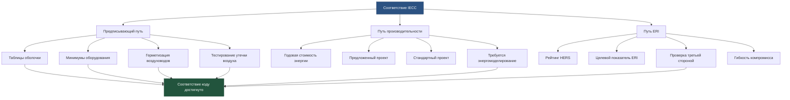

## Обзор

Международный кодекс энергосбережения (IECC) устанавливает минимальные требования к энергоэффективности для новых жилых и коммерческих зданий. Обновляемый в трёхлетнем цикле, IECC предусматривает три различных пути соответствия для систем HVAC: предписывающий, основанный на производительности и индекс энергетических характеристик (ERI). Код разделяет Соединённые Штаты на восемь климатических зон (1-8) с подклассификациями по режимам влажности, что прямо влияет на требования к проектированию HVAC.

IECC работает параллельно со стандартом ASHRAE 90.1 для коммерческих зданий, часто служа основой для государственных и местных кодексов энергосбережения. Понимание соответствия IECC является фундаментальным для инженеров HVAC, подрядчиков и должностных лиц строительных органов, обеспечивающих установку в соответствии с кодексом.

## Классификация климатических зон

Климатические зоны определяют уровни изоляции оболочки, минимальные требования к эффективности оборудования и требования к проектированию систем. IECC определяет зоны на основе градусо-дней отопления (HDD) и градусо-дней охлаждения (CDD):

| Климатическая зона | Описание | Типичные города | HDD база 18°C | CDD база 10°C |
|------------------|---------|----------------|---------------|---------------|
| 1A | Очень жарко-влажно | Майами, Флорида | <500 | >5000 |
| 2A | Жарко-влажно | Хьюстон, Техас | 500-1000 | 3500-5000 |
| 2B | Жарко-сухо | Феникс, Аризона | 500-1000 | 3500-5000 |
| 3A | Тепло-влажно | Атланта, Джорджия | 1000-2000 | 2500-3500 |
| 3B | Тепло-сухо | Лас-Вегас, Невада | 1000-2000 | 2500-3500 |
| 3C | Тепло-морской | Сан-Франциско, Калифорния | 1000-2000 | <2500 |
| 4A | Смешанно-влажно | Нью-Йорк, Нью-Йорк | 2000-3000 | 1500-2500 |
| 4B | Смешанно-сухо | Альбукерке, Нью-Мексико | 2000-3000 | 1500-2500 |
| 4C | Смешанно-морской | Сиэтл, Вашингтон | 2000-3000 | <1500 |
| 5A | Прохладно-влажно | Чикаго, Иллинойс | 3000-4000 | 1000-1500 |
| 5B | Прохладно-сухо | Денвер, Колорадо | 3000-4000 | 1000-1500 |
| 6A | Холодно-влажно | Миннеаполис, Миннесота | 4000-5000 | 500-1000 |
| 6B | Холодно-сухо | Хелена, Монтана | 4000-5000 | 500-1000 |
| 7 | Очень холодно | Дулут, Миннесота | 5000-7000 | <500 |
| 8 | Субарктический | Фэрбанкс, Аляска | >7000 | <500 |

## Пути соответствия

### Предписывающий путь

Предписывающий подход требует строгого соответствия минимальным значениям эффективности для каждого компонента здания без компромиссов. Оборудование HVAC должно соответствовать или превышать минимальные значения AFUE, SEER, HSPF и EER, указанные в таблицах IECC в зависимости от типа оборудования и мощности.

**Минимальные эффективности HVAC для жилых зданий (IECC 2021):**

| Тип оборудования | Мощность | Минимальная эффективность | Применение по климатической зоне |
|----------------|----------|----------------------|-----------------------------------|
| Центральный кондиционер | <230 кДж/ч | 14 SEER2 | Все зоны |
| Тепловой насос воздух-воздух (охлаждение) | <230 кДж/ч | 14 SEER2 | Все зоны |
| Тепловой насос воздух-воздух (отопление) | <230 кДж/ч | 7,5 HSPF2 | Все зоны |
| Газовая печь | <793 кДж/ч | 80% AFUE (90% AFUE в зонах 4C, 5-8) | Зависит от зоны |
| Котёл (газовый) | <1060 кДж/ч | 90% AFUE | Все зоны |
| Бесканальный мини-сплит кондиционер | <127 кДж/ч | 15 SEER2 | Все зоны |

### Путь производительности

Путь производительности позволяет гибкость проектирования посредством энергомоделирования всего здания. Предложенный проект должен продемонстрировать равную или более низкую годовую стоимость энергии по сравнению со стандартным проектом, используя идентичную геометрию, но компоненты с минимальным соответствием коду.

Уравнение соответствия:

$$
\text{Стоимость энергии}_{\text{предложенный}} \leq \text{Стоимость энергии}_{\text{стандартный}}
$$

Для систем HVAC расчёт производительности учитывает:

$$
Q_{\text{годовой}} = \sum_{i=1}^{8760} \left( \frac{Q_{\text{отопление},i}}{\text{AFUE}} + \frac{Q_{\text{охлаждение},i}}{\text{SEER} \times 3,413} + Q_{\text{вентилятор},i} \right)
$$

Где почасовые нагрузки учитывают теплопередачу через оболочку, инфильтрацию, вентиляцию, внутренние выделения тепла и солнечное излучение.

### Путь индекса энергетических характеристик (ERI)

Путь ERI требует сертификации HERS (система рейтинговой оценки энергоэффективности жилого дома), демонстрирующей производительность относительно эталонного дома. Целевой ERI варьируется в зависимости от климатической зоны:

| Климатическая зона | Целевой ERI (2021 IECC) | Максимально допустимый ERI |
|------------------|------------------------|---------------------------|
| 1-2 | 54 | 54 |
| 3 | 53 | 53 |
| 4 | 52 | 52 |
| 5 | 51 | 51 |
| 6 | 50 | 50 |
| 7-8 | 49 | 49 |

Более низкие значения ERI указывают на лучшую энергетическую производительность, где ERI 100 представляет эталонный дом, а 0 — нулевое чистое энергопотребление.

## Требования к коэффициентам теплопередачи U оболочки

Тепловая производительность оболочки здания напрямую влияет на расчёты нагрузок HVAC. Общий коэффициент теплопередачи через узлы не должен превышать максимальные значения коэффициентов U:

$$
U_{\text{эффективный}} = \frac{1}{R_{\text{общий}}} = \frac{1}{R_{\text{изоляция}} + R_{\text{воздушный слой}} + R_{\text{материалы}}}
$$

Для тепловых мостиков через каркас:

$$
U_{\text{узел}} = \frac{A_{\text{полость}}}{R_{\text{полость}}} + \frac{A_{\text{каркас}}}{R_{\text{каркас}}}
$$

**Максимальные коэффициенты U оболочки (жилые здания):**

| Компонент | Зоны 1-2 | Зона 3 | Зона 4 | Зона 5 | Зона 6 | Зоны 7-8 |
|-----------|----------|--------|--------|--------|--------|----------|
| Кровля/потолок | U-0,146 | U-0,146 | U-0,146 | U-0,146 | U-0,146 | U-0,146 |
| Стена выше уровня земли | U-0,475 | U-0,475 | U-0,340 | U-0,340 | U-0,255 | U-0,255 |
| Стена подвала | U-2,041 | U-2,041 | U-0,334 | U-0,283 | U-0,283 | U-0,283 |
| Плита на грунте | F-4,131 | F-4,131 | F-3,061 | F-2,950 | F-2,893 | F-2,461 |
| Светопрозрачные конструкции | U-2,839 | U-2,839 | U-2,273 | U-1,817 | U-1,704 | U-1,533 |

## Требования к механическим системам

Помимо эффективности оборудования, IECC требует надлежащих практик монтажа:

- **Герметизация воздуховодов**: Общая утечка ≤1,36 CFM (2,31 м³/ч) на 100 кв.футов (930 м²) кондиционируемой площади при 125 Па (тест на начальном этапе) или ≤2,71 CFM (4,60 м³/ч) на 100 кв.футов (тест после строительства)
- **Утечка воздуха**: Оболочка здания ≤3 ACH50 (зоны 1-2) или ≤5 ACH50 (зоны 3-8), подтверждённая тестированием дверцей нагнетаемого воздуха
- **Термостат**: Требуется программируемый или автоматический режим снижения температуры
- **Вентиляция**: Механическая вентиляция в соответствии с ASHRAE 62.2 с рекуперацией тепла/энергии в зонах 6-8
- **Экономайзеры**: Требуются для коммерческих систем охлаждения ≥191 кДж/ч в соответствующих климатических зонах

## Ввод в эксплуатацию и проверка

Раздел R403.3 IECC требует функционального тестирования систем HVAC:

1. Измерение расхода воздуха через нагревательные/охлаждающие катушки (±10% от проектного значения)
2. Проверка расхода наружного воздуха для вентиляции
3. Калибровка и программирование термостата
4. Проверка заправки хладагента (±5% от спецификации производителя)

Документация должна продемонстрировать надлежащий монтаж в соответствии со спецификациями производителя и требованиями кодекса.

## Взаимосвязь с ASHRAE 90.1

Для коммерческих зданий юрисдикции обычно принимают либо коммерческие положения IECC, либо ASHRAE 90.1. Оба кодекса имеют сходные определения климатических зон и методологии энергомоделирования, хотя ASHRAE 90.1 в целом предусматривает более подробные технические требования для сложных механических систем. Многие юрисдикции ссылаются на ASHRAE 90.1 для коммерческих проектов, применяя IECC к жилому строительству.

## Компоненты

- Требования к тепловой оболочке зданий
- Эффективность механических систем
- Система горячего водоснабжения
- Электроснабжение и освещение
- Проверка ввода в эксплуатацию IECC
