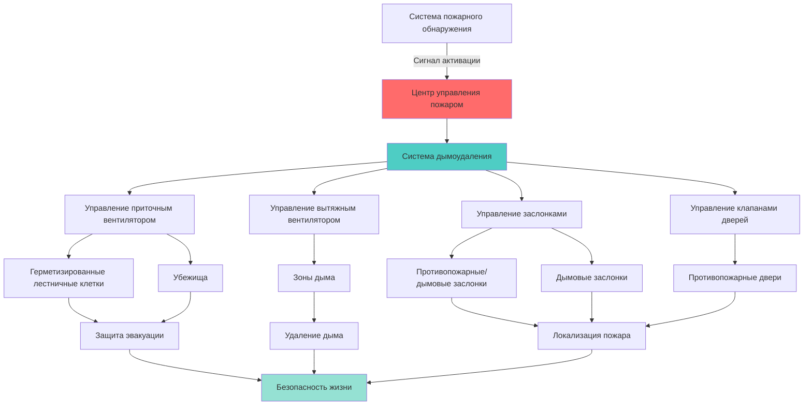

Международный противопожарный кодекс (МПК) устанавливает минимальные требования пожарной безопасности для существующих и новых зданий, включая критические положения систем HVAC. Опубликованный Международным советом по кодексам, МПК координируется с Международным механическим кодексом для обеспечения комплексной противопожарной защиты через надлежащее проектирование, установку и техническое обслуживание HVAC.

## Требования к противопожарным заслонкам

Противопожарные заслонки предотвращают распространение огня и дыма по воздуховодам, пересекающим конструкции с огнестойкостью. МПК требует специальных установок в зависимости от рейтинга конструкции и характеристик воздуховода.

### Требования к установке противопожарных заслонок

| Расположение | Огнестойкость | Тип заслонки | Температура срабатывания |
|----------|-------------|-------------|----------------------|
| Противопожарные стены | 3 часа | Противопожарная заслонка | 74°C или 100°C |
| Противопожарные барьеры | 1-2 часа | Противопожарная заслонка | 74°C |
| Горизонтальные конструкции | 1-2 часа | Противопожарная заслонка | 74°C |
| Дымовые барьеры | Различная | Дымовая заслонка | Остановка HVAC |
| Комбинированные барьеры | 1-3 часа | Комбинированная заслонка | 74°C + дым |
| Шахты оборудования | 2 часа | Противопожарная/дымовая заслонка | 74°C |

### Исключения для заслонок

МПК предусматривает конкретные исключения, когда противопожарные заслонки не требуются:

- Стальные воздуховоды без отверстий, пересекающие бетон или каменную кладку, с минимальным заделыванием 15 см
- Воздуховоды внутри отдельных жилых блоков
- Вытяжные воздуховоды от сушилок белья в жилых помещениях
- Воздуховоды HVAC в отдельных одноэтажных и двухэтажных зданиях
- Воздуховоды систем воздухозабора, где имеется резервная защита

## Системы дымоудаления

Системы дымоудаления поддерживают безопасные условия во время пожара, управляя движением дыма механическими или пассивными средствами.

### Требования МПК к системам дымоудаления

**Атриумы и большие помещения:**
- Естественная вентиляция: минимум 2,5% площади атриума
- Механические системы: пропускная способность вытяжки на основе расчетов дымовых потоков
- Обеспечение притока воздуха для поддержания перепадов давления
- Отдельные зоны дымоудаления для помещений, превышающих 1 860 м²

**Высотные здания:**
- Герметизация лестничных клеток: минимум 12,4 Па, максимум 43,6 Па
- Герметизация шахт лифтов для доступа пожарных
- Автоматическая активация при срабатывании системы пожарной сигнализации
- Возможность ручного управления из центра управления пожаром

**Подземные здания:**
- Минимальная скорость вытяжки 6 воздухообменов в час
- Вытяжка дыма непосредственно в атмосферу
- Независимый источник аварийного питания
- Координация дымовых барьеров с вентиляционными зонами

## Системы аварийной вентиляции

Системы аварийной вентиляции поддерживают безопасные условия при выбросах опасных материалов и пожарах.

### Требования к аварийному питанию

| Тип системы | Резервное питание | Время переключения | Время работы |
|-------------|--------------|---------------|---------|
| Дымоудаление | Требуется | 10 секунд | Минимум 2 часа |
| Вентиляция помещения с пожарным насосом | Требуется | 60 секунд | 2 часа |
| Вытяжка опасных материалов | Требуется | 10 секунд | По анализу риска |
| Герметизация лестничных клеток | Требуется | 10 секунд | Минимум 2 часа |
| Помещения с аккумуляторами | Требуется | 60 секунд | До проветривания |
| Холодильное оборудование | Требуется | 10 секунд | До эвакуации |

## Хранение опасных материалов

МПК устанавливает требования к вентиляции при хранении опасных материалов для предотвращения опасного накопления и обеспечения безопасного рассеивания.

**Общие требования:**
- Механическая вытяжка для всех внутренних помещений хранения
- Скорость вытяжки: 0,17 CFM (0,29 м³/ч) на один квадратный метр площади пола
- Точка выброса: минимум 3 м от границ участка и отверстий
- Отрицательное давление относительно окружающих помещений
- Конструкция воздуховодов, устойчивая к коррозии

**Специальные опасности:**

**Легковоспламеняющиеся жидкости:**
- Впускные отверстия вытяжки в пределах 30 см от пола
- Взрывозащищенное электрическое оборудование
- Непрерывная вентиляция или блокировка от занятости
- Минимум 6 воздухообменов в час

**Окислители и едкие вещества:**
- Выделенные вытяжные системы (без рециркуляции)
- Воздуховоды и вентиляторы, устойчивые к химическому воздействию
- Отдельные системы для несовместимых материалов
- Аварийное отключение, доступное снаружи

**Криогенные жидкости:**
- Мониторинг дефицита кислорода
- Механическая вентиляция во время операций заправки
- Активация аварийной вытяжки при тревоге
- Минимальная скорость: 0,17 CFM (0,29 м³/ч) на 2 м²

## Координация МПК и NFPA

МПК ссылается и координируется с несколькими стандартами NFPA для комплексной противопожарной защиты:

| Глава МПК | Стандарт NFPA | Применение HVAC |
|-------------|---------------|------------------|
| Глава 6 | NFPA 90A | Системы кондиционирования воздуха и вентиляции |
| Глава 9 | NFPA 13 | Координация автоматических спринклеров с HVAC |
| Глава 9 | NFPA 92 | Системы дымоудаления |
| Глава 23 | NFPA 96 | Вытяжные системы коммерческих кухонь |
| Глава 50 | NFPA 318 | Предприятия полупроводниковых технологий |
| Глава 60 | NFPA 45 | Противопожарная защита лабораторий |

**Ключевые точки координации:**

1. **Дымовые датчики воздуховодов:** Требования размещения NFPA 90A, применяемые через МПК
2. **Подавление на кухне:** Требования блокировки NFPA 96 указаны в МПК Глава 23
3. **Управление дымом:** Методы расчета NFPA 92, принятые для систем дымоудаления МПК
4. **Системы с инертным газом:** Требования NFPA 2001 для остановки HVAC при выпуске

## Проверка и техническое обслуживание

МПК требует периодической проверки и технического обслуживания компонентов противопожарной защиты в системах HVAC:

**Противопожарные заслонки:**
- Первоначальная проверка после установки
- Периодическая проверка каждые 4 года (больницы: 6 лет)
- Проверка после любых изменений здания, влияющих на огнестойкие конструкции
- Документация ведется в течение всего жизненного цикла здания

**Системы дымоудаления:**
- Полугодовое тестирование всех компонентов
- Ежегодное тестирование в условиях имитации пожара
- Полное системное тестирование один раз в пять лет
- Немедленное тестирование после модификаций или ремонта

**Аварийная вентиляция:**
- Ежеквартальное тестирование работоспособности
- Ежегодная проверка пропускной способности
- Полугодовое тестирование переключения аварийного питания
- Ежеквартальная проверка тревог и блокировок

## Стратегия соответствия

Эффективное соответствие МПК для систем HVAC требует:

1. **Ранняя координация** между специалистами по механике, противопожарной защите и архитектуре
2. **Пусконаладка** всех компонентов противопожарной защиты с задокументированными результатами испытаний
3. **Обучение** операторов зданий управлению аварийными системами
4. **Документация**, включающая расположение заслонок, последовательности дымоудаления и пропускные способности систем
5. **Договоры на техническое обслуживание**, обеспечивающие соответствие периодическим требованиям проверки и испытаний

Комплексный подход МПК к противопожарной безопасности HVAC защищает жизнь и имущество через проверенные инженерные принципы, обязательные программы проверок и координацию с установленными стандартами противопожарной защиты.
