Международный механический код (IMC) представляет собой наиболее широко принятый модельный механический код в Соединенных Штатах, устанавливающий комплексные требования к проектированию, монтажу, инспекции и техническому обслуживанию механических систем. Опубликованный Международным советом по кодексам (ICC) с трехлетним циклом пересмотра, IMC охватывает отопление, вентиляцию, кондиционирование воздуха, холодильные установки, приборы сгорания, дымоходы, вентиляционные каналы и безопасность механического оборудования. Код предусматривает минимальные требования, обеспечивающие безопасность, функциональность и энергоэффективность механических систем, одновременно защищая жильцов и имущество здания от опасностей, связанных с неправильно спроектированным или установленным механическим оборудованием.

IMC применяется к новому строительству, добавлениям, переоборудованию, ремонту и замене механических систем во всех типах зданий, за исключением отдельных одно- и двухсемейных жилых домов и таунхаусов (охватываемых Международным жилищным кодексом). Понимание требований IMC является обязательным для инженеров-механиков, подрядчиков, инспекторов и операторов объектов, участвующих в проектировании коммерческих, институциональных и многоквартирных жилых механических систем. Код координируется с другими Международными кодексами, включая Международный строительный код (IBC), Международный код топливного газа (IFGC), Международный код энергосбережения (IECC) и Международный противопожарный код (IFC).

## Структура и организация кодекса

IMC организует требования по отдельным главам, адресующим определенные категории и компоненты механических систем. Эта логическая структура обеспечивает эффективную навигацию при группировании связанных положений вместе.

```mermaid
graph TD
    A[IMC Область применения и администрирование] --> B[Требования вентиляции]
    A --> C[Системы вытяжки]
    A --> D[Системы воздуховодов]
    A --> E[Воздух горения]
    A --> F[Дымоходы и вентиляционные каналы]

    B --> B1[Нормы наружного воздуха]
    B --> B2[Естественная вентиляция]
    B --> B3[Механическая вентиляция]

    C --> C1[Общая вытяжка]
    C --> C2[Коммерческая кухня]
    C --> C3[Опасная вытяжка]

    D --> D1[Стандарты конструкции]
    D --> D2[Требования монтажа]
    D --> D3[Положения сейсмики]

    E --> E1[Расчет воздуха горения]
    E --> E2[Источники воздуха]
    E --> E3[Размер воздуховода]

    F --> F1[Размер вентиляционного канала]
    F --> F2[Материалы]
    F --> F3[Выводы]

    A --> G[Монтаж оборудования]
    A --> H[Холодильные установки]
    A --> I[Гидравлические системы]

    G --> G1[Доступ к оборудованию]
    G --> G2[Зазоры]
    G --> G3[Поддержка и крепление]

    H --> H1[Ссылка на ASHRAE 15]
    H --> H2[Предельные количества хладагента]
    H --> H3[Машинные помещения]

    I --> I1[Материалы труб]
    I --> I2[Испытание под давлением]
    I --> I3[Контроль расширения]
```

Код использует обязательный язык («должна» / "shall") для требуемых положений и разрешающий язык («может» / "may" или «разрешается» / "is permitted") для приемлемых альтернатив. Исключения из общих требований появляются непосредственно после применимого раздела. Этот последовательный формат уточняет обязательства по соответствию, одновременно определяя приемлемые вариации.

## Требования к нормам вентиляции

Глава 4 IMC устанавливает минимальные требования вентиляции, обеспечивающие адекватное поступление наружного воздуха для здоровья жильцов, разбавления запахов и удаления загрязняющих веществ. Нормы вентиляции зависят от классификации занятости, плотности занятости и характеристик использования помещения.

| Классификация занятости | Норма наружного воздуха (м³/ч на человека) | Дополнительная норма (м³/ч на м²) | Примечания |
|-------------------------|-------------------------------|---------------------------|-------|
| Офисные помещения | 8.5 | 0.64 | Обычные офисные площади |
| Конференц-залы | 8.5 | 0.64 | Умножить на плотность занятости |
| Классные комнаты (возраст 9+) | 17 | 1.29 | Более высокие нормы для младших школьников |
| Лекционные залы | 12.7 | 0.64 | Типичны зафиксированные места |
| Розничные магазины | 12.7 | 1.29 | Торговые этажи |
| Рестораны | 12.7 | 1.93 | Только зоны питания |
| Спортивные залы | 34 | 0.64 | Высокая метаболическая активность |
| Гостиничные номера | 8.5 | 0.64 | На человека занятости |

IMC ссылается на ASHRAE Standard 62.1 для подробных процедур вентиляции, включая процедуру расчета нормы вентиляции и процедуру качества воздуха помещений. Эта координация обеспечивает согласованность между минимальными требованиями кода и национально признанными инженерными стандартами при допуске подходов соответствия на основе производительности.

Естественная вентиляция представляет собой приемлемую альтернативу механической вентиляции при наличии определенных условий. Отверстия естественной вентиляции должны обеспечивать свободную площадь не менее 4 % площади пола, с отверстиями, расположенными для создания эффективной перекрестной вентиляции. Этот пассивный подход снижает энергопотребление при обеспечении соответствия коду вентиляции при надлежащих климатических условиях и проектных условиях здания.

## Конструкция и монтаж систем воздуховодов

Глава 6 устанавливает комплексные требования к системам воздуховодов, адресующие материалы, методы конструкции, структурную поддержку, герметизацию, изоляцию и практику монтажа. Эти положения обеспечивают безопасность, долговечность и производительность системы воздуховодов при предотвращении распространения огня, структурного отказа и потерь энергии.

**Стандарты материалов и конструкции** требуют конструкции воздуховода в соответствии с признанными промышленными стандартами, включая SMACNA HVAC Duct Construction Standards. Конкретные требования адресуют:

- Минимальная толщина оцинкованной стали в зависимости от размеров воздуховода
- Спецификации алюминиевого сплава для стойкости к коррозии
- Нержавеющая сталь для коррозионных сред
- Методы конструкции воздуховода из стекловолокна
- Максимальная длина гибкого воздуховода и расстояние поддержки
- Требования монтажа огневых заслонок и дымовых заслонок

| Тип воздуховода | Класс давления | Мин. скорость (м/с) | Макс. скорость (м/с) | Стандарт конструкции |
|-----------|----------------|---------------------|---------------------|----------------------|
| Приточный воздух | 50 Па | 5.1 | 12.7 | SMACNA низкого давления |
| Возвратный воздух | 50 Па | 4.1 | 10.2 | SMACNA низкого давления |
| Высокоскоростной | 150 Па | 12.7 | 20.3 | SMACNA высокого давления |
| Вытяжка | 50 Па | 7.6 | 15.2 | SMACNA низкого давления |
| Коммерческая кухня | 50 Па | 7.6 | 12.7 | SMACNA с сертификацией UL |

**Требования опоры и раскрепления воздуховода** предотвращают структурный отказ, чрезмерную вибрацию и сейсмические повреждения. Максимальное расстояние опоры варьируется в зависимости от материала и размера воздуховода, обычно колеблется от 2.4 до 3.7 м. Сейсмические крепления следуют положениям, координирующимся с ASCE 7 и требованиями строительного кода к структуре, с поперечным и продольным раскреплением на заданных интервалах в зависимости от категории сейсмического проектирования.

**Требования герметизации воздуховода** минимизируют утечку воздуха, снижая энергопотребление и поддерживая расчетные скорости потока воздуха. IMC требует, чтобы системы воздуховодов, работающие при статических давлениях, превышающих 50 Па, имели герметичные поперечные соединения, швы и проникновения стенок воздуховода. Методы герметизации должны соответствовать стандартам UL 181, используя надлежащие ленты, герметики или прокладки в зависимости от материалов воздуховода и условий работы.

## Монтаж оборудования и положения безопасности

Глава 3 адресует общие требования по монтажу механического оборудования, включая зазоры, доступ, поддержку, электрические соединения и элементы управления безопасностью. Эти основные положения применяются к разнообразным типам оборудования, обеспечивая безопасный монтаж, работу и доступность технического обслуживания.

**Требования доступа к оборудованию** предусматривают рабочее пространство, достаточное для инспекции оборудования, технического обслуживания и замены компонентов. Минимальные положения доступа включают:

- Минимальная ширина пути доступа 0.76 м к оборудованию
- Беспрепятственный доступ к сервисным панелям и компонентам
- Освещение, обеспечивающее минимальное освещение 108 люкс в зонах обслуживания
- Постоянный доступ по лестнице или переходу для кровельного оборудования
- Входная дверь доступа размером минимум 0.61 × 0.76 м для входа в машинное помещение

**Требования зазора оборудования** предотвращают пожарные опасности, обеспечивают циркуляцию воздуха и облегчают безопасную работу. Зазоры зависят от типа оборудования, источника топлива и спецификаций производителя. Оборудование горения требует больших зазоров к горючим материалам по сравнению с электрическим оборудованием. Минимальные зазоры варьируются от 2.54 см для ограниченного горючего воздействия до 0.91 м и более для высокотемпературных поверхностей и соединений дымовых каналов приборов сгорания.

**Поддержка оборудования и крепление** должны выдерживать рабочие нагрузки, сейсмические силы и ветровые нагрузки без отказа или чрезмерного прогиба. Опорные конструкции требуют инженерного проектирования для оборудования, превышающего установленные пороги веса. Виброизоляция координируется с требованиями структуры, предотвращающими отказ системы изоляции во время сейсмических событий при обеспечении эффективного контроля вибрации во время обычной работы.

## Требования к воздуху горения

Глава 7 устанавливает требования к воздуху горения и воздуху разбавления для приборов с горением топлива, обеспечивающие полное сгорание, разбавление вытяжного колпака и безопасное удаление продуктов сгорания. Недостаточный воздух горения вызывает неполное сгорание, производящее оксид углерода, выброс пламени, отказ пилота и повреждение оборудования, связанное с конденсацией.

Расчет воздуха горения учитывает все приборы, сжигающие топливо в пространстве, их объединенные входные мощности и характеристики источников воздуха горения. Два основных метода определяют адекватный воздух горения:

**Стандартный метод** для замкнутых пространств (объем пространства менее 1.4 м³ на 293 Вт общей входной мощности прибора):

- Два постоянных отверстия, сообщающихся с наружным воздухом или незамкнутым пространством
- Каждое отверстие минимум 6.5 см² свободной площади на 293 Вт (вертикальные воздуховоды/прямые отверстия)
- Каждое отверстие минимум 6.5 см² свободной площади на 586 Вт (горизонтальные воздуховоды)

**Инженерный метод** допускает меньшие размеры отверстий, когда механическая вентиляция обеспечивает документированные скорости потока воздуха, соответствующие требованиям воздуха горения приборов плюс резерв для вариаций работы. Этот подход требует инженерного анализа с учетом:

$$Q_{combustion} = \sum_{i=1}^{n} \frac{I_i \times C_a}{1,000}$$

Где:
- $Q_{combustion}$ = требуемый объем воздуха горения (м³/ч)
- $I_i$ = входная мощность прибора (кДж/ч)
- $C_a$ = коэффициент воздуха горения (обычно 0.35 м³/ч на 293 кДж/ч)

## Положения систем холодильного оборудования

Глава 11 адресует безопасность холодильной системы через прямое принятие ASHRAE Standard 15 по ссылке, устанавливая согласованные требования безопасности холодильного оборудования во всех юрисдикциях, принимающих IMC. Эта координация устраняет конфликты между требованиями кода и национально признанными стандартами безопасности холодильного оборудования при обеспечении комплексного охвата классификации хладагентов, предельных количеств, требований машинного помещения, систем обнаружения и защиты от давления.

| Класс хладагента | Тип занятости | Макс. количество (кг) | Требуется машинное помещение | Требуется обнаружение |
|-------------------|----------------|--------------------|-----------------------|-------------------|
| A1 (R-134a) | Коммерческая | Расчетное* | >500 кг | >50 кг в помещении |
| A1 (R-410A) | Институциональная | Расчетное* | >250 кг | >25 кг в помещении |
| A2L (R-32) | Коммерческая | Расчетное* | >100 кг | >10 кг в помещении |
| A2L (R-454B) | Жилая | Расчетное* | >100 кг | Все количества |
| A3 (R-290) | Коммерческая | Расчетное* | Все количества | Все количества |

*Расчетное в соответствии с ASHRAE 15 на основе объема пространства и свойств хладагента

Глава холодильного оборудования IMC адресует:

- **Классификация хладагента** в соответствии с характеристиками токсичности и воспламеняемости ASHRAE Standard 34
- **Ограничения количества** в зависимости от типа занятости и группы безопасности хладагента
- **Требования машинного помещения** при превышении количеством хладагента прямых системных допусков
- **Положения вентиляции** для нормальной и аварийной вентиляции машинного помещения
- **Системы обнаружения и сигнализации** активирующие аварийную вентиляцию и предоставляющие предупреждение жильцам
- **Сброс давления** защищающий компоненты системы от чрезмерного давления

Координация между Главой 11 IMC и ASHRAE 15 обеспечивает, что механические разрешения, рецензирование планов и инспекции адресуют комплексные требования безопасности холодильного оборудования. Юрисдикции, принимающие IMC, эффективно принимают требования ASHRAE 15 по ссылке, создавая унифицированное правоприменение положений холодильного оборудования.

## Координация IMC и стандартов ASHRAE

IMC широко ссылается на стандарты ASHRAE, включающие национально признанные технические требования, разработанные через процессы консенсуса, включающие инженеров, производителей, подрядчиков и чиновников кодекса. Этот подход координации использует специализированный технический опыт при поддержании применяемости кода через четкое принятие по ссылке.

Ключевые стандарты ASHRAE, включенные в IMC:

- **ASHRAE 15:** Требования безопасности холодильной системы (Глава 11)
- **ASHRAE 62.1:** Вентиляция для приемлемого качества воздуха помещений (Глава 4)
- **ASHRAE 90.1:** Энергетический стандарт для зданий (координируется с IECC)
- **ASHRAE 34:** Обозначение хладагента и классификация безопасности (Глава 11)

Эта структура координации обеспечивает быстрое включение технических обновлений по мере развития стандартов ASHRAE при поддержании формата кода и процедур правоприменения. Инженеры и подрядчики ссылаются на подробные положения стандартов ASHRAE для проектных расчетов и процедур монтажа, в то время как чиновники кода обеспечивают минимальные требования через структуру IMC.

## Соответствие кодексу и правоприменение

IMC устанавливает административные процедуры для разрешений, рецензирования планов, инспекций, испытаний и выдачи свидетельства о занятости. Глава 1 адресует:

- Требования заявки на разрешение и исключения
- Представление и утверждение конструкционных документов
- Уведомление об инспекции и требования доступа
- Процедуры испытания и запуска оборудования
- Критерии выдачи временного и окончательного свидетельства о занятости

Соответствие IMC требует координации между несколькими сторонами, включая инженеров-механиков, предоставляющих проектные расчеты и спецификации, подрядчиков, монтирующих системы в соответствии с утвержденными документами, производителей оборудования, предоставляющих соответствующее оборудование и инструкции по монтажу, и чиновников кода, рецензирующих материалы и проводящих полевые инспекции. Этот совместный процесс обеспечивает, что установленные системы соответствуют минимальным требованиям кода, защищая жильцов зданий и имущество.

Понимание требований IMC, организации и координации со ссылаемыми стандартами обеспечивает эффективное проектирование, монтаж и работу механической системы, соответствующие целям безопасности и производительности. Комплексный охват кода адресует разнообразные механические системы от базовой вентиляции до сложных холодильных установок, обеспечивая согласованные минимальные требования, применимые к различным типам зданий и типам занятости. По мере эволюции технологии механического оборудования и повышения ожиданий эффективности здания, IMC продолжает адаптироваться через регулярные циклы пересмотра, поддерживая актуальность при сохранении фундаментальных принципов безопасности, защищающих здоровье и благополучие населения.
