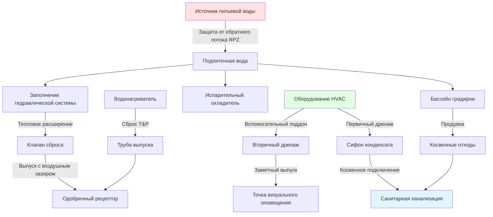

## Обзор

Международный сантехнический кодекс (IPC) устанавливает минимальные требования к сантехническим системам, которые напрямую взаимодействуют с установками HVAC. Опубликованный Международным советом по кодексам (ICC), IPC регулирует системы водоснабжения, отведения, вентиляции и газоснабжения, которые поддерживают оборудование отопления, охлаждения и вентиляции. Специалисты HVAC должны понимать положения IPC, влияющие на удаление конденсата, гидравлическое распределение, осушение оборудования и компоненты со стороны воды.

## Требования к осушению конденсата

### Оборудование кондиционирования и холодоснабжения

Раздел 314 IPC регулирует удаление конденсата из холодильного оборудования. Весь конденсат должен попадать в одобренный сантехнический прибор, напольный слив или зону утилизации. Прямое подключение к системе санитарного дренажа требует косвенного подключения отходов с воздушным зазором или воздушным разрывом для предотвращения загрязнения обратным потоком.

**Основные требования к дренажу:**
- Минимальный внутренний диаметр трубы 19 мм
- Минимальный уклон 4 мм на метр в сторону выпуска
- Требуется сифон с глубиной затвора не менее 25 мм
- Доступные прочистки при изменениях направления более 45 градусов
- Материалы: PVC Schedule 40, CPVC, медь или одобренный пластик

**Вспомогательные дренажные поддоны:**
Для оборудования, установленного над занятыми помещениями или в скрытых местах, IPC требует вторичной защиты. Вспомогательные дренажные поддоны должны иметь минимальную глубину 38 мм с дренажным соединением 19 мм. Вспомогательный дренаж должен выпускаться в заметное место для оповещения жильцов об отказе первичного дренажа.

### Системы конденсатных насосов

Когда дренаж под действием силы тяжести невозможен, конденсатные насосы обеспечивают возможность подъема. IPC требует:
- Резервуар, рассчитанный на производительность конденсата оборудования
- Выключатель высокого уровня воды для отключения оборудования перед переполнением
- Обратный клапан на нагнетании для предотвращения обратного потока
- Выпуск в одобренный косвенный рецептор отходов

## Системы гидравлических трубопроводов

IPC регулирует подключения питьевой воды к гидравлическим системам HVAC, в то время как механические коды обычно регулируют распределение замкнутого контура.

### Подключения подпиточной воды

Раздел 608.16.3 IPC требует защиты от обратного потока для всех соединений между сетью питьевого водоснабжения и не-питьевыми системами:

| Тип системы | Требуемая защита от обратного потока |
|-------------|---------------------------------------|
| Замкнутое отопление/охлаждение | Сборка регулятора с пониженным давлением (RPZ) |
| Открытые градирни | Воздушный зазор или сборка RPZ |
| Испарительные охладители | Вакуумный выключатель или сборка RPZ |
| Гидравлическое таяние снега | Сборка RPZ |
| Системы химической обработки | Разделение воздушным зазором |

### Расширительное облегчение бака

Гидравлические системы требуют защиты от чрезмерного давления в соответствии с разделом 504.6 IPC. Клапаны сброса давления должны выпускаться в одобренный косвенный рецептор отходов через воздушный зазор. Труба выпуска должна быть:
- Минимальный размер выпускного отверстия клапана сброса
- Материалы, рассчитанные на минимальную температуру 99°C
- Полный размер до точки завершения без редукторов
- Видимый выпуск для оповещения об открытии клапана сброса давления

## Положения о водонагревателях

Глава 5 IPC устанавливает требования для водонагревателей, обслуживающих приложения HVAC, включая катушки горячей воды для бытовых нужд, радиационное отопление и технологические нагрузки.

### Требования к установке

| Параметр | Требование IPC |
|----------|-----------------|
| Пропускная способность клапана сброса | Минимальный рейтинг, равный входной мощности водонагревателя в кДж/ч |
| Давление срабатывания клапана | Максимум 1034 кПа и 99°C |
| Температурно-напорный сброс | Требуется для всех накопительных нагревателей |
| Материал трубы выпуска | Медь, CPVC, одобренный пластик, рассчитанный на 99°C |
| Завершение выпуска | 150–600 мм над полом, одобренный рецептор |
| Требование поддона | Требуется при установке над занятым помещением |
| Сейсмическое крепление | Крепление согласно разделу 308 IPC в сейсмических зонах |

### Воздух горения и вентиляция

Водонагреватели с процессами горения требуют адекватного снабжения воздухом согласно разделу 701 IPC. Стандартные установки требуют 1,41 м³ на кДж/ч входной мощности для воздуха горения и вентиляции в совокупности. Замкнутые пространства требуют спроектированного воздухоснабжения из наружных источников.

Вентиляция должна соответствовать требованиям главы 8 IPC для газовых приборов и главы 9 для оборудования, работающего на масле. Приборы категории I требуют вентиляции типа B с минимальными зазорами. Конденсирующие приборы используют системы вентиляции PVC или CPVC с правильным осушением конденсата.

## Градирни и испарительное оборудование

### Осушение продувки и переполнения

Раздел 802.2 IPC требует, чтобы градирни осушали воду продувки через косвенное подключение отходов. Сливы переполнения должны выпускаться в одобренное место, где выпуск воды не создает опасности или повреждений.

**Размер дренажной системы:**

| Производительность градирни | Минимальный размер слива |
|------------------------------|-------------------------|
| До 3,5 кВт | 38 мм |
| 3,5–10,5 кВт | 51 мм |
| 10,5–21 кВт | 76 мм |
| Свыше 21 кВт | Минимум 102 мм |

### Обращение с химикатами водоподготовки

Системы, использующие химическую обработку воды, требуют специальных положений:
- Дозаторы химикатов подключены через воздушный зазор или сборку RPZ
- Проверка pH осушения продувки для проверки приемлемых пределов
- Нейтрализующие резервуары, если требуется органом юрисдикции
- Сдерживание разливов для мест хранения химикатов

## Точки взаимодействия сантехники и HVAC

## Осушение оборудования и требования к рецептору

### Косвенные подключения отходов

Раздел 802 IPC требует косвенные подключения отходов для оборудования, выпускающего потенциально загрязненную канализацию:
- Конденсат кондиционирования воздуха
- Продувка и переполнение градирни
- Выпуск клапана сброса
- Дренажные поддоны оборудования
- Стерилизаторы и коммерческие посудомоечные машины

Косвенное подключение создает воздушный зазор между выпуском оборудования и системой санитарной канализации, предотвращая перекрестное загрязнение при условиях обратного потока.

### Размер напольного слива

Помещения оборудования, в которых размещаются компоненты HVAC, требуют осушения пола, рассчитанного на возможные объемы выпуска:
- Минимум сливы в полу 51 мм в механических помещениях
- Ловушки для переполнения градирни
- Щелевые дренажи для банков водонагревателей
- Наклонные полы в сторону точек дренажа (минимум 21 мм на метр)

## Газовые трубопроводы (Глава 12 IPC)

IPC содержит всесторонние требования к газовым трубопроводам в качестве альтернативы Международному кодексу газоснабжения. Ключевые положения включают:
- Размер трубы на основе самого длинного хода и общего спроса на кДж/ч
- Надлежащее расстояние между опорами (горизонтальные трубы каждые 1,8 м для стальных труб)
- Ловушки для осадков (капельные колена) при каждом подключении прибора
- Испытание газа под давлением при 1,5 кратной рабочему давлению минимум
- Запорные клапаны в пределах 1,8 м от каждого прибора

## Точки проверки соответствия кодексу

### Инспекция в начальной стадии

Инспекторы проверяют перед скрытием:
- Размер и уклон трубы конденсатного дренажа
- Установка сифона и глубина уплотнения
- Ориентация установки защиты от обратного потока
- Материалы трубопроводов и методы соединения
- Расстояние опор и подвесов
- Результаты проверки давления газа

### Финальная инспекция

Проверка завершенной системы включает:
- Завершение выпуска клапана сброса
- Тестирование потока конденсата
- Сертификация защиты от обратного потока
- Зазоры доступа оборудования
- Маркировка запорных клапанов
- Эксплуатационное испытание конденсатных насосов

## Стандарты материалов, упомянутые в IPC

IPC ссылается на многочисленные стандарты материалов для компонентов, взаимодействующих с системами HVAC:
- ASTM B88: Медная водопроводная трубка
- ASTM D1785: Пластиковая труба PVC Schedule 40
- ASTM D2846: Пластиковая труба CPVC и фитинги
- ASTM A53: Стальная труба, черная и горячеоцинкованная
- ASSE 1012: Сборки защиты от обратного потока
- CSA LC-1: Системы газовых трубопроводов

## Координация с механическими кодексами

Хотя IPC регулирует водоснабжение и дренаж, Международный механический кодекс (IMC) регулирует установку оборудования, воздуховоды и системы охлаждения. Успешные установки HVAC требуют координации между обоими кодексами. IPC конкретно освобождает определенные гидравлические системы замкнутого контура от охвата кодексом сантехники, передавая полномочия механического кодекса на трубопроводы распределения, расширительные баки и устройства удаления воздуха.

Юрисдикции, принимающие I-Codes, должны уточнить, какой кодекс имеет приоритет для гибридных систем, включающих как элементы сантехники, так и механики. Строительные отделы обычно требуют разрешения как на сантехнику, так и на механику для комплексных проектов HVAC, включающих компоненты со стороны воды и воздуха.

## Компоненты

- Распределение водоснабжения
- Системы санитарной канализации
- Системы вентиляции
- Приборы сантехники
- Водонагреватели IPC
- Газовые трубопроводы IPC
