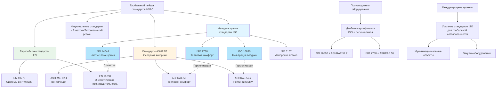

# ISO стандарты для систем HVAC и приложений

Международная организация по стандартизации (ISO) разрабатывает глобально признанные технические стандарты, которые устанавливают единые критерии производительности, методологию испытаний и системы классификации для оборудования и приложений HVAC. Стандарты ISO обеспечивают международную гармонизацию для эффективности фильтрации воздуха (ISO 16890), проектирования и эксплуатации чистых помещений (серия ISO 14644), оценки теплового комфорта (ISO 7730), измерения потока (ISO 5167) и систем управления (ISO 9001, 14001, 50001). Эти стандарты обеспечивают согласованные спецификации оборудования, облегчают международную торговлю, поддерживают соответствие нормативным требованиям и устанавливают общий технический язык в различных национальных рамках, включая ASHRAE, EN (Европейские нормы), JIS (Японские промышленные стандарты) и GB (Китайские национальные стандарты).

## Основные технические стандарты HVAC

### ISO 16890: Воздушные фильтры для общей вентиляции

**Область применения и применение стандарта:**
ISO 16890 (опубликован в 2016 году) устанавливает глобальную систему испытаний и классификации воздушных фильтров, используемых в приложениях общей вентиляции, заменяя предыдущий европейский стандарт EN 779. Стандарт вводит классификацию эффективности по взвешенной среднеквадратичной частице (ePM) на основе производительности фильтра против частиц PM₁, PM₂.₅ и PM₁₀, согласовывая спецификации фильтрации с показателями качества наружного воздуха и диапазонами размеров частиц на основе здоровья.

**Структура классификации фильтров:**

| Группа фильтра | Диапазон размера частиц | Минимальная эффективность | Типичные приложения |
|--------------|---------------------|-------------------|---------------------|
| ISO Coarse | > 10 мкм | ≥ 50% улавливание крупной пыли | Предварительная фильтрация, промышленные объекты |
| ISO ePM₁₀ | ≤ 10 мкм (PM₁₀) | ≥ 50% при PM₁₀ | Общая вентиляция, коммерческие здания |
| ISO ePM₂.₅ | ≤ 2,5 мкм (PM₂.₅) | ≥ 50% при PM₂.₅ | Приложения с улучшенным качеством воздуха в помещении |
| ISO ePM₁ | ≤ 1 мкм (PM₁) | ≥ 50% при PM₁ | Высокоэффективная фильтрация, больницы, лаборатории |

**Структура отчётности об эффективности:**
Фильтры получают числовые рейтинги эффективности с шагом 5% от 50% до 95% для соответствующего диапазона размера частиц. Примеры обозначений:

- **ISO ePM₁₀ 50%:** Минимум 50% эффективность для частиц PM₁₀
- **ISO ePM₂.₅ 65%:** Минимум 65% эффективность для частиц PM₂.₅
- **ISO ePM₁ 80%:** Минимум 80% эффективность для частиц PM₁ (сверхтонкие частицы)

**Требования протокола испытания:**
- Кондиционированные фильтры испытаны при потоке воздуха 0,944 м³/с (3400 м³/ч)
- Аэрозольный тест DEHS (Di-Ethyl-Hexyl-Sebacat)
- Подсчёт частиц в диапазоне 0,3-10 мкм с использованием оптических счётчиков частиц
- Измерения начальной эффективности и эффективности в загруженном состоянии
- Рейтинг минимальной эффективности на основе наиболее проникающего размера частиц

**Статус глобального принятия:**
ISO 16890 был принят или признан Европейским союзом (замена EN 779), Китаем (GB/T 14295-2019 на основе ISO 16890), Австралией и все чаще в Северной Америке в качестве дополнения к рейтингам ASHRAE 52.2 MERV. Крупные производители фильтров теперь предоставляют данные о производительности как ISO 16890, так и ASHRAE 52.2.

### ISO 7730: Эргономика тепловой среды

**Назначение стандарта:**
ISO 7730 предоставляет аналитические методы для определения и интерпретации теплового комфорта в помещениях с использованием индексов прогнозируемого среднего голоса (PMV) и прогнозируемого процента недовольных (PPD), разработанных П. О. Фангером. Стандарт устанавливает критерии комфорта для умеренных тепловых сред и поддерживает проектирование систем HVAC, определение уставок и оценку качества внутренней среды.

**Параметры модели PMV-PPD:**

Индекс PMV интегрирует шесть фундаментальных параметров:

**Личные факторы:**
- Скорость метаболизма (met): 0,8 (сон) до 4,0+ (тяжелые физические упражнения)
- Теплоизоляция одежды (clo): 0,0 (обнаженное тело) до 2,0+ (тяжелая зимняя одежда)

**Факторы окружающей среды:**
- Температура воздуха: 10-30°C типичный диапазон комфорта
- Средняя радиационная температура: температуры поверхности стены, пола, потолка
- Скорость воздуха: 0-1,0 м/с типичная зона для людей
- Относительная влажность: диапазон 30-70% рекомендуемый

**Критерии комфорта для проектирования:**

| Шкала PMV | Тепловое ощущение | PPD (% недовольных) | Категория проектирования HVAC |
|-----------|------------------|----------------------|---------------------|
| +3 | Жарко | > 95% | Вне зоны комфорта |
| +2 | Тепло | 75% | Вне зоны комфорта |
| +1 | Немного тепло | 26% | Категория C (приемлемо) |
| +0,5 | Нейтрально-тепло | 10% | Категория B (нормально) |
| 0 | Нейтрально | 5% | Категория A (высокие ожидания) |
| -0,5 | Нейтрально-холодно | 10% | Категория B (нормально) |
| -1 | Немного холодно | 26% | Категория C (приемлемо) |
| -2 | Холодно | 75% | Вне зоны комфорта |
| -3 | Очень холодно | > 95% | Вне зоны комфорта |

**Категории проектирования комфорта:**

**Категория A (PMV: -0,2 до +0,2, PPD < 6%):**
- Высокий уровень ожидания
- Пространства для чувствительных занимающих лиц (больницы, дома престарелых)
- Требования к точному управлению

**Категория B (PMV: -0,5 до +0,5, PPD < 10%):**
- Нормальный уровень ожидания
- Типичные офисные здания, школы, жилые помещения
- Стандартная целевая точка проектирования HVAC

**Категория C (PMV: -0,7 до +0,7, PPD < 15%):**
- Умеренный уровень ожидания
- Склады, временные сооружения, некондиционированные пространства

**Факторы локального теплового дискомфорта:**
- Рейтинг сквозняка (DR): скорость воздуха, температура, интенсивность турбулентности
- Вертикальная разница температур воздуха: < 3°C между уровнем головы и лодыжки
- Температура поверхности пола: 19-29°C в зависимости от материала пола
- Асимметрия радиационной температуры: < 10°C вертикально, < 5°C горизонтально

### ISO 14644: Чистые помещения и контролируемые среды

**Структура серии стандартов:**
ISO 14644 состоит из 17 частей, охватывающих классификацию чистых помещений, испытание, мониторинг, проектирование, строительство и эксплуатацию. Стандарт предоставляет глобальную базу для контроля загрязнения в фармацевтическом производстве, производстве полупроводников, биотехнологии, аэрокосмической промышленности и производстве медицинских устройств.

**Классы чистоты по содержанию взвешенных в воздухе частиц:**

| Класс ISO | Максимум частиц/м³ по размеру |||||
|-----------|------------|-----------|-----------|-----------|-----------|
| | ≥ 0,1 мкм | ≥ 0,2 мкм | ≥ 0,3 мкм | ≥ 0,5 мкм | ≥ 1 мкм |
| **ISO 1** | 10 | 2 | — | — | — |
| **ISO 2** | 100 | 24 | 10 | 4 | — |
| **ISO 3** | 1 000 | 237 | 102 | 35 | 8 |
| **ISO 4** | 10 000 | 2 370 | 1 020 | 352 | 83 |
| **ISO 5** | 100 000 | 23 700 | 10 200 | 3 520 | 832 |
| **ISO 6** | 1 000 000 | 237 000 | 102 000 | 35 200 | 8 320 |
| **ISO 7** | — | — | — | 352 000 | 83 200 |
| **ISO 8** | — | — | — | 3 520 000 | 832 000 |
| **ISO 9** | — | — | — | 35 200 000 | 8 320 000 |

**Требования к проектированию HVAC по классам ISO:**

**Пример требований ISO 5 (Класс 100):**
- Количество смен воздуха: 240-480 ACH (предпочтительно однонаправленный поток)
- Фильтрация: HEPA H14 (99,995% @ 0,3 мкм) терминальные фильтры
- Давление: минимум +15 Па относительно зон более низкого класса
- Контроль температуры: типично ±1°C
- Контроль влажности: типично ±5% RH

**Пример требований ISO 7 (Класс 10 000):**
- Количество смен воздуха: 60-90 ACH (смешанный поток приемлем)
- Фильтрация: HEPA H13 (99,95% @ 0,3 мкм) или H14 терминальные фильтры
- Давление: минимум +10 Па относительно зон более низкого класса
- Контроль температуры: ±2°C приемлем
- Контроль влажности: ±10% RH приемлем

**Пример требований ISO 8 (Класс 100 000):**
- Количество смен воздуха: 20-30 ACH
- Фильтрация: ISO ePM₁ 95% предварительные фильтры + HEPA H13 терминальные фильтры
- Давление: минимум +5 Па относительно неконтролируемых зон
- Контроль температуры: приемлемо ±2-3°C
- Контроль влажности: приемлемо ±15% RH

**Требования мониторинга и испытания (ISO 14644-2):**
- Частота испытания подсчёта частиц: каждые 6-12 месяцев в зависимости от критичности
- Испытание скорости потока/объема воздуха: ежегодно
- Мониторинг дифференциального давления: непрерывно
- Испытание целостности HEPA фильтра: при установке и ежегодно
- Испытание времени восстановления: после строительства/модификации

### ISO 5167: Измерение потока жидкости

**Применение в системах HVAC:**
ISO 5167 определяет геометрию и методы расчёта для дифференциального давления расходомеров, включая пластины с отверстиями, сопла и трубы Вентури, используемые для измерения потока воздуха и потока воды в системах распределения HVAC, установках охлажденной воды и гидравлических системах отопления.

**Спецификации пластины с отверстием:**
- Коэффициент бета (β = d/D): от 0,10 до 0,75 типично
- Требования числа Рейнольдса: Re > 5000 для точности
- Требования прямой трубы: 10-44D выше по потоку, 4-8D ниже по потоку
- Конфигурации отводов давления: угловые отводы, фланцевые, отводы D и D/2

**Расчёт потока:**
Q = C × A × √(2ΔP/ρ)

Где:
- Q = объемный расход (м³/с)
- C = коэффициент расхода (функция β, Re, конфигурации отвода)
- A = площадь горла отверстия (м²)
- ΔP = дифференциальное давление (Па)
- ρ = плотность жидкости (кг/м³)

## Стандарты системы управления

### ISO 9001: Системы управления качеством

**Значение для промышленности HVAC:**
ISO 9001:2015 устанавливает требования к системам управления качеством, применимые к проектировочным фирмам HVAC, производителям оборудования, подрядчикам и поставщикам услуг. Сертификация демонстрирует приверженность последовательному качеству, удовлетворению потребителей и постоянному совершенствованию.

**Ключевые требования, влияющие на операции HVAC:**
- Контроль документов для расчётов проектирования, предложений, руководств O&M
- Требования компетентности для техников и инженеров
- Протоколы калибровки и испытания оборудования
- Процедуры несоответствия и корректирующих действий
- Программы внутреннего аудита

### ISO 14001: Системы управления окружающей средой

**Применение к HVAC:**
ISO 14001:2015 предоставляет основу для управления окружающей средой, применимую к обращению с хладагентами, снижению потребления энергии, управлению отходами и оценке воздействия на окружающую среду для проектов HVAC.

**Специфические аспекты окружающей среды HVAC:**
- Предотвращение утечки хладагента и восстановление (снижение GWP)
- Оптимизация энергоэффективности (снижение выбросов)
- Утилизация и переработка оборудования
- Управление строительными отходами
- Контроль загрязнения шумом

### ISO 50001: Системы управления энергией

**Основа управления энергией HVAC:**
ISO 50001:2018 устанавливает систематический подход к улучшению энергетической производительности путём измерения, документирования, отчётности и оптимизации использования энергии в системах HVAC.

**Требования реализации:**
- Установление энергетической базовой линии (интенсивность использования энергии в здании)
- Показатели энергетической производительности (кВт/т для чиллеров, Вт/CFM для вентиляторов)
- Операционные управления (управление уставками, расписание)
- Стратегии закупки энергии
- Проверка производительности и измерение

**Типичные показатели энергетической производительности HVAC:**

| Тип системы | Показатель энергетической производительности | Эталон промышленности |
|------------|----------------------------|-------------------|
| Установка охлажденной воды | кВт/т при проектных условиях | 0,45-0,65 кВт/т |
| Установка котельной | Годовая эффективность сгорания | 80-95% |
| Блоки обработки воздуха | Система вентилятора Вт/CFM | 0,4-0,8 Вт/CFM |
| Насосные системы | Эффективность от провода к воде | 45-65% |

## Международная гармонизация и региональное принятие

### Взаимоотношения стандартов ISO и ASHRAE

### Статус гармонизации по области применения

**Стандарты фильтрации воздуха:**
- **ISO 16890** все чаще принимается глобально, заменяя региональные стандарты
- **ASHRAE 52.2** остаётся доминирующей в Северной Америке с рейтингами MERV
- **EN 779** снято в пользу ISO 16890 (переход в Европе завершён)
- Производители предоставляют таблицы кросс-ссылок: MERV ≈ эквиваленты ePM

**Оценка теплового комфорта:**
- **ISO 7730** модель PMV-PPD основа для адаптивной модели комфорта **ASHRAE 55**
- Оба стандарта признают ограничения в естественно вентилируемых зданиях
- **EN 16798-1** принимает методологию ISO 7730 с адаптациями
- Региональные предположения об одежде и скорости метаболизма варьируются

**Классификация чистых помещений:**
- **ISO 14644** универсально принята для фармацевтической, полупроводниковой промышленности
- **US Federal Standard 209E** официально снято, заменено ISO 14644
- **EU GMP Annex 1** ссылается на классификации ISO 14644
- **China GB 50073** согласуется с классами ISO 14644

### Региональные эквиваленты стандартов

**Кросс-ссылка эффективности фильтра:**

| ISO 16890 | ASHRAE 52.2 | EN 779 (снято) | Применение |
|-----------|-------------|-------------------|-------------|
| ISO Coarse | MERV 5-7 | G3-G4 | Предварительная фильтрация |
| ISO ePM₁₀ 50% | MERV 9-10 | M5 | Общая вентиляция |
| ISO ePM₂.₅ 50-70% | MERV 11-13 | M6-F7 | Коммерческие здания |
| ISO ePM₁ 50-80% | MERV 14-15 | F8-F9 | Здравоохранение, лаборатории |

**Эквиваленты классов чистых помещений:**

| ISO 14644 | US Fed Std 209E | EU GMP | Типичное применение |
|-----------|-----------------|---------|-------------------|
| ISO 5 | Класс 100 | Класс A/B | Асептическая обработка |
| ISO 7 | Класс 10 000 | Класс C | Чистое производство |
| ISO 8 | Класс 100 000 | Класс D | Зоны упаковки |

## Стратегии соответствия и спецификации

**Спецификации международных проектов:**
При указании оборудования HVAC для мультинациональных объектов ссылайтесь как на стандарты ISO, так и на региональные требования:

- Основная ссылка: стандарт ISO (ISO 16890, ISO 14644)
- Вторичная ссылка: соответствие местному коду (ASHRAE, EN, национальные коды)
- Проверка испытания: аккредитованные лаборатории согласно ISO 17025

**Язык закупки оборудования:**
"Воздушные фильтры должны соответствовать классификации ISO ePM₁ 70% согласно протоколу испытания ISO 16890. Предоставьте документацию, показывающую эквивалентность рейтингу ASHRAE 52.2 MERV для объектов Северной Америки."

**Требования проектной документации:**
- Расчёты теплового комфорта согласно ISO 7730 с показом PMV/PPD для проектных условий
- Проверка классификации чистых помещений согласно протоколам испытания ISO 14644-3
- Выбор устройства измерения потока согласно расчётам размеров ISO 5167
- Процедуры управления качеством согласно ISO 9001 для мероприятий ввода в эксплуатацию

**Сертификация и проверка третьей стороной:**
- Производители фильтров: отчёты об испытании Eurovent, AHRI или независимой лаборатории ISO 16890
- Сертификация чистых помещений: испытание классификации ISO 14644-2 аккредитованными органами
- Системы управления: сертификация ISO 9001, 14001, 50001 аккредитованными регистрарами

## Будущие разработки и появляющиеся стандарты

**Разрабатываемые стандарты ISO:**
- Пересмотр ISO 16890 с учётом сверхтонких частиц < 0,3 мкм
- Расширение частей ISO 14644 для контроля биозагрязнения
- Серия ISO 52000 (методы расчёта энергетической производительности EPBD)
- Интеграция стандартов ISO с рабочими процессами информационного моделирования зданий (BIM)

**Тренды глобальной конвергенции:**
Промышленность HVAC продолжает движение к единым международным стандартам, уменьшая региональные вариации и позволяя глобальным цепочкам поставок, согласованным спецификациям производительности и упрощённой проверке соответствия на разных рынках.

---

**Связанные разделы:**
- Стандарты и руководства ASHRAE
- Европейские стандарты EN
- Обзор кодов и норм
- Международные подходы к проектированию HVAC
