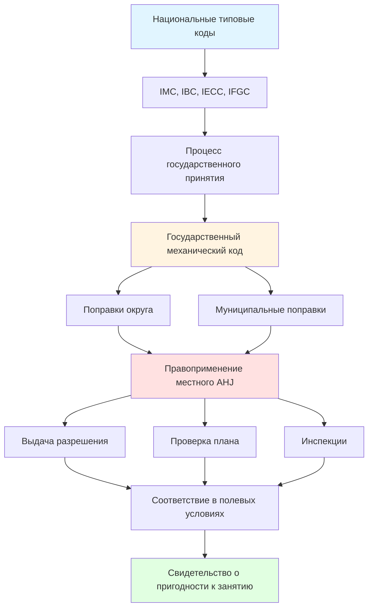

## Обзор

Местные нормативы HVAC представляют наиболее непосредственный уровень правоприменения кодекса, дополняя национальные типовые коды путем государственного принятия и местных поправок. Понимание юрисдикционных требований необходимо для правового соответствия, поскольку нарушения могут привести к неудачным инспекциям, задержкам проекта, отзыву разрешений и проблемам с ответственностью. Местные органы, имеющие юрисдикцию (AHJ), сохраняют власть изменять принятые коды для решения проблем, специфичных для климата, проблем плотности застройки и региональных приоритетов безопасности.

## Иерархия нормативных актов

Типичная структура нормативных актов вытекает из национальных типовых кодексов через государственное принятие к местным поправкам:

## Процессы принятия государственного кода

Штаты используют различные механизмы для принятия и изменения типовых кодексов. Три основных подхода:

**Прямое принятие**: Штаты принимают последнее издание типовых кодексов (IMC, IBC, IECC) с минимальными или без поправок. Этот подход упрощает многоюрисдикционные проекты, но может не решить проблемы, специфичные для штата.

**Принятие с поправками**: Штаты принимают типовые коды, но включают поправки, касающиеся климатических зон, требований к сейсмичности, мандатов энергоэффективности или структур лицензирования. Поправки обычно содержатся в административных кодексах штата.

**Пользовательские государственные коды**: Некоторые штаты разрабатывают полностью отдельные механические коды, включающие принципы типовых кодексов при переструктурировании организации и требований. Title 24 Калифорнии является примером этого подхода, интегрируя механические, энергетические и доступностные требования в единую базу.

Штаты обновляют коды в разные циклы. Большинство следуют 3-летним интервалам обновления, согласованным с публикацией типовых кодексов, но лаги принятия варьируются от немедленных до 6+ лет отставания от текущих редакций.

## Местные поправки и вариации

Муниципалитеты и округа часто изменяют государственные коды для решения местных условий:

- **Требования, специфичные для климата**: Улучшенные минимумы изоляции, модифицированные коэффициенты размеров оборудования или обязательное управление влажностью в прибрежных регионах
- **Сейсмические положения**: Усиленные требования к раскреплению и креплению в высокосейсмических зонах сверх государственных минимумов
- **Энергоэффективность**: Местные растяжные коды, требующие производительности, превышающей государственные энергетические коды
- **Мандаты качества воздуха**: Повышенные скорости вентиляции, минимумы фильтрации (MERV 13+) или обязательный мониторинг наружного воздуха
- **Ограничения оборудования**: Запреты на определенные хладагенты, типы топлива или приборы сгорания
- **Звуковые постановления**: Пределы уровня шума (дБА) для наружного оборудования более строгие, чем типовые коды

Юрисдикции публикуют поправки в муниципальных кодексах, обычно организованных по главам, соответствующим структуре типового кода (поправки к главе 3 IMC влияют на положения главы 3).

## Требования к разрешениям

Работа HVAC требует разрешений практически во всех юрисдикциях, причем пороги объема варьируются по местоположению.

### Факторы срабатывания разрешения по типу юрисдикции

| Тип юрисдикции | Новая установка | Замена | Ремонт | Модификация воздуховода | Холодильная система |
|------------------|------------------|--------|--------|--------------------------|----------------------|
| Крупной метрополис | Всегда требуется | ≥1,76 кВ или печь | При изменении мощности | >10% модификация системы | >22,68 кг заряд |
| Город среднего размера | Всегда требуется | ≥1,06 кВ | Ремонты, связанные с кодом | Новые воздуховоды | >11,34 кг заряд |
| Маленький муниципалитет | Всегда требуется | Оборудование с сжиганием | Ремонт топливной системы | Добавления подачи/возврата | Переменная |
| Округ (неинкорпорированный) | Всегда требуется | Аналогично варьируется | Обычно освобождается | Может быть освобождено | Государственный минимум |

**Обычные исключения** (проверьте с местным AHJ):
- Переносное оборудование, не требующее коммунальных услуг
- Замена холодильных линий, аналогичная существующей
- Замена фильтров и плановое обслуживание
- Замена термостата (не зонирующие системы)
- Очистка воздуховодов без модификации

### Требования к заявке

Заявления о разрешении обычно требуют:

1. **Чертежи**: Графики оборудования, планы этажей, показывающие местоположение оборудования/воздуховодов, стояки диаграмм, детали сейсмического раскрепления
2. **Расчеты нагрузки**: ACCA Manual J (жилое) или методология ASHRAE (коммерческое)
3. **Характеристики оборудования**: Листы данных, показывающие рейтинги эффективности, мощность, электрические характеристики
4. **Документация по лицензированию**: Проверка лицензии подрядчика, сертификаты профессии (EPA 608)
5. **Соответствие энергетическим нормам**: Сертификаты соответствия кодам (ResCheck, COMcheck) или моделирование производительности
6. **Документация специальной системы**: Планы пусконаладки для сложных систем, графики противопожарных/дымовых заслонок, последовательности управления

## Процессы инспекции

Установки HVAC подвергаются поэтапным инспекциям, обеспечивающим соответствие кодексу перед скрытием и окончательным одобрением.

### Типичная последовательность инспекции

**Инспекция грубого строительства** (перед скрытием):
- Испытание газопровода под давлением (обычно 20,68-68,95 кПа в течение 15+ минут)
- Проверка маршрутизации и размера холодильной линии
- Установка воздуховода, герметизация (тестирование Duct Blaster в некоторых юрисдикциях)
- Отверстия для воздуха сгорания
- Поддержка оборудования и сейсмическое раскрепление
- Зазоры до легковоспламеняющихся материалов

**Финальная инспекция**:
- Установка оборудования в соответствии со спецификациями производителя
- Электрические соединения и отключения
- Дренаж конденсата и ловушки
- Соответствие вентиляции и завершения
- Измерения воздушного потока (жилое: ≥594 CFM (1008 м³/ч) охлаждение на кВ)
- Тестирование безопасности сгорания (уровни CO, тяга)
- Работа и программирование термостата
- Проверка соответствия энергетическому коду
- Маркировка (тип хладагента, электрические рейтинги, размеры фильтров)

**Специальные инспекции** (в зависимости от юрисдикции):
- Тестирование утечки воздуховода (≤6,78-10,17 CFM25/100 кв. футов поверхности воздуховода)
- Утечка внешней оболочки здания (≤5,09-8,48 ACH50)
- Измерение воздушного потока на регистрах
- Проверка зарядки хладагента (перегрев/недогрев)
- Функциональное тестирование экономайзера
- Пусконаладка системы автоматизации зданий (BAS)

Неудачные инспекции требуют исправления и повторной инспекции, с взиманием сборов за каждый дополнительный визит в большинстве юрисдикций.

## Требования к лицензированию подрядчиков

Государственные и местные органы власти регулируют лицензирование подрядчиков HVAC для обеспечения компетентности и защиты потребителей.

### Структуры лицензирования по штатам

| Модель лицензирования | Описание | Примеры | Требования |
|----------------------|----------|---------|-----------|
| Государственная лицензия | Одна лицензия действительна по всему штату | FL, TX, CA | Государственный экзамен, опыт (2-5 лет), залог |
| Двойное лицензирование | Требуются государственная + местная лицензии | NY, NJ (некоторые города) | Государственная квалификация + муниципальная регистрация |
| Округ/Муниципалитет | Нет государственной лицензии; только местная | VA, CO (некоторые области) | Широко варьируется по юрисдикции |
| Без ограничений | Нет специализированной лицензии HVAC | WY (может применяться лицензия электрика) | Общая лицензия подрядчика или лицензия профессии |

**Распространенные классификации лицензий**:
- **Жилой HVAC**: Системы ≤1,76 кВ, приложения для одной семьи/дуплекса
- **Коммерческий HVAC**: Без ограничения мощности, все типы зданий
- **Ограниченный/Подмастерье**: Работа под надзором лицензированного мастера
- **Специальность**: Газоснабжение, только холодильное, листовой металл, очистка воздуховодов

### Типичные требования к лицензированию

1. **Опыт**: 2-5 лет верифицируемого опыта полевых работ под лицензированным надзором
2. **Экзамен**: Знание профессии (психрометрия, расчет нагрузки, коды), бизнес/законодательство
3. **Страховка**: Общая ответственность (1,06-3,54 млн кДж), компенсация работников
4. **Залог**: Гарантийные облигации (22,37-111,85 кДж), защищающие потребителей
5. **Повышение квалификации**: 4-16 часов ежегодно по обновлению кодов, безопасности, эффективности

## Примеры региональных вариаций

**Калифорния**: Title 24 требует верификации HERS для жилых систем, сертификации зарядки хладагента, тестирования воздуховодов и измерения воздушного потока. Местные округа контроля качества воздуха налагают дополнительные требования (Правило 1111 South Coast AQMD для выбросов NOx оборудования).

**Нью-Йорк**: Требует разрешения Департамента зданий Нью-Йорка, отличные от государственного лицензирования, специальные инспекции для систем >7,08 м³/с и инспекции бойлеров/сосудов под давлением уполномоченными органами.

**Флорида**: Государственная преамбула ограничивает местные поправки; строительные отделы применяют Florida Building Code-Mechanical с минимальными местными вариациями. Одобрение продукта требует общегосударственной валидации.

**Чикаго**: Обширные местные поправки к IMC, включая усиленное сейсмическое раскрепление, специфические требования к вентиляции и обязательную защиту от обратного потока на гидронических системах.

## Лучшие практики соответствия

- **Предварительное исследование дизайна**: Свяжитесь с местным строительным отделом, чтобы получить списки поправок и требования к разрешениям перед проектированием
- **Раннее подание разрешения**: Отведите 2-6 недель для проверки плана в большинстве юрисдикций
- **Планирование инспекции**: Предоставьте 24-48 часов уведомления; координируйте с другими профессиями, чтобы избежать задержек
- **Хранение документации**: Ведите разрешения, одобренные чертежи, записи инспекций и документацию гарантии
- **Отношения с должностными лицами кодекса**: Установите профессиональные отношения; уточняйте неясные требования перед тем, как начать работу

Понимание местных нормативных требований предотвращает дорогостоящие переделки, обеспечивает правовое соответствие и защищает занимающихся зданиями путем проверки безопасности и производительности системы.
