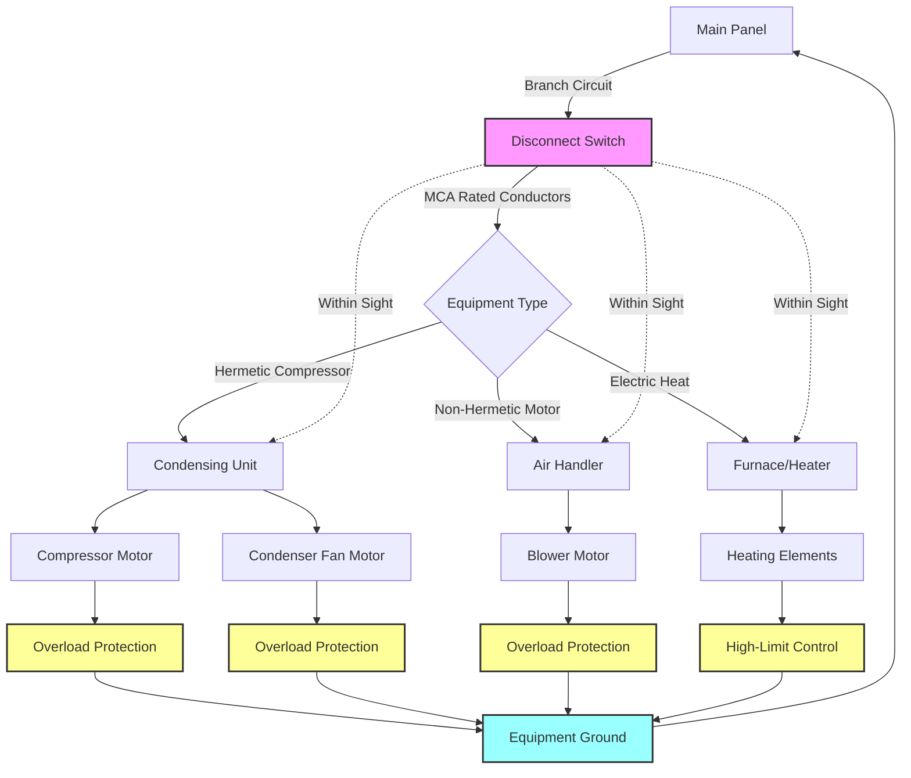

## Обзор

NFPA 70, Национальный электротехнический кодекс (NEC), устанавливает минимальные стандарты безопасности для электрических установок в зданиях. Для систем HVAC специальные статьи регулируют оборудование с электроприводом, приборы, стационарное электрическое отопление и оборудование кондиционирования воздуха/охлаждения. Соответствие требованиям обеспечивает электрическую безопасность, надлежащую работу оборудования и защиту от электрических опасностей.

## Критические статьи NEC для HVAC

**Статья 422 - Приборы:** Охватывает постоянно подключенные приборы HVAC, включая печи, котлы и нагреватели воздуховодов. Требует наличие средства отключения в зоне видимости или с блокируемым сервисным оборудованием.

**Статья 424 - Стационарное электрическое оборудование обогрева:** Регулирует электрические плинтусные нагреватели, панели лучистого отопления, нагревательные кабели и нагреватели воздуховодов. Требует правильного выбора размера ответвленной цепи, защиты от перегрузок и расстояния от горючих материалов.

**Статья 430 - Двигатели, цепи двигателей и контроллеры:** Устанавливает общие требования для установки двигателей. Применяется для насосов, вентиляторов и герметичных компрессоров. Охватывает выбор размера проводника, защиту от перегрузок и спецификации контроллеров.

**Статья 440 - Оборудование кондиционирования воздуха и охлаждения:** Специально регулирует герметичные холодильные мотор-компрессоры. Заменяет статью 430 для герметичных систем компрессоров. Включает положения для комнатных кондиционеров, сплит-систем и компактных блоков.

## Требования к выбору размера цепи двигателя

### Допустимая нагрузка по току проводника

Ответвленные проводники, питающие один двигатель, должны иметь допустимую нагрузку по току не менее 125% от номинального тока полной нагрузки (FLC) двигателя. Для герметичных компрессоров используйте номинальный ток нагрузки (RLC) или ток выбора ответвленной цепи (BCSC), в зависимости от того, какой больше.

| Тип оборудования | Минимальная допустимая нагрузка по току проводника | Ссылка на NEC |
|---|---|---|
| Один двигатель (герметичный) | 125% от FLC | 430.22(A) |
| Герметичный компрессор | 125% от RLC или BCSC | 440.32 |
| Несколько двигателей (крупнейший + остальные) | 125% крупнейшего + сумма остальных | 430.24 |
| Воздухообработчик с отоплением | 125% от общей нагрузки | 424.3(B) |

### Выбор размера устройства защиты от перегрузок

| Оборудование | Максимальный размер автомата/предохранителя | Требование |
|---|---|---|
| Герметичный двигатель | 250% FLC (автомат обратного времени) | 430.52(C)(1) |
| Герметичный двигатель | 175% FLC (предохранитель с замедлением) | 430.52(C)(1) |
| Герметичный компрессор | По MCA/MOP производителя на табличке данных | 440.22(A) |
| Электрическое отопление сопротивлением | 125% от общей нагрузки нагревателя | 424.3(B) |
| Комбинированное оборудование | Крупнейший двигатель на 125% + остальные на 100% | 440.33 |

**MCA (минимальная допустимая нагрузка цепи):** требование минимального размера провода.
**MOP (максимальная защита от перегрузок):** максимально допустимый размер автомата или предохранителя.

Всегда используйте значения MCA и MOP на табличке для герметичного оборудования. Эти значения учитывают ток заблокированного ротора, коэффициент обслуживания и другие параметры, специфичные для производителя.

## Требования к средствам отключения

### Расположение и видимость

Каждый блок HVAC требует средства отключения. Для оборудования, расположенного снаружи или в механических помещениях, отключающее устройство должно находиться в зоне видимости и быть легко доступным от оборудования. "В зоне видимости" означает видимое и не более чем в 15 м от оборудования.

**Приемлемые типы отключающих устройств:**
- Блокируемый автомат в щите (если находится в зоне видимости)
- Отключающий выключатель с предохранителями или без них
- Штепсельная вилка и розетка (для подключаемого по шнуру оборудования мощностью менее 0,25 кВт)

### Выбор размера отключающего устройства

Номинальная сила тока отключающего устройства должна составлять не менее 115% номинального тока нагрузки или тока выбора ответвленной цепи для герметичных компрессоров (Статья 440.12). Для комбинированного оборудования с двигателями и нагревателями выбирайте размер по сумме всех нагрузок.

| Номинальное значение оборудования | Минимальный номинальный ток отключающего устройства |
|---|---|
| Один герметичный компрессор | 115% от RLC или BCSC |
| Двигатель + нагреватель сопротивлением | Сумма двигателя (115%) + нагревателя (100%) |
| Несколько двигателей | Сумма с крупнейшим на 115% |
| Номинальная мощность в кВт | Должна быть равна или превышать мощность двигателя |

## Защита GFCI и AFCI

### Требования к защите от утечек на землю

**210.8(B)(2)** - Оборудование на крыше: начиная с NEC 2023, оборудование на крыше требует защиты GFCI для розеток 120 В, однофазных, 15 и 20 А, расположенных на крышах.

**210.8(B)(10)** - Внутреннее оборудование: механические помещения и зоны размещения оборудования требуют защиты GFCI для розеток 125 В, однофазных.

**Исключение:** защита GFCI не требуется для розеток, которые не являются легко доступными, или розеток, питающих выделенное оборудование кондиционирования воздуха.

### Требования к защите от дугового замыкания

Защита AFCI требуется для ответвленных цепей 120 В, однофазных, питающих розетки в жилых помещениях, указанные в 210.12. Оборудование HVAC на чердаках, в подвалах и механических помещениях, как правило, освобождается от требований AFCI при питании выделенного оборудования.

## Заземление и соединение

Все неток-проводящие металлические части оборудования HVAC должны быть заземлены согласно Статье 250. Размер провода защитного заземления оборудования (EGC) выбирается на основе номинальной силы тока устройства защиты:

| Номинальная сила тока устройства защиты | Минимальный размер медного провода EGC |
|---|---|
| 15 А | 14 AWG |
| 20 А | 12 AWG |
| 30 А | 10 AWG |
| 40 А | 10 AWG |
| 60 А | 10 AWG |
| 100 А | 8 AWG |

Для конденсационных блоков на улице обеспечьте соединение между блоком и отключающим устройством. Используйте заземляющие втулки или соединительные перемычки, указанные в стандартах, при подключении к металлическому кабелепроводу.

## Диаграмма электрического подключения HVAC

## Специальные рассмотрения

### Оборудование с подключением шнура и штепселя

Комнатные кондиционеры и переносное оборудование могут использовать подключения со шнуром и штепселем. Штепсельная вилка служит отключающим устройством. Номинальная сила тока розетки должна быть равна или превышать номинальную силу тока оборудования. Для блоков сверх 12 А требуется выделенная цепь.

### Установки с несколькими блоками

Когда несколько блоков HVAC совместно используют общую электрическую сеть, применяйте коэффициенты разнесения согласно 220.60 и рекомендациям производителя. Тепловые насосы с вспомогательным электрическим отоплением требуют расчета общей подключенной нагрузки, включая компрессор и все элементы отопления.

### Требования к данным на табличке

На табличке каждого блока HVAC должны отображаться (согласно 440.4):
- Название производителя и номер модели
- Напряжение и фаза
- Номинальный ток нагрузки (RLC) или ток выбора ответвленной цепи (BCSC)
- Ток заблокированного ротора (LRA)
- Минимальная допустимая нагрузка цепи (MCA)
- Максимальная защита от перегрузок (MOP)

Всегда проверяйте фактические значения на табличке перед выбором размера цепей, проводников или устройств защиты от перегрузок. Общие предположения могут привести к недостаточному выбору размера электрических систем или нарушению кодекса.

## Проверка соответствия

Электрические инспекторы проверяют:
1. Размер проводника соответствует требованиям MCA
2. Устройство защиты от перегрузок не превышает MOP
3. Отключающее устройство находится в зоне видимости и имеет надлежащий номинальный ток
4. Провод защитного заземления оборудования имеет надлежащий размер и правильно подключен
5. Защита GFCI предусмотрена где требуется
6. Данные на табличке соответствуют установленным компонентам

Правильное применение требований NEC обеспечивает безопасные и надежные электрические установки HVAC, защищающие оборудование, жильцов здания и персонал обслуживания.
