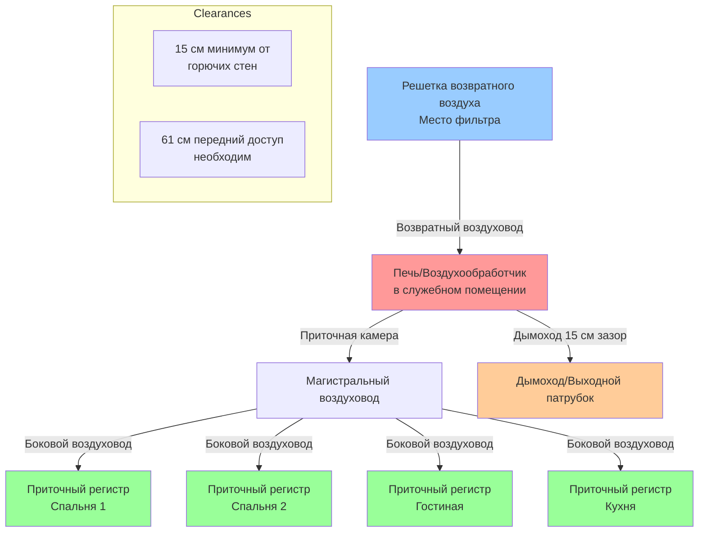

NFPA 90B устанавливает стандарты установки для систем теплого воздушного отопления и кондиционирования воздуха, обслуживающих жилые и малые коммерческие здания. Этот стандарт охватывает одно- и двухсемейные дома, мобильные дома, рекреационные транспортные средства и другие многоквартирные жилые здания с индивидуальными системами отопления и охлаждения.

## Область применения и назначение

NFPA 90B применяется к системам теплого воздушного отопления, где пропускная способность циркуляции воздуха не превышает 2000 CFM (м³/ч) и тепловой ввод не превышает 286 МВт для газовых приборов или 179 МВт для масляных приборов. Стандарт тесно координируется с Международным кодексом жилищного строительства (IRC) Глава 16 для систем воздуховодов и Глава 24 для установок топливного газа.

Стандарт охватывает:
- Заводские камины и печи-камины
- Жилые принудительные воздушные печи (газовые, масляные, электрические)
- Тепловые насосы и системы кондиционирования воздуха
- Системы воздуховодов (приточные, возвратные и вытяжные)
- Компоненты и принадлежности распределения воздуха

## Требования к материалам воздуховодов

Материалы воздуховодов должны соответствовать определенным критериям производительности по огнестойкости, структурной целостности и предотвращению утечек воздуха. В следующей таблице описаны одобренные материалы и их применение:

| Тип материала | Применение | Макс. температура | Требования к толщине |
|--------------|-------------|-----------------|------------------------|
| Оцинкованная сталь | Приточные/возвратные воздуховоды | 121°C непрерывно | Калибр 28 минимум для ≤36 см |
| Алюминиевый лист | Приточные/возвратные воздуховоды | 121°C непрерывно | 0,48 мм минимум для ≤36 см |
| Нержавеющая сталь | Высокотемпературные приложения | 538°C непрерывно | Калибр 28 минимум |
| Доска из стекловолокна | Низкоскоростные системы | 121°C непрерывно | Указано и маркировано |
| Гибкий воздуховод (металлизированный) | Короткие пролеты, соединения | 121°C прерывисто | Указан UL 181 |
| ПВХ/ХПВХ | Забор воздуха для сгорания | По списку | Указан для применения |
| Бетон/кирпичная кладка | Подземные/встроенные | Варьируется | Облицован или покрыт |

Все материалы воздуховодов должны иметь соответствующие списки от признанных испытательных лабораторий (UL 181 для гибких воздуховодов, UL 181A для жестких из стекловолокна, UL 181B для систем закрытия).

## Зазоры печей и оборудования

Требования к зазорам предотвращают пожарные опасности и обеспечивают надлежащую работу. Эти размеры представляют минимальные расстояния от горючих материалов, если только оборудование специально не указано для уменьшенных зазоров:

| Тип оборудования | Спереди | Боки | Сзади | Сверху | Дымоход |
|---------------|-------|-------|------|-----|-----------|
| Газовая печь (стандартная) | 61 см | 15 см | 15 см | 15 см | 15 см радиус |
| Масляная печь (стандартная) | 61 см | 30 см | 30 см | 46 см | 46 см радиус |
| Электрическая печь | 61 см | 7,6 см | 7,6 см | 7,6 см | Н/П |
| Указанная низкозазорная | По этикетке | По этикетке | По этикетке | По этикетке | По этикетке |
| Тепловой насос (внутренний) | 61 см | 15 см | 15 см | 15 см | Н/П |

Оборудование, установленное в нишах или шкафах, требует дополнительных зазоров для обеспечения надлежащего поступления воздуха для сгорания (для топливоиспользующих приборов) и доступа к обслуживанию. Передний зазор должен позволять полный доступ к отсеку горелки и элементам управления.

## Конфигурация установки жилой HVAC

## Требования к установке воздуховодов

**Конструкция приточного воздуховода:** Приточные воздуховоды должны сохранять структурную целостность под положительным давлением (обычно 1,2–4,8 см вод. ст.) и сопротивляться утечке воздуха. Соединения и швы требуют механического крепления плюс мастика герметик или чувствительная к давлению лента, соответствующая стандартам UL 181A-P (жесткие) или UL 181B-FX (гибкие). Продольные швы должны быть на верхних поверхностях, где они доступны.

**Конструкция возвратного воздуховода:** Системы возвратного воздуха работают под отрицательным давлением и требуют тщательной герметизации для предотвращения инфильтрации некондиционированного воздуха или загрязнителей. Полости в зданиях (промежутки между лагами, стеновые полости) запрещены как камеры возвратного воздуха, если они не герметичны и не построены из непрерывных горючих материалов или облицованы одобренным материалом воздуховода.

**Опоры и распорки:** Металлические воздуховоды требуют опоры с максимальными интервалами 3 м с использованием металлических ремней, подвесов или кронштейнов. Гибкий воздуховод должен поддерживаться каждые 1,2 м максимум и натянут, чтобы минимизировать потерю давления (провис не превышающий 1,3 см на метр длины).

**Проходки:** Где воздуховоды проходят через огнестойкие узлы (стены, полы, потолки), требуются противопожарные заслонки или другие методы противопожарной защиты для сохранения огнестойкости узла. Горючие воздуховоды должны быть заменены металлическими на 46 см с обеих сторон проходки.

## Воздух для сгорания и вентиляция

Топливоиспользующие приборы требуют адекватного воздуха для сгорания, чтобы обеспечить полное сгорание и предотвратить выброс продуктов сгорания. Признаны два метода:

**Внутренний воздух для сгорания:** Требует двух постоянных отверстий (одно в пределах 30 см от потолка, одно в пределах 30 см от пола), каждое с минимальной свободной площадью 645 см² на 286 МВт теплового ввода для замкнутых пространств. Здания с плотной конструкцией (устойчивые к инфильтрации) требуют специального наружного воздухоснабжения.

**Наружный воздух для сгорания:** Прямое соединение с внешней средой через два отверстия или одно отверстие с моторизованными заслонками. Минимальная свободная площадь составляет 1,6 см² на 114 МВт теплового ввода, когда оба отверстия соединяются непосредственно с наружной средой.

## Специальные соображения по установке

**Установка на чердаке:** Воздуховоды в некондиционированных чердаках требуют теплоизоляции с тепловым сопротивлением R-1,4 (RSI 0,25) или выше для предотвращения конденсации и потерь тепла. Опоры должны учитывать дополнительный вес изоляции. Доступ для обслуживания должен быть предусмотрен в соответствии с требованиями IRC (минимальное отверстие 56 см × 76 см, беспрепятственный проход).

**Установка в подземном пространстве:** Воздуховоды в вентилируемых подземных пространствах требуют теплоизоляции и защиты от паров. Опоры должны предотвращать контакт с землей. Гибкий воздуховод разрешен, но должен быть установлен на прочные поверхности или подвешен, чтобы предотвратить повреждение от пешеходного движения во время обслуживания.

**Установка в гараже:** Оборудование и воздуховоды, установленные в гаражах, должны быть защищены от физических повреждений и установлены с высотой основания минимум 46 см над полом для топливоиспользующих приборов (для предотвращения воспламенения паров бензина, которые тяжелее воздуха).

**Мобильное жилье:** Применяются дополнительные требования в соответствии со стандартами HUD, включая испытание герметичности системы воздуховодов и специальные методы опоры для предотвращения повреждений во время транспортировки и установки.

## Проверка и испытание

Системы воздуховодов должны быть проверены на надлежащие материалы, опоры и герметизацию перед скрытием. Визуальная проверка проверяет зазоры, надлежащий уклон для отвода конденсата (если применимо) и отсутствие повреждений. Некоторые юрисдикции требуют испытания утечки воздуховодов с максимально допустимой утечкой 1,7–2,3 CFM (м³/ч) на 100 м² кондиционируемой площади при испытательном давлении 25 Па.

Органы управления, имеющие юрисдикцию, могут потребовать демонстрацию надлежащего поступления воздуха для сгорания, надлежащего отвода продуктов сгорания и проверки правильного функционирования автоматических устройств безопасности перед окончательным одобрением.

## Координация с другими стандартами

NFPA 90B координируется с несколькими стандартами для предоставления комплексного руководства по установке:
- NFPA 54 (Национальный кодекс газового топлива) для трубопроводов газа и соединений приборов
- NFPA 31 для установки масляного оборудования
- NFPA 211 для дымоходов, каминов, вентиляционных отверстий и систем твердого топлива
- Главы 12–24 IRC для жилых механических систем
- ASHRAE 62.2 для требований жилой вентиляции

Инструкции производителей оборудования имеют приоритет, когда они предусматривают более ограничивающие требования, чем NFPA 90B, поскольку списания оборудования основаны на конкретных параметрах установки, проверенных посредством испытаний.
