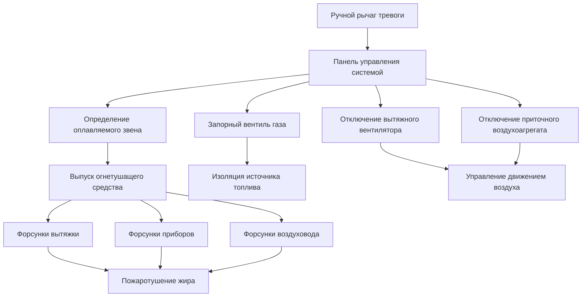
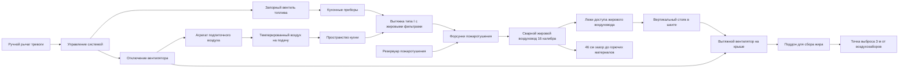

## Обзор NFPA 96

NFPA 96, Стандарт контроля вентиляции и противопожарной защиты коммерческих кухонь, устанавливает всеобъемлющие требования пожарной безопасности для всего коммерческого кухонного оборудования и связанных систем вентиляции. Опубликованный Национальной ассоциацией по защите от пожаров и обновляемый трёхлетнему циклу, этот стандарт охватывает одну из наиболее опасных в отношении пожаров зон коммерческих зданий — коммерческую кухню.

Коммерческие кухни производят пары, нагруженные жиром, которые при неправильном захватывании и удалении накапливаются внутри воздуховодов и создают серьёзные пожарные опасности. NFPA 96 предоставляет подробные требования к конструкции вытяжки, конструкции вытяжных воздуховодов, системам пожаротушения и процедурам обслуживания для минимизации этого риска. Как Международный механический кодекс (IMC), так и Единый механический кодекс (UMC) ссылаются на NFPA 96 как на основной стандарт для систем вытяжки коммерческих кухонь.

## Область применения и сфера действия

### Охватываемое оборудование и операции

NFPA 96 применяется ко всем коммерческим предприятиям общественного питания, включая:

- Рестораны, столовые и заведения быстрого питания
- Кухни гостиниц и учреждений
- Отделы подготовки продуктов в продуктовых магазинах
- Кухни больниц и домов престарелых
- Столовые в школах и университетах
- Киоски с закусками и мобильные продовольственные операции
- Корпоративные столовые

Стандарт охватывает как стационарное, так и мобильное кухонное оборудование, которое производит пары, нагруженные жиром, или дым, включая приборы для приготовления на твёрдом топливе (древесный уголь, дерево), требующие специализированные управления.

### Исключённые применения

NFPA 96 не применяется к:

- Жилому приготовлению пищи в жилых помещениях
- Бытовым электроплитам в комнатах отдыха (см. NFPA 90A)
- Лабораторным вытяжным шкафам, работающим с исследованиями, связанными с приготовлением пищи
- Промышленным операциям по переработке пищевых продуктов (производственные линии непрерывного действия)

## Классификация вытяжек и конструкция

### Вытяжки типа I (удаление жира)

Вытяжки типа I требуются для всех приборов, которые производят пары, нагруженные жиром. Эти вытяжки включают указанные жировые фильтры или дефлекторы и подключаются к выделенным жировым воздуховодам.

**Подтипы вытяжек типа I:**

- **Настенно-монтируемая навеса:** Наиболее распространённая, установленная на стену над линией приготовления
- **Одиночная островная навеса:** Подвешена над кухонным оборудованием на острове
- **Двойная островная (спина к спине) навеса:** Покрывает две линии приготовления
- **Бровь (близкозахватная) вытяжка:** Вытяжка с близким захватом и уменьшенным выпуском
- **Проходная вытяжка:** Маловысокопрофильная конструкция, позволяющая проходить обслуживанию
- **Вытяжка на задней полке:** Захватывает поднимающееся тепло и жир в защитной стенке прибора

**Расчёт расхода воздуха вытяжки для настенно-монтируемой навеса:**

$$Q_{hood} = V_{face} \times A_{face} = V_{face} \times L_{hood} \times H_{opening}$$

Где:
- $Q_{hood}$ = Требуемый расход вытяжного воздуха (CFM)
- $V_{face}$ = Лицевая скорость на отверстии вытяжки (м/мин)
- $A_{face}$ = Площадь лицевой части вытяжки (м²)
- $L_{hood}$ = Длина вытяжки (м)
- $H_{opening}$ = Высота отверстия вытяжки от поверхности приготовления к нижнему краю (м)

**Минимальные расходы выхлопа согласно Таблице IMC 507.2.2:**

| Режим работы прибора | Тип вытяжки | Расход выхлопа |
|----------------------|-------------|-----------------|
| Лёгкий режим | Настенная навеса | 57 CFM (96 м³/ч) на погонный метр |
| Средний режим | Настенная навеса | 85 CFM (145 м³/ч) на погонный метр |
| Тяжёлый режим | Настенная навеса | 113 CFM (192 м³/ч) на погонный метр |
| Особо тяжёлый режим | Настенная навеса | 142 CFM (241 м³/ч) на погонный метр |
| Лёгкий режим | Островная навеса | 85 CFM (145 м³/ч) на погонный метр |
| Средний режим | Островная навеса | 113 CFM (192 м³/ч) на погонный метр |
| Тяжёлый режим | Островная навеса | 142 CFM (241 м³/ч) на погонный метр |
| Особо тяжёлый режим | Островная навеса | 170 CFM (289 м³/ч) на погонный метр |

**Требования к выпуску вытяжки:**

$$O_{min} = 15 \text{ см за приборм со всех открытых сторон}$$

Для приборов, генерирующих мощные тепловые шлейфы (угольные гриля, печи с верхним огнём), большие выпуски улучшают эффективность захвата:

$$O_{recommended} = 30 \text{ см за пределами краёв прибора}$$

### Вытяжки типа II (удаление тепла и пара)

Вытяжки типа II удаляют тепло, влагу и запахи от приборов, которые не производят жир. Эти вытяжки не требуют жировых фильтров и подключаются к нежировым воздуховодам.

**Применение вытяжек типа II:**

- Паровые котлы и отсечные пароварки
- Варочные котлы для макаронных изделий и пароварки для овощей
- Посудомоечные машины (в учреждениях)
- Печи при отсутствии производства жира

**Расход выхлопа вытяжки типа II:**

$$Q_{typeII} = 850 \text{ до } 2 550 \text{ м³/ч на м² площади вытяжки}$$

Выбор зависит от скорости выделения тепла и производства влаги. Вытяжки над посудомоечными машинами обычно требуют 21-28 м³/ч на погонный метр для обработки выброса пара.

## Конструкция и установка жирового воздуховода

### Требования к материалам воздуховодов

NFPA 96 требует конкретные материалы для систем жировых воздуховодов из-за риска пожарного воздействия:

**Утверждённые материалы:**
- **Сталь:** Чёрная или оцинкованная, минимум 16 калибра (1.52 мм)
- **Нержавеющая сталь:** Тип 304 или 316, минимум 18 калибра (1.22 мм)

Воздуховод должен быть непрерывно сварен с герметичными соединениями. Механические крепёжные элементы, заклёпки или винты запрещены в системах жировых воздуховодов.

**Требования к толщине материала:**

| Размер воздуховода (диаметр или максимальный размер) | Минимум углеродной стали | Минимум нержавеющей стали |
|------------------------------------------------------|-----------------------|------------------------|
| До 760 мм | 16 калибра (1.52 мм) | 18 калибра (1.22 мм) |
| 790-1900 мм | 14 калибра (1.90 мм) | 16 калибра (1.52 мм) |
| Свыше 1900 мм | 12 калибра (2.66 мм) | 14 калибра (1.90 мм) |

### Скорость и калибровка воздуховода

Правильная скорость воздуховода предотвращает отложение жира и избегает чрезмерного шума:

$$V_{duct} = \frac{Q_{exhaust}}{A_{duct}} = \frac{4Q_{exhaust}}{\pi D^2}$$

Где:
- $V_{duct}$ = Скорость воздуховода (м/мин)
- $Q_{exhaust}$ = Расход вытяжного воздуха (CFM)
- $A_{duct}$ = Площадь поперечного сечения воздуховода (м²)
- $D$ = Диаметр воздуховода (м)

**Требуемый диапазон скорости:**

$$152 \text{ м/мин} \leq V_{duct} \leq 457 \text{ м/мин}$$

Скорости ниже 152 м/мин позволяют накоплению жира; скорости, превышающие 457 м/мин, создают шум и увеличивают сопротивление системы.

**Пример расчёта:**

Для вытяжки, выводящей 1900 л/мин (113 CFM) через круглый воздуховод диаметром 51 см:

$$V_{duct} = \frac{4 \times 1900/1.699}{\pi \times (0.51)^2} = \frac{4 \times 1118.88}{0.816} = 5 480 \text{ м/мин}$$

Это превышает максимум. Увеличьте воздуховод до 61 см диаметра:

$$V_{duct} = \frac{4 \times 1118.88}{\pi \times (0.61)^2} = \frac{4 \times 1118.88}{1.166} = 3 834 \text{ м/мин} \checkmark$$

### Зазоры до горючих материалов

NFPA 96 определяет минимальные зазоры между жировыми воздуховодами и горючей конструкцией:

| Конфигурация воздуховода | Минимальный зазор |
|-------------------------|-------------------|
| Открытый жировой воздуховод | 46 см к горючим материалам |
| Жировой воздуховод с указанной системой зазора | По паспорту (обычно 15 или 23 см) |
| Жировой воздуховод в огнестойком ограждении | 0 см (воздуховод может соприкасаться с ограждением) |

**Сокращение зазора с защитой:**

Когда зазор в 46 см нецелесообразен, методы защиты уменьшают требуемый зазор:

- **Указанные заводские системы воздуховодов:** Следуйте требованиям производителя к зазорам (обычно 15-23 см)
- **Полевая изоляция:** Минимум 2.5 см минеральной ваты, рассчитанной на 649°C минимум, сокращает зазор до 23 см
- **Огнестойкое ограждение вала:** Конструкция 1 или 2 часов, допускает нулевой зазор

### Поддержка воздуховода и доступ

**Интервалы поддержки:**

Жировые воздуховды требуют существенной поддержки для предотвращения провисания:

$$S_{support} \leq 3 \text{ м для горизонтальных участков}$$

Опора на каждом проходе этажа и при изменениях направления. Системы поддержки должны быть стальными и негорючими.

**Требования к люкам доступа:**

Установите люки доступа в соответствии с NFPA 96:

- На верхних и нижних концах вертикальных стояков
- Максимум 3.7 м в расстоянии на горизонтальных участках
- При изменениях направления, превышающих 45 градусов
- Минимум 51 см × 51 см для воздуховодов свыше 61 см

## Системы пожаротушения

### Требования к автоматическому пожаротушению

NFPA 96 требует автоматических систем пожаротушения, защищающих:

1. **Внутреннюю часть вытяжки и фильтры:** Полное покрытие всех зон, где накапливается жир
2. **Кухонные приборы:** Защита всех поверхностей приборов внутри вытяжки
3. **Жировой воздуховод:** Защита внутреннего пространства воздуховода (для систем с твёрдым топливом)

**Типичные типы систем пожаротушения:**

- **Системы влажного химиката:** Одобрены UL 300, наиболее распространены для современного кухонного оборудования
- **Водные системы:** Предварительно спроектированный водяной туман или дренчер, растущая популярность
- **Системы сухого химиката:** Устаревшие системы (больше не соответствуют требованиям для новых установок)

**Конструкция системы влажного химиката:**

$$N_{nozzles} = \frac{L_{hood}}{S_{nozzle}} + 1$$

Где:
- $N_{nozzles}$ = Требуемое количество форсунок вытяжки
- $L_{hood}$ = Длина вытяжки (м)
- $S_{nozzle}$ = Расстояние форсунок согласно производителю (обычно 2.4-3 м)

### Компоненты системы пожаротушения

**Температура активации оплавляемого звена:**

$$T_{link} = 177°C \text{ до } 260°C$$

Звенья плавятся при проектной температуре, высвобождая механическое ограничение, которое запускает выпуск огнетушащего средства.

### Управление вспомогательным оборудованием

Активация системы пожаротушения должна одновременно:

- **Отключить топливо/электроэнергию** всем защищённым кухонным приборам (газовые электромагнитные клапаны, электрические контакторы)
- **Отключить вытяжные вентиляторы** для предотвращения эвакуации средства и возникновения пожарного сквозняка
- **Отключить агрегаты подпиточного воздуха** для исключения кислорода
- **Активировать систему оповещения о пожаре в здании** (если предусмотрено) через модуль мониторинга

NFPA 96 запрещает временные задержки или переключатели отказа на этих функциях безопасности.

## Требования подпиточного воздуха

### Расчёт объёма подпиточного воздуха

Удаление вытяжного воздуха создаёт отрицательное давление в здании, требующее замены подпиточного воздуха:

$$Q_{makeup} \geq 0.80 \times Q_{exhaust}$$

Как минимум, предусмотрите подпиточный воздух, равный 80% вытяжного. Многие юрисдикции требуют 100% подпиточного воздуха для предотвращения проблем с избыточным давлением в здании.

**Энергетические соображения:**

Кондиционированный подпиточный воздух поддерживает комфорт на кухне:

$$Q_{cooling} = 1.23 \times Q_{makeup} \times \Delta T$$

Где:
- $Q_{cooling}$ = Охлаждающая нагрузка от подпиточного воздуха (кДж/ч)
- $Q_{makeup}$ = Объём подпиточного воздуха (м³/ч)
- $\Delta T$ = Разница температур (°C) между наружной и желаемой температурой кухни

### Распределение подпиточного воздуха

**Методы распределения:**

1. **Прямая подача в вытяжку:** Низкоскоростной воздух, подаваемый непосредственно на лицевую часть вытяжки, уменьшает требования к вытяжке на 10-20%
2. **Подача по периметру:** Диффузоры по периметру кухни, направляющие воздух к вытяжкам
3. **Распределение в служебной зоне:** Общая вентиляция со стратегическим размещением диффузоров
4. **Распределение в зале обслуживания:** Воздух избыточного давления поступает на кухню из залов обслуживания

**Соображения по скорости:**

Подпиточный воздух не должен нарушать захват вытяжкой:

$$V_{makeup} \leq 0.38 \text{ м/сек на периферии лицевой части вытяжки}$$

Высокоскоростные струи подпиточного воздуха, падающие на лицевую часть вытяжки, создают турбулентность, которая нарушает эффективность захвата.

## Схема кухонной системы вытяжки

## Проверка, испытание и техническое обслуживание

### Требования по частоте очистки

NFPA 96 требует проверки и очистки в зависимости от объёма работ:

| Уровень использования | Частота проверки/очистки |
|----------------------|------------------------|
| Системы с приготовлением на твёрдом топливе | Ежемесячно |
| Высокопроизводительные операции (круглосуточно, приготовление на углях) | Ежеквартально |
| Среднепроизводительные операции | Дважды в год |
| Низкопроизводительные операции (церкви, дома для пожилых) | Ежегодно |

**Требования к очистке:**

- Удалите все накопления жира из внутренней части вытяжки, фильтров, воздуховодов и вентилятора
- Допустимые остатки: Максимум 3 мм влажной плёнки жира
- Получите доступ ко всей системе воздуховодов через установленные люки доступа
- Используйте квалифицированных подрядчиков по очистке вытяжек в соответствии со стандартами IKECA или Cikca

### Испытание системы пожаротушения

**Техническое обслуживание два раза в год проверяет:**

- Правильность установки оплавляемых звеньев и отсутствие повреждений
- Форсунки свободны от препятствий и правильно ориентированы
- Цилиндр(ы) с огнетушащим средством надлежащим образом заполнены (взвешивание или использование манометра)
- Ручные рычаги тревоги доступны и обозначены
- Запорные вентили топлива приборов функционируют надлежащим образом
- Газопроводы свободны от утечек

**Ежегодное испытание включает:**

- Срабатывание системы с использованием ручного рычага тревоги (без выпуска огнетушащего средства)
- Проверка функционирования всех блокировок (отключение вентилятора, отключение топлива, уведомление об оповещении)
- Проверка механических и электрических компонентов
- Проверка веса/давления резервуара огнетушащего средства в соответствии со спецификацией

### Документация и записи

Ведите постоянные записи, включая:

- Даты обслуживания вытяжки и названия компаний
- Отчёты о проверке подрядчика по пожаротушению
- Фотографии, документирующие накопление жира перед очисткой
- Ремонты, изменения или замены компонентов
- Сертификация технических специалистов, выполняющих работы

Органы юрисдикции (AHJ) могут запросить эти записи во время проверок.

## Соответствие коду и правоприменение

### Ссылки IMC на NFPA 96

Раздел 507 Международного механического кодекса обширно ссылается на NFPA 96:

- **IMC 507.2.1:** Оборудование для вытяжки коммерческой кухни должно соответствовать NFPA 96
- **IMC 507.13:** Системы воздуховодов соответствуют NFPA 96 для конструкции жирового воздуховода
- **IMC 507.2.5:** Системы пожаротушения соответствуют NFPA 96 и Международному коду пожарной безопасности

### Распространённые нарушения кодекса

**Частые дефекты, обнаруженные при проверках:**

1. **Недостаточные зазоры воздуховода:** Жировые воздуховды слишком близко к горючим балкам или каркасу
2. **Отсутствующие люки доступа:** Неадекватный доступ для очистки всей длины воздуховода
3. **Неправильные материалы воздуховода:** Использование спирального замыкаемого или заклёпанного воздуховода вместо сварного
4. **Необозначенное оборудование:** Кухонное оборудование, находящееся вне зоны захвата вытяжки
5. **Недостаточный подпиточный воздух:** Чрезмерное отрицательное давление на кухне
6. **Несоответствующее пожаротушение:** Устаревшие системы сухого химиката или отсутствующая защита воздуховода
7. **Отложенная очистка:** Чрезмерное накопление жира, превышающее толщину в 1/8 дюйма (3.2 мм)

## Заключение

NFPA 96 предоставляет всеобъемлющие требования, которые защищают коммерческие кухни — одну из наиболее опасных в отношении пожаров зон любого здания. Правильная конструкция вытяжки обеспечивает эффективный захват паров, нагруженных жиром, в то время как конструкция жирового воздуховода с адекватными зазорами предотвращает распространение пожара. Автоматические системы пожаротушения обеспечивают критическую защиту при возникновении пожаров, а регулярная очистка удаляет накопившиеся источники топлива. Инженеры должны тщательно интегрировать вытяжки типа I и II, надлежащим образом рассчитывать системы вытяжки и подпиточного воздуха и согласовывать пожаротушение со всеми вспомогательными управлениями. Текущее обслуживание и документация обеспечивают постоянное соответствие и безопасность жильцов на протяжении всего операционного периода объекта.
