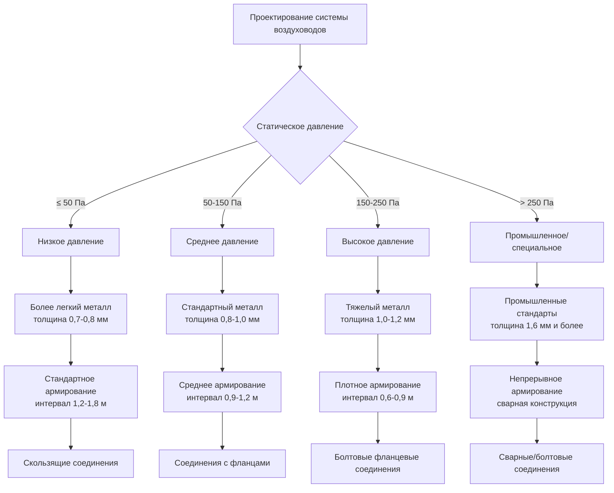

## Обзор

Национальная ассоциация подрядчиков листового металла и кондиционирования воздуха (SMACNA) публикует ведущие в отрасли технические руководства, устанавливающие стандарты конструкции, монтажа и испытаний систем HVAC. Эти стандарты содержат подробные спецификации для изготовления воздуховодов, сейсмического крепления, управления качеством воздуха в помещении и процедур пуска систем, используемых во всей отрасли механического подряда.

Стандарты SMACNA служат авторитетным справочником для проектировщиков, подрядчиков и должностных лиц кодекса. Хотя они не являются юридически обязательными кодексами, они широко упоминаются в строительных кодексах, спецификациях и контрактных документах. Соответствие стандартам SMACNA демонстрирует приверженность лучшим практикам отрасли и гарантирует производительность, безопасность и долговечность системы.

## Основные публикации SMACNA

### Стандарты конструкции воздуховодов

| Публикация | Применение | Ключевые особенности |
|-------------|-------------|--------------|
| Стандарты конструкции воздуховодов HVAC - металлические и гибкие | Коммерческие системы HVAC до 50 Па | Классификация давления, графики армирования, требования к швам и соединениям |
| Конструкция прямоугольных промышленных воздуховодов | Высокопроизводительные промышленные системы | Охватывает давления от 50 Па и выше до 100 Па, конструкция из толстого металла |
| Конструкция круглых промышленных воздуховодов | Высокоскоростные промышленные выхлопные системы | Спецификации спирального замка, методы сварки |
| Стандарты конструкции стеклопластиковых воздуховодов | Низконапорные системы распределения | Методы монтажа, герметизация соединений, акустические свойства |
| Конструкция термопластических воздуховодов | Выхлопные системы с едкими парами | Спецификации материалов ПВХ, ПП, ПВДФ и методы изготовления |

### Стандарты сейсмического и конструктивного крепления

| Публикация | Применение | Ключевые особенности |
|-------------|-------------|--------------|
| Руководство по сейсмическому креплению | Оборудование и воздуховоды в сейсмических зонах | Расчеты конструкции, детали крепления, определение размеров кабелей и стержней |
| Руководство по архитектурному листовому металлу | Кровельное оборудование на постаментах | Детали гидроизоляции, защита от атмосферы, конструктивная интеграция |

### Стандарты производительности системы

| Публикация | Применение | Ключевые особенности |
|-------------|-------------|--------------|
| Испытание, регулировка и балансировка систем HVAC | Пуск воздушных и гидравлических систем | Процедуры TAB, формы отчетов, критерии приемки |
| Руководящие принципы IAQ для занятых зданий в процессе строительства | Качество воздуха на этапе строительства | Контроль источников, фильтрация, стратегии изоляции |
| Руководство по испытанию утечки воздуховодов | Проверка герметичности воздуховодов | Методология испытаний для классов герметизации A, B, C |

## Классификация давления при конструкции воздуховодов

SMACNA определяет требования к конструкции воздуховодов на основе статического давления и скорости:

## Классификация герметизации воздуховодов

SMACNA устанавливает три класса герметизации на основе максимально допустимой утечки при испытательном давлении:

| Класс герметизации | Максимальная утечка (м³/ч на м² при 25 Па) | Типичные применения |
|------------|--------------------------------------|----------------------|
| Класс герметизации C | 0,68 м³/ч | Низконапорные системы возврата воздуха, выхлопные системы |
| Класс герметизации B | 0,34 м³/ч | Системы подачи воздуха, общее применение |
| Класс герметизации A | 0,17 м³/ч | Высокопроизводительные системы, наружный воздух, рекуперация энергии |

Давление испытания варьируется в зависимости от рабочего давления: системы, работающие при давлении 75 Па и выше, испытываются при 1,5-кратном рабочем давлении, в то время как системы более низкого давления испытываются при рабочем давлении плюс 25 Па.

## Требования сейсмического крепления

Стандарты сейсмического крепления SMACNA содержат всеобъемлющие спецификации крепления для воздуховодов, трубопроводов и оборудования в сейсмических категориях конструкции C–F:

**Требования к креплению воздуховодов:**

- Поперечное крепление: максимальный интервал 12 м (9 м для воздуховодов шириной более 0,7 м)
- Продольное крепление: максимальный интервал 12 м, минимум два креления на участок воздуховода
- Четырехстороннее крепление требуется при изменении направления, отводах и подключениях оборудования
- Углы крепления: 30° до 60° от горизонтали для оптимальной передачи нагрузок

**Детали крепления:**

- Конструктивные крепления должны выдерживать расчетные сейсмические силы на растяжение и сжатие
- Анкеры для бетона и кирпичной кладки требуют одобрения ICC-ES для сейсмических применений
- Зазоры необходимы между воздуховодами и конструктивными элементами для предотвращения повреждений при сейсмических событиях
- Системы виброизоляции требуют сейсмических демпферов или ограниченных пружинных изоляторов

## Стандарты энергетических систем

Сосредоточенные на энергии публикации SMACNA рассматривают эффективность и устойчивость:

- **Руководство по пуску систем HVAC**: Систематическая проверка монтажа оборудования, последовательностей управления и испытаний производительности
- **Справочник оборудования для рекуперации энергии**: Выбор и монтаж вентиляторов рекуперации энергии, энтальпийных колес и замкнутых контуров
- **Оптимизация системы воздуховодов**: Правильный расчет размеров воздуховодов для снижения энергопотребления при сохранении адекватного расхода воздуха

## Руководящие принципы IAQ во время строительства

Руководящие принципы IAQ SMACNA устанавливают протоколы для предотвращения загрязнения систем зданий во время строительства:

1. **Контроль источников**: Хранение пористых материалов в сухих местах, защита от проникновения влаги
2. **Прерывание путей распространения**: Герметизация воздуховодов во время строительства, использование временной фильтрации
3. **Защита HVAC**: Отсрочка монтажа или применение усиленной фильтрации при проведении высокопыльных работ
4. **Управление влажностью**: Контроль уровня влажности, предотвращение стоячей воды в системах воздуховодов
5. **Пуск системы**: Проверка чистоты перед заселением, проведение осмотра и очистки воздуховодов при необходимости

## Процедуры испытания и балансировки

Процедуры TAB SMACNA устанавливают систематические методы проверки производительности системы HVAC:

**Воздушные системы:**
- Траверсные измерения в воздуховодах с использованием массивов трубки Прандтля
- Регулировка концевых устройств для достижения расхода проектного воздуха в пределах ±10%
- Проверка статического давления на выходе вентилятора и во всей системе распределения
- Показания ампеража и напряжения двигателя для проверки производительности вентилятора

**Гидравлические системы:**
- Измерение расхода с использованием откалиброванных балансировочных клапанов или ультразвуковых счетчиков
- Пропорциональная балансировка для достижения расходов проектного расхода в пределах ±5%
- Проверка кривых производительности насоса
- Показания перепада давления через катушки и регулирующие клапаны

## Применение в спецификациях

Стандарты SMACNA интегрируются в проектные спецификации путем ссылки:

- **Раздел 23 31 00 - Воздуховоды и кожухи HVAC**: "Изготавливать и монтировать металлические воздуховоды в соответствии со стандартами SMACNA HVAC Duct Construction Standards, 3-е издание, для указанных давлений и скоростей."
- **Раздел 23 05 93 - Испытание, регулировка и балансировка**: "Выполнять работы TAB в соответствии с SMACNA HVAC Systems Testing, Adjusting & Balancing, 4-е издание."

Проектировщики указывают класс герметизации, класс давления, класс армирования и категорию сейсмического конструирования для установления обязательных критериев производительности на основе методологий SMACNA.

## Компоненты

- Стандарты конструкции воздуховодов HVAC, металлические и гибкие
- Конструкция прямоугольных промышленных воздуховодов
- Конструкция круглых промышленных воздуховодов
- Стандарты конструкции стеклопластиковых воздуховодов
- Испытание утечки воздуховодов SMACNA
- Испытание, регулировка и балансировка систем HVAC
- Руководящие принципы IAQ для занятых зданий
- Руководство по архитектурному листовому металлу
