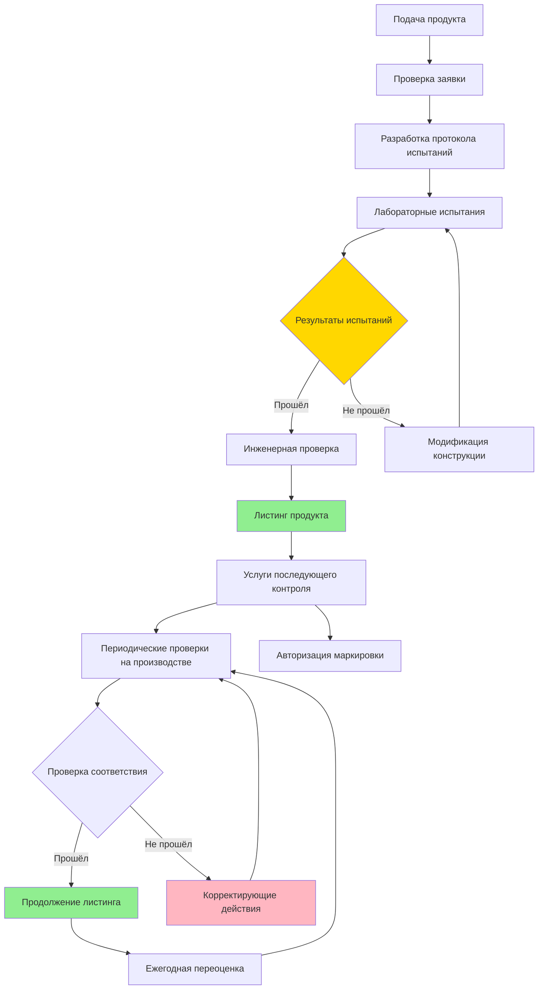

Underwriters Laboratories (UL) устанавливает критические стандарты безопасности для оборудования HVAC посредством тщательного тестирования и протоколов сертификации. Сертификация UL обеспечивает независимую проверку соответствия продуктов определённым требованиям безопасности, решая проблемы пожарной опасности, электробезопасности и конструктивной целостности. Оборудование с маркировкой UL Listed прошло комплексную оценку и продолжает контролироваться посредством периодических проверок на производстве.

## Основные стандарты UL для оборудования HVAC

### Стандарты основного оборудования

| Стандарт UL | Название | Применение |
|-------------|----------|-----------|
| **UL 1995** | Оборудование отопления и охлаждения | Печи, кондиционеры, тепловые насосы, крышные установки |
| **UL 1812** | Канальные рекуператоры тепла | HRVs, ERVs, оборудование рекуперации энергии |
| **UL 2021** | Стационарные электрические обогреватели помещений и установки | Электрическое отопительное оборудование, цеховые обогреватели |
| **UL 207** | Компоненты и аксессуары, содержащие хладагент | Компрессоры, конденсаторы, испарители |
| **UL 1995A** | Оборудование отопления и охлаждения для мобильных домов | Системы HVAC для жилых домов производства |

### Стандарты пожарной безопасности и материалов

| Стандарт UL | Название | Критические параметры |
|-------------|----------|----------------------|
| **UL 555** | Противопожарные заслонки | Рейтинги огнестойкости 1,5 часа и 3 часа, рейтинги воздушного потока |
| **UL 555S** | Дымовые заслонки | Классификация утечки, рейтинги температуры |
| **UL 2043** | Испытание огнем для выделения тепла и видимого дыма | Пространства обработки воздуха, оборудование, рассчитанное для плены |
| **UL 723** | Характеристики горения поверхности | Индекс распространения пламени ≤25, выделение дыма ≤50 |
| **UL 181** | Воздуховоды и соединители воздуха, изготовленные на заводе | Конструкция воздуховода класса 0, класса 1, системы герметизации |
| **UL 181A** | Системы герметизации для жёстких воздуховодов | Ленты, мастики, механические крепежи |
| **UL 181B** | Системы герметизации для гибких воздуховодов | Гибкие соединители воздуховодов, герметики |
| **UL 94** | Воспламеняемость пластических материалов | Классификация V-0, V-1, V-2 для компонентов |

### Стандарты компонентов и аксессуаров

| Стандарт UL | Название | Область применения |
|-------------|----------|-------------------|
| **UL 353** | Контроллеры пределов | Переключатели верхнего предела, рабочие контролёры |
| **UL 372** | Первичные контроллеры безопасности | Системы защиты от пламени, газовые клапаны |
| **UL 60730** | Автоматические электрические контролёры | Электронные контролёры, программируемые термостаты |
| **UL 508A** | Промышленные панели управления | Шкафы управления, панели автоматизации |

## Процесс сертификации UL

## Категории листинга UL

**UL Listed**: Полный продукт был протестирован в соответствии с применимыми стандартами безопасности. Весь блок соответствует всем требованиям UL и может иметь маркировку UL Listed. Это представляет наивысший уровень сертификации UL и требуется большинством строительных норм для основного оборудования HVAC.

**UL Recognized Component**: Отдельный компонент был оценён для использования в полных продуктах. Компоненты, такие как двигатели, контролёры или теплообменники, могут быть UL Recognized, но должны быть встроены в UL Listed конечный продукт. Маркировка Recognized Component (UL в обратной букве "R") появляется только в производственных условиях, а не на потребительских продуктах.

**UL Classified**: Продукт был оценён с точки зрения конкретных свойств или характеристик производительности. Классификация решает конкретные требования пожарной безопасности, аварийной безопасности или нормативные требования, а не комплексную оценку безопасности. Примеры включают противопожарные заслонки, классифицированные для определённых рейтингов огнестойкости.

## Требования UL 1995 для оборудования отопления и охлаждения

UL 1995 устанавливает комплексные требования безопасности для жилого и коммерческого оборудования HVAC. Основные области оценки включают:

**Электробезопасность**: Непрерывность заземления, защита от перегрузки по току, сопротивление изоляции, расстояния между живыми частями и доступными поверхностями. Все электрические компоненты должны выдерживать диэлектрическое испытание напряжением 1000 В плюс дважды номинальное напряжение в течение одной минуты без пробоя.

**Пожарные опасности**: Воспламенение наружных материалов, воспламеняемость внутренних компонентов, повышение температуры на прилегающих горючих материалах. Окружающие горючие материалы не должны превышать пределы повышения температуры: 50°C на поверхностях непосредственно над оборудованием, 36°C на боковых и фронтальных поверхностях.

**Механические опасности**: Острые края, точки сжатия, открытость лопастей вентилятора, безопасность панели. Движущиеся части должны быть защищены, чтобы предотвратить контакт во время нормальной работы и плановых работ по обслуживанию.

**Целостность хладагентного контура**: Испытание под давлением в 1,5 раза номинального давления работы, стойкость к вибрации, прочность соединений труб. Устройства сброса давления должны работать правильно при 90% от давления разрыва.

**Производительность системы управления**: Ответ контроллера пределов, работа защиты от пламени, целостность контура безопасности. Контролёры верхнего предела должны открывать цепи до развития опасных температур.

## Рейтинг плены UL 2043

UL 2043 решает проблему пожарной производительности оборудования и материалов, установленных в пространствах обработки воздуха (плены). Испытания оценивают выделение тепла и образование дыма при воздействии источников воспламенения, представляющих электрическую неисправность.

**Процедура испытания**: Образец размещается в камере плены размером 2,4 м × 3,7 м × 0,55 м с контролируемым воздушным потоком. На 20 минут прикладывается источник воспламенения песочной бани мощностью 2,5 кВт. Пиковая скорость выделения тепла не должна превышать 100 кВт, а среднее выделение тепла за любой 5-минутный период не должно превышать 25 кВт. Оптическая плотность дыма не должна превышать 0,5 на единицу длины в любой точке измерения.

**Применение**: Требуется для оборудования, установленного над подвесными потолками, используемыми в качестве плены возвратного воздуха, включая оконечные установки, вентиляторные боксы, воздухообрабатывающие установки и панели управления. Рейтинг 2043 отличается от рейтингов кабеля и провода для плены (CMP), которые следуют другим протоколам испытания.

## Требования противопожарной заслонки UL 555

UL 555 оценивает противопожарные заслонки на способность поддерживать целостность пожарного отсека при установке в системы распределения воздуха. Испытания определяют почасовые рейтинги огнестойкости (1,5 часа или 3 часа) на основе производительности при стандартных испытаниях огнём.

**Испытание статическим огнём**: Узел заслонки монтируется в стену печи и подвергается воздействию кривой время-температура согласно ASTM E119. Заслонка должна предотвращать проход пламени и ограничивать повышение температуры на неподвергнутой стороне до 140°C в среднем или 163°C в любой отдельной точке. Испытание водяной струёй проводится при 75% от продолжительности испытания огнём.

**Испытание динамическим огнём**: Заслонка работает в условиях воздушного потока (скорость 10 м/с) во время воздействия для проверки надлежащего закрытия в реальных условиях. Лопасти должны полностью закрыться в течение оценённого времени закрытия (обычно 30 секунд) и поддерживать положение на протяжении всего воздействия огня.

**Температурные рейтинги**: Рейтинги плавкой перемычки 74°C, 100°C и 141°C соответствуют нормальным условиям окружающей среды в месте установки. Более высокие оценённые перемычки предотвращают ненужное закрытие в жарких условиях, а всё ещё реагируют на условия пожара.

## Классификация распространения пламени UL 723

UL 723 (ASTM E84) измеряет характеристики поверхностного горения строительных материалов с помощью туннельного теста Steiner. Образец длиной 7,6 м подвергается воздействию контролируемого пламени на одном конце в течение 10 минут при горизонтальном монтаже в испытательном туннеле.

**Индекс распространения пламени (FSI)**: Расстояние и скорость распространения пламени в сравнении с эталонными материалами (цементная доска = 0, красный дуб = 100). Материалы класса A имеют FSI ≤ 25, класса B от 26-75, класса C от 76-200.

**Индекс выделения дыма (SDI)**: Оптическая плотность дыма при испытании в сравнении с той же эталонной шкалой. Материалы, рассчитанные на плену, обычно требуют SDI ≤ 50 независимо от классификации FSI.

**Применение HVAC**: Изоляция воздуховодов, гибкие воздуховоды, фиброглассовые воздуховоды, материалы акустической облицовки должны соответствовать классу A (FSI ≤ 25) для скрытых пространств и большинства коммерческих применений. Механические коды широко ссылаются на классификацию UL 723 для одобрения материалов.

## Стандарты конструкции воздуховода UL 181

UL 181 решает проблему конструкции воздуховодов и соединителей, изготовленных на заводе, устанавливая требования к конструкции и системы маркировки для определения надлежащих применений.

**Класс 0**: Неметаллические воздуховоды без термической изоляции. Требует FSI ≤ 25, SDI ≤ 50. Используется для возвратного воздуха и приложений низкого давления, где пожарная производительность критична.

**Класс 1**: Гибкие или жёсткие воздуховоды для систем распределения воздуха. Наиболее распространённая классификация для жилого и коммерческого гибкого воздуховода. Должны выдерживать положительное давление 50 Па и отрицательное давление 50 Па без отказа или чрезмерной утечки.

**UL 181A**: Системы герметизации жёстких воздуховодов, включая ленты с прочностью клея 9 кг/см ширины минимум, мастики с мостиковой способностью на зазорах 3 мм и механические крепежи с устойчивостью к вытягиванию.

**UL 181B**: Системы герметизации гибких воздуховодов, оптимизированные для продольных швов и концевых соединений. Основные требования включают минимальную прочность на разрыв 400 Н при 23°C и сохранение 70% прочности после теплового старения при 93°C в течение 168 часов.

## Программа услуг последующего контроля

UL поддерживает постоянный контроль указанных продуктов посредством незаявленных проверок на производстве, обычно ежеквартально. Инспекторы проверяют постоянное соответствие производственных образцов первоначальным спецификациям, подвергнутым испытанию.

**Контроль маркировки**: Производители должны покупать авторизованные маркировки UL и вести записи о применении маркировки. Каждая маркировка содержит уникальный идентификатор, позволяющий отследить определённые партии производства.

**Изменения конструкции**: Любое изменение указанных продуктов требует уведомления и оценки UL. Изменения, влияющие на параметры безопасности, требуют повторного тестирования; незначительные изменения могут быть одобрены посредством инженерной проверки.

**Контроль рынка**: UL проводит полевые проверки установленного оборудования для проверки надлежащей маркировки и соответствия указанным продуктам. Несоответствующие продукты вызывают полевое расследование и потенциальное исключение из листинга.

## Компоненты

- Сертификация листинга UL
- Оборудование отопления и охлаждения UL 1995
- Канальные рекуператоры тепла UL 1812
- Рейтинг распространения пламени UL 723
- Системы герметизации воздуховодов лентой UL 181
- Воспламеняемость пластиков UL 94
- Требования стандарта UL 1995
- Recognized Component UL
- Классифицированные продукты UL
