## Обзор требований безопасности HVAC

Здравоохранение и безопасность в системах HVAC охватывают комплексный набор нормативных актов, стандартов и лучших практик, разработанных для защиты рабочих, занимающихся обслуживанием, жителей зданий и окружающей среды. Многофункциональный характер работ по HVAC связан с воздействием электрических опасностей, хладагентов, продуктов горения, замкнутых пространств и физических опасностей, требующих строгих протоколов безопасности и постоянного обучения.

Индустрия HVAC работает под контролем перекрывающихся юрисдикций федеральных, государственных и местных органов безопасности, причем основным регулирующим органом являются Управление по безопасности и охране здоровья (OSHA) и Агентство по охране окружающей среды (EPA). Понимание и реализация этих требований безопасности — это не просто соответствие нормативным требованиям, а основа для предотвращения травм, смертельных исходов и ущерба окружающей среде.

## Нормативные акты OSHA для работ по HVAC

OSHA устанавливает и обеспечивает соблюдение стандартов безопасности во всех отраслях, со многими нормативными актами, непосредственно применимыми к операциям HVAC. Положение об общем долге (раздел 5(a)(1)) требует от работодателей предоставлять рабочие места, "свободные от признанных опасностей, которые вызывают или могут вызвать смерть или серьезный физический вред".

**Ключевые стандарты OSHA для HVAC:**

- **29 CFR 1910.147** — Управление опасной энергией (Блокировка/навешивание бирок)
- **29 CFR 1910.146** — Допуск в замкнутые пространства
- **29 CFR 1910.132-138** — Личное защитное оборудование
- **29 CFR 1910.268** — Электробезопасность
- **29 CFR 1910.1200** — Стандарт коммуникации об опасности
- **29 CFR 1926.501** — Защита от падения (строительство)

Деятельность OSHA включает плановые проверки, расследования по жалобам и значительные штрафы за нарушения. Умышленные нарушения могут привести к штрафам до 156 259 долларов за нарушение, в то время как серьезные нарушения влекут штрафы до 15 625 долларов за нарушение. Повторяющиеся нарушения влекут повышенные штрафы, что делает соответствие как юридически, так и финансово необходимым.

| Стандарт OSHA | Нормативный акт | Основная рассматриваемая опасность | Ключевые требования |
|---|---|---|---|
| 29 CFR 1910.147 | Блокировка/навешивание бирок (LOTO) | Непредвиденная активизация | Процедуры изоляции энергии, замки, бирки, обучение |
| 29 CFR 1910.146 | Вход в замкнутое пространство | Атмосферные опасности, захват | Система допусков, атмосферное тестирование, план спасения |
| 29 CFR 1910.134 | Респираторная защита | Воздушные загрязнители | Медицинская оценка, подгонка маски, администрирование программы |
| 29 CFR 1910.269 | Электробезопасность при работах | Удар, дуговая вспышка, электротравма | Обозначение квалифицированного лица, СИЗ, безопасные рабочие методы |
| 29 CFR 1926.501 | Защита от падения | Падения с высоты | Ограждения, страховочные сетки, системы индивидуальной защиты от падения |
| 29 CFR 1910.1200 | Коммуникация об опасности | Химическое воздействие | Паспорта безопасности, маркировка, обучение сотрудников |

### Обязанности работодателя в соответствии с OSHA

Работодатели должны установить комплексные программы безопасности, которые включают:

1. **Письменные политики и процедуры безопасности**, специфичные для операций HVAC
2. **Регулярное обучение сотрудников** по распознаванию опасностей и их смягчению
3. **Предоставление надлежащих СИЗ** за счет работодателя
4. **Ведение записей, требуемых OSHA**, включая журналы травм (форма 300)
5. **Немедленное информирование** о смертельных исходах и серьезных травмах на рабочем месте
6. **Размещение уведомлений OSHA** и информации о правах сотрудников

Подрядчик HVAC должен проводить анализ опасностей работ для обычных и необычных задач, внедряя технические средства контроля, административные средства контроля и СИЗ в этом иерархическом порядке предпочтения. Документация о тренировках по безопасности, проверках оборудования и расследованиях инцидентов формирует основу защищаемых программ безопасности.

## Требования EPA и безопасность окружающей среды

EPA регулирует экологические аспекты работ по HVAC, особенно касающиеся хладагентов, качества воздуха и опасных материалов. Раздел 608 Закона об охране чистого воздуха устанавливает комплексные требования к обращению с хладагентами, их восстановлению и утилизации, которые прямо влияют на технических специалистов HVAC.

**Требования сертификации EPA раздел 608:**

- **Тип I** — Небольшие приборы, содержащие менее 2,3 кг хладагента
- **Тип II** — Аппараты высокого давления (за исключением небольших приборов и MVAC)
- **Тип III** — Аппараты низкого давления
- **Универсальный** — Оборудование всех типов

Технические специалисты должны получить соответствующую сертификацию EPA 608, пройдя проверенные экзамены, демонстрирующие знание свойств хладагентов, методов восстановления, процедур безопасности и нормативных требований. Сертификация обязательна для покупки хладагентов и обслуживания оборудования, с нарушениями, подлежащими принудительному исполнению EPA.

### Требования по управлению хладагентами

Нормативные акты EPA требуют специфических практик для обращения с хладагентами:

**Требования восстановления:**
- Оборудование, произведенное до 15 ноября 1993 г.: 80-90% восстановления
- Оборудование, произведенное после 15 ноября 1993 г.: 90-95% восстановления
- Восстановление до атмосферного давления или определенные уровни вакуума в зависимости от типа оборудования

**Ведение записей:**
- Записи о покупке хладагента
- Журналы восстановления и переработки
- Записи об обслуживании оборудования
- Сертификаты утилизации восстановленного хладагента

Программа Significant New Alternatives Policy (SNAP) EPA оценивает и регулирует заменители хладагентов на вещества, разрушающие озон, требуя от подрядчиков быть в курсе приемлемых заменителей и графиков вывода. По состоянию на 2024 год Закон об американских инновациях и производстве (AIM Act) устанавливает базовые уровни производства и потребления гидрофторуглеводородов (ГФУ), создавая дополнительные требования соответствия.

## Опасности, связанные с хладагентами

Хладагенты представляют множественные угрозы безопасности, требующие специализированных процедур обращения и протоколов реагирования на чрезвычайные ситуации. Понимание свойств хладагентов и характеристик опасности является основополагающим для защиты рабочих.

### Классификация опасности хладагентов

| Хладагент | Группа безопасности ASHRAE | Токсичность | Воспламеняемость | Основные опасности | Предел воздействия (ppm) |
|---|---|---|---|---|---|
| R-410A | A1 | Низкая токсичность | Нет распространения пламени | Удушение, давление | 1000 (NIOSH) |
| R-134a | A1 | Низкая токсичность | Нет распространения пламени | Удушение, сенсибилизация миокарда | 1000 (NIOSH) |
| R-32 | A2L | Низкая токсичность | Низкая воспламеняемость | Удушение, слабая воспламеняемость | 1000 (предложено) |
| R-717 (аммиак) | B2L | Высокая токсичность | Низкая воспламеняемость | Коррозийность, токсичность, воспламеняемость | 25 (OSHA PEL) |
| R-290 (пропан) | A3 | Низкая токсичность | Высокая воспламеняемость | Удушение, взрыв | 1000 (NIOSH) |
| R-744 (CO₂) | A1 | Низкая токсичность | Не воспламеняемость | Удушение, высокое давление | 5000 (OSHA PEL) |

**Критические меры безопасности при работе с хладагентами:**

1. **Предотвращение удушения** — Хладагенты вытесняют кислород в замкнутых пространствах, создавая непосредственно угрожающие жизни условия. Атмосферы с содержанием кислорода менее 19,5% требуют респираторной защиты с подачей воздуха.

2. **Сенсибилизация миокарда** — Галогенированные хладагенты повышают чувствительность миокарда к эпинефрину, потенциально вызывая фатальные аритмии. Избегайте интенсивной деятельности во время воздействия хладагента.

3. **Термическое разложение** — Хладагенты, подвергающиеся воздействию пламени или горячих поверхностей (выше 315°C), разлагаются на токсические соединения, включая фтороводород, хлороводород, фторид карбонила и фосген. Никогда не паяйте или не сваривайте системы, содержащие хладагент, без полной эвакуации.

4. **Опасности давления** — Сжатые хладагенты в баллонах и системах представляют опасность разрыва. Баллоны никогда не должны превышать 54°C или подвергаться механическому повреждению.

5. **Обморожение и холодные ожоги** — Быстрое расширение хладагента вызывает резкое снижение температуры. Контакт с жидким хладагентом вызывает мгновенное обморожение, требующее немедленной медицинской помощи.

## Разработка программы безопасности

Эффективные программы безопасности HVAC интегрируют соответствие нормативным требованиям с активным управлением опасностями. Иерархия средств контроля предоставляет основу для решения проблем безопасности на рабочем месте:

1. **Устранение** — Полностью избавиться от опасности
2. **Замена** — Заменить на менее опасные альтернативы
3. **Технические средства контроля** — Изолировать людей от опасностей
4. **Административные средства контроля** — Изменить рабочие процедуры
5. **СИЗ** — Защитить рабочего с помощью оборудования

### Основные элементы программы

**Оценка опасностей и их контроль:**
- Комплексный анализ безопасности работ для всех обычных задач
- Предварительное планирование для необычных работ
- Регулярные проверки рабочих мест и аудиты
- Расследование инцидентов и отслеживание корректирующих действий

**Программы обучения:**
- Вводное ориентирование новых сотрудников, охватывающее общие требования безопасности
- Специализированное обучение перед назначением на опасные работы
- Ежегодное переподготовка и обновление нормативных требований
- Обозначение компетентного лица и обучение для специализированных задач

**Готовность к чрезвычайным ситуациям:**
- Планы действий в чрезвычайных ситуациях с процедурами эвакуации
- Первая помощь и реагирование на чрезвычайные медицинские ситуации
- Протоколы предотвращения и реагирования на пожары
- Системы коммуникации для уведомлений о чрезвычайных ситуациях

**Мониторинг здоровья:**
- Базовые и периодические медицинские обследования в соответствии с требованиями
- Мониторинг воздействия опасных веществ
- Программы сохранения слуха
- Программы респираторной защиты при необходимости

## Безопасность горения и опасности побочных продуктов

Оборудование HVAC, работающее на ископаемых видах топлива, генерирует побочные продукты горения, представляющие острые и хронические опасности для здоровья. Неполное горение производит угарный газ, альдегиды и взвешенные частицы, требующие постоянного мониторинга и целостности систем вентиляции.

### Пределы воздействия побочных продуктов горения

| Загрязнитель | OSHA PEL | NIOSH REL | IDLH | Воздействия на здоровье |
|---|---|---|---|---|
| Угарный газ (CO) | 50 ppm (средн. за 8 часов) | 35 ppm (средн. за 8 часов) | 1200 ppm | Гипоксия, неврологический ущерб, смерть |
| Диоксид азота (NO₂) | 5 ppm (потолок) | 1 ppm (15-мин STEL) | 20 ppm | Раздражение дыхательной системы, отек легких |
| Диоксид серы (SO₂) | 5 ppm (средн. за 8 часов) | 2 ppm (средн. за 8 часов) | 100 ppm | Раздражение дыхательной системы, спазм бронхов |
| Формальдегид (HCHO) | 0,75 ppm (средн. за 8 часов) | 0,016 ppm (потолок) | 20 ppm | Канцероген, респираторная сенсибилизация |
| Взвешенные частицы (PM₂.₅) | 5 мг/м³ (респирабельные) | 5 мг/м³ (респирабельные) | N/A | Респираторное заболевание, сердечно-сосудистые эффекты |

**Требования безопасности горения:**

1. **Адекватный воздух для горения** — Оборудование с механической тягой требует 47 л/с на 1,76 кВт входной мощности для воздуха горения плюс воздух разбавления в соответствии с NFPA 54. Недостаточный воздух вызывает неполное горение и образование CO.

2. **Целостность системы дымоудаления** — Дымовые газы должны быть полностью изолированы от занятых пространств. Ежегодная проверка и чистка трубопроводов дымоудаления, дымоходов и вытяжных колпаков предотвращает вытекание и обратное движение воздуха.

3. **Обнаружение угарного газа** — Установите детекторы угарного газа с низким уровнем (порог срабатывания 25 ppm) в механических помещениях и смежных занятых пространствах. Жилые детекторы UL 2034 (порог срабатывания 70 ppm) обеспечивают недостаточную защиту для коммерческих установок.

4. **Системы управления пламенем** — Системы защиты пламени должны отключать подачу топлива в течение 4 секунд после отказа пламени. Регулярное тестирование и калибровка датчиков пламени предотвращают небезопасную работу.

## Опасности качества воздуха в помещениях

Системы HVAC прямо влияют на качество воздуха в помещениях, при этом неправильно обслуживаемые системы становятся источниками загрязнения, а не решениями для качества воздуха в помещениях. Биологические, химические и взвешенные загрязнители, распределяемые через воздуховоды, создают широкое воздействие на жителей.

### Загрязнители качества воздуха в помещениях и источники

| Категория загрязнителя | Типичные источники в HVAC | Воздействия на здоровье | Меры контроля |
|---|---|---|---|
| Биологические (бактерии, грибы) | Стоячая вода, мокрые теплообменники, увлажнители | Болезнь легионеллеза, гиперчувствительный пневмонит, астма | Дренаж, UV-C, биоциды, техническое обслуживание |
| Летучие органические соединения | Герметики воздуховодов, изоляция, чистящие продукты | Головная боль, раздражение дыхательной системы, ущерб печени/почкам | Контроль источников, фильтрация, вентиляция |
| Взвешенные частицы | Наружный воздух, строительство, мусор воздуховодов | Респираторное заболевание, аллергические реакции | Фильтрация MERV 13+, чистка воздуховодов |
| Радон | Проникновение газов из почвы, избыточное разрежение здания | Рак легких (вторая ведущая причина) | Положительное давление в здании, герметизация |
| Волокна асбеста | Разрушенная изоляция трубопроводов/воздуховодов | Асбестоз, мезотелиома, рак легких | Изоляция, сертифицированное удаление |

**Критические меры защиты качества воздуха в помещениях:**

1. **Проверка частоты вентиляции** — ASHRAE 62.1 требует минимальных частот вентиляции наружным воздухом. Измеряйте и документируйте фактические скорости потока воздуха ежегодно с использованием откалиброванных приборов.

2. **Контроль влажности** — Поддерживайте поддоны с сифонами, наклоном и постоянным дренажом. Стоячая вода становится микробным резервуаром в течение 24-48 часов.

3. **Техническое обслуживание системы фильтрации** — Заменяйте фильтры в соответствии с графиками производителя до чрезмерного перепада давления, вызывающего утечку воздуха. Рейтинги MERV должны соответствовать мощности системы.

4. **Чистота воздуховодов** — Стандарты NADCA ACR 2021 устанавливают процедуры чистки воздуховодов для загрязненных систем. Визуальная проверка через точки доступа идентифицирует загрязнение.

## Типичные опасности HVAC

Работа по HVAC представляет различные опасности, требующие специализированных знаний и мер предосторожности:

**Физические опасности:**
- Падения с высоты (крыши, лестницы, леса)
- Опасности поражения оборудованием и материалами
- Опасности захвата вращающимся оборудованием
- Травмы от поднятия и перемещения материалов

**Химические опасности:**
- Воздействие хладагентов и удушение
- Продукты горения (CO, NOx, взвешенные частицы)
- Чистящие химикаты и растворители
- Асбест в старом оборудовании и изоляции

**Опасности энергии:**
- Электрический шок и дуговая вспышка
- Системы высокого давления (пневматические и гидравлические)
- Тепловые ожоги от горячих поверхностей и пара
- Накопленная энергия в пружинах, конденсаторах и сжатом газе

## Документирование и проверка соответствия

Ведение комплексной документации демонстрирует должную осмотрительность и соответствие нормативным требованиям:

- Паспорта безопасности (SDS) для всех используемых химикатов
- Записи о проверке и техническом обслуживании оборудования
- Записи об обучении с датами, темами и подписями участников
- Отчеты об инцидентах и журналы травм
- Разрешения на вход в замкнутые пространства, горячие работы и другие опасные операции
- Записи о калибровке контрольного оборудования

Регулярные внутренние аудиты проверяют эффективность программы и выявляют возможности для улучшения. Внешние консультанты по безопасности могут предоставить объективные оценки и специализированный опыт для сложных вопросов соответствия.

Инвестиции в комплексные программы безопасности дают измеримую отдачу за счет снижения травм, сокращения страховых расходов, повышения производительности и улучшения репутации. Организации с сильной культурой безопасности испытывают меньше несчастных случаев, лучшую текучесть кадров и конкурентные преимущества при подаче заявок и отношениях с клиентами.

## Основа соображений безопасности HVAC

```mermaid
graph TD
    A[Программа безопасности HVAC] --> B[Соответствие нормативным требованиям]
    A --> C[Оценка опасностей]
    A --> D[Защита рабочих]
    A --> E[Безопасность жителей]

    B --> B1[Стандарты OSHA]
    B --> B2[Нормативные акты EPA]
    B --> B3[Государственные/местные кодексы]
    B1 --> B1a[29 CFR 1910.147 LOTO]
    B1 --> B1b[29 CFR 1910.146 Замкнутое пространство]
    B1 --> B1c[29 CFR 1910.134 Респираторная защита]
    B2 --> B2a[Раздел 608 Хладагенты]
    B2 --> B2b[Программа SNAP]
    B2 --> B2c[Вывод ГФУ в соответствии с AIM Act]

    C --> C1[Физические опасности]
    C --> C2[Химические опасности]
    C --> C3[Опасности энергии]
    C1 --> C1a[Падения с высоты]
    C1 --> C1b[Поражение объектами]
    C1 --> C1c[Замкнутые пространства]
    C2 --> C2a[Воздействие хладагентов]
    C2 --> C2b[Продукты горения]
    C2 --> C2c[Чистящие химикаты]
    C3 --> C3a[Электрический шок]
    C3 --> C3b[Системы высокого давления]
    C3 --> C3c[Тепловые ожоги]

    D --> D1[Программы обучения]
    D --> D2[Предоставление СИЗ]
    D --> D3[Мониторинг здоровья]
    D1 --> D1a[Вводное ориентирование]
    D1 --> D1b[Специализированное обучение]
    D1 --> D1c[Ежегодная переподготовка]
    D2 --> D2a[Респираторная защита]
    D2 --> D2b[Защита от падения]
    D2 --> D2c[СИЗ электробезопасности]
    D3 --> D3a[Базовые обследования]
    D3 --> D3b[Мониторинг воздействия]
    D3 --> D3c[Сохранение слуха]

    E --> E1[Качество воздуха в помещениях]
    E --> E2[Безопасность горения]
    E --> E3[Целостность системы]
    E1 --> E1a[Адекватность вентиляции]
    E1 --> E1b[Контроль загрязнителей]
    E1 --> E1c[Техническое обслуживание фильтрации]
    E2 --> E2a[Обнаружение CO]
    E2 --> E2b[Подача воздуха для горения]
    E2 --> E2c[Целостность системы дымоудаления]
    E3 --> E3a[Обнаружение утечки хладагента]
    E3 --> E3b[Инспекция сосудов под давлением]
    E3 --> E3c[Системы аварийного отключения]

    style A fill:#2c5aa0,stroke:#1a3d6e,color:#fff
    style B fill:#4a90e2,stroke:#2c5aa0,color:#fff
    style C fill:#4a90e2,stroke:#2c5aa0,color:#fff
    style D fill:#4a90e2,stroke:#2c5aa0,color:#fff
    style E fill:#4a90e2,stroke:#2c5aa0,color:#fff
```

## Рекомендации и руководящие принципы NIOSH

Национальный институт безопасности и гигиены труда (NIOSH) предоставляет основанные на исследованиях рекомендации, дополняющие обязательные стандарты OSHA. Рекомендуемые NIOSH пределы воздействия (RELs) часто устанавливают более строгие критерии, чем допустимые пределы воздействия OSHA (PELs), отражая современное научное понимание.

### Ключевые рекомендации NIOSH для работ по HVAC

| Публикация NIOSH | Тема | Ключевые рекомендации |
|---|---|---|
| NIOSH 2010-117 | Предотвращение смертей и травм рабочих HVAC | Блокировка/навешивание бирок, защита от падения, процедуры для замкнутых пространств |
| NIOSH 2005-100 | Предотвращение отравления угарным газом | Мониторинг CO, тестирование горения, проверка вентиляции |
| NIOSH 2013-153 | Предотвращение профессионального респираторного заболевания | Элементы программы респираторной защиты, медицинское наблюдение |
| NIOSH 2014-106 | Иерархия средств контроля | Приоритизация технических средств контроля над СИЗ |
| Справочник NIOSH | Данные по химической безопасности | Пределы воздействия, воздействия на здоровье, защитные меры |

Данные наблюдения NIOSH за смертностью выявляют электротравму, падения и инциденты в замкнутых пространствах как ведущие причины смертности рабочих HVAC. Целевые вмешательства, решающие эти опасности, дают измеримые улучшения безопасности.

## Лучшие практики в отрасли

Ведущие подрядчики HVAC превосходят минимальные нормативные требования, внедряя лучшие практики:

- Программы безопасности, основанные на поведении, которые привлекают рабочих к выявлению опасностей
- Системы отчетности о близких потерях для выявления и исправления опасностей до инцидентов
- Программы стимулирования безопасности, которые вознаграждают безопасное поведение и безаварийную производительность
- Тематические беседы и ежедневные брифинги по безопасности, решающие конкретные опасности работ
- Инвестиции в современное оборудование с повышенными функциями безопасности
- Участие в инициативах по безопасности отрасли и обмене информацией

Профессиональные организации, включая ASHRAE, ACCA и SMACNA, предоставляют ресурсы по безопасности, учебные материалы и форумы для обмена извлеченными уроками. Активное участие в развитии отрасли обеспечивает доступ к развивающимся технологиям безопасности и развивающимся лучшим практикам.
