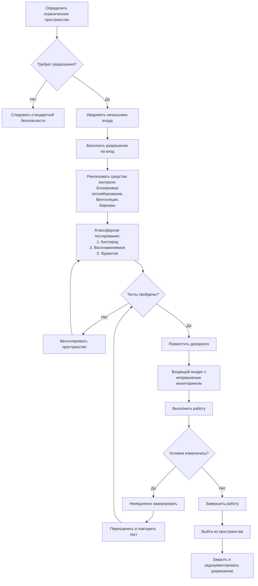

## Обзор

Вход в ограниченные пространства представляет одну из наиболее опасных операций, которые выполняют техники HVAC. OSHA определяет ограниченное пространство как область достаточно большую для входа человека, имеющую ограниченные средства входа или выхода и не предназначенную для постоянного пребывания. Работа HVAC часто включает вход в ограниченные пространства, требующие разрешения, включая воздухораспределительные камеры, машинные отделения холодильных установок, крупные воздуховоды, подземные хранилища, градирни, резервуары и колодцы.

OSHA 29 CFR 1910.146 устанавливает обязательные требования для входа в ограниченные пространства, требующие разрешения. Нарушения приводят к серьезным травмам и смертельным исходам ежегодно, что делает строгое соблюдение этих протоколов необходимым для безопасности техников.

## Критерии ограниченного пространства, требующего разрешения

Ограниченное пространство становится требующим разрешения, когда оно соответствует одному или нескольким из следующих условий:

| Категория опасности | Критерии | Примеры HVAC |
|----------------|----------|---------------|
| **Атмосферные опасности** | Кислород < 19,5% или > 23,5% | Воздухораспределительные камеры, герметизированные машинные отделения |
| **Воспламеняемая атмосфера** | >10% нижнего предела взрывоопасности (LEL) | Утечки хладагента, зоны природного газа |
| **Ядовитые вещества** | Превышает предельно допустимую концентрацию (PEL) | Концентрации хладагента, накопление CO₂ |
| **Опасности захоронения** | Материал, который может захватить/задушить | Резервуары конденсата, бассейны градирен |
| **Конфигурационные опасности** | Сходящиеся внутрь стены, наклонные полы | Сужающиеся воздуховоды, корпуса вентиляторов |
| **Другие серьезные опасности** | Механические, электрические, экстремальные температуры | Вращающееся оборудование, находящиеся под напряжением системы, паровые линии |

## Требования атмосферного тестирования

Атмосферное тестирование должно проводиться перед входом и непрерывно во время пребывания. Тестирование следует определенной последовательности на основе серьезности опасности:

**Последовательность тестирования:**

1. **Концентрация кислорода** - тестировать в первую очередь (приемлемый диапазон: 19,5% - 23,5%)
2. **Воспламеняемые газы и пары** - тестировать во вторую очередь (должны быть < 10% LEL)
3. **Ядовитые газы и пары** - тестировать в третью очередь (должны быть ниже PEL)

**Протокол тестирования:**

| Параметр | Приемлемый диапазон | Действие при выходе за пределы диапазона |
|-----------|-----------------|------------------------|
| Кислород (O₂) | 19,5% - 23,5% | Вентилировать и повторить тест; не входить |
| Воспламеняемые газы (LEL) | <10% LEL | Вентилировать, устранить источники воспламенения, повторить тест |
| Оксид углерода (CO) | <35 ppm (ПДК на 8 ч) | Вентилировать до достижения значения ниже PEL |
| Сероводород (H₂S) | <10 ppm (потолок) | Вентилировать, использовать подаваемый воздух при необходимости входа |
| Хладагенты (R-410A, R-134a) | <1000 ppm | Вентилировать, устранить утечки перед входом |
| Диоксид углерода (CO₂) | <5000 ppm (ПДК на 8 ч) | Вентилировать, непрерывный мониторинг обязателен |

Испытательное оборудование должно быть откалибровано в соответствии со спецификациями производителя и проверено перед каждым использованием. Требуются приборы прямого показания со звуковыми сигналами тревоги для непрерывного мониторинга.

## Типичные ограниченные пространства HVAC

**Воздухораспределительные камеры:**
Камеры подачи и возврата воздуха представляют риск дефицита кислорода из-за ограниченного воздухообмена. Крупные коммерческие камеры под поднятыми полами или над подвесными потолками требуют входа по разрешению, когда доступ превышает плановые проверки. Опасности включают вытеснение кислорода утечками хладагента, плохую вентиляцию и экстремальные температуры.

**Бассейны и отстойники градирен:**
Эти влажные среды представляют опасность утопления, захоронения и поскальзывания. Биологический рост производит сероводород. Химические обработки воды создают ядовитые атмосферы. Вход в бассейн требует непрерывного атмосферного мониторинга и защиты от падения, когда глубина превышает 1,2 м.

**Подземные хранилища и колодцы:**
Подземные механические помещения накапливают более тяжелые, чем воздух, газы, включая хладагенты, природный газ и канализационные газы. Дефицит кислорода возникает из-за биологического разложения и вытеснения. Вентиляция должна продолжаться во время всего входа с непрерывным атмосферным мониторингом.

**Крупные воздуховоды и корпуса вентиляторов:**
Вход в воздуховоды для очистки, ремонта или модификации требует разрешений, когда диаметр превышает 61 см и длина препятствует быстрому выходу. Блокировка/опломбирование вентиляторов и заслонок обязательны. Опасности включают дефицит кислорода, накопление пыли и ловушки конфигурации.

**Резервуары и сосуды для хранения хладагента:**
Резервуары, ранее содержащие хладагенты, должны быть продуты, протестированы и вентилированы. Даже "пустые" сосуды содержат остаточный хладагент, который испаряется, вытесняя кислород. Горячие работы (сварка, резка) требуют дополнительных разрешений и сертификации газовой очистки.

## Система разрешения входа

Разрешение на вход служит центральным контрольным документом. Обязательные элементы включают:

- Идентификация и местоположение пространства
- Назначение входа и выполняемые работы
- Дата и разрешенная продолжительность
- Авторизованные входящие, дежурные и начальники входа
- Результаты атмосферного тестирования (первоначальные и периодические)
- Выявленные опасности и реализованные средства контроля
- Процедуры и оборудование связи
- Доступные службы спасения и экстренные услуги
- Требуемое оборудование (вентиляция, тестирование, СИЗ, спасение)
- Специальные требования (разрешения на горячие работы, блокировка/опломбирование)
- Подпись начальника входа, разрешающая вход

Разрешения действительны только в течение указанного периода работ. Изменение условий требует отмены разрешения и переоценки.

## Процедуры входа

## Требования к дежурному

Хотя бы один дежурный должен оставаться вне ограниченного пространства во время операций входа. Дежурный не может выполнять другие обязанности, которые мешают выполнению функций мониторинга.

**Обязанности дежурного:**
- Поддерживать непрерывную связь с входящими
- Контролировать атмосферные условия и сигналы тревоги
- Отслеживать авторизованных входящих (кто входит, кто выходит)
- Приказать эвакуацию при развитии опасностей
- Вызвать службы спасения при необходимости
- Предотвратить несанкционированный вход
- Поддерживать точность разрешения на вход

Дежурные не могут входить в пространство в целях спасения, если они не обучены надлежащим образом и не оснащены как персонал спасения.

## Вентиляция и управление атмосферой

Принудительная вентиляция является основным средством контроля атмосферных опасностей. Механическая вентиляция должна:

- Обеспечивать адекватный воздухообмен (минимум 6 воздухообменов в час)
- Продолжаться в течение всего периода входа
- Использовать взрывозащищенное оборудование в воспламеняемых атмосферах
- Подавать дыхательный воздух (минимум класс D)
- Создавать воздушный поток, который сметает загрязнители от входящих

Вентиляция одна не устраняет необходимость атмосферного тестирования. Непрерывный мониторинг остается обязательным даже при активных системах вентиляции.

**Конфигурация вентиляции:**
Разместите воздухозаборный канал на одном конце и вытяжку на противоположном конце для создания сквозной вентиляции. Позиционируйте подачу для продвижения свежего воздуха мимо входящего к точке вытяжки. Для вертикальных входов (колодцы) подавайте воздух сверху и вытягивайте снизу при удалении более тяжелых, чем воздух, загрязнителей; делайте обратное для более легких, чем воздух, газов.

## Процедуры спасения

Спасение без входа является предпочтительным методом. Системы извлечения, состоящие из полнотелесных привязей и механических устройств извлечения (штативы, лебедки), позволяют внешнему персоналу извлекать входящих без входа в пространство.

Спасение входом требует:
- Команда спасения, обученная специально для спасения в ограниченном пространстве
- Персонал спасения, оснащенный дыхательными аппаратами с подаваемым воздухом
- Резервный персонал спасения в режиме готовности
- Практические спасения, проводимые минимум ежегодно
- Координация с местными службами экстренной помощи

Подрядчики HVAC должны либо содержать обученные команды спасения, либо договориться об услугах с местными пожарными службами или частными компаниями спасения. Время ответа не может превышать 5 минут с момента уведомления об экстренной ситуации.

## Системы связи

Непрерывная связь между входящими и дежурным обязательна. Приемлемые методы включают:

- Голосовая связь (прямая видимость)
- Двусторонние рации (внутренне безопасные в воспламеняемых атмосферах)
- Сигнальные линии (потягивание каната)
- Электронные устройства мониторинга со звуковыми сигналами

Методы связи должны надежно функционировать в конкретной среде ограниченного пространства. Радиопомехи от оборудования и конструкций могут потребовать альтернативных систем.

## Требования к обучению

Персонал, участвующий в входе в ограниченные пространства, требующие разрешения, должен пройти комплексное обучение:

**Входящие:** Распознавать опасности, использовать СИЗ и испытательное оборудование, общаться с дежурным, понимать реакции на сигналы тревоги, процедуры эвакуации при чрезвычайных ситуациях

**Дежурные:** Распознавать опасные условия, вести точный учет входящих, понимать процедуры спасения, управлять оборудованием связи, вызывать службы экстренной помощи

**Начальники входа:** Оценивать пространства, авторизовать входы, проверять точность разрешения, отменять разрешения, понимать требования тестирования, контролировать соответствие

Обучение проводится перед первичным назначением, при изменении обязанностей, при изменении опасностей и всякий раз, когда появляются дефициты знаний. Ежегодное переподготовка рекомендуется как лучшая практика.

## Компоненты

- Ограниченные пространства, требующие разрешения
- Атмосферное тестирование ограниченного пространства
- Мониторинг концентрации кислорода
- Мониторинг воспламеняемого газа
- Мониторинг ядовитого газа
- Вентиляция ограниченного пространства
- Система разрешения входа
- Требования к дежурному
- Процедуры спасения ограниченного пространства
- Системы связи ограниченного пространства
