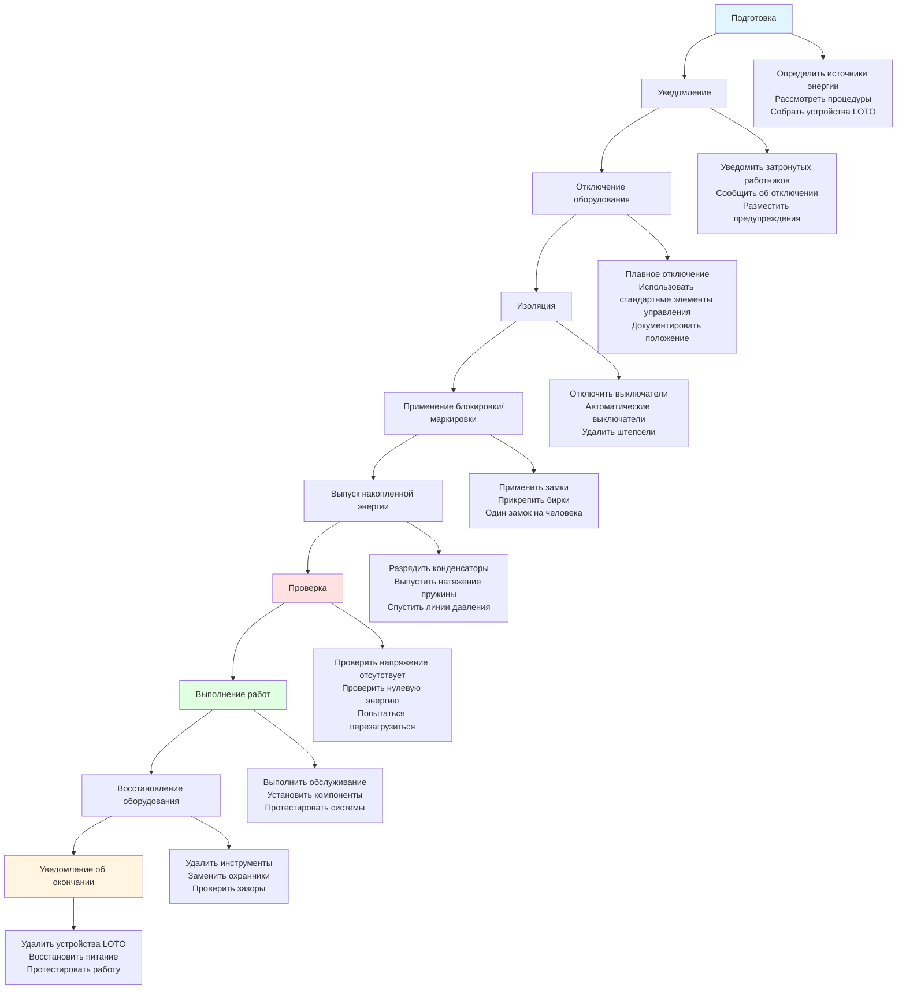

Электрические опасности представляют один из наиболее серьёзных рисков для техников HVAC. От жилых цепей 120В до коммерческих трёхфазных систем, превышающих 480В, работа HVAC обычно включает воздействие под напряжением. Понимание классификации напряжения, внедрение надлежащих процедур блокировки/маркировки и использование надлежащих средств индивидуальной защиты критически важны для предотвращения поражения электрическим током, травм от электрической дуги и электрических ожогов.

## Нормативно-правовая база

OSHA 1910 Подраздел S устанавливает законодательные требования к электробезопасности на рабочем месте. Эти нормативы требуют специфических трудовых практик, требований к обучению и защитных мер, основанных на уровнях напряжения и условиях воздействия. NFPA 70E, Стандарт электробезопасности на рабочем месте, предоставляет техническую основу для соответствия требованиям OSHA и стал промышленным стандартом для программ электробезопасности.

Ключевые требования OSHA 1910 Подраздел S:
- 1910.147: Контроль опасной энергии (блокировка/маркировка)
- 1910.333: Выбор и использование трудовых практик
- 1910.335: Использование защитного оборудования
- 1910.331: Требования к обучению квалифицированных и неквалифицированных лиц

## Классификация напряжения

Понимание классификации напряжения является основой для оценки электрических опасностей и выбора надлежащих защитных мер.

| Класс напряжения | Диапазон напряжения | Типичные применения в HVAC |
|--------------|---------------|--------------------------|
| Сверхнизкое напряжение | ≤50В переменного | Цепи управления, термостаты, датчики |
| Низкое напряжение | 51–1000В переменного | Жилое/коммерческое оборудование, двигатели |
| Среднее напряжение | 1001–35 000В переменного | Крупные чиллеры, оборудование центрального растения |
| Высокое напряжение | >35 000В переменного | Подключения к сети, распределение на кампусе |

Большинство работ HVAC включают системы низкого напряжения, но потенциал серьёзной травмы существует при всех уровнях напряжения выше 50В переменного или 60В постоянного.

## Расстояния подхода

NFPA 70E устанавливает границы подхода, определяющие безопасные рабочие расстояния от открытых проводников под напряжением. Эти границы определяют требуемую квалификацию, защитное оборудование и трудовые процедуры.

| Диапазон напряжения | Граница ограниченного подхода | Граница ограниченного подхода | Запретный подход |
|--------------|---------------------------|------------------------------|---------------------|
| 50–300В | 3,0 м | 1,0 м | Контакт |
| 301–750В | 3,0 м | 1,0 м | 25 мм |
| 751–15 000В | 3,0 м | 1,5 м | 178 мм |
| 15 001–36 000В | 3,0 м | 1,8 м | 330 мм |

**Граница ограниченного подхода**: Расстояние, которое неквалифицированные лица не должны пересекать без присмотра.

**Граница ограниченного подхода**: Расстояние, требующее статуса квалифицированного лица, документированной оценки рисков и надлежащих СИЗ.

**Запретный подход**: Расстояние, требующее специализированного обучения, эквивалентного квалифицированным электротехническим работникам на системах под напряжением.

## Процедуры блокировки/маркировки

Блокировка/маркировка (LOTO) — единственный наиболее эффективный метод предотвращения электрических травм во время обслуживания и ремонта HVAC. OSHA 1910.147 требует письменные процедуры контроля энергии для обслуживания оборудования.

### Критические требования LOTO

**Индивидуальная защита**: Каждый техник должен применить собственный персональный замок. Процедуры групповой блокировки требуют запирающихся ящиков при обслуживании одного оборудования несколькими рабочими.

**Проверка**: После применения блокировки проверка напряжения должна подтвердить условия без напряжения с использованием надлежащим образом рассчитанных испытательных приборов. Метод "тест-тест-тест" проверяет функцию счётчика до и после испытания.

**Попытка запуска**: Попытка эксплуатации оборудования после блокировки подтверждает эффективную изоляцию и предотвращает предположения о состоянии цепи.

## Требования квалифицированного лица

NFPA 70E определяет квалифицированное лицо как лицо, которое продемонстрировало навыки и знания, связанные с конструкцией и эксплуатацией электрического оборудования, и получило обучение по электробезопасности для выявления и избежания электрических опасностей. Для техников HVAC, работающих с электрическими компонентами, это требует:

- Понимание теории электричества и принципов безопасности
- Знакомство с конструкцией оборудования и его эксплуатацией
- Способность определять уровни напряжения и источники энергии
- Знание надлежащего выбора и использования СИЗ
- Обучение процедурам экстренного реагирования и спасения
- Документированная проверка квалификации

Квалификация зависит от уровня напряжения и конкретной задачи. Техник, квалифицированный для работы на цепях двигателя 480В, может быть не квалифицирован для коммутационного аппарата среднего напряжения.

## Опасности электрической дуги

Электрическая дуга представляет крайнюю электрическую опасность, уникальную для работ под напряжением. Когда электрический ток проходит через воздух между проводниками или на землю, температура может превышать 19 400°C, создавая интенсивное тепло, волны давления и брызги расплавленного металла.

### Граница электрической дуги

Граница электрической дуги — это расстояние, на котором падающая энергия равна 1,2 кал/см² (пороговое значение для ожогов второй степени на открытой коже). В пределах этой границы дуговые СИЗ обязательны для работ под напряжением.

| Напряжение системы | Типичная граница электрической дуги | Доступный ток короткого замыкания |
|----------------|---------------------------|------------------------|
| 208В | 0,3–1,2 м | 10 000–25 000А |
| 480В | 1,2–3,0 м | 25 000–50 000А |
| 4160В | 3,0–12,0 м | 50 000А+ |

Расчёты падающей энергии требуют анализа электрической системы с учётом напряжения, тока короткого замыкания, времени отключения защитного устройства и рабочего расстояния. Метки электрической дуги на оборудовании предоставляют рассчитанные уровни опасности и требуемые СИЗ.

## Средства индивидуальной защиты

Выбор СИЗ для электротехнических работ зависит от уровня напряжения, воздействия падающей энергии и требований задачи.

### Категории дуговых СИЗ

| Категория СИЗ | Падающая энергия | Требуемые СИЗ |
|-------------|----------------|--------------|
| 0 | <2 кал/см² | Необработанная одежда из натурального волокна, защитные очки |
| 1 | 4 кал/см² | Дуговая рубашка и брюки или комбинезон, лицевой щиток, защитные очки |
| 2 | 8 кал/см² | Дуговая рубашка и брюки, капюшон дугового костюма, лицевой щиток, защитные очки |
| 3 | 25 кал/см² | Куртка и брюки дугового костюма, капюшон дугового костюма, лицевой щиток, защитные очки |
| 4 | 40 кал/см² | Куртка и брюки дугового костюма, капюшон дугового костюма, лицевой щиток, защитные очки |

Перчатки, рассчитанные на напряжение, обеспечивают изоляцию от опасностей поражения электрическим током и должны проверяться каждые шесть месяцев. Кожаные защиты, надеваемые на резиновые перчатки, предотвращают механические повреждения и повышают долговечность.

## Безопасные трудовые практики

Помимо специфических процедур и оборудования, электробезопасность опирается на дисциплинированные трудовые практики:

**Де-энергизация в первую очередь**: Работа под напряжением оправдана только когда де-энергизация создаёт большие опасности или невозможна. Конструкция оборудования и планирование обслуживания должны минимизировать воздействие под напряжением.

**Тест перед касанием**: Всегда проверяйте условия де-энергизации с помощью надлежащим образом рассчитанных тестеров напряжения перед касанием проводников или компонентов.

**Правило одной руки**: При тестировании или работе вблизи открытых цепей держите одну руку в кармане или за спиной, чтобы предотвратить пути тока через сердце.

**Изолированные инструменты**: Используйте инструменты с изолированными ручками, рассчитанные на напряжение системы, когда работа вблизи деталей под напряжением не может быть избежана.

**Поддерживайте зазоры**: Соблюдайте границы подхода и поддерживайте требуемое рабочее пространство вокруг электрического оборудования в соответствии со статьей 110.26 NEC.

## Экстренное реагирование

Несмотря на превентивные меры, электрические несчастные случаи требуют немедленного реагирования:

1. **Не касайтесь** жертвы, если она всё ещё в контакте с источником электричества
2. **Де-энергизируйте** цепь, если возможно, без задержек
3. **Позовите экстренные службы** немедленно
4. **Оказывайте СЛР**, если обучены и жертва не дышит
5. **Лечите от шока** и ожогов в ожидании медицинской помощи

Все работники в зонах с электрическим воздействием должны получить обучение СЛР и первой помощи с акцентом на реагирование на электрические травмы.

## Заключение

Электробезопасность в работе HVAC требует всестороннего понимания опасностей, нормативных требований и защитных мер. Иерархия управления отдаёт приоритет де-энергизации над работой под напряжением, инженерным управлением над СИЗ и квалифицированным работникам над неподготовленными работниками. Последовательно применяя процедуры блокировки/маркировки, соблюдая надлежащие расстояния подхода и используя надлежащее защитное оборудование, техники HVAC могут эффективно управлять электрическими рисками и предотвращать опасные для жизни травмы.

## Компоненты

- Процедуры блокировки маркировки Loto
- Опасности электрической дуги
- Средства индивидуальной защиты электрические
- Одежда с дуговой защитой
- Проверка напряжения и верификация
- Автоматический выключатель при замыкании на землю Gfci
- Заземление оборудования
- Требования к заземлению
- Электрические зазоры
- Требования к рабочему пространству
- Обучение электробезопасности
