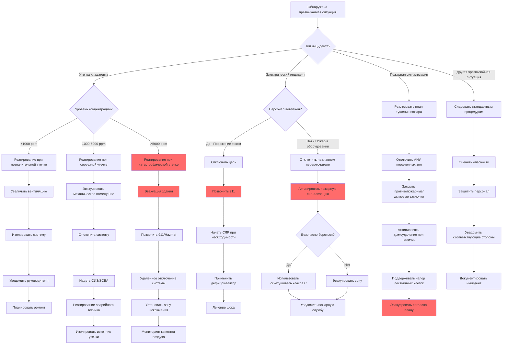

## Требования к плану действий при чрезвычайных ситуациях

OSHA 29 CFR 1910.38 требует наличия письменного плана действий при чрезвычайных ситуациях на рабочих местах, где операции HVAC представляют потенциальные опасности. План должен включать процедуры эвакуации, порядок уведомления в случае чрезвычайной ситуации, операции спасения и ответственность персонала. Объекты HVAC требуют специализированных протоколов из-за токсичности хладагента, опасности электричества и рисков пожара от легковоспламеняющихся хладагентов.

### Ключевые элементы планов экстренного реагирования HVAC

**Назначение координатора чрезвычайной ситуации**
Каждое учреждение HVAC должно назначить обученных координаторов экстренного реагирования, ответственных за реализацию процедур ответных действий, координацию с аварийными службами и проведение анализа инцидентов после события. Координаторы должны поддерживать актуальные знания о свойствах хладагента, протоколах электробезопасности и системах пожаротушения.

**Системы связи**
Экстренная связь требует резервных систем, включая панели сигнализации, двусторонние радиостанции, телефоны экстренного вызова и визуальные сигналы для высокошумных зон. Механические помещения, содержащие холодильное оборудование, требуют локальных сигнализаций обнаружения хладагента с уведомлением систем управления зданием.

**Маршруты эвакуации и места сбора**
Первичные и вторичные маршруты эвакуации должны быть четко обозначены фотолюминесцентными знаками. Места сбора должны быть расположены против ветра от механических помещений на расстояниях более 45 м для предотвращения воздействия хладагента. Маршруты должны избегать электрических помещений и зон, содержащих легковоспламеняющиеся материалы.

## Экстренное реагирование по типам инцидентов

Следующая таблица содержит рекомендации по немедленным действиям при типичных чрезвычайных ситуациях HVAC:

| Тип инцидента | Немедленные действия | Вторичное реагирование | Требования уведомления |
|---------------|-------------------|-------------------|---------------------------|
| **Утечка хладагента (малая)** | Проветрить помещение, эвакуировать незанятый персонал, изолировать систему | Надеть СИЗ (SCBA при необходимости), найти источник утечки, перекрыть изолирующие клапаны | Администратор учреждения, поставщик хладагента |
| **Утечка хладагента (большая)** | Активировать сигнал тревоги, эвакуировать здание, отключить HVAC с удаленного места | Контактировать с командой hazmat, установить зону исключения (более 30 м), контролировать качество воздуха | Аварийные службы (911), EPA, OSHA |
| **Электрический пожар** | Отключить питание оборудования на главном отключателе, активировать пожарную сигнализацию, эвакуировать зону | Использовать только огнетушитель класса C, если безопасно, не использовать воду | Пожарная служба, электроснабжающая компания, администрация учреждения |
| **Поражение электрическим током** | Не трогать жертву, отключить источник питания, позвонить в 911 | Проводить сердечно-легочную реанимацию/использовать дефибриллятор, если квалифицирован, лечение шока | Скорая медицинская помощь, OSHA (если требуется госпитализация) |
| **Выброс аммиака** | Звуковой сигнал, эвакуация против ветра, активировать аварийную вентиляцию | Надеть SCBA, изолировать утечку, применить водяной туман для поглощения паров | Пожарная служба, команда hazmat, OSHA, EPA |
| **Отказ компрессора** | Аварийное отключение, проверка утечек масла/пожара, проветривание | Проверить на механические повреждения, потерю хладагента, электрические неисправности | Производитель оборудования, страховая компания |
| **Термический ожог** | Убрать от источника тепла, охлаждать водой (15-20 мин), снять украшения | Закрыть стерильной повязкой, лечить шок, контролировать жизненные показатели | Медицинские услуги если ожог 2-3 степени или >3% поверхности тела |
| **Воздействие химических веществ** | Вывести на свежий воздух, снять загрязненную одежду, промыть пораженные участки | Подать кислород, если доступен, обратиться к SDS для специфического лечения | Служба по отравлениям, медицинские услуги, OSHA |

## Протоколы реагирования на утечку хладагента

### Обнаружение и оценка

Детекторы хладагента должны быть установлены в механических помещениях на уровне пола (плотные хладагенты) или на уровне потолка (аммиак) с установками сигнализации на уровне 25% TLV-TWA. При активации сигнала тревоги:

1. Подтвердить сигнал тревоги и отметить тип хладагента
2. Проверить условия работы системы через BMS
3. Определить тяжесть утечки на основании показаний детектора концентрации
4. Инициировать соответствующий уровень ответных действий (незначительная, серьезная или катастрофическая)

### Критерии классификации утечки

**Незначительная утечка:** Показание детектора <1000 ppm для галоуглеводородов, <25 ppm для аммиака. Система остается в эксплуатации с повышенной вентиляцией. Реагирование техника в течение 4 часов.

**Серьезная утечка:** Показание детектора 1000-5000 ppm галоуглеводородов, 25-150 ppm аммиака. Требуется немедленное отключение системы. Эвакуация механического помещения. Реагирование аварийного техника в течение 1 часа.

**Катастрофическая утечка:** Показание >5000 ppm галоуглеводородов, >150 ppm аммиака. Эвакуация здания, уведомление аварийных служб, реагирование hazmat. Хладагент может вытеснить кислород, создавая опасность удушья.

### Требования к средствам индивидуальной защиты

| Тип хладагента | Респираторная защита | Защита глаз | Защита кожи | Дополнительные требования |
|------------------|----------------------|----------------|-----------------|------------------------|
| R-410A, R-134a, R-404A | Одобренный NIOSH респиратор для >1000 ppm | Защитные очки, маска для защиты лица при контакте с жидкостью | Изолированные перчатки для жидкого хладагента | Автономный дыхательный аппарат (SCBA) для >10 000 ppm |
| Аммиак (R-717) | Полнолицевой SCBA для >50 ppm | Полнолицевой респиратор включает защиту глаз | Неопреновые или резиновые перчатки, костюм, устойчивый к химикатам | Спасательный респиратор для эвакуации <300 ppm |
| CO₂ (R-744) | Требуется SCBA (CO₂ вытесняет кислород) | Маска для защиты лица при выбросах высокого давления | Изолированные перчатки для защиты от холодных ожогов | Обязательно оборудование для контроля кислорода |
| Легковоспламеняющиеся (R-290, R-32) | Респиратор плюс взрывозащищенное оборудование | Защитные очки, маска для защиты лица | Одежда, устойчивая к пламени | Неискрящиеся инструменты, взрывозащищенное освещение |

## Реагирование при электрических инцидентах

### Протокол поражения электрическим током и электрокатастрофы

Путь электрического тока через тело вызывает остановку сердца, паралич дыхания и серьезные ожоги. Последовательность ответных действий:

1. **Отключить цепь** с помощью ближайшего переключателя отключения или автоматического выключателя. Не подходить к жертве при наличии напряжения.
2. **Немедленно позвонить 911** при всех электротравмах независимо от видимой тяжести.
3. **Начать сердечно-легочную реанимацию** если жертва без сознания и не дышит. Продолжать до прибытия медиков.
4. **Применить дефибриллятор** (автоматический внешний дефибриллятор) согласно голосовым подсказкам.
5. **Лечить шок** путем поднятия ног, поддержания температуры тела и контроля сознания.
6. **Документировать электрические параметры** включая напряжение, путь тока и длительность контакта для медицинского лечения.

### Тушение электрических пожаров

Электрические пожары в оборудовании HVAC требуют специфических методов тушения:

**Находящееся под напряжением оборудование:** Использовать только огнетушители класса C (CO₂ или сухой химический порошок). Водяные огнетушители создают опасность электрокатастрофы. Отключить питание на главном переключателе перед применением тушащего вещества.

**Де-энергизированное оборудование:** Подходят огнетушители класса A или ABC. Водяной туман может использоваться после подтверждения полного отключения питания и завершения процедур блокировки/опломбирования.

**Пожар в электрическом помещении:** Активировать стационарную систему тушения (FM-200, CO₂ или водяной туман). Немедленно эвакуировать. Закрыть противопожарные двери. Не возвращаться до разрешения пожарной службы.

## Реагирование при пожарной чрезвычайной ситуации

### Действия системы HVAC при пожаре

При возникновении пожара в зданиях системы HVAC требуют специфических управляющих последовательностей:

**Активация обнаружения дыма**
- Отключить приточно-вытяжные установки, обслуживающие пораженные зоны
- Закрыть противопожарные/дымовые заслонки в воздуховодах, проходящих через противопожарные преграды
- Активировать системы дымоудаления (если предусмотрены для управления дымом)
- Поддерживать напорные системы лестничных клеток для защиты путей эвакуации
- Продолжить работу систем, обслуживающих незатронутые зоны

**Включение спринклерной сигнализации**
- Отключить все приточно-вытяжные установки для предотвращения миграции дыма/воды
- Закрыть все противопожарные заслонки
- Де-энергизировать электрическое оборудование в пораженных зонах
- Активировать аварийную вентиляцию для дымоудаления после пожара
- Поддерживать работу только для систем управления дымом с противопожарным рейтингом

### Выбор огнетушителя для применения в HVAC

| Класс пожара | Тип топлива | Подходящий огнетушитель | Применение HVAC | Дальность действия |
|------------|-----------|-------------------------|-------------------|-----------------|
| A | Обычные горючие материалы (дерево, бумага, изоляция) | Вода, сухой химический порошок ABC, пена | Зоны хранения, офисы, пожары в изоляции | 4,5-6 м |
| B | Легковоспламеняющиеся жидкости (масло, смазка, масла хладагента) | CO₂, сухой химический порошок, пена | Пожары масла компрессора, системы топливного масла | 2,4-3,7 м |
| C | Электрическое оборудование под напряжением | CO₂, сухой химический порошок (неэлектропроводящий) | Электрические панели, двигатели, системы управления | 2,4-3 м |
| D | Горючие металлы (магний, титан) | Агенты порошка класса D | Специальные применения, обработка металлов | 1,8-2,4 м |
| K | Растительные масла и жиры | Агенты влажной химии | Системы вытяжки коммерческих кухонь | 3-3,7 м |

## Блок-схема плана действий при чрезвычайных ситуациях

Следующая диаграмма иллюстрирует дерево решений экстренного реагирования для операций HVAC:

## Обучение и тренировки

### Требуемое обучение при чрезвычайных ситуациях

**Первоначальное обучение:** Все сотрудники HVAC должны пройти обучение плану действий при чрезвычайных ситуациях перед началом работы. Обучение охватывает маршруты эвакуации, системы сигнализации, место расположения аварийного оборудования и ответственность по ролям.

**Ежегодное освежающее обучение:** Проводить ежегодные обзоры процедур экстренного реагирования или при изменении элементов плана. Включить практические упражнения, имитирующие утечки хладагента, электрические инциденты и пожарные сценарии.

**Тренировки эвакуации:** Проводить неанонсированные тренировки ежеквартально. Тренировки должны включать эвакуацию механических помещений, процедуры мест сбора и проверку ответственности. Документировать результаты тренировок и корректирующие действия.

**Специализированное обучение:** Члены команды реагирования на хладагент требуют обучения HAZWOPER (29 CFR 1910.120). Респондеры электрических инцидентов должны иметь сертификацию по первой помощи/СЛР/дефибриллятору. Назначенные члены пожарной бригады требуют специализированного обучения по пожаротушению.

## Составление отчетов об инцидентах и документирование

### Требования OSHA к ведению записей

**Подлежащие уведомлению события:** Инциденты, требующие неотложной медицинской помощи за пределами первой помощи, госпитализации, ампутации, потери сознания или летального исхода, должны быть сообщены в OSHA в установленные сроки (8 часов для летальных исходов, 24 часа для госпитализаций).

**Документирование инцидента:** Записывать детали инцидента включая дату, время, место, вовлеченный персонал, тип инцидента, предпринятые экстренные действия, участвующее оборудование и результат. Сохранять доказательства включая журналы детектора хладагента, записи системы сигнализации и данные оборудования.

**Анализ первопричины:** Проводить расследования в течение 48 часов для выявления способствующих факторов, отказов оборудования, процедурных дефектов и пробелов в обучении. Реализовать корректирующие действия для предотвращения рецидива.

## Компоненты

- Реагирование при пожарной чрезвычайной ситуации
- Обучение по типам огнетушителей
- Процедуры маршрутов эвакуации
- Места сбора
- Системы экстренной связи
- Обучение первой помощи
- Процедуры реагирования на разливы
- Локализация разливов материалов
- Место расположения аварийного оборудования
- Процедуры составления отчетов об инцидентах
