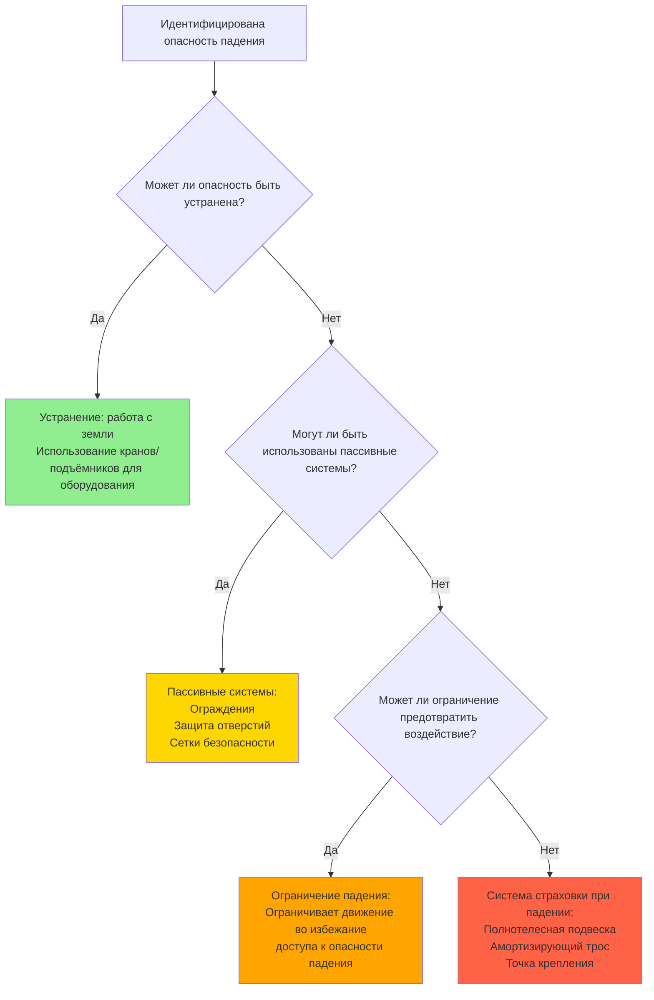

Защита от падений представляет наиболее критическое направление безопасности для техников HVAC, поскольку падения с высоты остаются основной причиной смертности в строительстве и работах по техническому обслуживанию. Работы с HVAC часто включают установку оборудования на крышах, обслуживание конденсаторов, доступ к кондиционирующим установкам и работу со спасательных лестниц — все эти виды деятельности подвергают рабочих риску падения.

## Нормативно-правовая база

OSHA устанавливает требования по защите от падений через два основных стандарта:

**OSHA 1926 Subpart M (Строительство):** Применяется к установке, переделке и капитальному ремонту систем HVAC. Требует защиты от падений на высоте 1,8 м и выше.

**OSHA 1910 Subpart D (Общая промышленность):** Применяется к регулярному техническому обслуживанию и работам по обслуживанию. Конкретные пороги высоты варьируются в зависимости от типа деятельности.

Плановые программы отдельных штатов OSHA могут устанавливать более строгие требования. Например, Cal/OSHA Калифорнии требует защиты от падений на высоте 2,3 м для некоторых операций, но 1,8 м для других. Всегда проверяйте местные требования.

## Требования к защите от падений по высотам

| Вид работ | Стандарт OSHA | Пороговая высота | Требуемая защита |
|-----------|---------------|------------------|------------------|
| Установка оборудования на крыше | 1926.501(b)(10) | 1,8 м | Ограждения, сетки безопасности или PFAS |
| Работа на краю крыши (незащищённые стороны) | 1926.501(b)(1) | 1,8 м | Ограждения, сетки безопасности или PFAS |
| Подъём по неподвижной вертикальной лестнице | 1910.27 | 7,3 м | Система защиты лестницы или PFAS |
| Работы на лесах | 1926.451 | 3,0 м | Ограждения или PFAS |
| Подъёмные платформы | 1926.453 | Любая высота | Полнотелесная подвеска, прикреплённая к стреле/корзине |
| Ходовые/рабочие поверхности | 1910.28 | 1,2 м | Ограждения или PFAS |
| Обслуживание кровельных агрегатов | 1910.28(b)(13) | 1,2 м | Ограждения или PFAS |

## Иерархия мер защиты от падений

Иерархия отдаёт приоритет методам от наиболее защитных (устранение) к менее (система страховки при падении). Хотя системы страховки при падении (PFAS) часто используются в работах с HVAC, пассивные системы, такие как ограждения, обеспечивают превосходную защиту, когда это возможно.

## Работы с оборудованием на крышах

Установки HVAC на крышах представляют уникальные опасности падения из-за:

- **Периметральное воздействие:** Оборудование часто располагается вблизи края крыши при операциях по такелажу
- **Проемы:** Люки доступа на крышу, световые люки и механические отверстия
- **Погодные условия:** Ветер влияет на устойчивость, лёд создаёт скользкие поверхности
- **Размер оборудования:** Большие кровельные агрегаты могут препятствовать видимости условий края

### Методы защиты крыш

**Постоянные системы ограждений:**
- Установка согласно 1910.29: верхняя рейка 1,07 м, промежуточная рейка, бордюр
- Должна выдерживать нагрузку 90 кг, приложенную в пределах 5 см от верхнего края
- Идеальна для часто используемого оборудования
- Требует инженерного расчёта для крепления

**Системы сигнальных линий (только для крыш с малым уклоном):**
- Разрешены на крышах с уклоном менее 4:12 (1926.502(f))
- Должны быть установлены на расстоянии 1,8 м от края крыши
- Требует выделенного наблюдателя, когда рабочие пересекают сигнальную линию
- Не разрешены в качестве единственной защиты при работах с механическим оборудованием — должны быть совмещены с другими методами

**Системы страховки при падении:**
- Требуются при работе в пределах 1,8 м от незащищённого края
- Точки крепления должны выдерживать нагрузку 22,7 кН на присоединённого рабочего (1926.502(d)(15))
- Общее расстояние падения не должно превышать зазор до нижнего уровня
- Требует плана спасения

## Компоненты системы страховки при падении

Полная PFAS состоит из трёх элементов, работающих вместе:

### 1. Страховка/точка крепления
- Должна выдерживать нагрузку 22,7 кН на присоединённого рабочего или поддерживать коэффициент безопасности 2:1 под надзором квалифицированного лица
- Распространённые точки крепления HVAC: конструкционная сталь, парапетные стены (спроектированные), кровельные якоря
- Переносные системы якорей доступны для временных установок
- **Никогда не крепить к:** оборудованию HVAC, кабелепроводам, воздуховодам, трубопроводам или неоцененным конструкционным элементам

### 2. Полнотелесная подвеска
- Разрешены только полнотелесные подвески (подвески на талии запрещены с 1998 г.)
- D-кольцо расположено между лопатками для дорсального крепления
- Должна правильно подогнаться: ремни подвески не должны быть перекручены, торсовые ремни плотные
- Проверяйте перед каждым использованием на наличие царапин, истираний, химических повреждений или растянутого оборудования

### 3. Соединительное устройство
- **Амортизирующие тросы:** Ограничивают максимальную силу остановки до 8 кН
- **Саморазвёртывающиеся страховочные тросы:** Автоматически регулируют длину, блокируются при падении
- **Зажимы для тросов:** Свободно скользят по вертикальному тросу, блокируются при резком рывке
- Максимальное расстояние свободного падения: 1,8 м
- Расчёт общего расстояния остановки: свободное падение + расстояние замедления троса + растяжение подвески/тела + коэффициент безопасности

### Пример расчёта расстояния падения

Для 1,8 м троса с амортизатором на плоской крыше:

- Свободное падение: 1,8 м (длина троса)
- Расстояние замедления: 1,1 м (развёртывание амортизатора)
- Растяжение подвески/тела: 0,3 м
- Коэффициент безопасности: 0,6 м
- **Требуемый минимальный зазор при падении: 3,8 м**

Этот расчёт демонстрирует, почему PFAS может быть неподходящей для работ на низкой высоте без надлежащего планирования.

## Безопасность лестниц при работах с HVAC

Лестницы обеспечивают доступ к оборудованию на крышах, повышенным конденсаторам и кондиционирующим установкам. Специфичные для HVAC опасности на лестницах включают:

**Выдвижные лестницы:**
- Должны выдвигаться на 0,9 м выше площадки приземления
- Соотношение 1:4 (1 м в сторону на каждые 4 м вверх)
- Трёхточечный контакт при подъёме
- Закрепите верх и низ, чтобы предотвратить смещение
- Рейтинг нагрузки: Тип I (113 кг промышленный) минимум

**Неподвижные вертикальные лестницы:**
- Клетки требуются для расстояния подъёма 6,1–9,1 м (1910.27)
- Системы защиты лестницы или PFAS требуются выше 7,3 м
- Боковые рейки должны выступать на 1,07 м выше площадки приземления
- Перекладины расположены с интервалом 0,3 м по центру

**Стремянки:**
- Никогда не используйте верхние две ступени
- Поддерживайте трёхточечный контакт
- Устанавливайте на ровную поверхность
- Смотрите на лестницу при подъёме/спуске

## Требования к подготовке и компетентному лицу

OSHA требует подготовки по защите от падений перед воздействием на рабочих опасностей падения (1926.503). Подготовка должна охватывать:

- Природу опасностей падения в рабочей зоне
- Надлежащие процедуры для установки, обслуживания и демонтажа систем защиты от падений
- Надлежащее использование, проверку и хранение оборудования
- Роль и функцию каждого компонента PFAS
- Ограничения оборудования
- Процедуры спасения

**Компетентное лицо** должно присутствовать на объектах, где требуется защита от падений. Это лицо должно быть способно идентифицировать опасности падения и иметь полномочия принимать корректирующие меры. Для подрядчиков HVAC это обычно прораб или руководитель проекта со специальной подготовкой.

## Проверка и техническое обслуживание

Оборудование защиты от падений должно проверяться перед каждым использованием и выводиться из эксплуатации, если оно неисправно:

**Контрольные точки проверки подвески:**
- Ткань: растрёпывание, разрезы, химические ожоги, чрезмерный износ
- D-кольца: трещины, деформация, острые края
- Пряжки: деформация, трещины, надлежащее функционирование
- Строчка: вырванные или разрезанные стежки, свободные нити

**Проверка троса/саморазвёртывающейся страховки:**
- Трещины или повреждения корпуса
- Коррозия компонентов
- Индикатор активации (амортизатор)
- Разборчивость этикетки

**Точки крепления:**
- Конструкционная целостность крепления
- Коррозия или деградация
- Надлежащая установка согласно спецификациям производителя

Оборудование, участвовавшее в событии падения, должно быть немедленно выведено из эксплуатации и проверено квалифицированным лицом или производителем перед возвращением в использование.

## Планирование аварийного спасения

OSHA требует, чтобы работодатели обеспечили оперативное спасение упавших рабочих или средства самоспасения (1926.502(d)(20)). Травма от подвешивания может вызвать потерю сознания или смерть в течение минут, поскольку кровь скапливается в ногах.

Элементы плана спасения:

1. Идентифицируйте оборудование спасения (спасательная лестница, системы тросов, доступ к подъёмной платформе)
2. Подготовьте назначенный персонал спасения
3. Установите протоколы связи
4. Согласуйте с местными аварийными службами
5. Проведите учения по спасению
6. Обеспечьте ремни облегчения подвешивания в подвесках для самоспасения

## Компоненты

- Защита края крыши
- Системы ограждений
- Системы страховки при падении
- Точки крепления защиты от падений
- Полнотелесная подвеска
- Системы страховочных тросов
- Безопасность лестниц
- Безопасность лесов
- Безопасность подъёмных платформ
