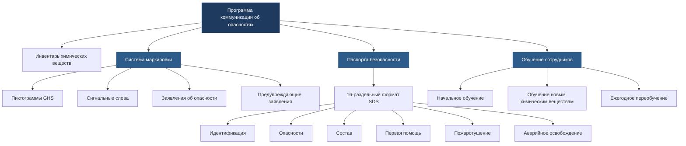

Стандарт OSHA по коммуникации об опасностях (HazCom 2012, 29 CFR 1910.1200) требует, чтобы работодатели предоставляли информацию об опасных химических веществах, используемых в операциях HVAC. Этот стандарт "права на информацию" требует комплексной программы, охватывающей идентификацию химических веществ, оценку опасностей, защитные меры и реагирование при чрезвычайных ситуациях для всех химических веществ, присутствующих на рабочем месте.

## Требования стандарта OSHA HazCom

Стандарт применяется ко всем химическим веществам с известными физическими или опасностями для здоровья. Для техников HVAC это охватывает холодильные агенты, материалы для пайки, растворители, чистящие средства, масла, кислоты и продукты горения. Стандарт требует трёх основных элементов: письменной программы коммуникации об опасностях, надлежащей маркировки всех контейнеров с химическими веществами и ведения паспортов безопасности (SDS), доступных для всех сотрудников.

Работодатели должны разработать письменную программу, описывающую, как рабочее место соответствует требованиям HazCom. Этот документ определяет ответственного лица, перечисляет все опасные химические вещества, объясняет системы маркировки, подробно описывает расположение и доступность SDS, а также определяет протоколы обучения сотрудников. Программа должна быть доступна сотрудникам и обновляться при введении новых химических веществ.

## Глобально гармонизированная система (GHS)

GHS предоставляет стандартизированные критерии для классификации химических опасностей и унифицированный формат для этикеток и паспортов безопасности. Принятая OSHA в 2012 году, гармонизация с GHS обеспечивает согласованную коммуникацию об опасностях через международные границы, что особенно важно для оборудования HVAC и химических веществ, полученных из глобальных источников.

## Обычные химические опасности HVAC

Техники HVAC встречают множество опасных материалов, требующих надлежащих протоколов коммуникации и обработки.

### Холодильные агенты и классификации опасностей

| Холодильный агент | Группа безопасности ASHRAE | Основные опасности | Пиктограммы GHS |
|-------------|---------------------|-----------------|----------------|
| R-410A | A1 | Простой асфиксиант, высокое давление | Газовый баллон, восклицательный знак |
| R-22 | A1 | Простой асфиксиант, истощение озона | Газовый баллон |
| R-134a | A1 | Простой асфиксиант, высокое давление | Газовый баллон |
| R-32 | A2L | Слабо воспламеняемый, асфиксиант | Пламя, газовый баллон |
| R-290 (пропан) | A3 | Чрезвычайно воспламеняемый, асфиксиант | Пламя, газовый баллон |
| R-717 (аммиак) | B2 | Ядовитый, воспламеняемый, едкий | Пламя, череп, коррозия |
| R-744 (CO₂) | A1 | Асфиксиант, высокое давление | Газовый баллон, восклицательный знак |

### Материалы для пайки и припоя

| Материал | Опасности | Пределы воздействия | Требуемое ИСЗ |
|----------|---------|-----------------|--------------|
| Серебряные припои | Лихорадка металлических паров, воздействие кадмия | Кадмий: 5 мкг/м³ ПДК | Респиратор, вентиляция |
| Флюс для пайки | Едкий, раздражающий | Варьируется по составу | Перчатки, защита глаз |
| Свинцово-оловянный припой | Отравление свинцом, неврологические эффекты | Свинец: 50 мкг/м³ ПДК | Респиратор, перчатки |
| Фосфор-медь | Образование газа фосфина | ПДКСС: 0,3 ppm | Локальная вытяжная вентиляция |

### Растворители и чистящие средства

| Химическое вещество | Применение | Эффекты на здоровье | Температура воспламенения |
|----------|-----|----------------|-------------|
| Ацетон | Очистка деталей, обезжиривание | Депрессия ЦНС, раздражение глаз | -18°C |
| Трихлорэтилен | Очистка катушек | Канцероген, повреждение печени/почек | Невоспламеняемый |
| Минеральные спирты | Общее обезжиривание | Опасность аспирации, дерматит | 41°C |
| МЭК (метилэтилкетон) | Клей, очистка | Депрессия ЦНС, раздражение дыхательных путей | -9°C |
| Изопропиловый спирт | Очистка электроники | Воспламеняемый, раздражение глаз | 12°C |

### Кислоты и едкие вещества

| Химическое вещество | Применение в HVAC | pH | Специфические опасности |
|----------|------------------|-----|------------------|
| Соляная кислота (муриатная) | Очистка конденсатора | <1 | Серьезные ожоги, едкие пары |
| Серная кислота | Обслуживание батареи | <1 | Серьезные ожоги, экзотермические реакции |
| Фосфорная кислота | Удаление ржавчины | 1-2 | Умеренные ожоги, едкая |
| Лимонная кислота | Удаление накипи | 2-3 | Слабый раздражитель, более безопасная альтернатива |

## Паспорта безопасности (SDS)

16-раздельный формат SDS предоставляет комплексную информацию о химическом веществе. Раздел 1 определяет химическое вещество и поставщика. Раздел 2 подробно описывает классификацию опасности и элементы этикетки GHS. Раздел 3 перечисляет состав и информацию об ингредиентах. Раздел 4 описывает меры первой помощи. Раздел 5 охватывает меры пожаротушения. Раздел 6 рассматривает процедуры при аварийном освобождении.

Раздел 7 объясняет требования к обращению и хранению. Раздел 8 определяет контроль воздействия и личную защиту. Раздел 9 предоставляет физические и химические свойства. Раздел 10 обсуждает стабильность и реактивность. Раздел 11 подробно описывает токсикологическую информацию. Раздел 12 охватывает экологическую информацию.

Раздел 13 рассматривает соображения по утилизации. Раздел 14 предоставляет информацию о транспортировке. Раздел 15 перечисляет нормативную информацию. Раздел 16 включает дату подготовки и историю пересмотров.

Работодатели должны поддерживать текущие SDS для всех опасных химических веществ на рабочем месте. Эти документы должны быть легко доступны во время каждой рабочей смены, доступны в электронном или бумажном формате. Многие подрядчики HVAC ведут цифровые библиотеки SDS, доступные через смартфон или планшет для техников, работающих в полевых условиях.

## Требования к маркировке химических веществ

Каждый контейнер с химическим веществом должен иметь этикетку, соответствующую GHS, содержащую шесть элементов. Идентификатор продукта совпадает с SDS. Сигнальные слова указывают на серьезность опасности — "Опасно" для серьезных опасностей, "Внимание" для менее серьезных. Стандартизированные заявления об опасности описывают природу и степень опасности, используя конкретные фразы, такие как "Чрезвычайно воспламеняемый аэрозоль" или "Вредно при вдыхании".

Предупреждающие заявления рекомендуют защитные меры, условия хранения и действия при чрезвычайных ситуациях. Пиктограммы GHS обеспечивают визуальные предупреждения об опасности через стандартизированные символы: пламя (воспламеняемый), газовый баллон (сжатый газ), коррозия (повреждение кожи/глаз), череп и скрещенные кости (острая токсичность), восклицательный знак (раздражитель), символ здоровья (системные эффекты), окружающая среда (водная токсичность), взрывающаяся бомба (взрывоопасный) и пламя над кругом (окислитель).

Раздел идентификации поставщика предоставляет имя, адрес и номер телефона для чрезвычайных ситуаций производителя. Вторичные контейнеры, используемые во время рабочей смены, должны быть помечены идентификацией химического вещества и предупреждениями об опасности, если только химическое вещество не остается под прямым контролем сотрудника, который его перенес.

## Требования к обучению сотрудников

Работодатели должны предоставить обучение HazCom перед начальным назначением на работу и когда бы ни были введены новые опасности. Обучение охватывает требования стандарта HazCom, операции с опасными химическими веществами в рабочей области, физические и опасности для здоровья от химических веществ, защитные меры, включая ИСЗ и процедуры для чрезвычайных ситуаций, расположение SDS и его интерпретацию, а также чтение этикеток, включая пиктограммы GHS.

Документация обучения включает дату обучения, имена сотрудников, имя инструктора и охватываемые темы. Ежегодное переобучение повторно закрепляет процедуры и обновляет сотрудников о новых химических веществах или пересмотренных процедурах. Техники должны продемонстрировать понимание информации на этикетке, навигацию по SDS, надлежащий выбор ИСЗ и реагирование при чрезвычайных ситуациях для химических веществ, которые они обрабатывают.

Эффективное обучение подчеркивает практическое применение. Для обращения с холодильными агентами это включает идентификацию цилиндров, интерпретацию манометров, процедуры обнаружения утечек и реагирование на выпуски холодильного агента. Для операций пайки обучение охватывает опасности флюса, симптомы лихорадки металлических паров, требования вентиляции и использование респиратора.

## Специфические соображения для холодильных агентов

Холодильные агенты представляют уникальные опасности, требующие специфических протоколов коммуникации. Холодильные агенты A2L, такие как R-32 и R-454B, вводят проблемы легкой воспламеняемости в концентрациях выше предела нижней воспламеняемости (LFL). Техники должны понимать пределы концентрации, методы обнаружения и контроль источников воспламенения.

Термическое разложение холодильных агентов, подвергнутых воздействию пламени или горячих поверхностей, производит ядовитые газы, включая фтористый водород, фторид карбонила и фосген. Информация SDS о продуктах разложения направляет реагирование при чрезвычайных ситуациях во время пожаров или инцидентов пайки рядом с утечками холодильного агента.

Опасности асфиксии возникают, когда концентрации холодильного агента вытесняют кислород в замкнутых пространствах. Предел концентрации холодильного агента (RCL), основанный на стандарте ASHRAE 15, определяет безопасные пороги концентрации. Техники должны распознавать симптомы кислородной недостаточности: повышенная частота дыхания, головная боль, головокружение, плохая координация и потеря сознания.

## Хранение и разделение химических веществ

Надлежащее хранение предотвращает опасные реакции между несовместимыми материалами. Кислоты должны быть отделены от оснований, окислители от воспламеняемых и вода-реактивные материалы от источников влаги. Баллоны со сжатым газом требуют хранения в вертикальном положении с установленными колпачками и ограничителями, предотвращающими падения.

Хранилища должны обеспечивать адекватную вентиляцию, надлежащий контроль температуры, изоляцию для разливов и ограничение доступа. Вторичная изоляция для жидких химических веществ предотвращает загрязнение окружающей среды. Шкафы хранения для легковоспламеняемых материалов ограничивают распространение пожара и обеспечивают организацию.

Этикетки на областях хранения определяют содержимое и опасности. Управление инвентарем обеспечивает использование более старых химических веществ в первую очередь и надлежащую утилизацию устаревших материалов. Регулярные проверки проверяют целостность контейнеров, четкость этикеток и соответствие условиям хранения.

## Лучшие практики внедрения

Успешные программы HazCom интегрируют управление химическими веществами в ежедневные операции. Проведите комплексный инвентарь химических веществ, определив все опасные материалы на рабочем месте, включая содержимое служебных транспортных средств. Получите текущие SDS для всех химических веществ, проверив, что они отражают текущий формат GHS.

Разработайте четкие процедуры маркировки вторичных контейнеров, особенно на служебных транспортных средствах, где химические вещества могут быть перенесены в более маленькие, более портативные контейнеры. Установите доступность SDS в различных форматах — настенные папки в местах расположения магазинов, цифровые библиотеки для полевого доступа и резервные системы, обеспечивающие доступность во время перебоев в интернете.

Создайте модули обучения для конкретных химических веществ, рассматривающие опасности, которые техники действительно встречают. Универсальное обучение лишено практического контекста, необходимого для эффективного распознавания опасностей. Используйте фактические этикетки продуктов и SDS из вашего инвентаря во время сеансов обучения.

Регулярные аудиты программы проверяют соответствие и определяют возможности для улучшения. Проверьте, что все химические вещества имеют текущие SDS, все контейнеры надлежащим образом помечены, документация обучения завершена, и сотрудники могут продемонстрировать понимание требований программы.

## Заключение

Коммуникация об опасностях защищает техников HVAC, обеспечивая их понимание химических опасностей и надлежащих защитных мер. Соответствие стандарту OSHA HazCom требует систематического внедрения письменных программ, протоколов маркировки, управления SDS и комплексного обучения. Интеграция GHS обеспечивает согласованную информацию об опасностях независимо от происхождения химического вещества, что особенно важно в отрасли, использующей оборудование и материалы из глобальных источников. Эффективные программы переводят нормативные требования в практические процедуры, которые защищают рабочих, одновременно поддерживая операционную эффективность.
