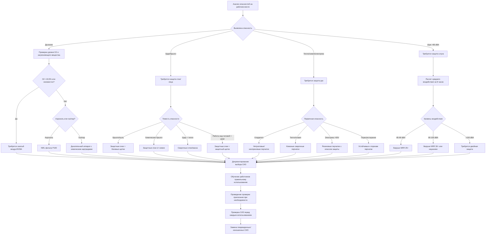

Средства индивидуальной защиты представляют последний барьер между техниками HVAC и опасностями на рабочем месте. OSHA требует от работодателей оценивать опасности на рабочем месте и предоставлять надлежащие СИЗ бесплатно работникам в соответствии с 29 CFR 1910.132. Работа в системах HVAC представляет уникальные риски воздействия, включая контакт с хладагентом, паяльные операции, входы в ограниченные пространства, воздействие шума и электрические опасности, требующие специальных стратегий защиты для каждой задачи.

## Требования к защите органов дыхания

Стандарт OSHA по защите органов дыхания (29 CFR 1910.134) предусматривает комплексную программу, когда опасности для дыхания невозможно устранить с помощью инженерных контрольных мер. Техники HVAC сталкиваются с опасностями для органов дыхания при обращении с хладагентом, работе в ограниченном пространстве и воздействии аэрозолей.

**Воздействие хладагента** требует специальной защиты в зависимости от концентрации и типа хладагента. R-410A и R-134a создают опасность асфиксии в ограниченных пространствах, где концентрация превышает 1000 ppm. Дыхательные аппараты с очисткой воздуха неэффективны против асфиксии; требуются дыхательные аппараты со сжатым воздухом или автономные дыхательные аппараты, когда уровень кислорода падает ниже 19,5% или концентрация хладагента превышает безопасные пределы.

**Воздействие аэрозолей** при замене фильтров, очистке воздуховодов и демонтаже требует фильтрации N95 или выше. Работы по борьбе с плесенью требуют фильтров P100, обеспечивающих фильтрацию 99,97% масляных и немасляных аэрозолей. Полумаски или полнолицевые эластомерные дыхательные аппараты с соответствующими картриджами обеспечивают многоразовую защиту при длительных операциях.

**Проверка прилегания** представляет критическое требование OSHA для плотноприлегающих дыхательных аппаратов. Количественная проверка прилегания измеряет фактическую утечку, в то время как качественная проверка использует обнаружение вкуса или запаха. Ежегодная проверка прилегания и проверка герметичности маски пользователя перед каждым использованием обеспечивают надлежащие коэффициенты защиты.

## Защита глаз и лица

Стандарт ASHRAE 15 и OSHA 29 CFR 1910.133 требуют защиту глаз при обращении с хладагентом и паяльных операциях. Выбор защиты зависит от характеристик конкретной опасности.

| Тип опасности | Требуемая защита | Рейтинг ударопрочности | Дополнительные требования |
|-------------|-------------------|---------------|------------------------|
| Обращение с хладагентом | Защитные очки от химических брызг | N/A | Косвенные вентиляционные отверстия, герметичное уплотнение |
| Пайка/сварка | Сварочные очки с оттенком 3-5 | Z87.1 | Фильтрация УФ/ИК, минимальный оттенок 3 |
| Шлифование/резка | Защитные очки с боковыми щитками | Z87+ | Ударопрочные, минимум 1 мм поликарбонат |
| Работа над головой | Защитные очки + защитный щиток лица | Z87+ | Защита подбородка, антибликовое покрытие |
| Вход в ограниченное пространство | Полнолицевой дыхательный аппарат | N/A | Обеспечивает комбинированную защиту органов дыхания/глаз |

**Поликарбонатные линзы** обеспечивают превосходную ударопрочность по сравнению с обычным пластиком, соответствуя требованиям ANSI Z87.1+ для высокоударного воздействия. Антибликовые покрытия поддерживают видимость во влажных условиях, характерных для запуска и пусконаладки. Очки по рецепту должны соответствовать тем же стандартам ударопрочности, что и непrescription варианты.

**Защитные щитки лица** дополняют, но никогда не заменяют защитные очки. Паяльные операции выше высоты плеча требуют как защитных очков, так и защитных щитков лица для защиты от расплавленных капель металла, которые могут отразиться вокруг однослойной защиты.

## Выбор защиты рук

Работа в HVAC требует выбора перчаток, соответствующих задаче, на основе механических, тепловых, химических и электрических опасностей. Ни одни перчатки не обеспечивают универсальную защиту.

| Категория задач | Тип перчаток | Стандарт защиты | Ограничения |
|--------------|-----------|-------------------|-------------|
| Обращение с хладагентом | Неопрен или нитрил | Химическая стойкость | Не для тепловых опасностей |
| Паяльные операции | Кожаные сварочные перчатки | ASTM F1060 устойчивость к теплу | Снимать при обращении с хладагентом |
| Электромонтажные работы >50V | Изолирующие резиновые перчатки класса 00-4 | ASTM D120, IEC 60903 | Проверять перед каждым использованием, переиспытание каждые 6-12 месяцев |
| Изготовление листового металла | Устойчивые к порезам (ANSI A4+) | ANSI/ISEA 105 | Не предотвращают проколы |
| Общее обращение | Механические перчатки | ANSI уровень стойкости к истиранию 3+ | Не химически и теплостойки |

**Электроизоляционные перчатки** требуют кожаных защитников для предотвращения физического повреждения. Перчатки класса 00 защищают до 500V AC, в то время как перчатки класса 4 обеспечивают защиту до 36000V AC. Визуальная проверка перед каждым использованием и периодическое электрическое тестирование с интервалами, указанными ASTM D120, обеспечивают продолжающуюся защиту.

**Химическая стойкость** варьируется по типу хладагента. Нитриловые перчатки обеспечивают отличную стойкость к минеральным маслам и многим хладагентам, но быстро деградируют при воздействии ароматических углеводородов. Неопрен обеспечивает более широкую химическую стойкость, включая устойчивость к хладагентам, маслам и мягким кислотам.

## Защита слуха

OSHA требует защиты слуха, когда средний уровень шума за 8 часов взвешенный по времени превышает 85 дBA (29 CFR 1910.95). Оборудование HVAC создает значительные опасности шума при эксплуатации, тестировании и установке.

**Типичные уровни воздействия шума** при работе в HVAC:

| Оборудование/операция | Типичный уровень звука | Максимальная продолжительность (85 dBA) | Требуется защита |
|-------------------|-------------------|------------------------|-------------------|
| Поршневые компрессоры | 95-105 dBA | 2-4 часа | Да |
| Большие центробежные охладители | 85-95 dBA | 4-8 часов | Да |
| Пневматические инструменты | 95-110 dBA | 15 минут - 2 часа | Да |
| Цех по изготовлению воздуховодов | 90-100 dBA | 1-8 часов | Да |
| Запуск кровельного блока | 80-90 dBA | Полная смена - 8 часов | Рекомендуется |

**Рейтинг шумоподавления (NRR)** указывает на снижение децибел, обеспечиваемое в идеальных лабораторных условиях. Защита в реальных условиях составляет примерно 50% от указанного NRR. Одноразовые поролоновые беруши обычно обеспечивают NRR 29-33 дB, в то время как наушники варьируются от NRR 21-31 dB. Двойная защита (беруши и наушники) обеспечивает максимальное подавление для экстремальных шумовых сред, превышающих 105 dBA.

**Требования к коммуникации** во время командной работы могут потребовать электронные наушники с функцией сквозной связи или изготовленные на заказ музыкальные беруши, которые ослабляют звук равномерно по всем частотам, сохраняя разборчивость речи.

## Процесс выбора СИЗ

Иерархия идентификации опасностей и выбора СИЗ следует систематической оценке:

## Дополнительное защитное оборудование

**Защитные каски** соответствующие ANSI Z89.1 тип I (защита верхней части) или тип II (защита верхней части и боковая защита) защищают от падающих предметов и надземных опасностей, общих при такелажных работах с оборудованием и работах на крыше. Защитные каски класса E обеспечивают электрическую защиту до 20000V.

**Ботинки со стальным носком** соответствующие ASTM F2413 защищают от сжатия и ударов от упавшего оборудования и материалов. Ботинки с рейтингом электрической опасности (EH) обеспечивают вторичную защиту от открытых цепей до 600V в сухих условиях.

**Одежда с дугостойкостью** становится обязательной при выполнении электромонтажных работ на энергизированном оборудовании, превышающем 50V с доступными уровнями энергии дуги, требующими защиты. Таблицы NFPA 70E указывают минимальный рейтинг защиты от дуги на основе расчетной энергии дуги и рабочего расстояния.

## Техническое обслуживание и проверка

OSHA требует от работодателей обеспечения того, чтобы СИЗ оставались в пригодном для использования состоянии. Протоколы проверки варьируются в зависимости от типа оборудования:

**Оборудование для защиты органов дыхания** требует ежедневную проверку пользователем ремней, клапанов и герметизирующих поверхностей. Квартальные проверки дыхательных аппаратов аварийного использования и ежемесячные проверки систем со сжатым воздухом квалифицированным персоналом обеспечивают надежность.

**Электрические перчатки** требуют проверки нагнетанием воздуха перед каждым использованием для выявления проколов или трещин. Сертифицированное лабораторное тестирование проводится каждые 6 месяцев для перчаток, используемых регулярно, ежегодно для перчаток, используемых время от времени.

**Оборудование защиты от падений** для техников на крыше требует проверки перед каждым использованием и официальной документированной проверки не менее одного раза в год компетентным лицом в соответствии с ANSI Z359.

Надлежащий выбор, техническое обслуживание и использование СИЗ представляют неоспоримые элементы комплексных программ безопасности HVAC. Обучение работников ограничениям, надлежащим процедурам надевания и снятия, а также требованиям по техническому обслуживанию обеспечивает, что СИЗ обеспечивают предусмотренную защиту на протяжении всего срока службы.
