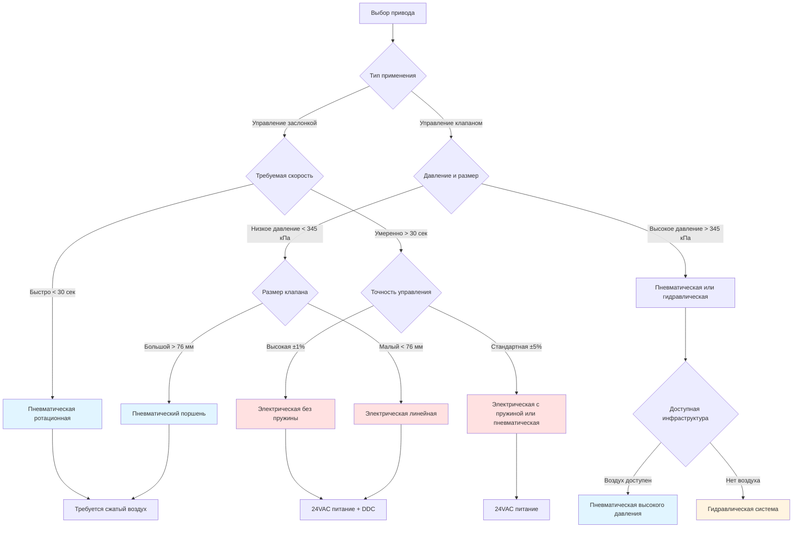

# Приводы HVAC: системы электрического, пневматического и гидравлического управления

Приводы преобразуют управляющие сигналы в механическое движение для позиционирования заслонок и клапанов во всей системе HVAC. Выбор зависит от требуемого усилия, времени отклика, точности управления и доступных источников энергии. Данный анализ рассматривает три основные технологии приводов и их характеристики производительности для конкретных применений.

## Фундаментальные принципы работы

### Требования к усилию и крутящему моменту

Выбор размера привода начинается с расчёта усилий, противодействующих движению. Для заслонок разность давления воздуха создаёт усилие:

$$F_{damper} = \Delta P \times A_{blade}$$

где $\Delta P$ — разность давления воздуха на лопасть заслонки (обычно 25-102 Па для применений HVAC) и $A_{blade}$ — эффективная площадь лопасти. Требуемый крутящий момент на валу заслонки становится:

$$T_{required} = F_{damper} \times \frac{L_{blade}}{2} \times \cos(\theta)$$

где $L_{blade}$ — длина лопасти от оси поворота и $\theta$ — угол наклона лопасти. Максимальный крутящий момент возникает при 45°, где аэродинамические силы достигают пика.

Для управляющих клапанов усилие на штоке должно преодолеть как гидравлическое давление, так и трение уплотнения:

$$F_{stem} = P_{inlet} \times A_{plug} + F_{friction}$$

Стандартная практика применяет коэффициент безопасности 1,5–2,0 к расчётным значениям согласно ASHRAE Guideline 13-2020.

## Электрические приводы

Электрические приводы используют двигатели переменного или постоянного тока с редукторным снижением для обеспечения усилия позиционирования. Современные устройства включают либо механизм возврата пружиной, либо механизм без возврата пружиной.

**Характеристики производительности:**

| Параметр | С возвратом пружины | Без возврата пружины |
|-----------|-------------------|----------------------|
| Диапазон крутящего момента | 0,39-3,4 Н·м | 0,39-45 Н·м |
| Время хода | 30-150 сек/90° | 15-90 сек/90° |
| Потребление мощности | 4-20 Вт работа | 2-15 Вт работа, 0,5 Вт удержание |
| Управляющий сигнал | 0-10 VDC, 2-10 VDC, 4-20 мА | То же + модулирующий |
| Точность позиционирования | ±2-5% | ±1-2% |

Электрическая мощность, требуемая для непрерывной модуляции:

$$P_{electric} = \frac{T_{load} \times \omega}{\eta_{motor} \times \eta_{gear}}$$

где $\omega$ — угловая скорость и значения $\eta$ представляют эффективность двигателя и редуктора (обычно 0,45–0,65 в сумме). Приводы без возврата пружины потребляют минимальную мощность удержания, так как редуктор самоблокируется.

**Преимущества:**
- Точное пропорциональное управление с обратной связью по положению
- Низкие эксплуатационные затраты и техническое обслуживание
- Прямая интеграция с системами DDC
- Доступны с резервным питанием для критических применений

**Ограничения:**
- Более медленный отклик, чем пневматические (обычно 60–150 секунд полный ход)
- Требует инфраструктуры электропроводки
- Выделение тепла при непрерывной модуляции

## Пневматические приводы

Пневматические приводы преобразуют давление сжатого воздуха (обычно 90–103 кПа) в линейное или вращательное движение через механизм диафрагмы или поршня.

Выходное усилие диафрагменного привода следует:

$$F_{output} = (P_{signal} - P_{atmospheric}) \times A_{diaphragm} - F_{spring}$$

Для стандартной диафрагмы диаметром 200 мм с диапазоном сигнала 20–103 кПа:

$$F_{max} = (103 - 20) \text{ кПа} \times \pi \times (0,1 \text{ м})^2 = 2,61 \text{ кН}$$

**Спецификации производительности:**

| Тип привода | Усилие/Крутящий момент | Время отклика | Потребление воздуха |
|-------------|----------------------|----------------|-------------------|
| Диафрагма (заслонка) | 0,45-9 кН | 10-30 сек | 0,048-0,24 м³/мин |
| Поршень (клапан) | 0,9-22 кН | 5-15 сек | 0,095-0,48 м³/мин |
| Ротационная лопасть | 17-170 Н·м | 15-45 сек | 0,072-0,29 м³/мин |

Потребление воздуха при работе:

$$V_{air} = \frac{A_{diaphragm} \times S_{stroke} \times (P_{max} + 101,3)}{101,3}$$

выражается в кубических метрах при атмосферном давлении, где $S_{stroke}$ — длина хода.

**Преимущества:**
- Быстрое время отклика (обычно 10–30 секунд)
- Высокое отношение усилия к массе
- Внутренне безопасны с возвратом пружиной
- Невосприимчивы к электрическим помехам

**Ограничения:**
- Требует инфраструктуры сжатого воздуха (103–138 кПа)
- Потребление энергии компрессора воздуха (0,11–0,19 кВт на м³/мин)
- Чувствительность к температуре влияет на характеристики пружины
- Гистерезис обычно 0,5–2% диапазона

## Гидравлические приводы

Гидравлические приводы используют давление жидкости (обычно 3,4–20,7 МПа) для применений, требующих экстремального усилия в ограниченном пространстве. Редко используются в коммерческих HVAC, но распространены на больших промышленных заслонках и изолирующих клапанах холодной воды.

Выходное усилие:

$$F_{hydraulic} = P_{hydraulic} \times A_{piston}$$

Поршень диаметром 51 мм при 6,9 МПа генерирует:

$$F = 6,9 \text{ МПа} \times \pi \times (0,0254 \text{ м})^2 = 14,0 \text{ кН}$$

Это усилие в компактном корпусе делает гидравлическую актуацию подходящей для больших заслонок (>0,9 м²), где пневматические системы требовали бы непрактично больших диафрагм.

**Типичные применения:**
- Большие изолирующие заслонки в промышленных процессах
- Управление клапанами с высоким давлением пара (>2,07 МПа)
- Системы аварийного отключения, требующие быстрого закрытия
- Экстремальные температурные условия (-40°C до 150°C)

## Блок-схема выбора типа привода

## Совместимость управляющих сигналов

Современные системы автоматизации зданий взаимодействуют с приводами через стандартизированные сигналы согласно ASHRAE Guideline 13:

**Аналоговые управляющие сигналы:**
- 0-10 VDC: наиболее распространены для электрических приводов
- 2-10 VDC: обеспечивает возможность обнаружения неисправности ниже 2В
- 4-20 мА: токовый контур для длительных линий с электрическими помехами
- 20–103 кПа: стандартный диапазон пневматического сигнала

**Цифровая коммуникация:**
- BACnet MS/TP: прямая интеграция с контроллерами DDC
- Modbus RTU: распространена в применениях модернизации
- 0-10V с обратной связью по положению: обеспечивает проверку замкнутого контура

Достижимая точность управления зависит от конструкции привода. Электрические приводы с обратной связью потенциометра обычно разрешают 0,5–1,0% хода, в то время как пневматические системы с позиционерами достигают 1–2% из-за механического гистерезиса в диафрагме и узле пружины.

## Техническое обслуживание и рассмотрение жизненного цикла

Электрические приводы обычно требуют минимального технического обслуживания помимо периодической проверки крепёжного оборудования и электрических соединений. Пневматические системы требуют качества подачи воздуха согласно ASHRAE Standard 188 для предотвращения деградации диафрагмы. Установите осушители и фильтры воздуха, чтобы поддерживать точку росы ниже -40°C и фильтрацию до 5 микрон.

Ожидаемый срок службы при нормальных условиях:
- Электрические приводы: 15-20 лет (50 000–100 000 циклов)
- Пневматические приводы: 10-15 лет (200 000–500 000 циклов)
- Гидравлические приводы: 20-25 лет (1 000 000+ циклов)

Надлежащий выбор на основе требований применения, доступной инфраструктуры и потребностей в точности управления обеспечивает надёжную работу системы HVAC на протяжении проектного срока службы.
