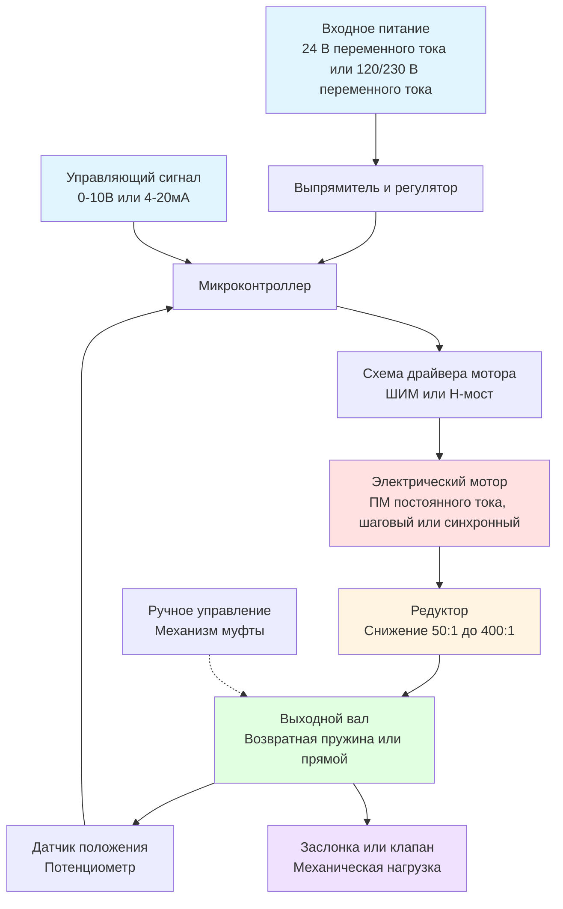

Электрические приводы преобразуют электрические сигналы в механическое движение для позиционирования заслонок и клапанов в системах HVAC. Эти устройства обеспечивают точное управление потоком воздуха и потоком воды, позволяя автоматизировать управление температурой, вентиляцию и энергоменеджмент.

## Технологии электромоторов

Электрические приводы используют различные типы моторов в зависимости от требований управления и характера приложения.

**Синхронные электромоторы**

Синхронные электромоторы работают с фиксированными скоростями, определяемыми частотой линии и количеством полюсов. Эти моторы обеспечивают согласованную скорость позиционирования и высокую надежность для двухпозиционного и плавающего управления. Скорость = (120 × частота) / количество полюсов.

**Электромоторы с экранирующей катушкой**

Электромоторы с экранирующей катушкой — это простые, недорогие моторы, подходящие для малых приводов. Они имеют медные кольца на полюсах статора, которые создают вращающееся магнитное поле. Типичный КПД составляет 15-30%, что делает их пригодными для приложений с низким циклом работы.

**Шаговые электромоторы**

Шаговые электромоторы вращаются на дискретные угловые приращения, как правило, 0,9° до 1,8° на шаг. Это обеспечивает отличную точность позиционирования без устройств обратной связи. Удерживающий момент сохраняет положение при отключении питания, исключая дрейф в приложениях модулирования.

**Двигатели постоянного тока с постоянными магнитами**

Двигатели ПМ постоянного тока обладают высоким отношением крутящего момента к весу и эффективной работой. Электронная коммутация исключает щетки, продлевая срок службы более 60 000 часов в приложениях непрерывной работы. Эти моторы обеспечивают пропорциональное управление с быстрым временем отклика.

## Конфигурации приводов

### Приводы с возвратной пружиной

Приводы с возвратной пружиной включают механическую пружину, которая возвращает привод в заранее определенное безопасное положение при потере питания. Пружина накапливает энергию во время управляемого вращения выходного вала, обеспечивая возможность аварийного позиционирования, критическую для систем защиты жизни.

**Работа привода с возвратной пружиной:**

1. Мотор активируется и сжимает возвратную пружину при вращении выходного вала
2. Электронный контроллер сохраняет положение против силы пружины
3. Потеря питания высвобождает энергию пружины
4. Пружина приводит привод в безопасное положение (обычно 0° или 90°)

Приводы с возвратной пружиной требуют моторов с более высоким крутящим моментом для преодоления сопротивления пружины во время нормальной работы. Доступный крутящий момент на валу равен крутящему моменту мотора минус противодействующая сила пружины.

### Приводы без возвратной пружины

Приводы без возвратной пружины не имеют пружин безопасности, полностью полагаясь на мощность мотора для позиционирования. Эти устройства обеспечивают более высокий эффективный выходной крутящий момент, так как мотор не работает против сопротивления пружины. КПД редуктора обычно достигает 40-60%, в сравнении с 25-40% для конструкций с возвратной пружиной.

Приводы без возвратной пружины сохраняют последнее положение при прерывании питания. Модули резервного питания от батареи обеспечивают аварийное позиционирование, когда требуется безопасная операция без штрафа по крутящему моменту механических пружин.

### Модулирующие приводы

Модулирующие приводы обеспечивают непрерывное позиционирование по всему диапазону вращения в ответ на аналоговые управляющие сигналы (0-10 В, 2-10 В, 4-20 мА). Встроенные контроллеры сравнивают сигналы обратной связи с управляющими сигналами, регулируя работу мотора, чтобы минимизировать ошибку позиционирования.

**Компоненты контроллера обратной связи:**

- Датчик положения (потенциометр или устройство Холла)
- Электронная схема компаратора
- Драйвер мотора ШИМ
- Кондиционер сигнала обратной связи

Точность позиционирования обычно достигает ±1-2% диапазона. Регулировки мертвой зоны предотвращают колебания в стабильных условиях.

## Требования к крутящему моменту и расчеты

Выбор размера привода требует расчета максимального крутящего момента, воздействующего на управляемое устройство в наихудших условиях.

**Расчет крутящего момента заслонки:**

Для противоположных лопастных заслонок:
T = (A × ΔP × L) / (2 × η)

Для параллельных лопастных заслонок:
T = (A × ΔP × L × k) / (2 × η)

Где:
- T = требуемый крутящий момент (Н·м)
- A = площадь лица заслонки (м²)
- ΔP = максимальный дифференциальный перепад давления (Па)
- L = длина лопасти (м)
- k = коэффициент для параллельных лопастей (1,5-2,0)
- η = механический КПД (0,85-0,95)

**Применение коэффициента безопасности:**

Выбирайте приводы с доступным крутящим моментом, превышающим расчетные требования на 25-50%, чтобы учесть:
- Увеличение трения подшипников в течение срока службы
- Заклинивание рычагов связей лопастей
- Силы сопротивления уплотнений
- Образование льда в приложениях с воздухом извне
- Колебания напряжения, снижающие крутящий момент мотора

## Таблицы выбора приводов

### Выбор размера привода заслонки

| Размер заслонки (см) | Макс. ΔP (Па) | Тип заслонки | Мин. крутящий момент (Н·м) | Рекомендуемый привод |
|----------------------|-----------------|------------|--------------------------|----------------------|
| 30 × 30 | 479 | Противоположные лопасти | 0,49 | 0,62 Н·м ВП |
| 61 × 61 | 479 | Противоположные лопасти | 1,98 | 2,48 Н·м ВП |
| 91 × 91 | 479 | Противоположные лопасти | 4,47 | 5,68 Н·м БВП |
| 122 × 122 | 479 | Противоположные лопасти | 7,95 | 9,94 Н·м БВП |
| 61 × 61 | 958 | Параллельные лопасти | 5,96 | 7,53 Н·м БВП |
| 91 × 91 | 958 | Параллельные лопасти | 17,89 | 22,71 Н·м БВП |

### Выбор привода клапана

| Размер клапана (см) | Тип клапана | Перепад закрытия (кПа) | Требуемый крутящий момент (Н·м) | Тип привода |
|-------------------|-------------|----------------------|--------------------------------|------------|
| 1,27-5,08 | Шаровый | 345 | 0,49-1,28 | 1,28 Н·м ВП |
| 6,35-7,62 | Шаровый | 345 | 2,27-3,77 | 4,40 Н·м ВП |
| 10,16-15,24 | Дисковый | 1034 | 4,97-12,78 | 14,24 Н·м БВП |
| 20,32-25,4 | Дисковый | 1034 | 19,88-39,76 | 42,61 Н·м БВП |

ВП = Возвратная пружина, БВП = Без возвратной пружины

## Технические характеристики

### Электрические параметры

| Параметр | Типичные значения | Примечания |
|----------|------------------|-----------|
| Входное напряжение | 24 В переменного тока, 120 В переменного тока, 230 В переменного тока | Допуск ±10% |
| Управляющий сигнал | 0-10 В, 2-10 В, 4-20 мА | Типы модулирования |
| Потребление мощности | 3-25 Вт | Зависит от рейтинга крутящего момента |
| Время позиционирования | 30-240 секунд | Для вращения на 90° |

### Характеристики производительности

| Характеристика | Типичный диапазон | Влияние на приложение |
|----------------|------------------|----------------------|
| Диапазон вращения | 90°, 95°, 180° | Соответствует требованиям устройства |
| Точность позиционирования | ±1-2% диапазона | Управление модулированием |
| Сигнал обратной связи | 0-10 В, 4-20 мА | Для интеграции DDC |
| Рабочая температура | −40°C до 54°C | Стандартная работа |
| Срок службы | 60 000-100 000 циклов | Типы электромоторов |

## Стандарты и соответствие

Электрические приводы для приложений HVAC должны соответствовать соответствующим стандартам:

**NEMA ICS 2** - Промышленные устройства управления, контроллеры и узлы. Определяет требования к конструкции, производительности и испытаниям оборудования управления, включая электрические приводы.

**UL 873** - Стандарт для оборудования с указанием температуры и ее регулированием. Охватывает требования безопасности для приводов, используемых в системах управления температурой.

**ASHRAE Standard 135 (BACnet)** - Устанавливает протоколы связи для автоматизации зданий, включая управление приводами и форматы сигналов обратной связи.

**IEC 60534-6-1** - Промышленные регулирующие клапаны, часть 6-1: системы позиционирования для приводов регулирующих клапанов. Обеспечивает спецификации производительности и методы испытаний для модулирующих приводов.

Выбор привода должен учитывать условия окружающей среды, требования к точности управления, необходимость безопасного позиционирования и интеграцию с системами автоматизации зданий. Надлежащий выбор размера с адекватными коэффициентами безопасности обеспечивает надежную работу на протяжении всего ожидаемого срока службы.
