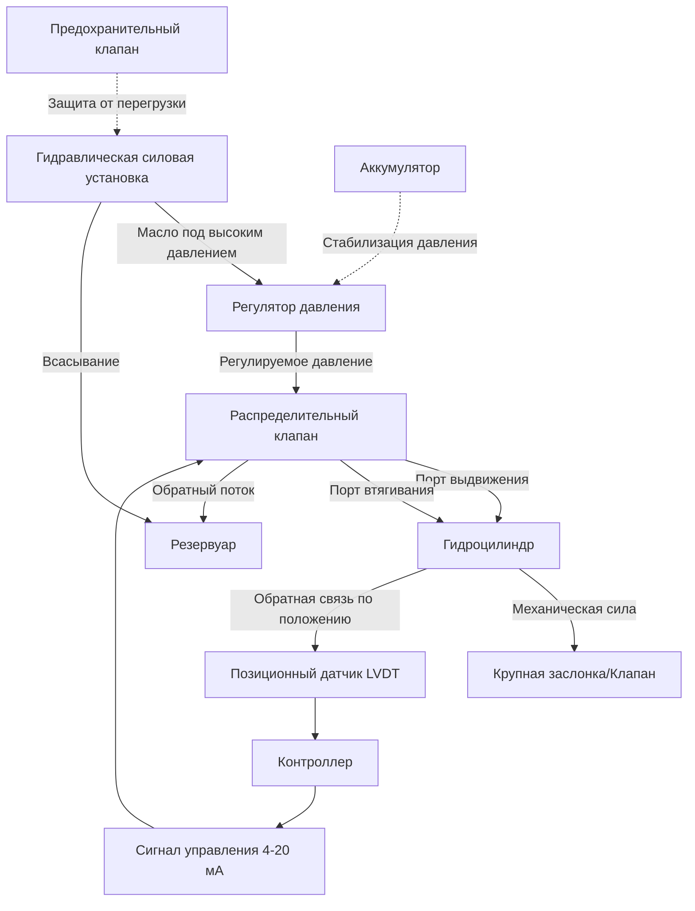

## Обзор

Гидравлические приводы преобразуют гидравлическое давление в механическую силу и движение для управления крупными HVAC-клапанами, заслонками и другим оборудованием, требующим значительного усилия привода. Эти приводы используют закон Паскаля — давление, приложенное к замкнутой жидкости, передается без уменьшения по всему объему жидкости — для создания сил в диапазоне от 2224 Н до более 44482 Н, что значительно превышает возможности пневматических или электрических приводов.

## Архитектура системы гидравлического привода

## Расчеты силы и давления

Фундаментальная зависимость между гидравлическим давлением и усилием привода описывается формулой:

**F = P × A**

Где:
- F = Выходная сила (Н или кН)
- P = Гидравлическое давление (кПа или Па)
- A = Площадь поршня (м²)

### Пример расчета

Для двухстороннего гидроцилиндра с диаметром цилиндра 76,2 мм, работающего при давлении 10342 кПа:

**Площадь поршня:** A = π × (D/2)² = π × (76,2/2)² = 4560 мм²

**Сила выдвижения:** F = 10342 кПа × 0,00456 м² = 47160 Н

**Сила втягивания:** Уменьшена за счет площади штока. Для штока диаметром 25,4 мм:
- Площадь штока = π × (25,4/2)² = 506,7 мм²
- Эффективная площадь = 4560 - 506,7 = 4053,3 мм²
- F_втягивания = 10342 кПа × 0,0040533 м² = 41920 Н

## Применение в HVAC

| Применение | Типичный диапазон усилия | Диапазон давления | Тип привода |
|-------------|--------------------------|------------------|-------------|
| Крупные промышленные заслонки (>1219 мм) | 8900-35600 Н | 6895-13790 кПа | Линейный цилиндр |
| Дымовые заслонки аварийного срабатывания | 6670-17800 Н | 10342-20685 кПа | Цилиндр с возвратной пружиной |
| Крупные изоляционные клапаны (>305 мм) | 13350-44480 Н | 10342-17240 кПа | Линейный или роторный лопаточный |
| Входные направляющие лопатки (чиллеры) | 2224-8900 Н | 6895-10342 кПа | Роторный привод |
| Управление жалюзи (градирни) | 4450-13350 Н | 6895-10342 кПа | Линейный цилиндр |

## Электрогидравлические приводы

Электрогидравлические приводы интегрируют гидравлическую силовую установку, управляющий клапан и цилиндр в автономную систему с электронным управлением. Эти устройства обеспечивают:

**Преимущества:**
- Пропорциональное управление через сигналы 0-10 В постоянного тока или 4-20 мА
- Интегрированная обратная связь по положению (потенциометрическая или LVDT)
- Аварийное позиционирование через аккумуляторы
- Модулирующее управление с точностью позиционирования 0,1%
- Заводские герметичные системы, требующие минимального обслуживания

**Конфигурация управления:**
Сервоклапан модулирует гидравлический поток на основе сигнала ошибки между заданным положением и фактической обратной связью по положению. Цикл управления PID обеспечивает точность позиционирования при изменяющихся нагрузках. Пружинные аккумуляторы обеспечивают аварийное позиционирование при потере питания.

## Спецификации гидравлической системы

| Параметр | Стандартный диапазон | Диапазон высокой производительности |
|------|----------------------|-----------------------------------|
| Рабочее давление | 6895-13790 кПа | 13790-20685 кПа |
| Гидравлическая жидкость | ISO VG 32-46 | Синтетический эфир (огнестойкий) |
| Рабочая температура | 0-65°C | -40-93°C |
| Время отклика (полный ход) | 10-30 секунд | 3-10 секунд |
| Точность позиционирования | ±1-2% | ±0,1-0,5% |
| Ресурс по циклам | 500 000 циклов | 1 000 000+ циклов |

## Соображения при проектировании системы

**Выбор гидравлической жидкости:**
Используйте нефтяные гидравлические масла (ISO VG 32 или 46) для стандартных применений. Огнестойкие жидкости (фосфатный эфир, гликоль с водой) требуются вблизи источников тепла или в занятых помещениях согласно NFPA 90A.

**Требования к давлению:**
Подбирайте гидравлическое давление на основе максимального крутящего момента заслонки при аварийном закрытии плюс 25% запас прочности. Рассчитайте крутящий момент отрыва заслонки при максимальном дифференциальном давлении (обычно 997-1994 Па для применений по контролю дыма).

**Подбор объема аккумулятора:**
Для обеспечения отказоустойчивой работы объем аккумулятора должен обеспечивать полный ход поршня при перепаде давления, не превышающем 20% от рабочего давления. Используйте уравнение:

**V = (V_cyl × P_op) / (P_op - P_final)**

Где V_cyl — объем цилиндра для полного хода, P_op — рабочее давление, P_final — минимально допустимое давление.

**Компенсация температуры:**
Вязкость гидравлического масла изменяется примерно на 10% при изменении температуры на 5,6°C. Подбирайте насосы и фильтры с учетом наихудшего режима (вязкость при самом холодном запуске). Включите нагреватели для систем, работающих при температуре окружающей среды ниже 4,4°C.

## Стандарты и нормы

**NFPA 92:** Системы противодымной защиты, требующие быстрого срабатывания исполнительных механизмов
**ASHRAE Guideline 36:** Последовательности управления для критических заслонок
**ISO 4413:** Общие правила и требования безопасности для гидравлических систем
**ANSI/NFPA 70:** Электромонтаж электрогидравлических систем управления
**AMCA 500-D:** Лабораторные методы испытаний заслонок на производительность, включая требования к крутящему моменту

## Требования к техническому обслуживанию

- Ежеквартально проверяйте уровень и состояние гидравлического масла
- Заменяйте фильтры каждые 2000 часов эксплуатации или при превышении перепада давления предельных значений, установленных производителем
- Ежегодно проводите испытания отказоустойчивого аварийного режима работы
- Полугодово проверяйте калибровку положения
- Ежемесячно проверяйте наличие внешних утечек (допустимая скорость <1 капли/минуту в местах соединений)
- При каждом сезонном запуске системы HVAC проводите функциональное испытание полного хода
