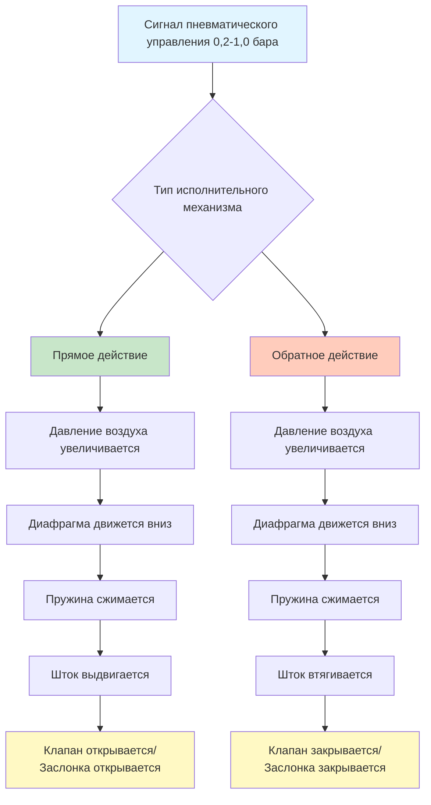

## Основы пневматических исполнительных механизмов

Пневматические исполнительные механизмы преобразуют сигналы давления сжатого воздуха в механическое движение для управления заслонками и клапанами в системах HVAC. Эти устройства работают по принципу баланса сил, где давление воздуха, действующее на площадь диафрагмы, создает силу, противодействующую натяжению пружины.

### Принцип работы

Основное уравнение, определяющее работу пневматического исполнительного механизма:

**F = P × A - F_пружина**

Где:
- F = Чистая выходная сила (Н)
- P = Давление воздуха (кПа)
- A = Эффективная площадь диафрагмы (см²)
- F_пружина = Сила пружины (Н)

Стандартные пневматические сигналы управления находятся в диапазоне от 0,2 до 1,0 бар в соответствии со стандартом ASHRAE Standard 135 и спецификациями ISA-20. Этот диапазон 0,8 бар обеспечивает органы управления для пропорционального позиционирования.

## Конфигурации прямого и обратного действия

| Конфигурация | При увеличении давления воздуха | Пружина сжимается | Типичное применение |
|--------------|----------------------------------|-------------------|---------------------|
| Прямое действие | Шток выдвигается | Во время работы | Нормально закрытые клапаны, управление охлаждением |
| Обратное действие | Шток втягивается | Во время работы | Нормально открытые клапаны, управление отоплением |

**Исполнительные механизмы прямого действия** выдвигают шток при увеличении давления воздуха. При 0,2 бара (минимальный сигнал) пружина удерживает исполнительный механизм на минимальном ходе. При 1,0 бара (максимальный сигнал) давление воздуха полностью сжимает пружину, полностью выдвигая шток.

**Исполнительные механизмы обратного действия** втягивают шток при увеличении давления воздуха. Пружина выдвигает шток при низком давлении, а давление воздуха преодолевает натяжение пружины при высоком давлении.

## Расчеты площади диафрагмы и силы

### Пример расчета размера

Рассчитайте требуемую площадь диафрагмы для исполнительного механизма, который должен создавать 445 Н при 1,0 бара с силой пружины 178 Н.

**Шаг 1:** Определите чистую требуемую силу
- F_нетто = F_выход + F_пружина = 445 + 178 = 623 Н

**Шаг 2:** Рассчитайте площадь диафрагмы
- A = F_нетто / P_макс = 623 / 100 = 60,3 см²

**Шаг 3:** Выберите стандартный размер исполнительного механизма
- Стандартный размер: 65 см² эффективной площади (обеспечивает расчетный запас)

### Проверка

При 1,0 бара с диафрагмой площадью 65 см²:
- F_доступная = (100 × 65) - 178 = 6322 Н (запас 10% сверху требуемых 445 Н)

## Выбор диапазона пружины

Диапазоны пружин определяют диапазон давлений, в котором исполнительный механизм перемещается из полностью закрытого положения в полностью открытое. Общие диапазоны включают:

| Диапазон пружины | Начальное давление | Конечное давление | Применение |
|------------------|-------------------|-------------------|-------------|
| 0,2-0,55 бара | 0,2 бара | 0,55 бара | Маломощные заслонки, безопасный пружинный возврат |
| 0,55-0,9 бара | 0,55 бара | 0,9 бара | Разделенное управление, секвенирование |
| 0,2-1,0 бара | 0,2 бара | 1,0 бара | Стандартное пропорциональное управление |
| 0,34-0,69 бара | 0,34 бара | 0,69 бара | Специальные приложения |

**Расчет жесткости пружины:**

k = (P_макс - P_мин) × A / Ход

Для исполнительного механизма с площадью 65 см², ходом 5 см и диапазоном 0,2-1,0 бара:
- k = (100 - 20) × 65 / 50 = 104 Н/см

## Работа с пружинным возвратом

Исполнительные механизмы с пружинным возвратом автоматически возвращаются в безопасное положение при потере подачи воздуха. Пружина должна накапливать достаточно энергии для преодоления трения и полного перемещения управляемого устройства.

**Требование энергии пружины:**

E = (F_нагрузка + F_трение) × Ход + Запас_безопасности

Где запас безопасности обычно составляет 20-30% от расчетной энергии.

## Применение позиционеров

Пневматические позиционеры повышают точность и отклик исполнительного механизма, сравнивая обратную связь о положении исполнительного механизма с входным сигналом управления. Позиционеры исключают ошибки смещения, вызванные:

- Переменными силами нагрузки
- Колебаниями давления подачи
- Изменениями трения
- Эффектами гистерезиса

### Таблица выбора размеров позиционера

| Размер исполнительного механизма | Потребление воздуха позиционером | Требуемое давление подачи | Время отклика |
|-----------------------------------|--------------------------------|--------------------------|---------------|
| 32-97 см² | 0,24-0,47 м³/ч | 138-172 кПа | 2-4 секунды |
| 129-258 см² | 0,71-1,42 м³/ч | 172-241 кПа | 3-6 секунд |
| 323-645 см² | 1,42-2,84 м³/ч | 241-345 кПа | 5-10 секунд |
| >645 см² | 2,84-5,68 м³/ч | 345-552 кПа | 8-15 секунд |

## Требования к подаче сжатого воздуха

Подача сжатого воздуха должна соответствовать стандартам качества в соответствии с ISA-7.0.01 (Инструментальный воздух):

- **Давление:** Подача 138-690 кПа (обычно 276-414 кПа)
- **Точка росы:** -40°C при давлении в линии
- **Содержание масла:** <1 мг/м³
- **Размер частиц:** <3 микрона
- **Класс качества:** В соответствии с ISO 8573-1 Класс 1.4.1

### Применение усилителей объема

Усилители объема увеличивают скорость хода исполнительного механизма, подавая высокие расходы воздуха при изменении положения. Устанавливайте усилители объема, когда:

- Объем исполнительного механизма >3260 см³
- Длина линии управления >15 метров
- Требования ко времени отклика <3 секунд
- Несколько исполнительных механизмов управляются от одного сигнала

## Конфигурации пневматических реле

Пневматические реле обеспечивают усиление сигнала, инверсию и логические функции:

| Тип реле | Функция | Коэффициент давления | Применение |
|----------|---------|---------------------|-------------|
| Прямое | Усиление | 1:1 | Усиление сигнала |
| Инвертирующее | Инверсия | 1:1 | Инверсия действия (ПД на ОД) |
| Усреднение | Вычисление среднего | N/A | Усреднение нескольких датчиков |
| Выбор высокого/низкого | Логика | N/A | Управление переопределением |

## Определение размеров исполнительного механизма для приложений с крутящим моментом

Для ротационных заслонок и поворотных клапанов рассчитайте требуемый крутящий момент:

**T = F × r**

Где:
- T = Требуемый крутящий момент (Н·см)
- F = Сила исполнительного механизма (Н)
- r = Эффективное плечо момента (см)

Добавьте запас 50-100% для герметизирующей силы заслонки и трения подшипников.

### Таблица выбора размеров по крутящему моменту

| Размер заслонки | Крутящий момент на разрыв | Рабочий крутящий момент | Рекомендуемый исполнительный механизм |
|-----------------|--------------------------|----------------------|--------------------------------------|
| 30 см × 30 см | 28-56 Н·м | 17-34 Н·м | 65 см², 0,2-1,0 бара |
| 60 см × 60 см | 112-224 Н·м | 68-136 Н·м | 162 см², 0,2-1,0 бара |
| 90 см × 90 см | 339-678 Н·м | 203-407 Н·м | 388 см², 0,2-1,0 бара |
| 120 см × 120 см | 678-1356 Н·м | 407-814 Н·м | 776 см², 0,2-1,0 бара |

## Стандарты и ссылки

- ASHRAE Standard 135: BACnet протокол (спецификации пневматических сигналов)
- ISA-20: Спецификационные формы для приборов измерения и управления технологическими процессами
- ISA-7.0.01: Стандарт качества инструментального воздуха
- ANSI/NFPA 70: Национальный электротехнический кодекс (требования для опасных зон)
- ISO 8573-1: Классы качества сжатого воздуха
