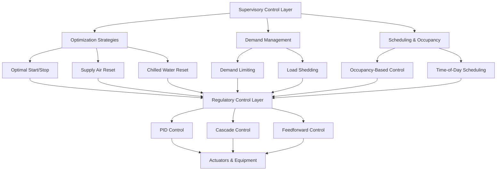

## Иерархия стратегий управления

Современные системы HVAC реализуют несколько уровней стратегий управления для оптимизации энергоэффективности, комфорта занимающихся и надежности оборудования. Иерархия переходит от базового регуляторного управления к расширенным алгоритмам надзора и оптимизации.

## Алгоритмы регуляторного управления

### Основы ПИД-регулирования

Пропорционально-интегрально-дифференциальное управление образует основу регуляторного управления HVAC. Выходной сигнал контроллера рассчитывается как:

$$u(t) = K_p e(t) + K_i \int_0^t e(\tau) d\tau + K_d \frac{de(t)}{dt}$$

Где:
- $u(t)$ = выходной сигнал контроллера в момент времени $t$
- $e(t)$ = сигнал ошибки (задание - переменная процесса)
- $K_p$ = коэффициент пропорционального усиления
- $K_i$ = коэффициент интегрального усиления
- $K_d$ = коэффициент дифференциального усиления

В дискретной форме для цифровой реализации:

$$u_n = K_p e_n + K_i \sum_{k=0}^{n} e_k \Delta t + K_d \frac{e_n - e_{n-1}}{\Delta t}$$

### Архитектура каскадного управления

Каскадное управление использует первичный (внешний) контур управления желаемой переменной и вторичный (внутренний) контур управления промежуточной переменной. Выход первичного контроллера становится задаением для вторичного контроллера:

$$SP_{secondary}(t) = u_{primary}(t)$$

Уравнение вторичного контура:

$$u_{secondary}(t) = K_{p,s} e_s(t) + K_{i,s} \int_0^t e_s(\tau) d\tau$$

Где $e_s(t) = SP_{secondary}(t) - PV_{secondary}(t)$

## Передовые стратегии управления

### Стратегии сброса

Стратегии сброса динамически корректируют уставки на основе потребности системы, снижая энергопотребление при сохранении комфорта.

**Сброс температуры приточного воздуха:**

$$T_{SA,SP} = T_{SA,min} + (T_{SA,max} - T_{SA,min}) \times \frac{\sum_{i=1}^{n} max(0, VLV_i - VLV_{trim})}{n}$$

Где:
- $T_{SA,SP}$ = уставка температуры приточного воздуха
- $VLV_i$ = положение клапана для зоны $i$
- $VLV_{trim}$ = пороговое значение подстройки (обычно 0,95)
- $n$ = количество зон

**Сброс статического давления (ASHRAE Guideline 36):**

$$SP_{static} = SP_{min} + (SP_{max} - SP_{min}) \times R_{requests}$$

Где $R_{requests}$ представляет долю зон, запрашивающих увеличенный расход воздуха.

### Алгоритмы оптимального старта/стопа

Оптимальный старт рассчитывает минимальное время выполнения перед приходом людей, необходимое для достижения условий комфорта к моменту занятия помещения:

$$t_{start} = t_{occupancy} - \frac{T_{current} - T_{setpoint}}{R_{heat}}$$

Где $R_{heat}$ — измеренная скорость нагрева (°C/час), определяемая адаптивным обучением:

$$R_{heat,n} = \alpha \times R_{measured} + (1-\alpha) \times R_{heat,n-1}$$

Коэффициент обучения $\alpha$ обычно находится в диапазоне от 0,1 до 0,3.

**Оптимальный стоп** продлевается в периоды отсутствия людей с использованием тепловой массы:

$$t_{stop} = t_{unoccupancy} + \frac{T_{comfort,max} - T_{setpoint}}{R_{drift}}$$

### Ограничение спроса и сброс нагрузки

Ограничение спроса предотвращает пиковые сборы за спрос, временно снижая производительность оборудования при приближении к пороговым значениям спроса:

$$P_{limit}(t) = P_{target} - P_{current}(t) - P_{safety\_margin}$$

Когда $P_{limit}(t) < 0$, система инициирует ступенчатое снижение нагрузки:

1. **Этап 1:** Увеличение уставки температуры на 0,5–1°C
2. **Этап 2:** Снижение наружного воздуха до минимума по коду
3. **Этап 3:** Циклирование некритичного оборудования
4. **Этап 4:** Отключение или снижение производительности выбранных зон

## Сравнение стратегий управления

| Стратегия | Применение | Экономия энергии | Сложность | Время отклика |
|-----------|-----------|-----------------|-----------|---------------|
| **ПИД** | Температура, давление, расход | Базовое | Низкая | Быстрое (секунды) |
| **Каскадное** | Температура приточного воздуха, давление в канале | 5–10% против одного контура | Средняя | Среднее (минуты) |
| **Сброс температуры приточного воздуха** | Системы VAV, AHU | 10–20% | Низкая | Медленное (часы) |
| **Сброс температуры холодной воды** | Центральные установки | 15–25% | Средняя | Медленное (часы) |
| **Оптимальный старт/стоп** | Все плановые системы | 10–30% | Средняя | N/A (планирование) |
| **Ограничение спроса** | Снижение пикового спроса | Снижение затрат | Средняя | Быстрое (секунды) |
| **Прогнозное/MPC** | Сложные многозонные системы | 20–40% | Высокая | Переменное |

## Параметры настройки и производительность

| Тип управления | Типичная полоса пропорциональности | Время интеграции | Время дифференцирования | Интервал обновления |
|---|---|---|---|---|
| **Температура помещения** | 1,5–3°C | 10–20 мин | Не используется | 1–5 мин |
| **Температура выходного воздуха** | 1–2°C | 3–10 мин | 0,5–2 мин | 15–60 сек |
| **Статическое давление в канале** | 75–150 Па | 1–5 мин | Не используется | 5–30 сек |
| **Температура подачи холодной воды** | 1–2°C | 5–15 мин | 1–3 мин | 30–120 сек |

## Интеграция ASHRAE Guideline 36

ASHRAE Guideline 36 предоставляет стандартизированные последовательности управления высокой эффективности для систем HVAC. Ключевые элементы включают:

**Логика подстройки и ответа:** Корректирует уставки на основе запросов зон, а не отдельной обратной связи датчиков, обеспечивая стабильную работу системы.

**Защита от замерзания:** Многоступенчатая защита с использованием датчиков температуры и мониторинга перепада давления для предотвращения замерзания теплообменника.

**Управление экономайзером:** Интегрированное управление с дифференциальной энтальпией или контролем сухого термометра с координацией вентилятора рельефа.

**Вентиляция по требованию:** Корректировка расхода наружного воздуха на основе CO₂ для поддержания качества воздуха в помещении при минимизации нагрузок кондиционирования.

Внедрение последовательностей Guideline 36 обычно дает 10–30% экономии энергии по сравнению с традиционными стратегиями управления, с улучшенным комфортом за счет снижения колебаний температуры и улучшенного управления влажностью.

## Рекомендации по внедрению

**Взаимодействие контуров управления:** При внедрении нескольких стратегий сброса проверьте, что контуры не конфликтуют. Сброс температуры приточного воздуха и сброс температуры холодной воды должны работать с разными постоянными времени для предотвращения нестабильности.

**Размещение датчиков:** Точное управление требует надлежащего размещения датчиков. Датчики температуры помещения должны избегать прямого солнечного света, выходных отверстий приточного воздуха и внешних стен. Датчики в каналах требуют достаточной длины прямого участка для репрезентативных измерений.

**Требования к наладке:** Все передовые стратегии управления требуют функционального тестирования для проверки надлежащей работы. Задокументируйте базовый уровень производительности перед включением последовательностей оптимизации для количественной оценки экономии энергии.

**Воздействие на техническое обслуживание:** Передовые стратегии снижают время работы и циклирование оборудования, продлевая срок службы. Контролируйте сохранение экономии во времени, так как дрейф датчиков и загрязненное оборудование могут привести к деградации производительности.
