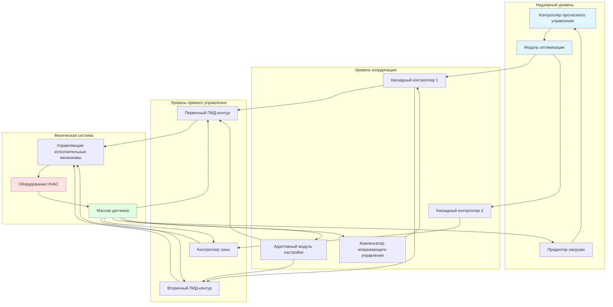

Продвинутые стратегии управления выходят за рамки базового ПИД-регулирования, чтобы учитывать сложную динамику систем HVAC, подавление возмущений и взаимодействия между множественными контурами. Эти методы улучшают стабильность, снижают потребление энергии и повышают комфорт занимающихся за счет учета взаимодействий в системе, предусмотренных возмущений и условий эксплуатации, изменяющихся во времени.

## Архитектура каскадного управления

Каскадное управление использует вложенные контуры управления, где выход первичного (главного) регулятора становится уставкой для вторичного (ведомого) регулятора. Эта конфигурация изолирует быстрые возмущения внутреннего контура до их влияния на первичную управляемую переменную.

### Физика реализации

Каскадная структура обеспечивает превосходное подавление возмущений для процессов с несколькими постоянными времени. Внутренний контур реагирует на возмущения в рамках его более быстрой динамики, предотвращая распространение на более медленный внешний контур.

**Первичный контур (внешний):**

$$C_1(s) = K_{p1}\left(1 + \frac{1}{T_{i1}s} + T_{d1}s\right)$$

**Вторичный контур (внутренний):**

$$C_2(s) = K_{p2}\left(1 + \frac{1}{T_{i2}s}\right)$$

Общая передаточная функция замкнутой системы имеет вид:

$$\frac{Y(s)}{R(s)} = \frac{C_1(s)C_2(s)G_1(s)G_2(s)}{1 + C_2(s)G_2(s) + C_1(s)C_2(s)G_1(s)G_2(s)}$$

Где $G_1(s)$ представляет первичный процесс, а $G_2(s)$ — вторичный процесс.

### Типичные приложения HVAC

**Управление температурой охлажденной воды:**
- Первичное: температура подаваемого воздуха
- Вторичное: положение клапана охлаждающего змеевика или расход воды
- Преимущество: Быстрое подавление колебаний температуры воды

**Управление зоной VAV:**
- Первичное: температура в помещении
- Вторичное: расход воздуха
- Преимущество: Улучшенный отклик на колебания давления

## Опережающее управление

Опережающее управление непосредственно измеряет возмущения и применяет корректирующее действие до того, как управляемая переменная отклонится от уставки. В отличие от обратной связи, которая реагирует на ошибки, опережающее управление предвидит и компенсирует.

### Математическая основа

Идеальный регулятор опережающего управления инвертирует передаточную функцию возмущения:

$$C_{ff}(s) = -\frac{G_d(s)}{G_p(s)}$$

Где $G_d(s)$ — передаточная функция возмущение-выход, а $G_p(s)$ — передаточная функция управляющее воздействие-выход.

Для практической реализации с компенсацией свинец-отставание:

$$C_{ff}(s) = K_{ff}\frac{1 + T_1s}{1 + T_2s}$$

### Приложения рекупирования энергии

В экономайзерах по воздуху температура наружного воздуха служит сигналом опережающего управления:

$$\dot{m}_{OA} = f(T_{OA}, T_{RA}, Q_{sensible})$$

Положение заслонки регулируется на основе предусмотренной охлаждающей нагрузки, а не ожидания отклонения температуры подаваемого воздуха.

## Прогнозное управление моделью (MPC)

MPC решает задачу оптимизации в каждом интервале управления, предсказывая поведение системы в будущем на скользящем горизонте и определяя оптимальные действия управления с учетом ограничений.

### Формулировка оптимизации

$$\min_{u(k)} J = \sum_{i=1}^{N_p} ||y(k+i|k) - r(k+i)||_Q^2 + \sum_{i=0}^{N_c-1} ||\Delta u(k+i)||_R^2$$

При условии:
- $u_{min} \leq u(k+i) \leq u_{max}$
- $y_{min} \leq y(k+i|k) \leq y_{max}$
- $\Delta u_{min} \leq \Delta u(k+i) \leq \Delta u_{max}$

Где:
- $N_p$ = горизонт прогнозирования
- $N_c$ = горизонт управления
- $Q$ = матрица весов ошибки выхода
- $R$ = матрица весов усилия управления
- $y(k+i|k)$ = прогнозируемый выход в момент времени $k+i$
- $\Delta u(k+i)$ = изменение управляющего воздействия

### Приложения MPC в HVAC

MPC превосходен в управлении тепловой обстановкой в здании благодаря:
1. Использованию тепловой массы для смещения нагрузки
2. Оптимизации стратегий предварительного охлаждения/предварительного подогрева
3. Координации нескольких зон с связанной динамикой
4. Удовлетворению ограничений комфорта при минимизации энергетических затрат

## Адаптивное и самонастраивающееся управление

Адаптивные регуляторы изменяют свои параметры в реальном времени, чтобы приспособиться к изменяющейся динамике системы, отказавшим компонентам или изменяющимся условиям эксплуатации.

### Планирование коэффициентов усиления

Коэффициенты усиления регулятора изменяются как функция рабочей точки:

$$K_p(\theta) = K_{p,0} + \sum_{i=1}^{n} a_i\theta^i$$

Где $\theta$ представляет переменную планирования (нагрузка, температура наружного воздуха и т. д.).

### Адаптивное управление с эталонной моделью (MRAC)

Регулятор адаптируется, чтобы заставить выход установки отслеживать эталонную модель:

$$\frac{d\theta}{dt} = -\Gamma e y$$

Где $\Gamma$ — матрица коэффициента адаптации, а $e$ — ошибка отслеживания.

## Сравнение стратегий управления

| Стратегия | Подавление возмущений | Сложность | Усилие при настройке | Энергосбережение | Лучшее приложение |
|----------|----------------------|------------|---------------|----------------|------------------|
| Каскадное | Превосходное (внутренний контур) | Среднее | Умеренное | 10–15 % | Быстрые вторичные возмущения |
| Опережающее | Превосходное (измеримые) | Среднее | Высокое | 15–25 % | Известные измеримые возмущения |
| Пропорциональное управление | Хорошее | Низкое | Низкое | 5–10 % | Пропорциональные расходы/температуры |
| MPC | Превосходное | Высокое | Высокое | 20–40 % | Оптимизация тепловой массы |
| Адаптивное | Хорошее | Высокое | Низкое (самонастройка) | 15–20 % | Системы с изменяющимися параметрами |
| Нечеткая логика | Хорошее | Среднее | Среднее | 10–20 % | Нелинейные, плохо смоделированные системы |

## Архитектура продвинутой системы управления

## Стандарты и руководства

**Стандарты ASHRAE:**
- **ASHRAE Guideline 36-2021:** Высокопроизводительные последовательности операций для систем HVAC определяют продвинутые последовательности управления, включая подстройку-реагирование, контроль спроса на вентиляцию и оптимальный пуск/остановку
- **ASHRAE Standard 90.1:** Требует управления мертвой зоной, оптимального пуска и контроля спроса на вентиляцию для энергоэффективности

**Показатели производительности управления:**
- Перерегулирование: < 5 % от изменения уставки (ASHRAE Guideline 36)
- Время установления: < 15 минут для управления температурой
- Статическая ошибка: ± 0,3 °C для температуры в помещении
- Минимальное положение управляющего клапана: 5 % для предотвращения прилипания

## Рекомендации по реализации

Продвинутые стратегии управления требуют:

1. **Точные модели системы:** MPC и опережающее управление зависят от понимания процесса
2. **Качественное приборостроение:** Датчики должны обеспечивать надежное измерение возмущений
3. **Вычислительные ресурсы:** Оптимизация MPC требует надлежащей вычислительной мощности
4. **Наладка:** Надлежащая настройка и проверка иерархических контуров
5. **Техническое обслуживание:** Текущая проверка моделей и адаптация параметров

Выбор продвинутых методов управления должен уравновешивать улучшение производительности против сложности реализации. Каскадные и опережающие стратегии обеспечивают немедленные преимущества с умеренными усилиями, тогда как MPC обеспечивает максимальную оптимизацию для крупных коммерческих зданий с значительной тепловой массой и дифференцированными по времени тарифами на электроэнергию.
