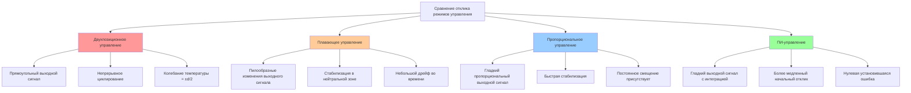

Основные режимы управления составляют основу систем автоматизации HVAC. Понимание их рабочих характеристик, математических представлений и практических применений необходимо для проектирования эффективных стратегий управления температурой, влажностью и давлением в системах зданий.

## Двухпозиционное (включение-выключение) управление

Двухпозиционное управление — это простейший режим управления, в котором исполнительный механизм находится в одном из двух дискретных состояний. Выход контроллера переключается между минимальным и максимальным значениями в зависимости от того, находится ли измеренная переменная выше или ниже уставки.

### Уравнение управления

Выходной сигнал управления u(t) определяется как:

```
u(t) = u_max  когда e(t) < -d/2
u(t) = u_min  когда e(t) > +d/2
```

Где:
- e(t) = сигнал ошибки (уставка − измеренное значение)
- d = дифференциальный зазор (мертвая зона)
- u_max = максимальный выход (100% или ВКЛ)
- u_min = минимальный выход (0% или ВЫКЛ)

### Характеристики

**Преимущества:**
- Простая реализация, требующая минимальных вычислительных ресурсов
- Недорогие датчики и исполнительные механизмы
- Высокая надежность с небольшим количеством режимов отказа
- Отсутствие проблем с установившейся ошибкой

**Недостатки:**
- Непрерывное циклирование около уставки
- Механический износ от частого переключения
- Колебания температуры, равные дифференциальному зазору
- Возможность коротких циклов без надлежащей мертвой зоны

**Применение:**
- Жилые термостаты, управляющие одноступенчатым оборудованием
- Управление защитой от замерзания
- Переключатели аварийного ограничения
- Небольшие компактные установки мощностью менее 17,6 кВт

## Плавающее управление

Плавающее управление позиционирует исполнительный механизм через импульсные команды без прямой обратной связи о положении исполнительного механизма. Контроллер выдает команды подъема или опускания на основе величины ошибки, а исполнительный механизм интегрирует эти импульсы во времени.

### Уравнение управления

Скорость изменения выходного сигнала управления:

```
du/dt = K_f   когда e(t) > d/2
du/dt = -K_f  когда e(t) < -d/2
du/dt = 0     когда |e(t)| ≤ d/2
```

Где:
- K_f = константа скорости плавающего управления (процент в секунду)
- d = ширина нейтральной зоны

### Характеристики

**Преимущества:**
- Более низкая стоимость по сравнению с пропорциональным управлением (обратная связь не требуется)
- Устраняет непрерывное циклирование двухпозиционного управления
- Совместимо со стандартными исполнительными механизмами 24 В переменного тока
- Гладкое управление по сравнению с включением-выключением

**Недостатки:**
- Отсутствие информации о фактическом положении исполнительного механизма
- Дрейф во времени без обратной связи по положению
- Более медленный отклик, чем пропорциональное управление
- Требует периодической переквалификации

**Применение:**
- Управление заслонкой в системах VAV
- Позиционирование клапана в гидравлических системах
- Заслонки экономайзера
- Смесительные приложения с 3-точечными исполнительными механизмами

## Пропорциональное (П) управление

Пропорциональное управление генерирует выходной сигнал, прямо пропорциональный ошибке управления. Положение исполнительного механизма изменяется непрерывно между 0% и 100% при отклонении измеренной переменной от уставки.

### Уравнение управления

```
u(t) = K_p × e(t) + u_bias
```

Где:
- K_p = пропорциональное усиление (безразмерное)
- e(t) = сигнал ошибки
- u_bias = член смещения или смещение (обычно 50%)

Пропорциональная полоса (ПП) — это обратное усиление:

```
ПП = 100% / K_p
```

### Диапазон регулирования

Диапазон регулирования определяет размах измеренной переменной, в пределах которого исполнительный механизм перемещается с 0% на 100%:

```
Диапазон регулирования = Пропорциональная полоса × Диапазон датчика
```

Пример: диапазон регулирования 5,5 °C с уставкой 21 °C означает, что клапан полностью закрыт при 18 °C и полностью открыт при 24 °C.

### Смещение (провал)

Пропорциональное управление по своей сути создает установившуюся ошибку, называемую смещением. В равновесии:

```
e_ss = Q_load / K_p
```

Где Q_load — это нагрузка системы. Более высокое усиление уменьшает смещение, но увеличивает риск колебаний.

### Характеристики

**Преимущества:**
- Гладкое непрерывное управление
- Быстрый отклик на изменения нагрузки
- Стабильная работа при надлежащей настройке
- Минимальный механический износ

**Недостатки:**
- Всегда создает установившееся смещение
- Требует тщательной настройки усиления
- Возможность колебаний при высоком усилении
- Требуются более дорогие датчики и исполнительные механизмы

**Применение:**
- Управление клапаном охлажденной воды
- Управление клапаном горячей воды
- Управление скоростью VFD
- Управление температурой воздуха на выходе

## Пропорционально-интегральное (ПИ) управление

ПИ-управление устраняет установившееся смещение путем добавления интегрального члена, который накапливает ошибку во времени. Это наиболее распространенный режим управления в приложениях HVAC, обеспечивающий как стабильность, так и точность.

### Уравнение управления

```
u(t) = K_p × e(t) + (K_p/T_i) × ∫e(τ)dτ + u_bias
```

Где:
- T_i = интегральное время или время сброса (секунды)
- K_i = K_p/T_i = интегральное усиление

В дискретной форме (цифровые контроллеры):

```
u(n) = K_p × e(n) + K_i × Σe(k) × Δt
```

### Действие сброса

Интегральный член непрерывно настраивает смещение до достижения нулевой ошибки. Время сброса T_i определяет скорость работы интегрального члена:
- Меньше T_i = более быстрое интегральное действие = более быстрое устранение смещения
- Больше T_i = более медленное интегральное действие = более стабильный отклик

### Характеристики

**Преимущества:**
- Полностью устраняет установившееся смещение
- Поддерживает точное управление уставкой при изменяющихся нагрузках
- Превосходная производительность для большинства приложений HVAC
- Доступны хорошо зарекомендовавшие себя методы настройки

**Недостатки:**
- Насыщение интегратора при условиях насыщения
- Более сложная настройка, чем управление только П
- Возможность перерегулирования при агрессивных настройках
- Требует логики защиты от насыщения в цифровых реализациях

**Применение:**
- Первичное управление температурой воздуха на выходе приточной установки
- Управление температурой в критичных помещениях
- Управление давлением в системах VAV
- Секвенирование котла и охладителя

## Сравнение режимов управления

| Режим управления | Установившаяся ошибка | Скорость отклика | Сложность | Типичная стоимость | Лучшее применение |
|---|---|---|---|---|---|
| Двухпозиционное | ±(d/2) | Быстрая | Очень низкая | $ | Жилые, простые нагрузки |
| Плавающее | Небольшой дрейф | Средняя | Низкая | $$ | Заслонки, клапаны без обратной связи |
| Пропорциональное | Смещение = Q/K_p | Быстрая | Средняя | $$$ | Стабильные процессы, допустимое смещение |
| ПИ-управление | Нулевая | Средняя | Высокая | $$$$ | Критичные помещения, изменяющиеся нагрузки |

## Характеристики отклика управления



## Критерии выбора

**Выбирайте двухпозиционное управление, когда:**
- Оборудование имеет встроенное двухступенчатое управление (компрессоры, насосы)
- Минимизация стоимости критична
- Допуск температуры превышает ±1,1 °C
- Нагрузка относительно постоянна

**Выбирайте плавающее управление, когда:**
- Бюджетные ограничения исключают пропорциональное управление
- Обратная связь по положению исполнительного механизма недоступна
- Время отклика некритично
- Требуется простое позиционирование заслонки или клапана

**Выбирайте пропорциональное управление, когда:**
- Быстрый отклик необходим
- Небольшое установившееся смещение допустимо
- Процесс имеет значительную емкость
- Насыщение интегратора может быть проблематичным

**Выбирайте ПИ-управление, когда:**
- Требуется нулевая установившаяся ошибка
- Нагрузки значительно варьируются
- Задан жесткий допуск уставки
- Оборудование может отвечать на непрерывное модулирование

## Ссылка на основы управления

Эти основные режимы управления основаны на фундаментальных концепциях теории управления, включая контуры обратной связи, сигналы ошибок и отклики исполнительных механизмов. Для более глубокого понимания архитектуры системы управления, выбора датчиков и типов сигналов обратитесь к разделу основ управления. Надлежащая реализация требует рассмотрения точности датчика, времени отклика исполнительного механизма, задержки процесса и емкости системы при выборе и настройке режимов управления.

## Компоненты

- Двухпозиционное включение-выключение
- Плавающее управление
- Пропорциональное управление П
- Пропорционально-интегральное управление ПИ
- Пропорционально-интегрально-производное управление ПИД
- Настройка усиления
- Настройка времени сброса
- Настройка времени производной
- Техники защиты от насыщения
- Плавный переход
